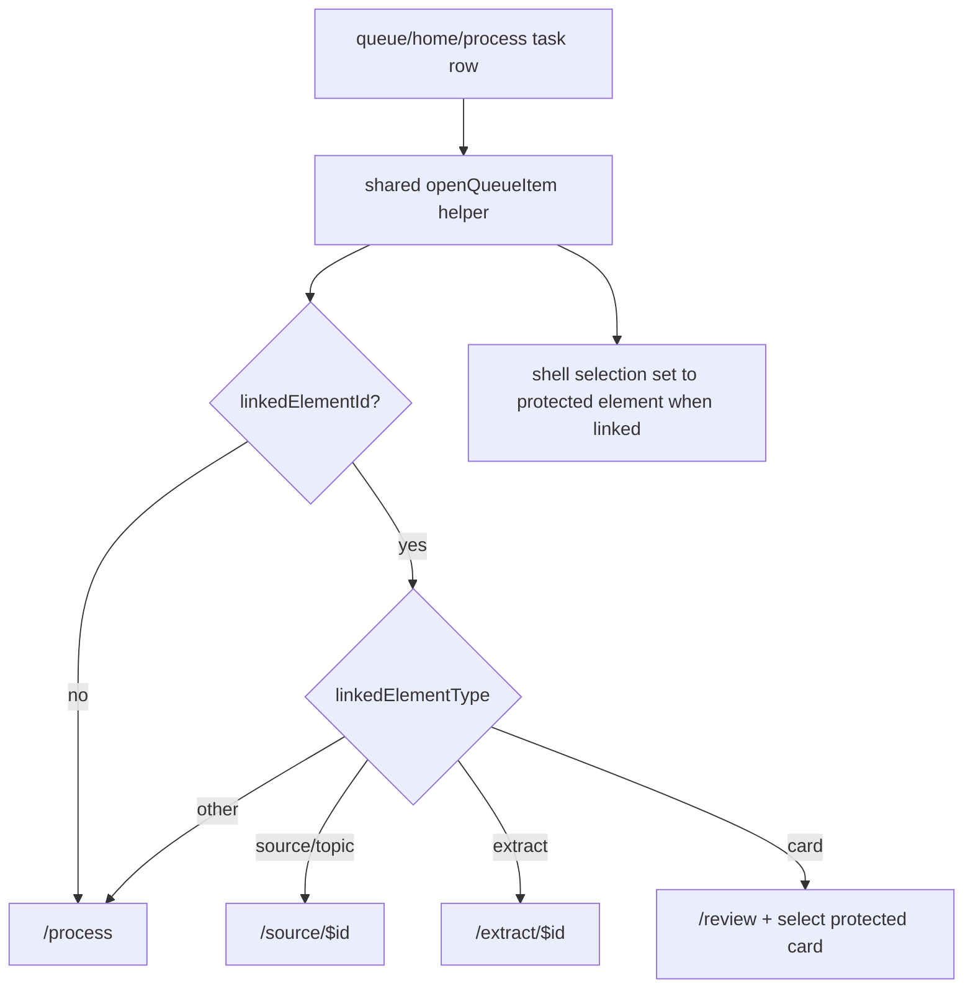

# feat: Upgrade task workflow

## Summary

Upgrade Interleave's task system from a thin maintenance row into a reliable task workflow for long-lived knowledge. Tasks remain first-class `task` elements on the attention scheduler, but opening, context, resolution, and task creation should behave like a gold-standard incremental reading tool: every task explains what knowledge it protects, jumps to the right work surface, and can be completed or postponed without losing lineage.

---

## Problem Frame

The current task substrate is strong: `TaskService` writes a `task` element, a `tasks` side-table row, a `references` relation, and operation-log entries in one transaction. The user-visible system is not yet adequate. Queue task rows can say "Verify" while some open paths do nothing useful for card-linked tasks, Home ignores task linkage, and the task row gives too little protected-element context for a user to know what action is needed.

A gold-standard incremental reading app treats tasks as knowledge maintenance actions, not generic todos. A task should make stale claims, weak sources, outdated cards, and current-version checks actionable while preserving the pipeline `Source -> Topic -> Extract -> Clean extract -> Atomic statement -> Card -> Review -> Mature knowledge`.

---

## Requirements

- R1. Opening a linked task must always route to a useful protected-element surface, including card-linked tasks.
- R2. Opening a task from Home, Queue, and Process must use one shared routing policy so task behavior does not drift across surfaces.
- R3. Task rows must show enough protected-element context for the user to understand what will be verified before opening.
- R4. Task actions must preserve the two-scheduler split: tasks stay attention-scheduled and never enter FSRS review as cards.
- R5. Completing, postponing, and creating tasks must continue to run through typed `window.appApi` commands with main-side validation, transactions, and operation-log-backed mutations.
- R6. Manual task creation from the inspector should produce clearer titles and notes, including the protected element title and chosen task kind.
- R7. Regression coverage must prove linked-task opening works for source, extract, and card targets, including the Home preview path that currently ignores task linkage.
- R8. The implementation must avoid a parallel todo model, raw renderer DB access, or schema churn unless implementation proves a schema gap.

---

## Assumptions

- A card-linked verification task should open `/review` with the protected card selected in the shell inspector, because the app has no dedicated `/card/$id` work surface.
- A linked source or topic task should open the source reader; a linked extract task should open the extract workspace.
- Unlinked custom tasks should stay in the process loop, where the user can complete, postpone, dismiss, or delete them.
- This pass should improve the existing task workflow without adding recurrence, dependencies, project planning, or a separate task inbox.

---

## Key Technical Decisions

- **Single task-routing helper:** Put task-aware open routing in a shared renderer helper used by Home, Queue, and Process. The bug is caused by route policy duplication, so the fix should remove duplication rather than patch each caller independently.
- **Task remains an Element:** Keep `task` as the existing universal element type with a `tasks` side table. Do not add a todo table or React-only task state.
- **Context via read shape before schema:** First enrich presentation from `QueueItemSummary` fields already available or cheaply derivable from `TaskSummary`. Add schema only if current fields cannot represent the needed protected-element context.
- **Resolution stays explicit:** Opening a task should help the user verify the protected element, but completing the task should remain an explicit action through `tasks.complete` or queue/process actions.
- **Test before broadening:** Add focused regression tests around routing and task text before broad UI polish, because the reported failure is concrete and easy to regress.

---

## High-Level Technical Design

---

## Implementation Units

### U1. Shared Task-Aware Open Routing

- **Goal:** Replace duplicated queue/home/process open branches with one tested routing helper.
- **Requirements:** R1, R2, R4, R7.
- **Dependencies:** None.
- **Files:** `apps/web/src/pages/queue/openQueueItem.ts`, `apps/web/src/pages/queue/openQueueItem.test.ts`, `apps/web/src/pages/queue/QueueScreen.tsx`, `apps/web/src/pages/queue/ProcessQueue.tsx`, `apps/web/src/pages/home/HomeScreen.tsx`.
- **Approach:** Create a pure helper that accepts a `QueueItemSummary`, `navigate`, `select`, and optional `asOf`. For a linked task, select the protected element and route by `linkedElementType`; for unlinked tasks and other attention-only types, route to `/process`. Preserve existing source, extract, and card behavior.
- **Patterns to follow:** Current route branches in `QueueScreen.tsx` and `ProcessQueue.tsx`; mock-heavy component tests in `QueueScreen.test.tsx` and `HomeScreen.test.tsx`.
- **Test scenarios:** Source row opens `/source/$id`; extract row opens `/extract/$id`; card row opens `/review`; linked source task selects the source and opens `/source/$id`; linked extract task selects the extract and opens `/extract/$id`; linked card task selects the card and opens `/review`; unlinked task opens `/process` with `asOf` when present.
- **Verification:** All surfaces call the helper, and component tests no longer encode divergent task routing logic.

### U2. Task Row Context And Labels

- **Goal:** Make task rows explain the protected knowledge before the user opens them.
- **Requirements:** R3, R6.
- **Dependencies:** U1.
- **Files:** `apps/web/src/pages/queue/queueRow.tsx`, `apps/web/src/pages/queue/queueRow.test.tsx`, `packages/local-db/src/queue-query.ts`, `packages/local-db/src/queue-query.test.ts`.
- **Approach:** Prefer queue summary fields already available from `TaskService.findTask`. If missing, enrich task queue rows with protected element title/type in the typed read shape. Render task meta as a maintenance action with protected target context, not just "Task".
- **Patterns to follow:** `TaskSummary.linkedElement` in `packages/local-db/src/task-service.ts`; `QueueItemSummary.linkedElementId` and `linkedElementType`; existing `metaFor` and `actionFor` tests.
- **Test scenarios:** Linked task meta names the protected target type/title; unlinked task meta stays generic; action label remains "Verify" only for linked tasks; queue query returns protected element routing fields for card-linked tasks.
- **Verification:** The queue and Home preview make a linked task understandable before navigation.

### U3. Inspector Task Creation Copy And Resolution Controls

- **Goal:** Make manual task creation and task resolution feel like knowledge maintenance rather than a generic button.
- **Requirements:** R5, R6.
- **Dependencies:** U2.
- **Files:** `apps/web/src/components/inspector/Inspector.tsx`, `apps/web/src/components/inspector/MaintenanceSection.test.tsx`, `apps/web/src/components/inspector/inspector.css`.
- **Approach:** Generate titles like `Verify claim: <protected title>` instead of `Verify claim: this item`, keep notes explicit, and ensure complete/postpone buttons remain visible and typed-API-backed. Keep styling within existing inspector task classes and token colors.
- **Patterns to follow:** Existing `MaintenanceSection` state machine and typed `appApi.createTask/listTasks/completeTask/postponeTask` calls.
- **Test scenarios:** Creating each selected task kind sends a title containing the protected element title; completing a task uses `tasks.complete`; postponing a task uses `tasks.postpone`; errors render without losing the existing task list.
- **Verification:** A task created from an element reappears with meaningful copy in inspector and queue reads.

### U4. E2E Task Workflow Regression

- **Goal:** Prove the reported open-task flow works in the Electron app and survives app restart where persistence is involved.
- **Requirements:** R1, R5, R7.
- **Dependencies:** U1, U2, U3.
- **Files:** `tests/electron/queue.spec.ts` or `tests/electron/task-workflow.spec.ts`, `tests/electron/launch.ts` if seed support is needed.
- **Approach:** Use existing seed data when possible; otherwise create a verification task through the inspector or review expiry banner, open it from the queue, assert it lands on the protected surface, complete or postpone it, restart, and verify the mutation persisted.
- **Patterns to follow:** Existing Electron queue tests and restart persistence checks in extraction/card flows.
- **Test scenarios:** Create a card-linked task, open it from the queue, land on review with the protected card selected; postpone the task and verify it leaves the due queue; restart and verify the task status/due behavior persisted.
- **Verification:** The Electron test covers the real preload/main/local-db path, not just renderer mocks.

---

## Scope Boundaries

- Deferred: recurring tasks, dependencies between tasks, multi-step project plans, and a dedicated task inbox.
- Deferred: a card detail route such as `/card/$id`; card-linked tasks use `/review` plus shell selection for now.
- Out of scope: AI-generated task suggestions beyond existing expiry generation.
- Out of scope: replacing the attention scheduler or mixing task scheduling into FSRS.

---

## System-Wide Impact

This change crosses the renderer route helper, queue read shape, inspector task creation, and Electron E2E coverage. It should not require a database migration unless U2 proves the protected target context cannot be derived from existing `tasks.linked_element_id` and `elements` rows. It must preserve operation-log discipline: task creation logs `create_element` and `add_relation`; completion/postpone logs `reschedule_element`; no new operation type is introduced.

---

## Risks & Dependencies

- Card-linked tasks have no dedicated detail route, so `/review` plus shell selection is the least-bad current surface. If review cannot focus the selected card, the fallback still shows the protected card in the inspector.
- Adding protected target titles to queue rows can introduce extra reads if done naively. Keep any enrichment batched or limited to task rows.
- Electron E2E may need deterministic task seed data. Keep seed additions scoped and avoid changing normal demo fixtures unless useful.

---

## Sources & Research

- `docs/domain-model.md` defines `task` as a universal `Element` type and requires source lineage to stay explicit.
- `docs/scheduling-and-priority.md` assigns tasks to the attention scheduler and cards to FSRS.
- `docs/tasks/M18-trust.md` documents the intended T092 task behavior: task elements protect time-sensitive knowledge, appear in the daily queue, link back to protected elements, and complete/postpone like attention items.
- `packages/local-db/src/task-service.ts` already provides transactional task creation, linked-element resolution, expiry generation, and complete/postpone operations.
- `packages/local-db/src/queue-query.ts` already carries `linkedElementId` and `linkedElementType` for task rows.
- `apps/web/src/pages/queue/QueueScreen.tsx`, `apps/web/src/pages/queue/ProcessQueue.tsx`, and `apps/web/src/pages/home/HomeScreen.tsx` currently duplicate open routing, which is the main drift point.
