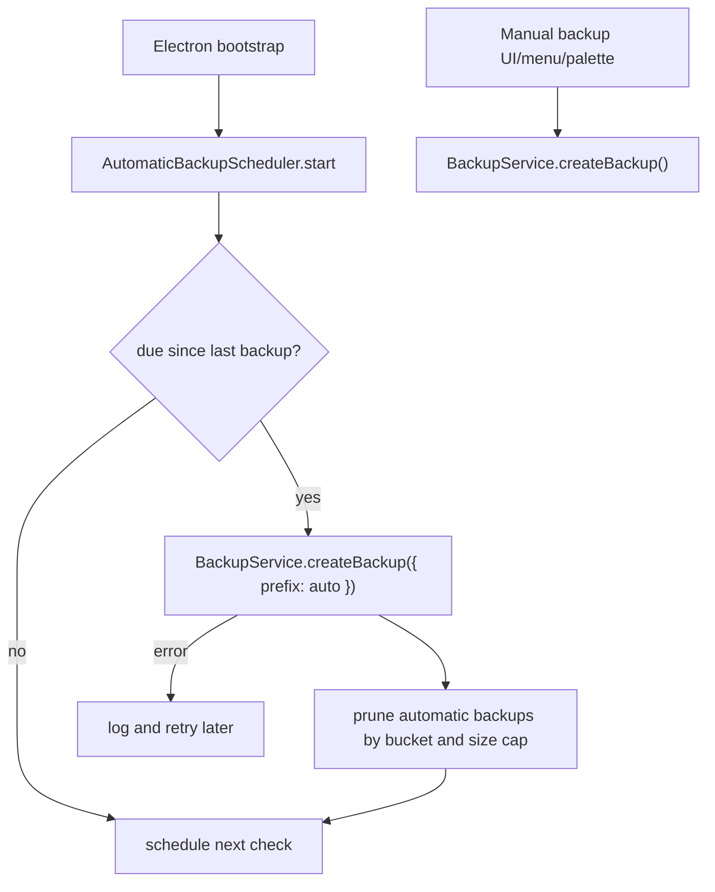

# feat: Automatic rolling backups

## Summary

Replace the shell-wide backup reminder banner with a main-process automatic backup scheduler that quietly creates and prunes restore-ready local backup archives. Manual backups remain available from Settings, the command palette, keyboard shortcut, and native menu.

---

## Problem Frame

Backups are a durability baseline, not a task the user should be nagged to remember. The current renderer banner asks the user to create backups after a reminder threshold, but the app already owns the trusted local paths and SQLite handle in Electron main. The safer behavior is to keep producing canonical backup ZIPs on a rolling cadence and let the UI stay quiet unless the user explicitly requests a backup.

---

## Requirements

- R1. The shell must not render a backup reminder, warning, or success banner during normal app use.
- R2. Explicit backup actions must keep working through the existing typed `backups.create` path.
- R3. Automatic backups must run only in Electron main, using `BackupService.createBackup` and the existing restore-ready ZIP layout.
- R4. Automatic backup retention must preserve a rolling cadence: hourly for the first 48 hours, every 6 hours through 7 days, daily through 30 days, and weekly through 12 weeks.
- R5. Automatic backup retention must prune older automatic archives and enforce a total automatic-backup size cap without deleting manual backups, assets, exports, or unrelated files.
- R6. Scheduler failures must not crash startup, block manual backups, or expose raw filesystem/database access to the renderer.
- R7. The behavior must be covered by unit tests for cadence, pruning, scheduler startup, and UI banner removal.

---

## Key Technical Decisions

- KTD1. Main-process scheduler: `apps/desktop` owns the timer because it already owns `AppPaths`, `DbService`, migrations, and `app.getVersion()`. The renderer gets no new filesystem or database capability.
- KTD2. Reuse canonical backup format: automatic backups call the existing `BackupService.createBackup` so manual and automatic archives share the same `app.sqlite` + `assets/` + `manifest.json` restore contract.
- KTD3. Mark automatic backups by timestamp prefix: automatic archives should be named with an `auto-` prefix so retention can distinguish automatic rolling backups from user-created manual backups without changing archive contents.
- KTD4. Retention is archive-file based: pruning keeps the newest automatic backup in each age bucket, then trims the oldest automatic ZIPs until the cap is met. The unzipped sibling directory for a pruned ZIP is removed only when its timestamp matches the automatic archive name.
- KTD5. Keep manual affordances but remove reminder state: Settings, command palette, `CmdOrCtrl+B`, and native File -> Back up stay. The `BackupPrompt` component and reminder settings keys are removed because backup freshness is no longer a renderer concern.

---

## High-Level Technical Design

---

## Scope Boundaries

- Restore UI, encrypted server backup, off-device upload, and incremental op-log backup remain outside this change.
- The scheduler creates local backups under `backups/`; it does not make same-disk backups equivalent to off-device durability.
- No new renderer-facing raw paths, file reads, directory listings, or generic database commands are introduced.
- Manual backups are not pruned by the automatic retention policy.

---

## Implementation Units

### U1. Extend backup naming and retention primitives

- **Goal:** Let callers create automatic backups with a distinct prefix and prune only automatic backup artifacts.
- **Requirements:** R3, R5, R6
- **Dependencies:** None
- **Files:** Modify `apps/desktop/src/main/backup-service.ts`; test in `apps/desktop/src/main/backup-service.test.ts`.
- **Approach:** Add a small `CreateBackupOptions` object with optional `prefix`, keep the default manual naming unchanged, and validate that prefixes are filesystem-safe constants controlled by main-process code. Add helpers that identify automatic ZIPs, pair them with matching unzipped directories, compute total automatic archive bytes, and delete only the automatic artifacts selected by retention.
- **Patterns to follow:** Existing deterministic timestamp collision handling and manifest-first ZIP order in `apps/desktop/src/main/backup-service.ts`.
- **Test scenarios:** Creating a manual backup without options keeps the existing timestamped name; creating an automatic backup uses an `auto-` timestamp name; two automatic backups in the same millisecond still disambiguate; pruning an automatic archive removes its matching directory and ZIP; pruning never removes a manual ZIP or files outside `backups/`.
- **Verification:** Backup service tests prove old manual behavior still passes and automatic naming/pruning is isolated to `backups/`.

### U2. Add automatic backup scheduler

- **Goal:** Start a main-process scheduler that creates rolling automatic backups on a quiet cadence.
- **Requirements:** R3, R4, R5, R6
- **Dependencies:** U1
- **Files:** Create `apps/desktop/src/main/automatic-backup-service.ts`; modify `apps/desktop/src/main/index.ts`; test in `apps/desktop/src/main/automatic-backup-service.test.ts`.
- **Approach:** Implement a timer-owned service injected with `DbService`, `AppPaths`, `migrationsDir`, `appVersion`, and a clock. On startup, scan automatic ZIPs in `backupsDir`, decide whether a new backup is due, run one backup at a time, prune by cadence buckets and size cap, and schedule the next check. Catch and log errors so startup and manual backups continue.
- **Patterns to follow:** Explicit lifecycle ownership in `JobRunner` and `CaptureController` wiring in `apps/desktop/src/main/index.ts`; constructor dependency injection in `BackupService` tests.
- **Test scenarios:** No prior automatic backup triggers a startup backup; a recent backup suppresses a new automatic duplicate; retention keeps and prunes across the hourly, 6-hour, daily, and weekly buckets; concurrent ticks do not run overlapping backups; backup errors are swallowed after logging and a later tick can retry; `stop()` clears the timer.
- **Verification:** Unit tests cover due decisions, lifecycle, failure handling, and pruning integration without launching Electron.

### U3. Remove backup reminder UI

- **Goal:** Remove the shell-wide backup reminder and its renderer-side freshness state while preserving explicit backup commands.
- **Requirements:** R1, R2, R7
- **Dependencies:** None
- **Files:** Delete `apps/web/src/components/BackupPrompt.tsx`; delete `apps/web/src/components/BackupPrompt.test.tsx`; modify `apps/web/src/shell/Shell.tsx`; modify `apps/web/src/shell/Shell.test.tsx`.
- **Approach:** Move the shared manual `runBackup` helper into the shell or a small non-visual helper, and remove `<BackupPrompt />` from the shell page. The shell continues to route `CmdOrCtrl+B`, palette action, and native menu event through `appApi.createBackup()`, with the existing snackbar for user-triggered feedback.
- **Patterns to follow:** Existing `onCreateBackup` handler in `apps/web/src/shell/Shell.tsx`; Settings backup button in `apps/web/src/pages/Settings.tsx`.
- **Test scenarios:** Shell no longer renders `backup-prompt`; command/palette/native-menu backup tests still call the backup helper; no test expects `backup-reminder` or reminder settings writes.
- **Verification:** Renderer tests show no banner surface remains and explicit backup actions still work.

### U4. Update help copy and E2E coverage

- **Goal:** Align user-facing backup documentation and E2E checks with automatic backups.
- **Requirements:** R1, R2, R4, R5, R7
- **Dependencies:** U1, U2, U3
- **Files:** Modify `apps/web/src/help/help-bodies.ts`; modify `tests/electron/backup.spec.ts`.
- **Approach:** Replace help text that says backups are manual-only or banner-driven with accurate local automatic-backup language while still warning that same-disk backups are not off-device protection. Extend the Electron backup spec to assert an automatic archive appears after startup and manual backups still produce separate ZIPs.
- **Patterns to follow:** Existing backup help entries in `apps/web/src/help/help-bodies.ts`; existing backup E2E checks in `tests/electron/backup.spec.ts`.
- **Test scenarios:** Help copy no longer mentions the reminder banner or "no automatic backup today"; E2E can identify at least one `auto-*.zip` under `backups/`; manual `backups.create()` still returns a non-automatic archive.
- **Verification:** E2E backup spec covers startup automatic backup plus manual backup integrity.

---

## Risks & Dependencies

- Automatic backup can be I/O-heavy on large vaults. The scheduler should run at most one backup at a time and use conservative timers so it does not compete with the foreground workflow.
- Same-disk backups still do not protect against device loss or disk failure. Help copy should keep the off-device copy warning.
- Retention must only delete automatic artifacts. Tests must include manual ZIPs and sibling directories to catch accidental deletion.

---

## Sources & Research

- `apps/desktop/src/main/backup-service.ts` already snapshots SQLite with `VACUUM INTO`, copies `assets/`, writes manifest hashes, and zips the canonical backup layout.
- `apps/desktop/src/main/index.ts` owns process lifecycle and is the right place to start and stop a background main-process service.
- `apps/web/src/shell/Shell.tsx` currently mounts `BackupPrompt` and also owns the manual backup shortcut/palette/menu handler.
- `docs/tasks/M9-safety-analytics-backup.md` and `docs/architecture.md` require backup logic to stay Electron-managed and keep the renderer away from raw filesystem and SQLite APIs.
