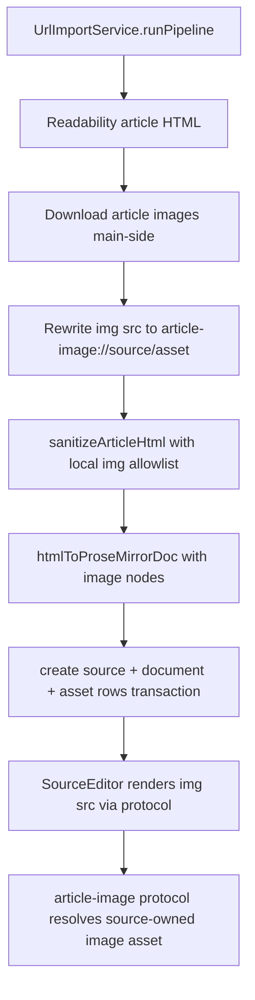

# Download Local Images for URL-Imported Articles

## Summary

URL article imports should preserve meaningful inline images by downloading them into the local asset vault, rewriting the stored article document to reference local image bytes, and rendering them without exposing raw paths or hotlinking remote URLs.

## Problem Frame

`UrlImportService` currently sanitizes article HTML through a schema that drops `` entirely. This keeps the reader safe, but imported articles such as Slate Star Codex's "The Toxoplasma of Rage" lose article images. The fix must keep Interleave local-first: if the remote image later disappears, the imported source still renders from the vault.

## Requirements

- R1. URL-imported article images are downloaded main-side into the filesystem asset vault and recorded as `assets` metadata rows owned by the imported source.
- R2. The stored source document and cleaned snapshot never hotlink remote image URLs; imported image nodes reference only a local, constrained render URL.
- R3. Image fetching has generous but bounded limits: capped image count per article, capped bytes per image, capped total image bytes per article, MIME validation, redirect/SSRF checks, and timeout handling.
- R4. Failed, blocked, oversized, duplicate, unsupported, or malformed images do not fail the entire article import; the surrounding article text still imports.
- R5. The implementation scales to tens of thousands of images by using streaming writes/hashes, asset metadata indexes, per-source image directories, content-hash dedup where practical, and no whole-library scans on import.
- R6. The renderer continues to receive no raw filesystem paths, arbitrary file APIs, or SQL access; local article images render through a narrow protocol or typed surface.
- R7. Existing backup logic is not expanded for images; image files live under `assets/` and no image-specific backup workflow is added now.
- R8. Tests prove the source body, cleaned snapshot, asset rows, and downloaded image bytes survive restart and that remote image URLs are not present in persisted reader content.

## Key Technical Decisions

- KTD1. Reuse `AssetKind = "image"` for article images: the schema already admits image assets, so no migration is needed. Rows are owned by the source element, with relative paths under `sources/<source_id>/images/`.
- KTD2. Add an article-image import helper in Electron main: URL resolution, SSRF checks, MIME validation, limits, streaming write, and rewrite metadata belong beside `UrlImportService`, not in `@interleave/importers` or React.
- KTD3. Rewrite sanitized article HTML before ProseMirror conversion: keep `` in the sanitizer only after it has been converted to a local `article-image://<source_id>/<asset_id>` URL with safe `alt`, dimensions, and optional title attrs.
- KTD4. Add a constrained ProseMirror `image` node: article images are document content, not media-fragment extracts. The node is block-ish, selectable, non-draggable, and stores only `src`, `alt`, `title`, `width`, and `height`.
- KTD5. Serve local images with a dedicated protocol: `article-image://<source_id>/<asset_id>` resolves main-side by asset row ownership and kind, streams the file, and rejects missing/foreign/non-image assets. The renderer never sees vault paths.
- KTD6. Keep compression out unless already available: no new native image-processing dependency is required for this task. MIME validation and byte limits provide the first reliable scaling guard; compression can be added later if a native-safe dependency is chosen.
- KTD7. Dedup against image-free canonical cleaned HTML: local `source_id` and `asset_id` values must not enter the content-hash duplicate key, or re-importing the same article would look unique every time.

## High-Level Technical Design

## Scope Boundaries

- Do not implement image OCR, image occlusion, gallery browsing, captions beyond existing `alt`/`title`, or image editing.
- Do not change backup behavior beyond letting existing vault ownership rules see these files.
- Do not make the renderer fetch or download remote images.
- Do not add generic vault read APIs or path-based IPC.
- Do not fail an otherwise valid article because a subresource image failed.

## Implementation Units

### U1. Add Constrained Article Image Schema Support

- **Goal:** Teach core/editor/importer document shapes to preserve local article images as first-class constrained document nodes.
- **Files:** Modify `packages/core/src/prosemirror.ts`, `packages/editor/src/schema.ts`, `packages/editor/src/serialize.ts`, `packages/importers/src/sanitize.ts`, `packages/importers/src/html-to-prosemirror.ts`, `packages/editor/src/SourceEditor.tsx`, and `packages/editor/src/index.ts`. Add `packages/editor/src/nodes/article-image.ts` and `packages/editor/src/nodes/ArticleImageNodeView.tsx` if a React view is needed.
- **Patterns:** Follow `packages/editor/src/nodes/math.ts`, `packages/editor/src/nodes/code-block-language.ts`, `packages/importers/src/html-to-prosemirror.ts`, and `packages/editor/src/serialize.ts`.
- **Test Scenarios:** `packages/importers/src/sanitize.test.ts` keeps remote/untrusted images out but allows already-local `article-image://` refs; `packages/importers/src/html-to-prosemirror.test.ts` converts image nodes, validates against `buildSchema()`, and keeps useful alt text in `plainText`; `apps/web/src/reader/SourceEditorRichRender.test.tsx` renders an image node without network or path exposure.
- **Verification:** Constrained schema lists `image`; imported image docs pass `buildSchema().nodeFromJSON`; `toPlainText` remains stable for previews/search.

### U2. Download and Rewrite Article Images in the URL Import Pipeline

- **Goal:** Add main-side image fetching with bounded streaming writes and rewrite article HTML to local image refs before sanitization/conversion.
- **Files:** Modify `apps/desktop/src/main/url-import-service.ts` and `apps/desktop/src/main/url-import-service.test.ts`. Add `apps/desktop/src/main/article-image-import.ts` and tests if the helper is substantial.
- **Patterns:** Follow `apps/desktop/src/main/url-fetch.ts`, `apps/desktop/src/main/vault-io.ts`, `apps/desktop/src/main/asset-vault-service.ts`, and the rollback discipline in `UrlImportService.runPipeline`.
- **Test Scenarios:** Downloads absolute, relative, and protocol-relative images; skips `data:`, private hosts, unsupported MIME, oversized image, and excess count; strips remote `src`; creates `image` asset rows; writes files under `sources/<id>/images/`; import still succeeds when image fetch fails; transaction failure removes partial image files.
- **Verification:** URL import happy path still writes `original.html` and `cleaned.html`; image rows and files are durable; duplicates by content hash do not create unnecessary duplicate bytes when safely reusable.

### U3. Serve Article Images Through a Narrow Protocol

- **Goal:** Let rendered source documents display downloaded images without giving the renderer any raw vault path.
- **Files:** Add `apps/desktop/src/main/article-image-protocol.ts` and `apps/desktop/src/main/article-image-protocol.test.ts`; modify `apps/desktop/src/main/index.ts` to register privileges and handler.
- **Patterns:** Follow `apps/desktop/src/main/media-protocol.ts`, `apps/desktop/src/main/media-protocol.test.ts`, and `apps/desktop/src/main/renderer-protocol.ts`.
- **Test Scenarios:** Streams source-owned `image` assets; rejects bad IDs, path traversal attempts, non-image assets, image assets owned by another source, missing files, and unknown assets; returns content type and length.
- **Verification:** The protocol resolves only through DB asset ownership and `assetsDir`; no URL path segment is ever treated as a filesystem path.

### U4. End-to-End Import and Restart Coverage

- **Goal:** Prove the full Electron URL-import flow preserves downloaded local images through app restart.
- **Files:** Modify `tests/electron/url-import.spec.ts`; optionally update `tests/electron/vault.spec.ts` if verify/orphan coverage needs explicit image assertions.
- **Patterns:** Follow the local HTTP fixture server in `tests/electron/url-import.spec.ts` and vault assertions in `tests/electron/vault.spec.ts`.
- **Test Scenarios:** Fixture article includes one local image. After import, the inbox/source document contains an `` using `article-image://`, the remote image URL is absent from cleaned HTML, the local image file exists, an `image` asset row exists, and the image still renders after restart.
- **Verification:** E2E imports through `window.appApi.sources.importUrl`; renderer has no `db.query`; persisted source body and vault files survive restart.

## System-Wide Impact

This touches the document schema, source import pipeline, asset vault metadata, and Electron protocol registration. The main data invariant remains intact: SQLite stores only metadata and document JSON, while image bytes live in the vault. The renderer's trust boundary is unchanged because image rendering uses a constrained protocol keyed by source and asset IDs.

## Risks & Dependencies

- A too-broad sanitizer allowlist could reintroduce remote subresource loading. Mitigation: only allow local protocol image refs and test that remote `src` is removed.
- Image fetching can make URL import slower. Mitigation: cap count/bytes and skip failed images. Worker off-main fetch can be improved later; this plan keeps main apply logic correct first.
- Existing source body features may not expect image nodes. Mitigation: keep image nodes block-level and update schema/plain-text tests so read-point/extraction logic still anchors to surrounding block IDs.
- Custom protocol registration must happen before app ready for privileges. Mitigation: mirror the existing `media://` registration pattern.

## Acceptance Examples

- AE1. Given an article with ``, when the URL is imported, then the vault contains `assets/sources/<source_id>/images/...`, SQLite has an `image` asset row, and the stored document contains an image node with an `article-image://` src.
- AE2. Given an article with `` that is unsupported, oversized, or blocked, when the URL is imported, then the article text imports and the bad image is omitted.
- AE3. Given the app is restarted after a successful image import, when the source reader opens the imported article, then the image renders from the local protocol without contacting the original remote host.
- AE4. Given a malicious cleaned snapshot tries `img src="file:///etc/passwd"` or `img src="https://remote.example/a.png"`, when sanitized and converted, then no image node survives.

## Sources / Research

- `apps/desktop/src/main/url-import-service.ts` is the URL import orchestrator and snapshot transaction boundary.
- `apps/desktop/src/main/url-fetch.ts` already implements URL fetch SSRF, timeout, MIME, and page size constraints.
- `apps/desktop/src/main/vault-io.ts` provides streamed write/hash primitives for large vault bytes.
- `apps/desktop/src/main/media-protocol.ts` is the closest protocol pattern for pathless local asset streaming.
- `packages/importers/src/sanitize.ts` currently drops `` entirely and is the security boundary that must stay narrow.
- `packages/importers/src/html-to-prosemirror.ts` owns sanitized HTML to constrained document JSON conversion.
- `packages/editor/src/schema.ts` owns the canonical constrained schema used by importers and the reader.
- `docs/solutions/ui-bugs/url-imported-articles-inbox-processing.md` notes that URL import bodies belong on detail paths, not list rows.
