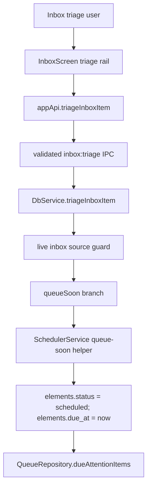

# Add Queue soon to inbox triage

## Summary

Add a `Queue soon` action between `Read now` and `Save for later` in Inbox triage. The action moves a source out of Inbox and into the attention due queue immediately, without opening the reader and without changing the meaning of `Save for later`.

## Problem Frame

Inbox triage currently asks the user to choose between starting a source immediately or dismissing it with no schedule. A gold-standard incremental reading workflow needs a middle outcome: the source is worth processing soon, but not worth interrupting the current triage session. That transition must create normal due queue eligibility, not a special "read next" shortcut.

## Requirements

- R1. The triage rail offers `Read now`, `Queue soon`, `Save for later`, and `Delete`, with keyboard shortcuts `1`, `2`, `3`, and `6`.
- R2. `Queue soon` removes the selected source from Inbox, schedules it as due attention work at the trusted mutation clock, and does not navigate to `/source/$id`.
- R3. A queued-soon source appears in `/queue` through the existing attention queue predicate and ordering; it must not bypass priority or queue scoring.
- R4. `Read now` keeps its existing behavior: activate the source, assign an attention return date, and navigate to the source reader.
- R5. `Save for later` keeps its existing behavior: leave the source dismissed and unscheduled, with no due queue entry.
- R6. All lifecycle and scheduling mutations stay behind the typed Electron IPC boundary and are logged as command-shaped mutations.
- R7. Stale triage requests against non-inbox, deleted, or missing sources fail through the existing trusted guard.

## Key Technical Decisions

- KTD1. Extend `inbox.triage` instead of adding a new IPC channel: `Queue soon` is an inbox triage outcome, so it belongs in the existing validated request union and main-side stale-source guard.
- KTD2. Persist `Queue soon` as `status: "scheduled"` with `dueAt = nowIso()`: that makes the item due at the current queue read clock while preserving the distinction from `Read now`'s `active` started-reading state.
- KTD3. Use a `reschedule_element` operation with a `queueSoon` payload marker: the existing operation type is correct, while the marker makes audit/debug output distinguish inbox queuing from manual queue scheduling.
- KTD4. Keep duplicate open-existing behavior unchanged: the duplicate path still means open the source, so inbox duplicates continue to activate and navigate rather than queue silently.

## Scope Boundaries

- Do not schedule every import automatically; fresh imports remain Inbox work until the user chooses a triage action.
- Do not change `Save for later` into a scheduled action.
- Do not add a full scheduling menu for tomorrow, next week, or manual dates in this change.
- Do not alter queue scoring or priority math. Queue-soon items enter the same queue model as other due attention items.

## High-Level Technical Design

## Implementation Units

### U1. Typed queue-soon triage contract

- **Goal:** Add `queueSoon` to the shared IPC contract and renderer type surface without introducing a new channel.
- **Files:** Modify `apps/desktop/src/shared/contract.ts`, `apps/desktop/src/shared/contract.test.ts`, `apps/web/src/lib/appApi.ts`.
- **Patterns:** Follow the existing `accept`, `keepForLater`, `setPriority`, and `delete` discriminated union shape in the inbox triage contract.
- **Test scenarios:** The schema accepts `{ kind: "queueSoon" }`; unknown actions and bad priority labels still fail.
- **Verification:** `pnpm --filter @interleave/desktop test -- src/shared/contract.test.ts`.

### U2. Main-side queue-soon persistence

- **Goal:** Handle `queueSoon` inside the trusted inbox triage transaction, setting the source to scheduled due-now attention work.
- **Files:** Modify `apps/desktop/src/main/db-service.ts`, `apps/desktop/src/main/db-service.test.ts`, `packages/local-db/src/scheduler-service.ts`, `packages/local-db/src/scheduler-service.test.ts`.
- **Patterns:** Reuse `SchedulerService.activateSourceWithReturnWithin` as the transaction-composable precedent; use `ElementRepository.rescheduleWithin` so mutation and `operation_log` stay atomic.
- **Test scenarios:** Queue soon changes an inbox source to `scheduled`, writes `dueAt <= asOf`, removes it from inbox, makes it visible to `QueueRepository`/`QueueQuery`, logs `reschedule_element`, and creates no `review_states` row. Existing `accept` and `keepForLater` behavior remains unchanged.
- **Verification:** `pnpm --filter @interleave/desktop test -- src/main/db-service.test.ts` and `pnpm --filter @interleave/local-db test -- src/scheduler-service.test.ts`.

### U3. Inbox triage UI and help copy

- **Goal:** Add the `Queue soon` button and `2` keyboard shortcut while preserving the current read/save/delete flows.
- **Files:** Modify `apps/web/src/pages/inbox/InboxScreen.tsx`, `apps/web/src/pages/inbox/InboxScreen.test.tsx`, `apps/web/src/help/help-bodies.ts`.
- **Patterns:** Follow the existing non-navigating `onTriage` path for `keepForLater`/`delete`, and keep the `Read now` path separate because it navigates.
- **Test scenarios:** The rail shows `1 · 2 · 3 · 6`; clicking or pressing `2` calls `{ kind: "queueSoon" }`, refreshes Inbox, clears selection when needed, and does not navigate. Keyboard handling still ignores form fields and modals.
- **Verification:** `pnpm --filter @interleave/web test -- src/pages/inbox/InboxScreen.test.tsx`.

### U4. End-to-end queue eligibility proof

- **Goal:** Prove the user-visible flow works across Electron, IPC, SQLite, and the queue read model.
- **Files:** Modify `tests/electron/inbox.spec.ts` or add focused Electron coverage in the existing inbox flow.
- **Patterns:** Follow existing Electron inbox tests for import/triage/restart checks; use the queue read surface rather than inspecting SQLite from the renderer.
- **Test scenarios:** Import a source, choose `Queue soon`, confirm no reader navigation, confirm the row leaves Inbox, confirm `/queue` shows the source as attention work, and confirm the scheduled state survives restart.
- **Verification:** `pnpm e2e -- tests/electron/inbox.spec.ts`.

## System-Wide Impact

This changes source lifecycle transitions and queue membership, so stale-command guards, operation-log preimages, and queue eligibility labels are load-bearing. The renderer remains a pure typed-client caller; Electron main owns scheduling and SQLite writes.

## Risks & Dependencies

- Clock flakes are possible if tests read the queue at a time before the persisted due timestamp. Use the same `asOf` clock when possible, or assert `dueAt <= nowAfterMutation`.
- A renderer-side sequence of "accept then schedule" would create partial-state risk; keep `Queue soon` as one main-side command.
- Queue soon should not imply "next item"; tests should assert queue visibility and priority preservation, not a fixed first row when other higher-priority due work exists.

## Acceptance Examples

- AE1. Given an inbox source is selected, when the user clicks `Queue soon`, then the source leaves Inbox, no source-reader navigation occurs, and the source is due in the queue.
- AE2. Given an inbox source is selected, when the user presses `2` outside a form field, then the same `Queue soon` behavior occurs.
- AE3. Given the same source is triaged with `Save for later`, then it is dismissed and absent from the due queue.
- AE4. Given a stale triage request arrives after the source has left Inbox, then the command fails without mutating the source again.

## Sources / Research

- `apps/web/src/pages/inbox/InboxScreen.tsx` contains the current triage rail and shortcut handling.
- `apps/desktop/src/main/db-service.ts` owns the trusted inbox triage transaction and stale-source guard.
- `packages/local-db/src/scheduler-service.ts` owns persisted attention scheduling decisions.
- `packages/local-db/src/queue-repository.ts` defines due attention queue eligibility.
- `docs/solutions/logic-errors/queue-eligibility-inventory-scheduler-state.md` records the canonical queue eligibility invariant.
- `docs/solutions/ui-bugs/balance-banner-queue-inbox-action-gating.md` records why Inbox and Queue must remain distinct until an explicit user action.
- `docs/solutions/ui-bugs/url-imported-articles-inbox-processing.md` records the stale triage and main-side lifecycle transition pattern.
