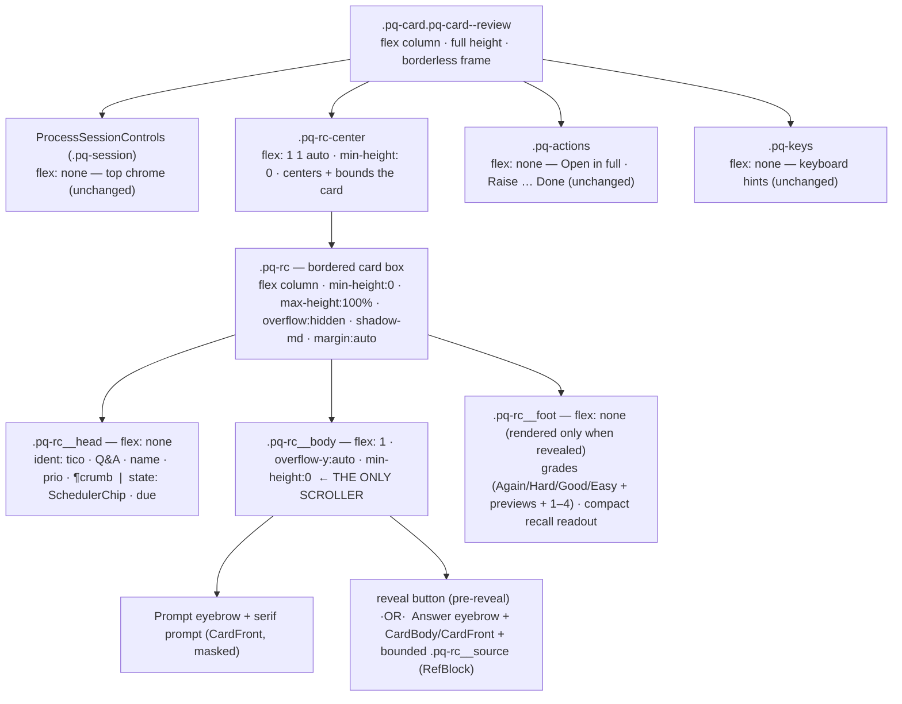

# feat: Improved Card Review — three-zone in-session card face

## Summary

Redesign the in-session review **card face** (`ProcessCard`, the `isCard` branch of
`apps/web/src/pages/queue/ProcessQueue.tsx`) from a centered, fixed-height column into a
**three-zone card**: a pinned identity header, a single scrolling body (prompt → answer →
source), and a pinned grade footer that is always reachable. This fixes a real UX defect — today
a long answer or large source excerpt pushes the Again/Hard/Good/Easy grade buttons off-screen —
while scaling cleanly from a one-line Q&A to a long answer with a large source.

Secondary cleanups carried by the same change, all directly from the design handoff and its
teammate review: **de-duplicate** the FSRS triple-stat box (it already lives in the inspector)
down to a single compact mono recall readout in the footer; **remove** the redundant in-card
"Open in review" button (the action bar's "Open in full" already calls the same handler); and
frame source provenance as a **bounded** section that scrolls inside its own cap rather than
blowing out the card.

This is a port of a static HTML/CSS mockup into the real React + token-only-CSS stack. It is
layout-only from an automation standpoint: **every feature and every behavioral `data-testid` is
preserved.**

---

## Problem Frame

The card face is rendered by `ProcessCard` (`ProcessQueue.tsx:1958-2034`) inside the `.pq-card`
box. Today that box holds session controls, the meta row, the card face, the action bar, and the
keys hint as flat siblings with **no internal scroll boundary** (`process-queue.css:148-239`,
`.pq-cardface` is `align-items:center; text-align:center`). Consequences:

- **Grades scroll away.** With a long answer or large source, the whole `.pq-center` scrolls and
  the grade buttons leave the viewport — the user must scroll to grade, every card. This is the
  core defect the design targets.
- **FSRS data is duplicated.** The three-stat Stability/Difficulty/Retrievability box renders on
  the card face (`FsrsStats`, `ProcessQueue.tsx:2007-2009`) AND in the Card inspector
  (`primitives.tsx` `FsrsStats`, shown in the right panel). Two owners for one fact.
- **Redundant action.** The in-card "Open in review" button (`ProcessQueue.tsx:2013-2021`) and the
  action bar's "Open in full" button (`:2083-2092`) both call the same `onOpen` callback
  (`:1121`). Pure duplication; the design's teammate review explicitly asked to remove the link.
- **Centered sprawl.** The centered single-column layout reads as an unstructured pile as content
  grows; the design replaces it with quiet mono eyebrows (Prompt / Answer / Source) and a
  left-aligned zoned rhythm.

Prior art in this exact surface confirms the failure mode is **scroll ownership**, not styling
(see `docs/solutions/ui-bugs/extract-distillation-scroll-contained-editor.md`,
`process-queue-extract-card-height-alignment.md`, `process-queue-inline-session-controls.md`).

---

## Requirements

Traced to the design handoff (`Improved Card Review.html`, `card-review.css`) and the two chat
transcripts (intent: "improve the design and UX of the cards during review… adaptable enough to
deal with small cards or ones with large content including large source content… correctly sized,
prioritized and organized" — and "Do not change any feature").

- **R1 — Three-zone card.** Card face becomes pinned header / scrolling body / pinned footer. Only
  the body scrolls; header and grade footer stay fixed and reachable at any content size.
- **R2 — Scale from tiny to large.** A one-line Q&A sits compact and centered; a long answer +
  large source excerpt keeps the card bounded to the viewport with the body scrolling internally,
  the source excerpt bounded inside its own capped sub-scroll.
- **R3 — Identity header.** Left: type icon, kind (`Q&A`/`Cloze`) + card name, priority badge,
  and a provenance crumb (source location). Right: the FSRS scheduler chip and a due hint.
- **R4 — Zoned body.** Mono eyebrows label Prompt, Answer, Source. Prompt in the read serif;
  answer rendered through the existing shared body renderer (math/code/cloze intact); source in a
  bounded provenance block.
- **R5 — Pinned grade footer.** The four grades (Again/Hard/Good/Easy) with interval previews and
  1–4 key hints stay docked at the bottom, plus a single compact mono recall readout
  (stability · difficulty · retrievability).
- **R6 — De-duplicate FSRS.** Remove the three-stat `FsrsStats` box from the card face; the
  inspector remains its canonical owner. The footer carries only the compact recall line.
- **R7 — Remove redundant action.** Remove the in-card "Open in review" button. "Open in full" in
  the session action bar is the single surviving open affordance.
- **R8 — Preserve every feature + testid.** reveal (`␣` + button), 1–4 grading with previews,
  cloze masking/reveal, Q&A answer rendering, source ref (post-reveal only — must never leak the
  answer), leech badge, the full action bar, the keyboard hints, and all `process-*` testids.
- **R9 — Token-only, house style.** New CSS lives in `process-queue.css` as `.pq-*` BEM-ish,
  token-driven rules. No Tailwind utilities, no hard-coded colors/spacing. Reuse the canonical
  `SchedulerChip` and `RefBlock` rather than re-implementing the mockup's bespoke pill/quote.
- **R10 — Non-card branches untouched.** The source/extract workbench branches
  (`.pq-card--source`, `.pq-card--extract`) and the attention-item preview render exactly as
  before. Their tests stay green.

---

## Key Technical Decisions

### KTD1 — New `.pq-rc` card box; `.pq-card` stays the flat layout frame

The mockup's `.rc` is a bordered, shadowed box with header/body/footer; the session controls and
action bar sit **outside** it. But `ProcessQueue.test.tsx:546-552` reads the raw stylesheet and
asserts `.pq-card` carries `border: 1px solid var(--border)` and **no** `box-shadow`. Resolution:
keep `.pq-card` as the borderless **layout frame** for the card branch (via a `.pq-card--review`
modifier, mirroring the existing `.pq-card--source` / `--extract` modifier pattern), and introduce
a **new** `.pq-rc` class for the inner bordered card box. Because `.pq-rc` is a new selector, it
may carry `box-shadow: var(--shadow-md)` per the mockup without tripping the `.pq-card` test, and
the base `.pq-card` rule keeps its border declaration intact for the attention-item path. This
follows the learning "split concerns into separate modifier classes rather than overloading one
`.pq-card--*` class" (`process-queue-extract-card-height-alignment.md`).

### KTD2 — Scroll ownership: body is the only scroller, `min-height:0` at every level

The pinned-footer behavior is a flex-bounding problem the codebase has solved repeatedly. The card
branch frame is `display:flex; flex-direction:column` and fills available height; `.pq-rc` is
`flex; flex-direction:column; min-height:0; max-height:100%; overflow:hidden`; `.pq-rc__head` and
`.pq-rc__foot` are `flex:none`; `.pq-rc__body` is the **only** `overflow-y:auto` with
`min-height:0`. Every ancestor in the chain (`.pq-center--review`, `.pq-card--review`, the
centering wrapper) carries `min-height:0` so the bound propagates. Never put `overflow:hidden` on
a container that owns required controls. (Recipe: `extract-distillation-scroll-contained-editor.md`,
`source-reader-scroll-extents-rich-source-rendering.md`.)

### KTD3 — Reuse `SchedulerChip` in the header, not the mockup's `.fsrs-pill`

The mockup approximated the FSRS chip with a bespoke sparkles `.fsrs-pill`. The app already has the
canonical `SchedulerChip` (`primitives.tsx:126`) that renders the FSRS treatment (brain icon,
`new`/recall %, `S Nd`) and encodes the load-bearing FSRS-vs-attention split that `design/AGENTS.md`
requires us to preserve. Use `<SchedulerChip scheduler={cardChipSignals(cardView)} />` in the
header's right-hand state slot. Fidelity to the **design system** beats fidelity to the mockup's
hand-rolled pill.

### KTD4 — Reuse `RefBlock` inside a bounded "Source" section; inspector stays the jump-to-source owner

The design's source provenance is richer-looking than `RefBlock`, but `RefBlock` is shared by
review, extract, inspector, and library and owns the orphan-placeholder, snippet-dedupe, and
reliability-badge logic; `formatSourceRef` (in `@interleave/core`) is the single citation/href
authority. Rather than fork that, render the existing `<RefBlock>` (keeping its
`process-card-refblock` testid, `dedupeSnippetAgainst`, and post-reveal gate) **inside** a new
bounded `.pq-rc__source` section with a "Source" eyebrow; the section caps height and scrolls only
when content is large (`R2`). Do **not** add a separate "Jump to source" button to the card face:
there is no source-location navigation handler in `ProcessCard` today (only `onOpen` → open in
full), and learning `extract-inspector-single-responsibility-lineage-scheduler.md` established the
inspector as the single canonical owner of the jump-to-source action. This keeps the change
low-risk and avoids inventing navigation plumbing (out of scope; see Boundaries).

### KTD5 — Reveal-gate the entire answer + source + footer; render-gate, not visibility-gate

The E2E contract (`process-queue.spec.ts:479-489`) asserts `process-card-grades` has **count 0**
before reveal and is visible after. So grades must remain absent from the DOM until `revealed`,
not merely hidden. The footer (grades + recall) and the answer/source body sections are
conditionally **rendered** on `revealed && cardView`, exactly as today. Pre-reveal, the body shows
only the prompt + the reveal button and the card sizes to content (no footer).

### KTD6 — Fix the latent `var(--space-3)` token bug while here

The current inline styles at `ProcessQueue.tsx:1983,2007` use `var(--space-3)`, which is undefined
in `design/tokens.css` (the scale is `--s-*`) and silently resolves to nothing. The redesign
replaces those inline styles with class-based `gap`/spacing using real `--s-*` tokens, fixing the
bug as a side effect.

---

## High-Level Technical Design

DOM + flex-bounding for the card branch (the `isCard` path of `ProcessCard`). Non-card branches
are unchanged.

Directional guidance, not implementation spec. The load-bearing invariants: a single
`overflow-y:auto` on `.pq-rc__body`; `min-height:0` on every ancestor; `.pq-rc__foot` render-gated
on `revealed`.

---

## Implementation Units

### U1. Restructure the card-branch JSX into three zones

**Goal:** Replace the centered `.pq-cardface` markup (meta row + title + face) in the `isCard`
branch with the three-zone structure: a `.pq-rc` card containing `.pq-rc__head`,
`.pq-rc__body`, and a render-gated `.pq-rc__foot`. De-duplicate FSRS into a compact recall
readout, remove the "Open in review" button, and wrap the source ref in a bounded section.

**Requirements:** R1, R3, R4, R5, R6, R7, R8, KTD3, KTD4, KTD5, KTD6.

**Dependencies:** none (U2 supplies the CSS but the JSX can be written first; they land together).

**Files:**
- `apps/web/src/pages/queue/ProcessQueue.tsx` (the `ProcessCard` `isCard` branch, ~`:1923-2034`;
  the wrapper className and `centerClassName` for the card path)

**Approach:**
- For the card branch only, add the `pq-card--review` modifier to the `.pq-card` wrapper and a
  `pq-center--review` modifier to `process-center` (compute alongside the existing
  `centerClassName`; do **not** add the `--extract` modifiers the card-path tests forbid).
- Keep `<ProcessSessionControls>` as the first child (flex:none chrome) — preserve its
  `process-session-controls` / `process-progress` / `process-modes` / `process-end` testids and
  nesting.
- Insert a `.pq-rc-center` wrapper, then the `.pq-rc` card:
  - **`.pq-rc__head`** — `ident` block: `<TypeIcon type="card" lg />`, kind text
    (`item.cardType === "cloze" ? "Cloze" : "Q&A"`) + masked card name (`maskCloze(item.title)` —
    reuse, never leak cloze answers), `<Prio priority={item.priority} />`, the leech badge when
    present, and a provenance crumb from `cardView.sourceLocationLabel` (omit when null).
    `state` block: `<SchedulerChip scheduler={cardChipSignals(cardView)} />` and a due hint from
    `item.dueLabel`/`item.due`.
  - **`.pq-rc__body`** (the scroller): Prompt eyebrow + `<CardFront card={cardView}
    revealed={false} />` (or `maskCloze(item.title)` fallback when `cardView` is null). Then,
    pre-reveal, the reveal button (`process-card-reveal`, `sessionbar__start pq-reveal`); post-
    reveal, the Answer eyebrow + answer (`CardFront revealed` for cloze, else `<CardBody>`), then
    the bounded `.pq-rc__source` section (Source eyebrow + `<RefBlock>` with
    `testId="process-card-refblock"` and `dedupeSnippetAgainst`). Keep `data-testid="process-card-answer"`
    on the post-reveal wrapper.
  - **`.pq-rc__foot`** (render-gated on `revealed && cardView`): the existing `.grades` grid
    (preserve `process-card-grades`, `process-grade-${rating}`, `process-interval-${rating}`) plus
    a compact recall readout (`.pq-rc__recall`) showing stability · difficulty · retrievability
    from `cardChipSignals(cardView)` using `formatStability`/`formatDifficulty` (mono, muted).
- **Remove** the `<button … data-testid="process-card-review">Open in review</button>` and the
  `<FsrsStats>` box and their `var(--space-3)` inline wrappers.
- Keep `data-testid="process-card-face"` on the card-face root for the existing unit assertion.
- Action bar (`.pq-actions`) and keys (`.pq-keys`) stay exactly as today, after the card.

**Patterns to follow:** existing `ProcessCard` props/handlers; `TypeIcon`/`Prio`/`SchedulerChip`
from `components/inspector/primitives.tsx`; `RefBlock` usage already in this file; `maskCloze`,
`cardChipSignals`, `GRADES`, `Kbd` already in `ProcessQueue.tsx`.

**Test scenarios** (assert in U3; behaviors this unit must keep true):
- Pre-reveal: `process-card-reveal` visible, `process-card-grades` absent (count 0), prompt shown.
- Post-reveal (`␣` or click): `process-card-answer` visible, all four `process-interval-*` show
  preview labels, grades clickable, `process-card-refblock` + `-quote` + `-citation` present.
- Cloze card: answer renders via `CardFront revealed` (cloze reveal styling), prompt masks all
  deletions pre-reveal.
- No `process-card-review` node exists; no `FsrsStats` (`fsrs-stats` testid) on the card face.
- Grading `process-grade-good` calls `onGrade("good")`.

**Verification:** the card renders three visually distinct zones; grading inline still advances the
session; cloze/Q&A/math/code answers render unchanged; no answer leaks pre-reveal.

### U2. Three-zone card CSS in `process-queue.css`

**Goal:** Add the token-only `.pq-*` rules that implement the three-zone card, its header/body/
footer, the bounded source section, the grade footer + recall readout, and the `--review`
layout-frame modifiers — without altering the base `.pq-card` flat-border rule or the
source/extract workbench rules.

**Requirements:** R1, R2, R5, R9, R10, KTD1, KTD2, KTD6.

**Dependencies:** U1 (consumes these classes).

**Files:**
- `apps/web/src/pages/queue/process-queue.css`

**Approach:**
- `.pq-center--review` — `align-items: stretch; justify-content: flex-start; min-height: 0`
  (override the centered base so the card fills height).
- `.pq-card--review` — `flex: 1 1 0; min-height: 0; max-width: 720px; margin-inline: auto;
  border: 0; background: transparent; padding: 0; gap: var(--s-5)` (borderless full-height frame;
  base `.pq-card` border rule untouched).
- `.pq-rc-center` — `flex: 1 1 auto; min-height: 0; display: flex; overflow: hidden`.
- `.pq-rc` — `width:100%; max-width:680px; margin:auto; background:var(--raised);
  border:1px solid var(--border); border-radius:var(--r-xl); box-shadow:var(--shadow-md);
  display:flex; flex-direction:column; min-height:0; max-height:100%; overflow:hidden`.
- `.pq-rc__head` (flex:none, border-bottom faint, space-between ident/state), `.pq-rc__ident`,
  `.pq-rc__kindline`, `.pq-rc__kind`, `.pq-rc__name`, `.pq-rc__sub`, `.pq-rc__crumb` (mono 2xs),
  `.pq-rc__state` (column, end-aligned), `.pq-rc__due` (mono 2xs) — ported from `card-review.css`
  with `--s-*`/`--t-*` tokens.
- `.pq-rc__body` — `flex:1 1 auto; min-height:0; overflow-y:auto; padding:var(--s-6);
  display:flex; flex-direction:column; gap:var(--s-6)`. `.pq-rc__eyebrow` (mono 2xs uppercase
  muted). `.pq-rc__prompt` (serif, `--t-xl`). Answer reuses `.pq-card__answertext` styling or a
  `.pq-rc__answer` rule.
- `.pq-rc__source` — bounded wrapper around `RefBlock`; cap height + `overflow-y:auto` only when
  large content (use a `--review` content rule or cap unconditionally at a viewport-safe max). The
  reused `.refblock` keeps its own styling from `review.css`.
- `.pq-rc__foot` — `flex:none; border-top:1px solid var(--border); background:var(--surface);
  padding:var(--s-4) var(--s-5) var(--s-5)`. Reuse the existing `.grades`/`.grade` grid from
  `review.css` (4-col) inside it; add `.pq-rc__recall` (mono 2xs, muted, `b` emphasised) and a
  `.pq-rc__recall .sep` dot.
- Do **not** modify `.pq-session`, `.pq-donepanel`, `.pq-card` base, `.pq-card--source`,
  `.pq-card--extract`, `.pq-source*`, `.pq-extract*` blocks (locked by contract tests).

**Patterns to follow:** the existing `process-queue.css` BEM-ish token rules; the mockup
`.design-ref/card-review.css` for exact values; the scroll-chain pattern from the cited learnings.

**Test scenarios:** asserted via the CSS-contract test in U3 (overflow/min-height/flex on the
right selectors). No behavioral test here.

**Test expectation:** none for runtime behavior — styling; covered by U3 contract assertions.

**Verification:** short card sits compact/centered; long answer + large source keeps the card
bounded to the viewport with the body scrolling and the footer pinned; light + dark both read
correctly.

### U3. Test coverage: CSS contract, unit, and Electron geometry

**Goal:** Lock the redesign with tests at three levels — a CSS-contract assertion that the scroll
chain exists, unit assertions for the new structure and the removals, and an Electron geometry
check that the grade footer stays reachable while the body scrolls (the failure mode jsdom cannot
catch).

**Requirements:** R1, R2, R5, R6, R7, R8 (verification of all).

**Dependencies:** U1, U2.

**Files:**
- `apps/web/src/pages/queue/process-queue-css.test.ts` (add three-zone selector assertions)
- `apps/web/src/pages/queue/ProcessQueue.test.tsx` (update/add card-face structural assertions)
- `tests/electron/process-queue.spec.ts` (add the pinned-footer-with-scroll geometry check)

**Approach:**
- **CSS contract:** assert `.pq-rc` declares `display: flex` + `overflow: hidden` +
  `max-height: 100%`; `.pq-rc__body` declares `overflow-y: auto` + `min-height: 0`; `.pq-rc__foot`
  declares `flex: none`. Use the existing `cssBlock`/`cssRule` regex helpers; avoid nesting blocks
  inside tested selectors (breaks the `[^}]*` matcher). Keep the existing `.pq-session` /
  `.pq-card--source` assertions green.
- **Unit:** keep the `.pq-card` flat-border + no-box-shadow assertion (now satisfied by the
  borderless frame keeping the base rule). Add: card item's `process-center` has `pq-center--review`
  and `process-item` has `pq-card--review` (and still NOT the `--extract` modifiers); the card face
  renders `.pq-rc__head`/`__body`/`__foot`; `process-card-review` is absent; `fsrs-stats` is absent
  from the card face; reveal-gating still holds (grades count 0 pre-reveal).
- **Electron geometry** (`Covers R2/R5`): seed/process a card with a long answer + large source so
  the body overflows; reveal; assert the `process-card-grades` footer's bounding box is within the
  viewport and the again/good buttons are clickable, while `process-card-answer`'s scroll height
  exceeds its client height (body actually scrolls). Reuse the deterministic due-scheduling and
  `INTERLEAVE_E2E_QUIET=1` ergonomics from existing specs; guard against stale builds per
  `electron-e2e-stale-build-lock-and-lineage-contract.md`.

**Test scenarios:**
- CSS: the three scroll-chain declarations above are present.
- Unit: structure + modifier + removals + reveal-gate (enumerated above).
- E2E happy path: existing reveal→preview→grade flow still passes unchanged.
- E2E geometry: long-content card keeps grades on-screen and clickable while the body scrolls.
- Edge: a card with no `sourceRef` renders no source section and no crash (RefBlock orphan path
  not even mounted); a one-line card shows no footer scroll and no body scroll.

**Verification:** `pnpm lint`, `pnpm typecheck`, `pnpm test` (vitest) all green; the targeted
`tests/electron/process-queue.spec.ts` passes including the new geometry assertion.

---

## Scope Boundaries

**In scope:** the `isCard` branch of `ProcessCard` and its CSS; de-dup FSRS; remove "Open in
review"; bounded source section; the three tests above.

**Out of scope / deferred to follow-up:**
- The source/extract workbench branches and the attention-item preview (`R10` — untouched).
- The full `ReviewScreen` card surface (`apps/web/src/review/`) — the design targets the in-session
  process card only; aligning ReviewScreen is a separate follow-up.
- A card-face "Jump to source" navigation affordance (KTD4 — no handler exists; inspector owns it).
- Changing `RefBlock`, `formatSourceRef`, `SchedulerChip`, or `FsrsStats` internals — reuse only.
- Audio/occlusion card faces in the process card (not rendered there today; no change).
- The mockup's separate `.fsrs-pill` and `.sizectl`/before-after demo chrome (mockup-only).

---

## Risks & Dependencies

- **Scroll-chain regression (medium).** If any ancestor drops `min-height:0`, the body won't bound
  and the footer scrolls away again. Mitigated by KTD2 + the U3 Electron geometry test (jsdom can't
  catch it).
- **CSS-contract test breakage (low).** Editing `process-queue.css` near `.pq-session` /
  `.pq-card--source` could trip `process-queue-css.test.ts`. Mitigated by additive-only changes and
  re-running the contract test.
- **Answer-leak regression (low/high-impact).** Source ref / answer must stay render-gated on
  `revealed`. Mitigated by KTD5 and the pre-reveal unit assertion.
- **Dark-mode + density (low).** Reused tokens already define dark values; verify both themes
  during work (deep-review-style check).
- **Dependency:** none external. All reused components/tokens already exist.

---

## Verification (Definition of Done)

1. `pnpm lint` 2. `pnpm typecheck` 3. `pnpm test` 4. `tests/electron/process-queue.spec.ts`
(including the new geometry assertion). Plus a manual light+dark visual check of short and
large-source cards. No `operation_log`/persistence/IPC surface is touched (pure renderer UI), so
the persistence DoD clauses do not apply.

---

## Sources & Research

- Design handoff: `.design-ref/Improved Card Review.html`, `.design-ref/card-review.css`,
  `.design-ref/screenshots/after*.png`; chat transcripts (intent + teammate review).
- Learnings: `docs/solutions/ui-bugs/extract-distillation-scroll-contained-editor.md`,
  `process-queue-extract-card-height-alignment.md`,
  `extract-inspector-single-responsibility-lineage-scheduler.md`,
  `process-queue-inline-session-controls.md`,
  `source-reader-scroll-extents-rich-source-rendering.md`,
  `process-queue-source-reader-library-header.md`,
  `test-failures/electron-e2e-stale-build-lock-and-lineage-contract.md`.
- Conventions: one co-located `.css` per page imported by side-effect; hand-written `.pq-*` token
  CSS (not Tailwind utilities) for structured components; vitest + RTL with `vi.mock` of
  `../../lib/appApi`; Biome (no class-ordering/no-inline-style rules; inline styles allowed for
  dynamic values only).
