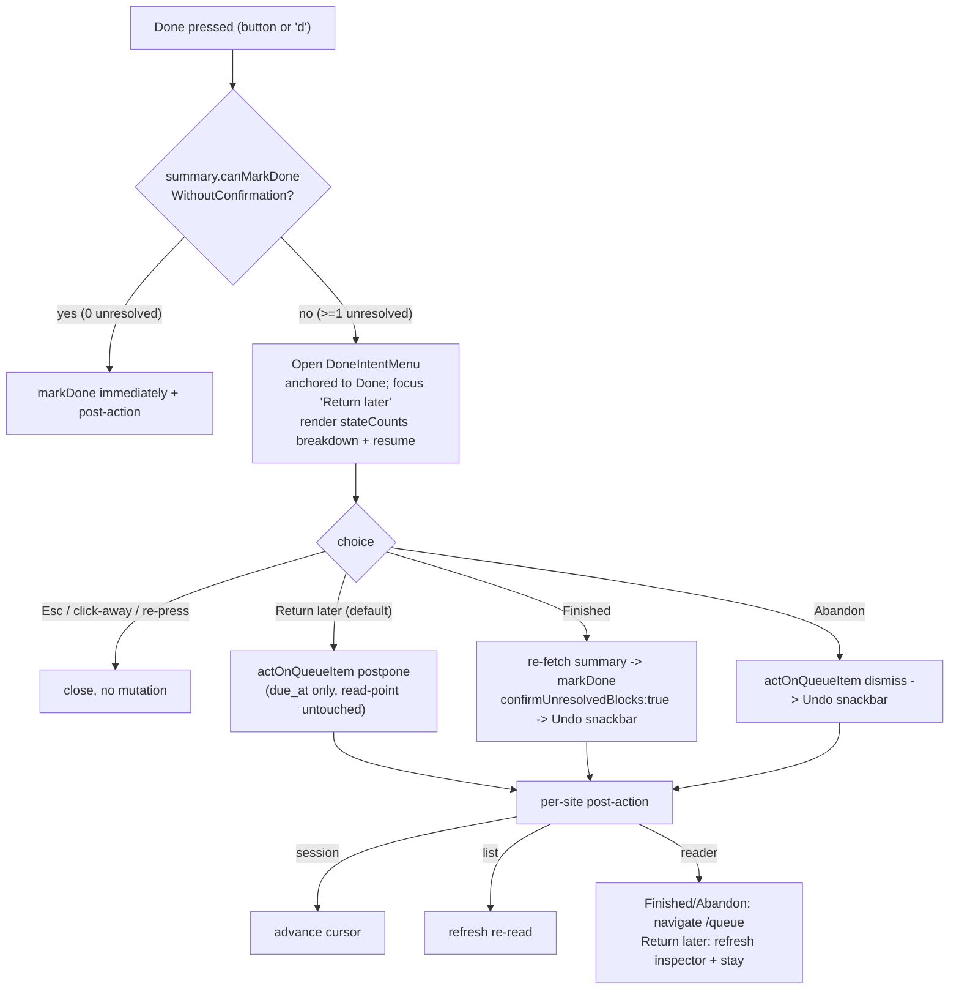

# feat: Partial-source "Done" intent surface (replace the unresolved-blocks confirm)

## Summary

Pressing **Done** on a source that still has unresolved blocks fires a native
`window.confirm` ("This source still has N unresolved blocks. Mark it done anyway?") at three
call sites. For an incremental-reading app this nags on the *normal* mid-processing state and
collapses three distinct intents — *finished* / *come back later* / *abandon* — into one yes/no.

Replace it with **one shared, non-modal, keyboard-navigable intent surface** anchored to the Done
action, defaulting focus to the safe **Return later**, showing an honest per-state breakdown from
`summary.stateCounts` (+ a resume location where available). The three choices route to the
**existing** mutations (`actOnQueueItem` `markDone` / `postpone` / `dismiss`); the server gate and
IPC are unchanged. This is a **renderer-only** change in `apps/web` — no `packages/*` or
`apps/desktop` edits, no new IPC.

---

## Problem Frame

- **Site A — in-session queue loop:** `apps/web/src/pages/queue/ProcessQueue.tsx` →
  `actionWithSourceDoneGate` (~L126), called from `act()` (~L537). The `d` shortcut maps to
  `act("markDone")` (`apps/web/src/pages/queue/useProcessShortcuts.ts`).
- **Site B — queue list rows:** `apps/web/src/pages/queue/QueueScreen.tsx` →
  `actionWithSourceDoneGate` (~L116), called from `onAction` (~L400).
- **Site C — standalone reader:** `apps/web/src/pages/source/SourceReader.tsx` →
  `onMarkSourceDone` (~L524), inside the `withExitAction` busy guard.

All three read `appApi.getBlockProcessingSummary`; the source-only gate is authoritative server-side
(`QueueActionService.markDone` re-derives `getDoneGate` and throws unless `confirmUnresolvedBlocks:true`).
Block states (`packages/core/src/source.ts`): only `extracted` / `ignored` /
`processed_without_output` are **terminal**; `unread` / `read` / `needs_later` / `stale_after_edit`
count as unresolved. A 1%-read source shows "68/68 unresolved".

**Why now:** the queue's done-gate is the last native `window.confirm` in the queue flow; it is
un-testable in Electron e2e, off-design (not token-styled), and product-wrong for incremental reading.

---

## Requirements

- **R1** Source Done with 0 unresolved blocks → mark done immediately, no surface (unchanged fast path).
- **R2** Source Done with ≥1 unresolved block → open a non-modal in-app surface (no `window.confirm`),
  default focus **Return later**, offering Finished / Return later / Abandon.
- **R3** Intents route to existing mutations: Finished → `actOnQueueItem({kind:"markDone", confirmUnresolvedBlocks:true})`;
  Return later → `actOnQueueItem({kind:"postpone"})`; Abandon → `actOnQueueItem({kind:"dismiss"})`.
- **R4** The surface renders a per-state breakdown from `summary.stateCounts` (friendly labels,
  zero buckets hidden, pluralized) plus a resume location where a read-point exists.
- **R5** Optimistic + reversible: Finished and Abandon raise a visible Undo (snackbar) on the queue
  surfaces (session + list); global ⌘Z undo restores at every site. Undo restores prior status + `due_at`.
- **R6** Server gate stays authoritative; no new IPC; one shared component used at all three sites.
- **R7** Keyboard: `d` opens the surface for an unresolved source (focus Return later); Esc / re-press /
  click-away cancels with no mutation; the surface is operable by keyboard without a focus trap.
- **R8** No `window.confirm` / `alert` / `prompt` remains for the done-gate at any of the three sites.

---

## Key Technical Decisions

- **KTD1 — Renderer-only, reuse existing `actOnQueueItem` kinds; no new IPC.** The three intents map
  1:1 to existing mutation kinds. The done-gate stays a server fact
  (`docs/solutions/architecture-patterns/durable-source-block-processing-state.md`); the surface only
  collects intent and forwards the `confirmUnresolvedBlocks` override. No `packages/local-db`,
  `packages/core`, or `apps/desktop` changes.
- **KTD2 — One shared anchored popover, modeled on `ScheduleMenu` + `BalanceBanner`.** Build
  `apps/web/src/components/queue/DoneIntentMenu.tsx` (+ `done-intent-menu.css`) following the
  `ScheduleMenu` anchored-popover pattern (`openSignal` prop, outside-click + Escape close,
  token-only styling from `design/tokens.css`) and `BalanceBanner`'s focus management (focus the
  default item on open, restore focus to the trigger on Escape). `role="dialog" aria-modal="false"`,
  non-modal, no focus trap. No `packages/ui` primitive exists for this (intentional — each popover is
  local).
- **KTD3 — "Return later" = single-cycle `postpone` via `actOnQueueItem({kind:"postpone"})`** (works
  uniformly for sources; `QueueActionService.postpone` handles the source/attention path). It writes
  `due_at` only and **never** touches the read-point — read-point (where) and due-date (when) stay
  decoupled (`docs/solutions/ui-bugs/daily-work-read-model-inbox-only-routing.md`). It is the
  non-destructive default and stays in rotation.
- **KTD4 — Undo affordance scoped to reality (rescopes the original "four ways").** `⌘⇧Z` redo /
  "undo-the-undo" is **out of MVP scope** and documented as unbound (`useShellShortcuts.ts:85`,
  help center copy). The real undo paths: (a) a **snackbar Undo button** on the session + list for
  Finished/Abandon (both return a `status` undo recipe), and (b) **global ⌘Z** (`undoLast`) at every
  site, which hit the same op. `postpone` returns `undo:null`, so **Return later** relies on global
  ⌘Z only (no snackbar) — acceptable because it is non-destructive and stays in rotation. The
  *data-layer* preimage symmetry the queue-eligibility learning requires
  (`docs/solutions/logic-errors/queue-eligibility-inventory-scheduler-state.md`) is already satisfied
  by `markDone`/`dismiss` returning `{previousStatus, previousDueAt}` and is verified by existing
  service tests — no redo UI is added.
- **KTD5 — Re-fetch the summary at Finished to close the non-modal staleness race.** A non-modal
  surface lets the doc change underneath it (the old modal froze the UI). On Finished, re-fetch
  `getBlockProcessingSummary`; if it dropped to 0 unresolved, mark done with no fuss; otherwise pass
  the override. The server gate is the final authority. The displayed breakdown is a best-effort
  snapshot (not live-updated).
- **KTD6 — Re-entrancy lives in the shared component, not the call sites.** The surface owns its own
  in-flight flag (modeled on the reader's `withExitAction` ref-guard) so a second submit while a
  mutation is in flight is dropped — uniform double-submit safety despite the three sites' differing
  busy models (`busy` / `busyId` / `exitActionBusyRef`). Opening the surface does **not** set the
  site-level busy (other rows stay usable — it is truly non-modal).
- **KTD7 — Breakdown copy is a pure renderer helper, not domain code.** State *classification*
  (`isTerminalSourceBlockProcessingState`) already lives in `packages/core`; the UI *labels*
  ("deferred (needs later)", "stale after edit") belong in `apps/web`. A pure helper maps
  `stateCounts` → ordered display segments (hide zeros, pluralize) and is unit-tested directly,
  keeping `packages/core` untouched.
- **KTD8 — Reader terminal behavior per intent (small, justified consistency fix).** Finished and
  Abandon **navigate to `/queue`** (the element left the active set; staying on a done/dismissed
  source's reader is a dead state, and Delete already navigates). Return later refreshes the inspector
  and stays (matches the existing `onScheduleReturn` behavior). The list keeps its existing
  `refresh()`-after-action model (correct for sort/counts) plus the snackbar; the session keeps its
  cursor `advance()`.

---

## High-Level Technical Design

Decision flow on **Done** for a source (identical logic at all three sites; only the post-action callback differs):

Post-action callback shape the shared component takes per site:
`onResolved(intent: "finished" | "later" | "abandon")` → session advances cursor; list refreshes;
reader navigates or refreshes per KTD8.

---

## Implementation Units

### U1. Breakdown copy helper (pure, unit-tested)

- **Goal:** Turn `summary.stateCounts` into ordered, human display segments and a resume label, with
  zero-count hiding and pluralization — the single source of the surface's copy.
- **Requirements:** R4.
- **Dependencies:** none.
- **Files:** `apps/web/src/pages/queue/doneIntentBreakdown.ts` (new),
  `apps/web/src/pages/queue/doneIntentBreakdown.test.ts` (new).
- **Approach:** Pure function `describeUnresolved(stateCounts)` → array of `{ key, label, count }`
  for the non-terminal buckets in a fixed order: `unread` → "unread", `read` → "read, not extracted",
  `needs_later` → "deferred", `stale_after_edit` → "stale after edit". Hide zero buckets. Pluralize
  ("1 block" vs "N blocks") via a tiny local helper. A second helper `resumeLabel(progress)` →
  `"block N of M"` or `null` when no read-point/total. Import `isTerminalSourceBlockProcessingState`
  from `@interleave/core` only to assert the terminal set is excluded (keeps it in sync).
- **Patterns to follow:** `blockProgressText` in `SourceReader.tsx` (~L648) for tone; existing pure
  helpers colocated with `.test.ts`.
- **Test scenarios:**
  - Happy: mixed counts → correct ordered segments with friendly labels.
  - Edge: all-zero non-terminal (0 unresolved) → empty segment list.
  - Edge: only `needs_later` → single "deferred" segment; only `stale_after_edit` → single "stale" segment.
  - Edge: count of 1 → singular "block"; >1 → plural "blocks".
  - Edge: terminal-only counts present (extracted/ignored/processed) → excluded from segments.
  - `resumeLabel`: present progress → "block N of M"; missing/zero total → `null`.
- **Verification:** `pnpm test` for the new file green; helper has no React import.

### U2. Shared `DoneIntentMenu` non-modal surface

- **Goal:** One anchored, non-modal, keyboard-navigable popover offering Finished / Return later /
  Abandon, defaulting focus to Return later, rendering the U1 breakdown + resume, owning its own
  in-flight guard.
- **Requirements:** R2, R4, R6, R7; KTD2, KTD6.
- **Dependencies:** U1.
- **Files:** `apps/web/src/components/queue/DoneIntentMenu.tsx` (new),
  `apps/web/src/components/queue/done-intent-menu.css` (new),
  `apps/web/src/components/queue/DoneIntentMenu.test.tsx` (new).
- **Approach:** Props ~ `{ summary, resumeLabel?, open / openSignal, onResolved(intent), onClose, busy? }`.
  Render anchored popover (`position: absolute`, token-only, mirroring `schedule-menu.css`). On open,
  focus the Return later button; Escape closes and restores focus to the trigger; outside-click
  closes (guard against swallowing the next click, cf. reader processed-mark listener). Three buttons
  with icons (`postpone`, `check`/`checkCircle`, `x` per `design/icon-map.md`), outcome-labeled, each
  Enter/Space-activatable; Tab cycles the three and may exit (no trap). Own in-flight `useRef` flag:
  the first chosen intent sets it and calls `onResolved`; further activations are dropped until reset
  on close. `role="dialog" aria-modal="false"`, `aria-label` from source title + unresolved summary.
- **Patterns to follow:** `apps/web/src/components/queue/ScheduleMenu.tsx` (anchored popover +
  `openSignal`), `apps/web/src/components/BalanceBanner.tsx` (focus-on-open, Esc-restore, outside-click),
  `apps/web/src/components/Icon.tsx`.
- **Test scenarios:**
  - Renders three outcome-labeled buttons; breakdown segments from U1; resume line when provided, omitted when not.
  - On open, focus lands on Return later.
  - Clicking each button calls `onResolved` with `"later"` / `"finished"` / `"abandon"` exactly once.
  - Esc → `onClose`, no `onResolved`; outside-click → `onClose`.
  - Double-activate (click Finished twice fast) → `onResolved` fires once (in-flight guard).
  - `busy` disables the buttons; `role="dialog" aria-modal="false"` and aria-label present.
  - Keyboard: Tab cycles the three buttons; Enter activates focused button.
- **Verification:** component tests green; no `window.confirm`; tokens only (no hard-coded colors).

### U3. Wire the in-session queue loop (ProcessQueue)

- **Goal:** Replace `actionWithSourceDoneGate`'s `window.confirm` with `DoneIntentMenu`; `d` opens it
  for unresolved sources; intents reuse existing `act()` paths; Finished/Abandon show a snackbar Undo.
- **Requirements:** R1, R2, R3, R5, R7, R8; KTD4, KTD5, KTD8.
- **Dependencies:** U2.
- **Files:** `apps/web/src/pages/queue/ProcessQueue.tsx`,
  `apps/web/src/pages/queue/useProcessShortcuts.ts`,
  `apps/web/src/pages/queue/ProcessQueue.test.tsx`,
  (reuse) `apps/web/src/components/queue/QueueSnackbar.tsx`.
- **Approach:** Replace the `window.confirm` body: on `act("markDone")` for a source with
  `!canMarkDoneWithoutConfirmation`, open `DoneIntentMenu` (via an `openSignal` like
  `postponeMenuOpenSignal`) instead of confirming. Callbacks → existing `act("markDone" w/ confirm)`
  (re-fetch summary first per KTD5), `act("postpone")`, `act("dismiss")`, so `ProcessUndoState` +
  local ⌘Z keep working. Render `QueueSnackbar` (currently only the `flash`/local undo exist) wired to
  the existing `undoLastProcessAction`/`undoState` so Finished/Abandon show a visible **Undo** button
  hitting the same op as ⌘Z. `d` keeps immediate markDone for non-sources and 0-unresolved sources;
  opens the surface for unresolved sources. Add the surface's open key to `PROCESS_BOUND_KEYS` if a new
  key is introduced (default: reuse `d`, no new key).
- **Patterns to follow:** `postponeMenuOpenSignal`/`ScheduleMenu` wiring already in this file; the
  `act()` undo recipe handling (~L550).
- **Test scenarios:**
  - 0-unresolved source Done → `actOnQueueItem({kind:"markDone"})`, cursor advances, no surface rendered.
  - Unresolved source Done (`d` or button) → surface opens; no `window.confirm` called.
  - Finished → `actOnQueueItem` called with `{kind:"markDone", confirmUnresolvedBlocks:true}`; cursor advances; snackbar with Undo shown.
  - Return later → `{kind:"postpone"}`; Abandon → `{kind:"dismiss"}`; both advance cursor.
  - Esc closes surface, no mutation, cursor unchanged.
  - Snackbar Undo and ⌘Z both call the undo path (same op).
  - `d` on a card/extract still marks done immediately (gate is source-only).
  - Covers R8: assert `window.confirm` is never called on this path.
- **Verification:** rewritten confirm tests pass; `pnpm test` green for this file.

### U4. Wire the queue list rows (QueueScreen)

- **Goal:** Replace the row done-gate `window.confirm` with `DoneIntentMenu` anchored to the row's
  Done button; intents reuse `onAction`/`onSchedule`; Finished/Abandon raise the existing `QueueSnackbar`.
- **Requirements:** R1, R2, R3, R5, R8; KTD5.
- **Dependencies:** U2.
- **Files:** `apps/web/src/pages/queue/QueueScreen.tsx`,
  `apps/web/src/pages/queue/QueueScreen.test.tsx`.
- **Approach:** Replace the `window.confirm` in `actionWithSourceDoneGate` with opening the surface
  anchored to the row's `markDone` button. Callbacks call the existing `onAction` paths (markDone with
  confirm after a re-fetch / postpone / dismiss). Keep the existing `refresh()`-after-action model
  (correct for sort/counts/budget); optimistically the row leaves on refresh. Wire `QueueSnackbar`
  (already present for batch) for Finished/Abandon using `res.undo` → `undoQueueAction`. Opening the
  surface must not disable other rows (KTD6) — do not set `busyId` on open, only on submit.
- **Patterns to follow:** existing `ROW_ACTIONS`, `onAction`/`onSchedule`, the batch `QueueSnackbar`
  + `batchUndoState` wiring.
- **Test scenarios:**
  - 0-unresolved row Done → immediate markDone, no surface.
  - Unresolved row Done → surface opens (no `window.confirm`); Finished/Return later/Abandon route to correct payloads.
  - Finished/Abandon → `QueueSnackbar` shown with Undo → `undoQueueAction` with the returned recipe.
  - Esc/outside-click closes, no mutation, row stays.
  - Opening the surface on row A does not disable row B's actions.
  - Covers R8: no `window.confirm` on the row path.
- **Verification:** rewritten confirm tests pass; `pnpm test` green.

### U5. Wire the standalone reader (SourceReader)

- **Goal:** Replace `onMarkSourceDone`'s inline `window.confirm` with `DoneIntentMenu` anchored to
  `reader-mark-done`; intents run inside `withExitAction`; Finished/Abandon navigate to `/queue`
  (with a ⌘Z-undo toast), Return later refreshes + stays.
- **Requirements:** R1, R2, R3, R5, R7, R8; KTD3, KTD5, KTD8.
- **Dependencies:** U2.
- **Files:** `apps/web/src/pages/source/SourceReader.tsx`,
  `apps/web/src/pages/source/SourceReader.test.tsx`.
- **Approach:** On Done with unresolved blocks, open the surface (the reader has the read-point via
  `rp`, so pass a real resume label). Finished → re-fetch summary, `actOnQueueItem({kind:"markDone",
  confirmUnresolvedBlocks:true})`, toast "Source done — ⌘Z to undo", navigate `/queue`. Abandon →
  `actOnQueueItem({kind:"dismiss"})`, toast, navigate `/queue`. Return later → existing postpone path
  (`actOnQueueItem({kind:"postpone"})` or `onScheduleReturn`), refresh inspector, stay. All inside
  `withExitAction`. Remove the inline `window.confirm`. Preserve failure handling (controls stay usable
  on error — existing test).
- **Patterns to follow:** `withExitAction`, `onScheduleReturn`, `deleteSource` navigate pattern, the
  existing toast usage.
- **Test scenarios:**
  - 0-unresolved Done → immediate markDone (existing fast path), no surface.
  - Unresolved Done → surface opens (no `window.confirm`).
  - Finished → markDone with confirm flag, navigate `/queue`, ⌘Z-undo toast.
  - Abandon → dismiss, navigate `/queue`.
  - Return later → postpone, stays on reader, inspector refresh, no navigation.
  - Esc closes surface, no mutation, stays on reader.
  - Mutation failure → toast error, controls remain usable (regression of existing test).
  - Covers R8: no `window.confirm` on the reader path.
- **Verification:** rewritten confirm tests pass; `pnpm test` green.

### U6. Electron e2e + restart survival

- **Goal:** Prove the new surface (no native dialog) and the persistence/undo invariants end-to-end.
- **Requirements:** R1, R3, R5, R8; Definition of Done persistence proofs.
- **Dependencies:** U3, U4, U5.
- **Files:** `tests/electron/process-queue.spec.ts` (extend) and/or
  `tests/electron/source-reader.spec.ts` (extend); reuse `launchApp` + seed helpers.
- **Approach:** Seed a source with unresolved blocks. From the in-session loop: press Done → assert
  the in-app `DoneIntentMenu` appears (no native dialog). (a) **Return later** → source recedes,
  **restart app**, source returns when due with read-point intact and block states unchanged.
  (b) **Finished** → status `done`, due cleared, `operation_log` has the queue-exit `update_element`;
  snackbar Undo restores `active` + prior `due_at`; restart confirms persisted state. (c) **Abandon**
  → `dismissed`, due cleared; restart confirms. (d) **Cancel** (Esc) → zero `operation_log` entries,
  source unchanged after restart.
- **Patterns to follow:** `tests/electron/process-queue.spec.ts` (undo-a-lifecycle-action +
  "mutations survive restart"), `tests/electron/queue.spec.ts` markDone/dismiss + restart,
  `tests/electron/source-reader.spec.ts` action bar. Rebuild `dist` before Electron e2e.
- **Test scenarios:** the four flows above, each asserting DOM surface presence (no native dialog),
  persisted status/due, read-point retention (Return later), and op-log entry counts (cancel = none).
- **Verification:** targeted `pnpm e2e` specs green; surface is e2e-visible (was impossible with `window.confirm`).

---

## Scope Boundaries

**In scope:** the three done-gate call sites; one shared `DoneIntentMenu`; the breakdown helper;
snackbar Undo on session+list; ⌘Z everywhere; e2e. Renderer-only (`apps/web`, `tests/electron`).

**Out of scope / unchanged:**
- The server gate, `confirmUnresolvedBlocks` semantics, block-state model, terminal/unresolved
  classification, IPC contract, `packages/local-db`, `packages/core`, `apps/desktop`.
- Auto-retire / yield-plateau completion, block-level scheduling, triage-on-resurface (separate work).
- The default queue exit (Skip / Enter unchanged); only Done-on-partial changes.
- FSRS / card paths (the gate is source-only; cards keep immediate markDone).

### Deferred to Follow-Up Work
- **`⌘⇧Z` redo / "undo-the-undo" UI** — out of MVP scope and documented as unbound
  (`useShellShortcuts.ts:85`); not added here. Data-layer preimage symmetry remains covered by
  existing service tests.
- **The 4th `window.confirm` in `apps/web/src/pages/Settings.tsx`** (restore-from-file) — unrelated to
  the done-gate; left as-is. A future unification of destructive-confirm UX could fold it in.
- **List read-point "block N of M"** — the row summary lacks read-point position; the list omits the
  resume line (breakdown still shown) rather than adding a read. Reader + session show it.

---

## Risks & Mitigations

- **Stale-summary race (non-modal):** mitigated by re-fetch-on-Finished + authoritative server gate (KTD5).
- **Three sites diverging:** mitigated by one shared component with a per-site `onResolved` callback;
  a usage assertion guards against re-forking.
- **Undo correctness (highest-risk area):** rely on existing `markDone`/`dismiss` `status` recipes and
  `undoLast`; e2e covers snackbar Undo + ⌘Z restoring status + due_at; redo is explicitly out of scope.
- **Outside-click listener colliding with the reader's processed-mark global click handler:** scope the
  surface's listener and guard against swallowing the next real click (cf. `BalanceBanner`).
- **`d` key behavior change:** constrained to unresolved sources only; non-sources and 0-unresolved
  keep immediate markDone; covered by tests + `PROCESS_BOUND_KEYS` drift contract.

---

## Test Strategy (Definition of Done)

- `pnpm lint`, `pnpm typecheck`, `pnpm test` green; targeted `pnpm e2e` specs (U6) green.
- No `window.confirm`/`alert`/`prompt` for the done-gate at any of the three sites (grep-able + asserted).
- Component tests: 3 intents → correct payloads (Finished passes `confirmUnresolvedBlocks:true`;
  Return later → postpone; Abandon → dismiss); 0-unresolved → immediate done, no surface; breakdown
  from `stateCounts`; Esc/outside-click non-destructive; in-flight guard.
- Undo: snackbar Undo (session+list) and global ⌘Z restore status + `due_at`; service-level preimage
  symmetry already covered (redo out of scope).
- e2e: partial Done shows the in-app surface (no native dialog); Return later reschedules + survives
  restart with read-point intact; Finished done + Undo restores; Abandon dismissed; cancel writes no op-log.

---

## Resolved Decisions (were open during research)

- **Undo "four ways" → two real ways** (snackbar + ⌘Z, same op); redo descoped (KTD4).
- **Snackbar on which intents:** Finished + Abandon (have recipes); Return later relies on ⌘Z (KTD4).
- **Reader post-action:** Finished/Abandon navigate `/queue`; Return later refresh + stay (KTD8).
- **`d` semantics:** unresolved source → surface; else immediate markDone (U3).
- **Breakdown source/labels:** pure renderer helper over `stateCounts`; needs_later="deferred",
  stale_after_edit="stale after edit" (KTD7, U1).
- **List resume line:** omitted (no read-point position in row summary); breakdown still shown.
- **Stale summary:** re-fetch on Finished; server gate authoritative (KTD5).
