# T105 Priority-integrity read model

## Summary

T105 adds a trusted priority-integrity read model that reports whether serviced work and deferred
work matched declared priorities. It derives attention service, FSRS service, deferral, postpone
debt, per-topic, and live band-share signals from durable `operation_log`, `review_logs`, and
`elements` facts, exposes the summary through the existing typed bridge, and renders a compact
Analytics receipt plus a durably dismissible Queue warning when thresholds are breached.

## Problem Frame

M16/T077 can postpone overloaded work correctly, but the user currently gets no receipt for what
was serviced or sacrificed. Repeated deferrals, priority inflation, and missed due-and-eligible
work are durable facts, yet they are not aggregated anywhere. T105 turns those facts into a
read-only accountability layer without changing scheduler behavior.

## Requirements

- R1. Compute a read-only priority-integrity summary in `packages/local-db`; React must not group
  raw logs or infer queue eligibility.
- R2. Report per priority band over a rolling local-calendar window: attention serviced, FSRS
  serviced, deferred, service/defer rates, and newly introduced postpone debt in days.
- R3. Report narrow per-topic/source-anchor summaries for linkable work, without concept maturity,
  retention, or graduation state.
- R4. Report live collection band share and flag A-band inflation when live A-band inventory is
  greater than `0.4` of live accountable inventory.
- R5. Return a bounded "sacrificed recently" list of most-postponed live rows with title, type,
  priority band, scheduler kind, postpone count, debt days, latest defer time, and topic/source
  anchor when known.
- R6. Include a durably dismissible Queue warning only when backend threshold flags are present;
  the warning routes to the Analytics priority-integrity panel and never invents a queue action.
- R7. Expose the model through validated Electron IPC, preload, and `appApi` with no generic SQL,
  filesystem, or renderer persistence capability.
- R8. Prove the query is read-only by testing that it appends no `operation_log` rows.
- R9. Use local-day window semantics for user-facing dates, matching the analytics heatmap
  precedent.

## Key Technical Decisions

- KTD1. Trusted read model, not a new table: `PriorityIntegrityQuery` lives in
  `packages/local-db/src/priority-integrity-query.ts` and recomputes from durable facts. This
  follows the analytics and heatmap pattern and avoids parallel analytics state.
- KTD2. Define the event taxonomy explicitly: attention service comes from in-window
  `reschedule_element` ops whose payload has `action` in `extract`, `rewrite`, `activate`, or
  `done`; attention/card deferral comes from `payload.postpone === true`; FSRS service comes from
  `review_logs`. The API keeps `attentionServiced`, `fsrsServiced`, and `deferred` separate so
  rates do not hide scheduler-kind differences.
- KTD3. Attribute bands from current element priority for T105, but suppress high-severity
  A-band-deferred flags for rows with in-window `update_element` priority changes. This prevents a
  C item postponed yesterday and raised to A today from producing a false strong A-sacrifice
  warning while avoiding full historical priority reconstruction.
- KTD4. Count "missed/deferred" only for rows that were due and eligible at the time implied by
  the op payload: valid previous due at or before the op timestamp, live row still accountable,
  and card rows not retired. Use `QueueRepository` helpers/semantics where possible; do not rely
  on `dueAt` or status alone.
- KTD5. Compute postpone debt as newly introduced displacement, not inherited overdue backlog:
  `max(prevDueAt, op.createdAt) -> dueAt` for attention and `max(prevReviewDueAt, op.createdAt) ->
  dueAt` for card defers. Missing or invalid preimages contribute zero debt but can still count as
  defer events.
- KTD6. Keep topic grouping conservative: group by a direct source/topic anchor when present
  (`sourceId`, `parentId`, or the row itself for topic/source rows). Concept rollups and richer
  topic knowledge state belong to T108/T109.
- KTD7. Threshold flags are named contract fields: `aBandInflation` when live A share is `> 0.4`;
  `aBandDeferredRecently` when A-band `deferred > 0` and no in-window priority edit makes the
  attribution suspect; `postponeDebtHigh` when any band accumulates `>= 14` debt days. Queue uses
  only these backend flags.
- KTD8. Queue warning dismissal uses the existing generic settings pattern from `BalanceBanner`:
  store a timestamp under `ui.noticeDismissals` keyed by `priorityIntegrity.queue`. Hide for a
  week is in scope; turning off the whole feature is not.

## High-Level Technical Design

```mermaid
flowchart TB
  Logs["operation_log + review_logs"] --> Query["PriorityIntegrityQuery"]
  Elements["elements + cards/review_states"] --> Query
  Query --> DbService["DbService.getPriorityIntegrity"]
  DbService --> IPC["analyticsPriorityIntegrity channel"]
  IPC --> Bridge["window.appApi.analytics.priorityIntegrity"]
  Bridge --> Wrapper["appApi.getPriorityIntegrity"]
  Wrapper --> Analytics["Analytics panel with id priority-integrity"]
  Wrapper --> Queue["Dismissible Queue warning"]
  Queue --> Analytics
```

## Scope Boundaries

- T105 does not pause recession, force a decision, reset postpone counts, demote items, or mutate
  schedules. T106 owns chronic-postpone reckoning.
- T105 does not create parallel analytics tables, materialized ledgers, or new operation-log op
  types.
- T105 does not distinguish auto-postpone from manual bulk postpone because existing payloads do
  not persist that distinction.
- T105 does not build concept-level maturity, retention trends, or graduation events. T108/T109
  own those surfaces.
- T105 does not change `postponeIntervalForPriority` or queue sorting.

## Implementation Units

### U1. PriorityIntegrityQuery domain read model

- **Goal:** Add a read-only local-db query with exact metric semantics, conservative topic
  grouping, named threshold flags, and deterministic local-day windowing.
- **Files:** `packages/local-db/src/priority-integrity-query.ts`,
  `packages/local-db/src/priority-integrity-query.test.ts`, `packages/local-db/src/index.ts`,
  `packages/local-db/src/queue-repository.ts` only if a small shared eligibility helper is needed.
- **Patterns to follow:** `packages/local-db/src/analytics-query.ts`,
  `packages/local-db/src/extract-stagnation-query.ts`,
  `docs/solutions/architecture-patterns/review-activity-heatmap-read-model.md`,
  `docs/solutions/logic-errors/queue-eligibility-inventory-scheduler-state.md`.
- **Approach:** Define `PriorityIntegritySummary`, `PriorityIntegrityBandSummary`,
  `PriorityIntegrityTopicSummary`, `PriorityIntegritySacrificedRow`, and
  `PriorityIntegrityThresholdFlags`. Use a local-calendar rolling window
  `[startOfLocalDay(asOf) - (windowDays - 1), asOf]`. Gather live elements once, in-window
  `review_logs` once, in-window `operation_log` rows for `reschedule_element` and priority
  `update_element` once, parse payloads defensively, and aggregate by priority label and
  topic/source anchor. Split attention service, FSRS service, and deferral in the payload. Compute
  live band shares from live accountable inventory using queue eligibility semantics, including
  retired-card exclusion.
- **Test scenarios:** Empty data returns zero-filled A/B/C/D summaries; attention non-postpone
  reschedules increment `attentionServiced`; review logs increment `fsrsServiced`; attention and
  card postpone payloads increment deferred counts; not-yet-due, terminal, parked, deleted, and
  retired-card rows do not count as missed priority; invalid payload dates do not throw; overdue
  card defer debt counts only new displacement; a C-postpone then A-raise does not trigger the
  strong A-deferred flag; topic/source anchor summaries aggregate expected rows; exact local-day
  boundary inclusion/exclusion works; query adds no `operation_log` rows.
- **Verification:** `pnpm test -- packages/local-db/src/priority-integrity-query.test.ts`.

### U2. Typed desktop and renderer API surface

- **Goal:** Thread the read model through the existing analytics bridge without widening renderer
  privileges.
- **Files:** `apps/desktop/src/shared/channels.ts`, `apps/desktop/src/shared/contract.ts`,
  `apps/desktop/src/shared/contract.test.ts`, `apps/desktop/src/shared/channels.test.ts`,
  `apps/desktop/src/main/ipc.ts`, `apps/desktop/src/main/db-service.ts`,
  `apps/desktop/src/main/db-service.test.ts`, `apps/desktop/src/preload/index.ts`,
  `apps/desktop/src/preload/index.test.ts`, `apps/web/src/lib/appApi.ts`,
  `apps/web/src/lib/appApi.test.ts`.
- **Patterns to follow:** `analytics.get`, `analytics.reviewActivity`, `sourceYield.list`, and
  `extractStagnation.list` contracts.
- **Approach:** Add `IPC_CHANNELS.analyticsPriorityIntegrity`, expose
  `window.appApi.analytics.priorityIntegrity(request)`, and add the flattened renderer wrapper
  `appApi.getPriorityIntegrity(request)`. Validate `{ asOf?, windowDays?, sacrificedLimit?,
  topicLimit? }` with bounded Zod inputs. Main defaults `asOf` with `nowIso()` and maps the
  local-db summary directly into JSON-safe contract types. Add an empty fallback result to
  non-desktop `appApi`.
- **Test scenarios:** Contract accepts omitted request and bounded options; rejects malformed
  dates, non-integer windows, and excessive limits; channel/preload forward the request exactly;
  `DbService` calls the query with defaults and returns threshold flags; web fallback resolves a
  zero summary.
- **Verification:** Desktop shared, preload, db-service, and appApi targeted tests.

### U3. Analytics panel

- **Goal:** Surface the receipt in Analytics as a compact accountability panel and a direct
  destination for Queue warnings.
- **Files:** `apps/web/src/analytics/AnalyticsScreen.tsx`,
  `apps/web/src/analytics/AnalyticsScreen.test.tsx`, `apps/web/src/analytics/analytics.css`,
  possibly `apps/web/src/analytics/PriorityIntegrityPanel.tsx`.
- **Patterns to follow:** `apps/web/src/analytics/ReviewActivityHeatmap.tsx`,
  `apps/web/src/analytics/SourceYield.tsx`, `design/kit/app/screen-analytics.jsx`,
  `docs/design-system.md`.
- **Approach:** Load priority integrity alongside existing analytics requests and add a request-id
  guard for the whole main Analytics load bundle. Render a panel with `id="priority-integrity"`
  near the top of the Analytics body after the balance banner, so Queue can navigate to
  `/analytics#priority-integrity` and focus the panel heading. Show four band rows, direct
  topic/source anchor rows, threshold chips, and a bounded sacrificed list. Sacrificed rows use
  existing `TypeIcon`, `Prio`, and `SchedulerChip` or a compact variant with the same scheduler
  and priority tokens.
- **Panel states:** Loading keeps the rest of Analytics visible with a compact placeholder. Read
  error shows a small inline error inside the panel only. Empty library shows zeroed bands and
  "No priority debt yet." Healthy/no flags says "Priorities are being serviced within thresholds."
  Flags with no sacrificed rows show the flag summary and "No individual rows remain in the
  sacrificed list." Flags with rows render the bounded list.
- **Test scenarios:** Loading and error states remain local to the panel; empty data renders
  zeroed copy; warning flags render chips; topic/source rows render when present; sacrificed rows
  render existing type/priority/scheduler treatments; clicking a Queue deep link focuses the panel
  heading; stale responses cannot overwrite newer Analytics data; no raw row grouping occurs in
  the component.
- **Verification:** `pnpm test -- apps/web/src/analytics/AnalyticsScreen.test.tsx`.

### U4. Queue-header warning and durable dismissal

- **Goal:** Add a quiet route-level integrity indicator when backend threshold flags say
  priorities are being sacrificed.
- **Files:** `apps/web/src/pages/queue/QueueScreen.tsx`,
  `apps/web/src/pages/queue/QueueScreen.test.tsx`, `apps/web/src/pages/queue/queue.css`, and any
  small shared notice-dismissal helper extracted from `apps/web/src/components/BalanceBanner.tsx`.
- **Patterns to follow:** `apps/web/src/components/BalanceBanner.tsx`,
  `docs/solutions/ui-bugs/balance-banner-queue-inbox-action-gating.md`.
- **Approach:** Fetch the priority-integrity summary for the queue header and add a request-id
  guard for the whole Queue `refresh()` state bundle. Render only when backend threshold flags are
  present and the `priorityIntegrity.queue` notice is not snoozed. Use a compact warning banner
  with `role="status"`, warning icon, deterministic summary copy for A-deferred vs inflation vs
  debt, a `View analytics` CTA to `/analytics#priority-integrity`, and a small hide-for-week menu
  persisted through `ui.noticeDismissals`. Place it below the queue title/budget area and above
  filters so it is visible without interrupting row scanning.
- **Test scenarios:** No warning below thresholds; warning appears only for named backend flags;
  any single A-band defer that does not produce a threshold flag stays hidden; hide for a week
  persists and suppresses the warning; failed dismissal keeps the warning visible with an inline
  error; CTA navigates and focuses Analytics panel; failed read hides the warning without breaking
  queue loading; stale async response does not flash outdated warning copy.
- **Verification:** `pnpm test -- apps/web/src/pages/queue/QueueScreen.test.tsx`.

### U5. Electron coverage and docs

- **Goal:** Prove the full desktop bridge and record the completed task.
- **Files:** `tests/electron/analytics.spec.ts`, `docs/tasks/M22-receipts.md`,
  `docs/roadmap.md`.
- **Patterns to follow:** Existing Analytics and queue Electron specs, plus roadmap completion
  notes from T101-T104.
- **Approach:** Seed enough review, attention-service, and postpone facts through existing
  fixtures or direct trusted setup. Open Analytics, assert the priority-integrity panel appears,
  then open Queue and assert the warning links back to the panel when threshold flags are present.
  Include a restart check for durable facts and the hide-for-week setting when practical. Update
  docs only after implementation and verification.
- **Test scenarios:** Analytics panel appears through real Electron `window.appApi`; a restart
  still shows the same durable facts; Queue warning appears for seeded threshold breach and links
  to Analytics; hide-for-week suppresses the Queue warning after restart.
- **Verification:** `pnpm e2e tests/electron/analytics.spec.ts` or the smallest relevant Electron
  spec subset after implementation.

## Acceptance Examples

- AE1. Given one A-band source with an in-window `action: "extract"` reschedule and one A-band
  card reviewed once, the A row reports one attention-serviced event and one FSRS-serviced event.
- AE2. Given one A-band source postponed while due and eligible, the A row reports one deferred
  event and debt days computed from `max(prevDueAt, op.createdAt) -> dueAt`.
- AE3. Given an overdue card deferred seven days, debt records the new seven-day displacement, not
  the full overdue backlog from old due date to new due date.
- AE4. Given live collection rows where A-band share is greater than `0.4`, Analytics shows
  `aBandInflation` and Queue shows the dismissible warning.
- AE5. Given a C-band row postponed and then raised to A in the same window, the row can appear in
  metrics with current-priority attribution, but it does not trigger the strong
  `aBandDeferredRecently` Queue warning.
- AE6. Given malformed legacy postpone payloads, the read model still counts valid marker events
  without throwing and assigns zero debt where preimages are unusable.
- AE7. Given an empty library, all four band summaries are present with zero counts and no warning
  flags.

## System-Wide Impact

This adds a new read model and IPC method but no new persistence schema and no mutation path.
Performance matters because `operation_log` and `review_logs` can be large; the implementation
should use bounded window queries, grouped passes, and limits for sacrificed/topic rows. The
two-scheduler split stays intact: attention-service ops, FSRS review logs, and deferral markers
are separate metrics in one receipt.

## Risks & Dependencies

- Operation-log payloads are heterogeneous and historical rows may be incomplete; parsing must be
  defensive and well-tested.
- Current-priority attribution can differ from event-time priority after later priority edits. The
  plan mitigates strong false warnings by detecting in-window priority edits, but full historical
  reconstruction remains out of scope.
- Auto-postpone and manual postpone are not distinguishable from persisted payloads today.
- Queue warning copy must avoid promising a corrective workflow; T105 is a receipt, not the T106
  decision surface.
- Durable notice dismissal should be extracted carefully from `BalanceBanner` so both banners use
  one helper and do not drift.

## Sources And Research

- Task spec: `docs/tasks/M22-receipts.md`.
- Scheduling rules: `docs/scheduling-and-priority.md`.
- Analytics read model precedent: `packages/local-db/src/analytics-query.ts`.
- Op-log postpone precedent: `packages/local-db/src/extract-stagnation-query.ts`.
- T077 apply seam: `packages/local-db/src/auto-postpone-service.ts` and
  `packages/local-db/src/queue-action-service.ts`.
- Prior learnings:
  `docs/solutions/architecture-patterns/review-activity-heatmap-read-model.md`,
  `docs/solutions/architecture-patterns/review-analytics-data-capture-in-review-logs.md`,
  `docs/solutions/logic-errors/queue-eligibility-inventory-scheduler-state.md`, and
  `docs/solutions/ui-bugs/balance-banner-queue-inbox-action-gating.md`.
