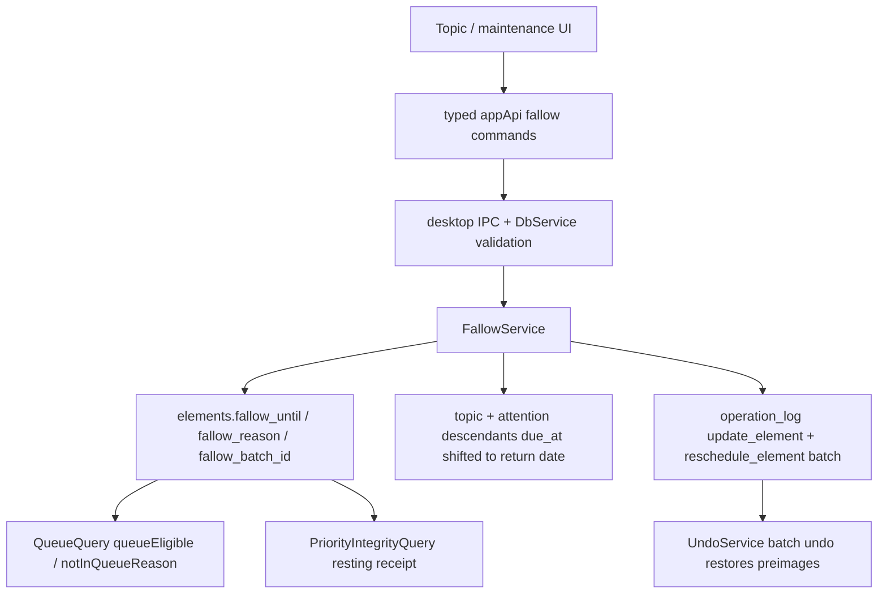

# T107 Fallow topic rest

## Summary

T107 adds deliberate, scheduled rest for topics. A user can fallow a topic until a chosen return
date with an optional reason. Fallowing pauses attention-scheduled topic work without counting as
postpone debt, keeps descendant cards in FSRS review, surfaces the rest state in queue and topic
inventory, and can be reversed through the existing operation-log/undo model.

## Problem Frame

Today a topic that is not worth working on right now is either postponed repeatedly, which creates
recession growth and priority-integrity debt, or abandoned, which is terminal. Fallow is a third
state: the topic is intentionally resting and will return. The feature must keep T105 accounting
honest by separating deliberate rest from missed work, while preserving backend-owned scheduling
semantics and the source-lineage model.

## Requirements

- R1. A live topic can be fallowed with `fallowUntil` and optional `fallowReason` durable state.
- R2. Entering fallow affects only attention-scheduled work under that topic. Descendant cards keep
  their `review_states` due dates and remain reviewable.
- R3. Fallowing shifts the topic row and live non-card descendants under the topic out to the
  return date in one transaction, appending command-shaped `operation_log` entries with one
  `batchId`.
- R4. Fallow is distinct from postpone. It must not set `postpone: true`, must not grow chronic
  postpone recession, and must be excluded from priority-integrity missed/deferred accounting.
- R5. Priority integrity reports fallowed topics separately as deliberate rest, including count and
  the nearest return date.
- R6. Queue and inventory semantics are backend-owned. Rows hidden by fallow expose
  `notInQueueReason: "fallow"` plus separate display metadata (`fallowUntil`, display label, and
  optional user-entered `fallowReason`); React must not infer this from `due_at`.
- R7. Fallow state is visible on topic/inventory surfaces and reversible through a typed command.
- R8. T106 chronic-postpone reckoning can offer Fallow as a fifth decision for topic rows only,
  with stale/non-topic decisions skipped explicitly.
- R9. Topic and inventory reads distinguish three states: active resting (`asOf < fallowUntil`),
  returned/expired (`asOf >= fallowUntil` but fields still present), and not resting. Expired
  fallow must not look like active rest.
- R10. Review cards whose ancestor topic is actively fallowed carry a lightweight context line so
  continuing card reviews do not look like fallow failed.
- R11. IPC, preload, and renderer client APIs expose only validated, narrow fallow commands and
  typed read results. No generic SQL/filesystem surface is added.
- R12. Roadmap and task documentation record the completed behavior, commit reference, downstream
  notes, and verification evidence.

## Key Technical Decisions

- KTD1. Store current fallow state on `elements`, not only in `operation_log`. Add nullable
  `fallow_until` and `fallow_reason` columns to the universal element row. This keeps queue,
  inventory, analytics, and inspector reads cheap and explicit while the operation log remains the
  audit and undo source.
- KTD2. Limit first implementation scope to topic-owned parent-tree descendants. A rested topic
  applies to live descendants whose `parent_id` chain reaches the topic. Cards are intentionally
  skipped because FSRS memory decays during rest; the UI copy should state that reviews continue.
  `source_id` remains lineage root, not topic membership.
- KTD3. Use `update_element` / `reschedule_element` operation payloads with a shared `batchId`;
  avoid a new operation type. Fallow metadata updates and descendant schedule shifts are ordinary
  command-shaped mutations with enough preimage data for undo.
- KTD4. Fallow works by schedule mutation, not an extra queue filter. The service reschedules the
  topic row and attention descendants to `fallowUntil`; queue list/count reads remain governed by
  due dates. Inventory summaries use active fallow metadata only to explain why a future-due row is
  resting. No due row should be hidden solely by a renderer or `QueueQuery` decoration filter.
- KTD5. Manual unfallow has one non-optional behavior: clear the topic's fallow fields and restore
  the topic plus attention descendants from the latest active fallow batch preimages. The service
  stores the active batch id in `elements.fallow_batch_id` so it does not need to search JSON
  payloads. If later user scheduling changed a descendant after the fallow batch, unfallow skips
  restoring that descendant and returns a skip summary rather than overwriting newer intent.
  Date-based return does not clear fields; once `asOf >= fallowUntil`, normal due rules apply and
  the resting receipt no longer treats the topic as active fallow.
- KTD6. Priority-integrity exclusion is payload-based and state-aware. Reschedules marked
  `fallow: true` are skipped before all service/defer/topic/sacrificed branches, so they are not
  counted as service, deferrals, debt, or sacrificed work. Live, unexpired fallowed topics appear in
  a separate `resting` receipt section with enough topic names, reasons, and return dates to make
  the exclusion auditable. No mutable analytics table is introduced.
- KTD7. T106 fallow decision is topic-only and discriminated:
  `{ kind: "fallow", id, fallowUntil, fallowReason? }`. It uses a transaction-composable
  `FallowService.fallowTopicWithin(tx, ..., batchId)` so a mixed chronic batch remains one
  undoable batch. A chronic fallow decision also appends the chronic reset marker so the deliberate
  rest does not leave the row immediately reckoning-eligible. UI copy labels this as "Rest topic
  until..." and states "returns automatically; does not count as postponed; cards still review."
- KTD8. The typed IPC boundary owns validation: return date input is date-only in the UI and is
  normalized before IPC to an ISO UTC timestamp at the start of that selected UTC day; the timestamp
  must be future at command time, reason is bounded text, and topic id must resolve to a live topic
  inside the transaction.

## High-Level Design

## Scope Boundaries

- T107 does not add a new lifecycle status or element type.
- T107 does not touch FSRS review scheduling for cards or write `review_states`.
- T107 does not build T110's weekly ledger. It adds the read model data that T110 can compose.
- T107 does not create a background daemon to auto-clear fields at midnight; queue eligibility uses
  the read clock and return date.
- T107 does not use renderer-side filters or decoration-only backend filters to hide queue rows.
- T107 does not add quick-return presets unless an existing date-control pattern supplies them
  without a new validation path; the first-pass control is a labeled date input.
- T107 does not broaden topic membership beyond the existing element parent tree.

## Implementation Units

### U1. Fallow schema and domain shape

- **Goal:** Persist topic fallow state and thread it through domain rows.
- **Files:** `packages/core/src/element.ts`, `packages/core/src/element.test.ts`,
  `packages/db/src/schema/elements.ts`, `packages/db/src/schema/elements.test.ts`,
  `packages/db/drizzle/0033_*.sql`, `packages/db/drizzle/meta/0033_snapshot.json`,
  `packages/db/drizzle/meta/_journal.json`, and a migration test under `packages/db/src`.
- **Patterns to follow:** `parked_at` in `packages/db/src/schema/elements.ts`; migration
  `packages/db/drizzle/0030_parked_elements.sql`; extract-fate migration
  `packages/db/drizzle/0032_extract_fates.sql`.
- **Approach:** Add nullable `fallowUntil`, `fallowReason`, and `fallowBatchId` to `Element` and
  the Drizzle schema. Generate or hand-author an additive migration that preserves existing
  constraints and indexes. Keep all fields nullable; existing rows render as non-fallowed.
- **Test scenarios:** Existing element factory rows round-trip with null fallow fields; migration
  adds nullable columns without changing existing statuses, indexes, or foreign keys; migration
  journal ordering remains monotonic and the `0033_snapshot.json` matches the schema.
- **Verification:** Targeted core/db tests plus root `pnpm test`.

### U2. Local fallow service and undo semantics

- **Goal:** Add a trusted transactional service that fallows/unfallows topics and reschedules
  attention descendants without touching cards.
- **Files:** `packages/local-db/src/fallow-service.ts`,
  `packages/local-db/src/fallow-service.test.ts`, `packages/local-db/src/element-repository.ts`,
  `packages/local-db/src/undo-service.ts`, `packages/local-db/src/undo-service.test.ts`,
  `packages/local-db/src/index.ts`, and `packages/testing/src/factories.ts` if e2e fixtures need a
  topic subtree.
- **Patterns to follow:** `packages/local-db/src/chronic-postpone-service.ts`,
  `packages/local-db/src/parked-resurfacing-service.ts`,
  `packages/local-db/src/queue-action-service.ts`, and
  `docs/solutions/architecture-patterns/chronic-postpone-reckoning-from-operation-log-reset-markers.md`.
- **Approach:** Implement `FallowService.fallowTopic`, `FallowService.fallowTopicWithin`, and
  `FallowService.unfallowTopic`. Revalidate topic id, live status, future return timestamp, and
  bounded reason inside the transaction. Walk the parent tree to find live descendants; update only
  the topic and non-card attention rows. Append a topic `update_element` payload and
  `reschedule_element` payloads with `fallow: true`, `prevDueAt`, `dueAt`, `topicId`, and a shared
  `batchId`; store that `batchId` on the topic as `fallowBatchId`. `unfallowTopic` uses the stored
  batch id to restore the topic and descendant due dates from preimages when the current due date
  still matches the fallow due date, skips rows that have newer schedule intent, clears fallow
  fields, and returns applied/skipped counts. Extend undo only if existing `update_element`/
  `reschedule_element` preimage handling cannot restore both topic metadata and descendant
  schedules.
- **Test scenarios:** Topic-only validation; missing/deleted/non-topic rows skip or throw as
  appropriate for direct command vs chronic batch; descendant source/topic/extract/synthesis-note
  due dates shift to return date; card `review_states.due_at` is unchanged; one batch undo restores
  topic fields and prior descendant due dates; direct unfallow restores schedules from the latest
  active fallow batch; direct unfallow skips descendants with newer schedule intent; repeated fallow
  replaces reason/date with new preimages instead of duplicating descendants.
- **Verification:** Targeted local-db fallow and undo tests.

### U3. Queue eligibility, inventory state, and priority-integrity receipt

- **Goal:** Make backend read models understand fallow as deliberate rest.
- **Files:** `packages/local-db/src/queue-query.ts`, `packages/local-db/src/queue-query.test.ts`,
  `packages/local-db/src/priority-integrity-query.ts`,
  `packages/local-db/src/priority-integrity-query.test.ts`.
- **Patterns to follow:** `docs/solutions/logic-errors/queue-eligibility-inventory-scheduler-state.md`;
  `docs/solutions/architecture-patterns/priority-integrity-read-model.md`;
  `packages/local-db/src/priority-integrity-query.ts`.
- **Approach:** Add fallow fields to queue summary reads and inventory decoration. Because U2
  shifts due dates, due list and budget counts stay correct through normal due-date predicates. A
  future-due row under active fallow reports `notInQueueReason: "fallow"` plus fallow display
  metadata; when `asOf >= fallowUntil`, the row is returned/expired and normal due labels return
  while topic surfaces can still offer a clear-rest cleanup. Update priority-integrity
  computation to skip `payload.fallow === true` before service/defer/topic/sacrificed branches and
  add a `resting` summary with live fallowed topics, topic names, optional reasons, and nearest
  return date.
- **Test scenarios:** Topic row and due attention descendants leave due list/counts after fallow
  because their due dates shifted; inventory summaries carry `notInQueueReason: "fallow"` with
  display metadata; the same rows return when read clock reaches `fallowUntil`; unrelated topics
  are unaffected; fallow reschedule payloads do not increment serviced/deferred/debt/sacrificed
  rows; resting summary counts live fallowed topics, excludes expired fallow dates, and exposes
  enough topic/reason context to audit the accounting exclusion.
- **Verification:** Targeted queue and priority-integrity tests.

### U4. Typed IPC, preload, and renderer client API

- **Goal:** Expose narrow validated fallow commands and read fields to the renderer.
- **Files:** `apps/desktop/src/shared/channels.ts`, `apps/desktop/src/shared/contract.ts`,
  `apps/desktop/src/shared/contract.test.ts`, `apps/desktop/src/main/ipc.ts`,
  `apps/desktop/src/main/ipc.test.ts`, `apps/desktop/src/main/db-service.ts`,
  `apps/desktop/src/main/db-service.test.ts`, `apps/desktop/src/preload/index.ts`,
  `apps/desktop/src/preload/index.test.ts`, `apps/web/src/lib/appApi.ts`, and
  `apps/web/src/lib/appApi.test.ts`.
- **Patterns to follow:** `maintenance:chronicPostpones:apply`, `library.parkedAction`, and
  `analytics:priorityIntegrity` contract wiring.
- **Approach:** Add fallow/unfallow request schemas with bounded reason text and result summaries.
  Add the chronic apply discriminated `fallow` decision shape with `fallowUntil` and
  `fallowReason`. Route through `DbService` to `FallowService`, and through
  `ChronicPostponeService` via `fallowTopicWithin` for mixed batches. Update shared result types
  that carry elements, queue rows, or priority-integrity summaries to include fallow fields where
  needed.
- **Test scenarios:** Contract rejects invalid IDs, past/invalid return dates, empty direct
  requests, malformed chronic fallow decisions, and overlong reasons; IPC forwards valid requests;
  preload/appApi wrappers call the exact channels; db-service returns applied/skipped/batch
  summaries.
- **Verification:** Targeted desktop/appApi tests.

### U5. Topic, queue, analytics, and chronic UI

- **Goal:** Make deliberate rest visible and actionable without creating a new dashboard.
- **Files:** `apps/web/src/inspector/*` or the existing selected-element inspector files that
  render topic metadata, `apps/web/src/pages/queue/queueRow.tsx`,
  `apps/web/src/maintenance/MaintenanceScreen.tsx`,
  `apps/web/src/maintenance/MaintenanceScreen.test.tsx`,
  `apps/web/src/analytics/PriorityIntegrityPanel.tsx`,
  `apps/web/src/analytics/AnalyticsScreen.test.tsx`, `apps/web/src/lib/appApi.ts`, and matching
  CSS/tests.
- **Patterns to follow:** Parked resurfacing and chronic-postpone panels in
  `apps/web/src/maintenance/MaintenanceScreen.tsx`; scheduler badges in queue rows; design tokens
  from `design/tokens.css`.
- **Approach:** Add the primary fallow controls to the right inspector's topic metadata/action
  section, not to the source reader body. The control is a labeled date input plus optional reason,
  with a clear-rest button when active and copy stating that card reviews continue. Controls disable
  while commands are in flight, surface validation and IPC/service errors inline, and announce
  applied/error/skipped summaries through the existing snackbar or an `aria-live` region. The
  success state offers undo via the existing undo snackbar when a batch id exists. Topic reads show
  active resting, returned/expired, and not-resting states distinctly. Queue rows layer
  fallow as an attention-scheduler state in the existing scheduler/status chip pattern; it must not
  replace FSRS-vs-attention treatment. Review cards with an actively fallowed ancestor topic show a
  small post-reveal or metadata context line: "Topic resting; card review continues." In the chronic
  panel, topic rows show a "Rest topic until..." action with the same date input and copy stating
  that the topic returns automatically, does not count as postponed, and cards still review;
  non-topic rows omit the action. Show the priority-integrity resting receipt in the existing panel
  with zero state, expired-fallow exclusion, missing-reason fallback, auditable topic/reason rows,
  and bounded list sorting by nearest return date.
- **Test scenarios:** Fallow controls render only for topics; labeled date/reason controls support
  keyboard submit/cancel and move focus predictably after success/error; invalid/blank date keeps
  apply disabled; submitting calls `appApi.fallowTopic`; stale/deleted topic errors render without
  losing input; clear calls `appApi.unfallowTopic`; chronic fallow action is omitted for non-topic
  rows; analytics panel renders zero/resting states, nearest return date, missing-reason fallback,
  and bounded overflow; queue row displays backend fallow reason while descendant FSRS cards keep
  normal review treatment; review card context explains why cards from resting topics still appear.
- **Verification:** Focused renderer tests.

### U6. Electron end-to-end coverage and docs

- **Goal:** Prove the user flow and finish roadmap/task documentation.
- **Files:** `tests/electron/maintenance.spec.ts` or a new `tests/electron/fallow-topic.spec.ts`,
  `docs/roadmap.md`, and `docs/tasks/M22-receipts.md`.
- **Patterns to follow:** `tests/electron/maintenance.spec.ts`,
  `tests/electron/parked-save-for-later.spec.ts`, and
  `tests/electron/queue.spec.ts`.
- **Approach:** Add deterministic fixture data if needed: a topic with a due attention descendant
  and a card descendant due for review. Drive the real Electron app through the typed bridge/UI:
  fallow the topic, verify attention work leaves the due queue, verify the card still appears in
  review, restart and verify state persists, then read with an `asOf` at/after return date to prove
  attention work returns and active-rest labels become returned/expired or normal due state. Update
  roadmap and task docs with the final commit reference and downstream notes after implementation.
- **Test scenarios:** Fallow removes attention work; cards remain reviewable; direct unfallow
  restores pre-fallow attention schedules; undo restores; restart preserves fallow state; return
  date makes attention rows eligible again; docs updated.
- **Verification:** `pnpm lint`, `pnpm typecheck`, `pnpm test`, and relevant `pnpm e2e`.

## Dependencies And Sequencing

1. U1 must land before local-db or IPC code can compile.
2. U2 should land before queue/priority-integrity integration so service payloads define the
   fallow receipt shape.
3. U3 can follow U2 and drives the backend-owned read semantics the UI consumes.
4. U4 follows U2/U3 so contract types match the service and read model.
5. U5 follows U4 and keeps React as presentation over typed backend facts.
6. U6 closes the loop after behavior is implemented.

## Risks And Mitigations

- **Descendant scope ambiguity:** Use parent-tree ownership for T107 and document this explicitly.
  Do not overload `source_id`, which is evidence lineage.
- **Fallow accidentally becomes postpone:** Mark fallow reschedules distinctly and keep
  `postpone: true` absent. Add priority-integrity tests around this.
- **Cards accidentally pause:** Add service and e2e assertions that `review_states` are unchanged
  and review still shows due cards.
- **Hidden queue work without explanation:** Extend queue eligibility reason from backend reads and
  add tests before UI filtering.
- **Undo gaps:** Prefer existing preimage-bearing payloads. Add a one-batch undo test before
  wiring UI.
- **Migration drift:** Keep the migration additive and test indexes/checks remain present.

## Verification Plan

- Targeted unit tests while implementing each unit.
- `pnpm lint`
- `pnpm typecheck`
- `pnpm test`
- Relevant Electron e2e, expected as `pnpm e2e tests/electron/fallow-topic.spec.ts` or the
  equivalent maintenance/queue spec slice.
