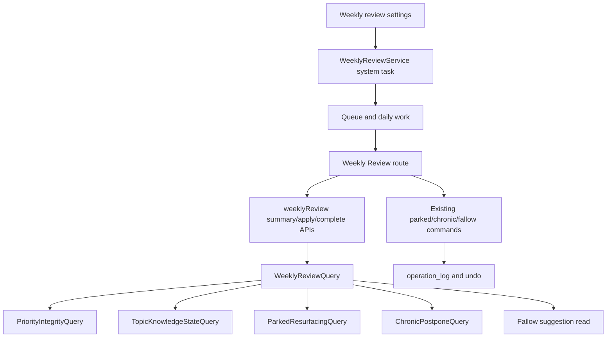

# feat: T110 weekly ledger and integrity session

## Summary

Build T110 as a scheduled weekly `task` element that arrives through the existing attention queue and opens a focused weekly review surface. The session composes the current receipts from priority integrity, topic knowledge state, parked resurfacing, chronic-postpone reckoning, and fallow suggestions, while all decisions continue through the existing command services.

---

## Problem Frame

M22 added accountability receipts, but the user still has to remember where to look. T110 turns those receipts into one calm weekly ritual: what reading produced, what priority debt accumulated, what matured, and what needs an explicit keep / schedule / rest / let-go decision.

The roadmap requires the ritual to be a scheduled attention element, dismissible and reschedulable like other attention work, with partial completion resumable. It must not become a second Maintenance implementation or a renderer-side analytics aggregator.

---

## Requirements

**Scheduled session**

- R1. The app creates and maintains one open weekly review session as a system-owned scheduled `task` element with `task_type = "weekly_review"`, due now on first enablement and then due every configured cadence after completion.
- R2. The weekly review task appears in the normal due queue and daily-work routing, and opening it routes to the weekly session surface rather than the generic process loop.
- R3. Completing closes the current session and schedules the next one; dismissing snoozes the same session without losing progress; disabling weekly review clears open weekly sessions from due routing.

**Ledger receipt**

- R4. The session read model returns a weekly ledger with sources read, extracts created, cards created, matured cards, priority-missed bands, resting topics, and graduation candidates from existing durable facts and read models.
- R5. The weekly ledger is read-only: composing it does not append `operation_log`, mutate settings, or acknowledge graduation events by merely reading.

**Decision queue**

- R6. The session composes chronic-postpone rows, due parked resurfacing rows, and fallow suggestions without duplicating their standalone Maintenance commands.
- R7. Decisions made inside the weekly session use the same typed command paths and undo behavior as the standalone parked resurfacing, chronic-postpone, and topic fallow surfaces.
- R8. Partial completion persists at section level for the active task/window, while item decisions disappear from the session only when the underlying parked, chronic, or fallow command state changes.

**Configuration and boundaries**

- R9. Settings expose weekly review enabled state and cadence with validated defaults and renderer-safe projection.
- R10. The renderer receives only typed weekly-review payloads and commands; it never reads raw SQLite, filesystem paths, or unvalidated task state.

---

## Assumptions

- `weekly_review` is a new `TaskType`, not a new `ElementType`. A weekly session is a maintenance action and the existing `task` element already participates in attention scheduling.
- Fallow suggestions are a new read-only recommendation derived from priority-integrity topic debt and queue-actionable topic rows. Applying rest still calls the existing topic fallow command.
- "Sources read" is derived from durable weekly processing evidence, not from route visits alone. If the exact source-read signal is weaker than needed, the read model should report a conservative count rather than inventing history.
- Weekly windows are immutable per session: the service records `windowStart`, `windowEnd`, and the active weekly task id when it creates the session, using local-day boundaries.

---

## Key Technical Decisions

- **Task-kind model:** Add `weekly_review` to the task vocabulary and widen the `tasks.task_type` CHECK constraint. This keeps the scheduled ritual inside the universal Element model without adding a parallel weekly-session table.
- **System-owned singleton:** Treat `weekly_review` as a system-only task kind. Enforce one open weekly task with a weekly-specific database or transactional singleton guard, exclude it from generic verification-task creation/generation, route lifecycle changes through mirror-safe weekly service methods that update `elements` and `tasks` together, and keep the generic `/process` deck from acting on the system row.
- **Session state boundary:** Store lightweight section progress in settings under the active weekly task id and immutable weekly window. Section progress is UI workflow state; item decisions are never hidden by settings alone and remain sourced from operation-log-backed commands.
- **Read model first:** Add a `WeeklyReviewQuery` that composes existing local-db receipts and services. React renders the payload and dispatches commands, but never recomputes priority integrity, graduation, parked due-ness, or chronic postpone eligibility.
- **Shared decision components:** Extract reusable parked/chronic decision panels from Maintenance or move their decision controls behind shared renderer components so Maintenance and Weekly Review have one behavior implementation. Fallow actions must match the existing topic fallow validation, busy/error handling, undo refresh, and return-date behavior.
- **No stored graduation ledger:** Use topic knowledge state current events and existing acknowledgement semantics. T110 can display graduation candidates, but it should not invent historical graduation rows.

---

## High-Level Technical Design

The weekly session has two flows. Reads compose receipts and due decisions into one payload. Item writes remain delegated to the existing parked, chronic, and fallow commands; weekly lifecycle writes go through `WeeklyReviewService` so the `elements` row, `tasks` mirror row, progress state, and operation-log evidence do not drift.

---

## Implementation Units

### U1. Add the weekly review task vocabulary and settings

- **Goal:** Make `weekly_review` a valid scheduled task kind and add validated weekly review settings.
- **Requirements:** R1, R3, R9
- **Dependencies:** None
- **Files:** `packages/core/src/task.ts`, `packages/core/src/task.test.ts`, `packages/core/src/settings.ts`, `packages/core/src/settings.test.ts`, `packages/db/src/schema/organize.ts`, `packages/db/src/schema/organize.test.ts`, `packages/db/drizzle/*`, `packages/db/drizzle/meta/*`, `packages/db/src/migration-*.test.ts`
- **Approach:** Add `weekly_review` to the core task tuple and labels, add enabled/cadence settings, and widen the SQLite CHECK constraint through a migration. Keep cadence bounded and default to enabled weekly. Add a singleton guard for open `weekly_review` rows, such as a partial unique index over open weekly tasks, while allowing completed historical weekly rows.
- **Patterns to follow:** `packages/db/drizzle/0025_noisy_korath.sql`, `packages/db/src/migration-0030.test.ts`, `packages/core/src/settings.ts`
- **Test scenarios:** 
  - Creating a task row with `task_type = "weekly_review"` passes the schema and invalid task types still fail.
  - Repeated or concurrent ensure attempts cannot create two open weekly review tasks; historical completed weekly tasks remain allowed.
  - Default settings include enabled weekly review cadence and malformed stored values coerce to safe defaults.
  - Disabling weekly review dismisses or suppresses any existing open weekly task so it no longer appears in Queue.
  - Renderer settings projection includes weekly review controls without exposing trusted-only values.
- **Verification:** Existing task tests and migration tests prove the widened vocabulary is accepted without weakening other constraints.

### U2. Create the weekly session service and read model

- **Goal:** Create the trusted-side owner for ensuring, reading, completing, dismissing, and rescheduling the weekly session.
- **Requirements:** R1, R3, R4, R5, R6, R8
- **Dependencies:** U1
- **Files:** `packages/local-db/src/weekly-review-query.ts`, `packages/local-db/src/weekly-review-query.test.ts`, `packages/local-db/src/weekly-review-service.ts`, `packages/local-db/src/weekly-review-service.test.ts`, `packages/local-db/src/index.ts`, `packages/local-db/src/task-service.ts`, `packages/local-db/src/task-service.test.ts`
- **Approach:** Add a query that returns the current weekly task, immutable ledger window, existing receipt summaries, due parked/chronic rows, and fallow suggestions. Add a service that creates a first session due now when enabled, retries/re-reads on singleton conflicts, stores section progress by active task id plus window, snoozes dismissals on the same task, completes by closing the current task and scheduling the next, and updates both `elements` and `tasks` mirror fields in one transaction.
- **Patterns to follow:** `packages/local-db/src/daily-work-query.ts`, `packages/local-db/src/synthesis-service.ts`, `packages/local-db/src/task-service.ts`, `packages/local-db/src/priority-integrity-query.ts`
- **Test scenarios:**
  - With no open weekly task and enabled settings, ensure creates one scheduled task due now on first run; completion schedules the next task at the configured cadence.
  - With weekly review disabled, ensure returns no newly created session and open weekly tasks are dismissed, cleared from due routing, or otherwise suppressed by the chosen setting-off transition.
  - Reading the session composes priority integrity, topic knowledge state, parked resurfacing, chronic rows, and fallow suggestions without appending operation-log rows.
  - Completing closes the current session and schedules the next session; dismissing snoozes the same session and preserves progress.
  - Marking a section complete persists settings-backed UI workflow progress under the active task/window, while live decision rows reflect current durable command state.
  - Undoing a parked/chronic/fallow decision can make a row visible again even if section progress exists; progress never hides live undecided command rows.
- **Verification:** Unit tests show read-only composition, idempotent session creation, and command-owned rescheduling.

### U3. Expose the weekly review IPC and renderer API

- **Goal:** Add typed desktop and renderer bridge methods for weekly review reads, progress updates, and completion.
- **Requirements:** R2, R3, R8, R10
- **Dependencies:** U2
- **Files:** `apps/desktop/src/shared/channels.ts`, `apps/desktop/src/shared/channels.test.ts`, `apps/desktop/src/shared/contract.ts`, `apps/desktop/src/shared/contract.test.ts`, `apps/desktop/src/main/db-service.ts`, `apps/desktop/src/main/ipc.ts`, `apps/desktop/src/main/ipc.test.ts`, `apps/desktop/src/preload/index.ts`, `apps/desktop/src/preload/index.test.ts`, `apps/web/src/lib/appApi.ts`, `apps/web/src/lib/appApi.test.ts`
- **Approach:** Add a `weeklyReview` namespace with summary, mark-section, complete, dismiss/snooze, and reschedule calls. Validate clocks, section ids, row ids, task ids, window bounds, and cadence values with Zod at the main boundary. Keep generic task creation from accepting `weekly_review`; only `WeeklyReviewService` should create system weekly tasks.
- **Patterns to follow:** `analytics.topicKnowledgeState`, `dailyWork.summary`, `maintenance.parkedResurfacing`, `maintenance.chronicPostpones`
- **Test scenarios:**
  - Contract accepts valid weekly requests and rejects malformed section ids, invalid clocks, and out-of-bounds limits.
  - Generic task creation rejects `weekly_review` unless the call is explicitly routed through the system weekly service.
  - IPC routes each request to the DB service with parsed payloads.
  - Preload forwards exact channel names and renderer `appApi` exposes typed fallback behavior outside desktop.
- **Verification:** Bridge tests prove the renderer has no generic database or filesystem capability and weekly review uses only narrow typed methods.

### U4. Add queue/daily-work routing for the weekly session

- **Goal:** Make the weekly review task arrive through normal user workflow and open the session surface.
- **Requirements:** R1, R2
- **Dependencies:** U2, U3
- **Files:** `packages/local-db/src/queue-query.ts`, `packages/local-db/src/queue-query.test.ts`, `packages/local-db/src/daily-work-query.ts`, `packages/local-db/src/daily-work-query.test.ts`, `apps/desktop/src/shared/contract.ts`, `apps/desktop/src/shared/contract.test.ts`, `apps/web/src/lib/appApi.ts`, `apps/web/src/lib/appApi.test.ts`, `apps/web/src/pages/queue/openQueueItem.ts`, `apps/web/src/pages/queue/openQueueItem.test.ts`, `apps/web/src/pages/queue/queueRow.tsx`, `apps/web/src/pages/queue/QueueScreen.test.tsx`, `apps/web/src/router.tsx`
- **Approach:** Preserve backend-canonical queue eligibility. Add `taskType` to queue task rows across local-db, IPC contract, and renderer API, then route `taskType = "weekly_review"` to the weekly review route before generic task handling. Keep the system weekly task discoverable in the queue without letting it outrank or block ordinary due work in the generic process loop.
- **Patterns to follow:** `docs/solutions/ui-bugs/daily-work-read-model-inbox-only-routing.md`, `apps/web/src/pages/queue/openQueueItem.ts`, `packages/local-db/src/queue-query.ts`
- **Test scenarios:**
  - A due weekly review task appears in queue results with task type and action label.
  - Opening the weekly review row navigates to the weekly route and does not jump to a linked protected element.
  - Daily work summary sees the weekly task as due queue work through existing due counts.
  - A crowded queue fixture still exposes the due weekly review row with clear task labeling and no generic verification-task affordance.
- **Verification:** Queue tests prove weekly review enters through the same due queue path as other attention tasks.

### U5. Build the weekly review surface and shared decision panels

- **Goal:** Render the weekly ledger and decision queue, reusing existing decision commands and undo feedback.
- **Requirements:** R4, R6, R7, R8, R10
- **Dependencies:** U3, U4
- **Files:** `apps/web/src/weekly/WeeklyReviewScreen.tsx`, `apps/web/src/weekly/WeeklyReviewScreen.test.tsx`, `apps/web/src/weekly/weekly-review.css`, `apps/web/src/maintenance/MaintenanceScreen.tsx`, `apps/web/src/maintenance/ParkedResurfacingPanel.tsx`, `apps/web/src/maintenance/ChronicPostponePanel.tsx`, `apps/web/src/maintenance/*.test.tsx`, `apps/web/src/components/queue/QueueSnackbar.tsx`
- **Approach:** Create a dense session screen ordered as: session header/window/progress and lifecycle controls, ledger groups for production/debt/maturation, then decision sections ordered by urgency. Extract parked/chronic controls into reusable components that accept rows, busy state, and callbacks; both Maintenance and Weekly Review call the same `appApi.maintenance.*Apply` methods. Fallow suggestions use the existing topic fallow validation and date behavior. Completion closes the current task and returns to Queue/Daily Work; dismiss snoozes the current task and leaves progress resumable; reschedule validates a future return date.
- **Patterns to follow:** `apps/web/src/maintenance/MaintenanceScreen.tsx`, `apps/web/src/analytics/PriorityIntegrityPanel.tsx`, `apps/web/src/analytics/AnalyticsScreen.tsx`, `docs/solutions/design-patterns/non-modal-intent-menu-replacing-confirm-gate.md`
- **Test scenarios:**
  - Empty ledger/decision sections render calm completed states rather than blank cards.
  - Parked and chronic decisions call the same maintenance APIs used by the standalone Maintenance screen and refresh section state.
  - A fallow suggestion calls `topics.fallow` with a validated future return date.
  - Marking a section skipped/completed persists progress and reloads without showing it as undecided.
  - Undo after a weekly decision refreshes both weekly and shared maintenance counts.
  - Complete, dismiss/snooze, and reschedule controls have disabled/loading/error/success states and predictable post-action navigation.
  - Keyboard-only users can open the weekly row, move through sections and row actions in visible focus order, trigger undo, and hear count changes through existing live-region/snackbar semantics.
- **Verification:** Renderer tests cover loading, error, empty, decision, skip, partial-progress, and undo states.

### U6. Cover the full Electron workflow

- **Goal:** Prove the weekly ritual works end to end with persistence and restart.
- **Requirements:** R1, R2, R3, R4, R7, R8
- **Dependencies:** U1, U2, U3, U4, U5
- **Files:** `tests/electron/weekly-ledger.spec.ts`, `tests/electron/fixtures/*`, `docs/tasks/M22-receipts.md`, `docs/roadmap.md`
- **Approach:** Add an Electron test fixture with a due weekly task, weekly production facts, priority misses, a due parked source, a chronic postponed item, and a fallow suggestion. Drive queue open, section decisions, dismiss/reschedule, restart, and resumed progress. Close out the task by updating `docs/roadmap.md` and `docs/tasks/M22-receipts.md` with completion notes, verification commands, and downstream implications.
- **Patterns to follow:** `tests/electron/maintenance.spec.ts`, `tests/electron/analytics.spec.ts`, `tests/electron/fallow-topic.spec.ts`, `tests/AGENTS.md`
- **Test scenarios:**
  - The weekly review row appears in Queue, opens the session, and displays ledger numbers from seeded facts.
  - Applying one parked decision and one chronic decision persists through reload and exposes shared undo.
  - Dismissing snoozes the same task with progress preserved; completing closes it and schedules the next weekly task.
  - After app restart, completed decisions and session progress are preserved while live read-model rows remain current.
  - The roadmap and task spec record T110 completion, commit/PR reference, verification, and downstream notes.
- **Verification:** Focused Electron coverage plus root gates prove the roadmap done criteria.

---

## Scope Boundaries

- The weekly session composes T102, T106, T107, and T108/T109 outputs; it does not replace their standalone Maintenance, Analytics, or topic surfaces.
- T110 does not build M23 adaptive scheduling or M24 ambient overload automation. Any fallow suggestions are advisory until the user accepts them.
- The plan does not add a stored historical graduation ledger. Graduation remains a current-state receipt with acknowledgement.
- The plan does not add a new top-level element type unless implementation proves `task_type = "weekly_review"` cannot satisfy queue and routing semantics.
- Generic verification-task creation and expiry generation do not create weekly review tasks; weekly sessions are system-owned.

---

## Risks & Dependencies

- **Task vocabulary migration:** Widening `tasks.task_type` requires a SQLite table rebuild or generated migration with the CHECK constraint preserved. Migration tests must cover old rows and invalid values.
- **Ledger source-read semantics:** Existing weekly balance counts may not fully prove "sources read." The implementation should use durable processing evidence and document any conservative counting choice in the query header.
- **Partial progress drift:** Stored session progress can go stale when decision rows change. Progress keys should include task id and immutable window, and live read models should own current row visibility.
- **Singleton drift:** Unlinked tasks are not deduped by the existing linked-task unique index. Weekly review needs its own singleton guard and recovery behavior for duplicate historical or pre-release rows.
- **Task mirror drift:** Weekly lifecycle writes must update `elements.status` / `elements.due_at` and `tasks.status` / `tasks.due_at` together; generic queue actions are not safe for weekly task lifecycle.
- **UI duplication risk:** Maintenance controls are already dense. Extracting shared panels should be narrowly scoped to avoid a broad maintenance refactor.

---

## Acceptance Examples

- AE1. Given weekly review is enabled and no open weekly task exists, when the app ensures weekly review state, then exactly one scheduled `weekly_review` task exists, is due now on first run, and appears in Queue.
- AE2. Given a weekly fixture with production, priority debt, due parked rows, and chronic rows, when the weekly screen loads, then the ledger and decision sections match the trusted read-model payload.
- AE3. Given the user decides one parked row and leaves chronic rows undecided, when they dismiss/snooze the session and reopen it, then the parked decision is no longer pending, chronic remains pending, and the same session can resume.
- AE4. Given the user completes the session, when Queue refreshes, then the current weekly task is closed and the next weekly task is scheduled by cadence.

---

## Sources & Research

- `docs/tasks/M22-receipts.md` defines T110 and the M22 read-model constraints.
- `docs/roadmap.md` marks T110 as the first available unchecked task after T109.
- `docs/solutions/architecture-patterns/priority-integrity-read-model.md` and `docs/solutions/architecture-patterns/topic-knowledge-state-read-model.md` define the trusted receipt pattern.
- `docs/solutions/architecture-patterns/chronic-postpone-reckoning-from-operation-log-reset-markers.md`, `docs/solutions/architecture-patterns/topic-fallow-rest-operation-log-preimages.md`, and `docs/solutions/workflow-issues/save-for-later-first-class-parked-state.md` define the decision-command and undo patterns to reuse.
- `docs/solutions/ui-bugs/daily-work-read-model-inbox-only-routing.md` and `docs/solutions/logic-errors/queue-eligibility-inventory-scheduler-state.md` define queue routing and backend-owned actionability rules.
