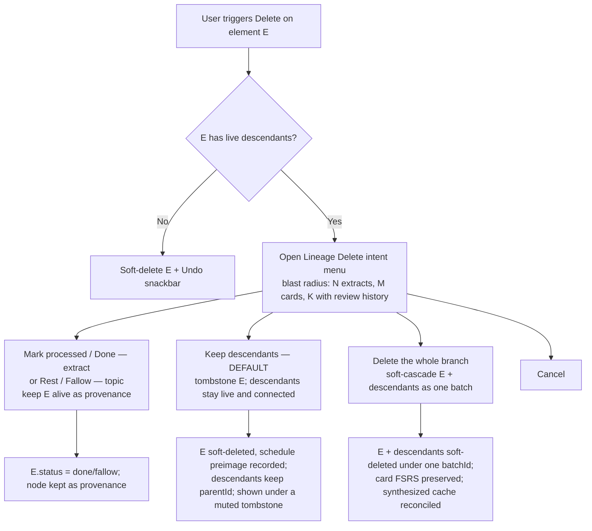

# feat: T135 Lineage-aware deletion (delete in the middle of the tree)

## Summary

Make deleting an element that sits in the *middle* of the lineage tree (a topic/extract/sub-extract with both an ancestor and live descendants) behave the way a gold-standard incremental-reading app should: never silently orphan, never silently hide live work, and never destroy review history as a side effect. Deleting a node with live descendants opens a non-modal intent menu that quantifies the blast radius and offers honorable paths — **mark processed** (keep the node alive as provenance; for topics this is **rest/fallow**), **keep descendants** (tombstone the node, default), or **delete the whole branch** (recoverable batch) — and the lineage view renders deleted ancestors as muted tombstones so a focused card never vanishes from its own chain.

**Phase A (U1–U2) lands first as the foundation** — it closes the exact confusion that motivated this work (a live card disappearing from its own lineage) — and Phases B–E build the full descendant-aware deletion on top. The whole feature ships as roadmap task **T135 (M30)**.

---

## Problem Frame

This sits within the lineage-integrity *theme* of the gold-standard ideation (`docs/ideation/2026-06-09-gold-standard-incremental-reading-ideation.md`), whose north star is the product's deepest invariant: *source lineage is sacred*. It is **not** the same problem as ideation track #7 / milestone M26, which is forward edit-propagation (the `stale_after_edit` dirty-bit flowing down the DAG and the card-edit write barrier). This is the *delete-path* facet of the same invariant, tracked as its own roadmap task T135 (M30) rather than riding M26's priority.

The lineage model is `source → topic → extract → sub-extract → atomic statement → card`, with `elements.parentId`/`sourceId` modeled as self-referencing foreign keys (`packages/db/src/schema/elements.ts`). A user who deletes a mid-tree extract observes the card below it "lose its parent." The real behavior is worse than it looks and is split across two failure modes:

- Today's **soft** delete (`ElementRepository.softDelete`) is single-row: it sets `deletedAt` + `status = "deleted"` on that node only. The descendants keep their `parentId` pointing at the now-deleted node, and `LineageQuery.walkDown` walks *down from the live root through live children only* — so the descendants silently disappear from the lineage tree even though they are alive and still parented. The focused card vanishes from its own lineage. This is the exact confusion that motivated this work.
- A **hard** delete (purge) of a mid-tree node fires the `onDelete: "set null"` foreign keys and nulls every direct child's `parentId` — the precise mechanism that wiped the real vault in the migration-0030 incident (`docs/solutions/database-issues/sqlite-table-rebuild-with-foreign-keys-on-fires-on-delete-actions.md`). Orphaning live descendants must never happen again — including via **Empty Trash** and the 30-day auto-purge, not just manual purge.

Neither failure is what any user wants, and neither matches how the canon (SuperMemo's Done/Dismiss/Delete) or the broader software world (Notion, Tana, git revert, IMAP threading) handle deleting a node that still has dependents. The job is to replace "silently prune from view" and "silently orphan" with explicit, reversible, lineage-preserving behavior, reusing the soft-delete / trash / undo / batch / fallow machinery already shipped rather than forking a new delete path.

---

## Requirements

**Lineage tombstones and visibility**

- R1. Soft-deleting any element that has live descendants never removes those descendants from view: the focused element always appears in its own lineage, and a deleted ancestor renders as a muted "tombstone" node with a restore affordance.
- R2. The lineage read model can include soft-deleted nodes as tombstones on request, while default and analytics lineage reads continue to operate over live lineage only (yield, "review this branch", and other consumers are unaffected).
- R3. A live element whose ancestor is a tombstone shows an unobtrusive "ancestor deleted" indicator offering one-click restore of the tombstoned ancestor chain up to a live root.

**Descendant-aware deletion**

- R4. Triggering delete on an element with no live descendants performs an immediate soft-delete with an Undo affordance and no menu.
- R5. Triggering delete on an element with live descendants opens a non-modal intent menu that quantifies the blast radius (counts of descendant extracts, cards, and cards carrying review history) and offers, at minimum: keep descendants (tombstone the node), delete the whole branch, and cancel — with focus defaulted to the safe (keep) action.
- R6. When the element being deleted is an extract that has already produced a card or sub-extract, the menu offers "mark processed / done" (honorable extract fate, node kept alive as provenance) as the recommended alternative to deletion. When the element is a **topic** (which has no extract-fate vocabulary), the menu offers "rest / fallow" as the honorable non-destructive alternative instead; the menu never invokes the extract-only `setFate` on a non-extract.

**Branch delete (cascade) semantics**

- R7. "Delete the whole branch" soft-deletes the node and all its live descendants in a single transaction under one shared batch id, recoverable as a unit.
- R8. Cards inside a deleted branch are soft-deleted with their FSRS review state preserved (both `elements.due_at` and `review_states.due_at` cleared, each with a recorded preimage), never hard-destroyed; restoring re-establishes their scheduling exactly.
- R9. Deleting a node reconciles the cached `synthesized` extract-fate in both directions: (a) a `synthesis_note` inside the deleted set clears the cache on its still-live target extracts; (b) deleting a target extract whose synthesizing note stays live clears that extract's own stale `synthesized` cache. Deleted rows are not rescheduled; restore re-establishes the cache.

**Restore, undo, and purge safety**

- R10. The branch-delete Undo affordance restores the exact branch it announced, regardless of intervening actions (it is batch-scoped, not "undo the last global op"); restore from Trash restores a branch together, root-first, and surfaces — rather than silently creates — any partial/broken chain when a node carries newer manual intent.
- R11. Restoring a tombstoned node returns it to its pre-delete status with its attention schedule re-established from the recorded preimage (not a stale, now-overdue date), and reconnects its descendants in the lineage view.
- R12. Hard-purging a soft-deleted node that still has live descendants is blocked at **every** hard-delete seam — manual purge, Empty Trash, and any automatic/30-day purge — so a purge can never null the lineage links of live descendants. Empty Trash purges the safe rows and reports the count it skipped.

**Boundaries and integrity**

- R13. No delete path silently nulls or re-points any element's `parentId`/`sourceId`; every descendant remains traceable to its source.
- R14. All new reads and mutations cross the typed IPC boundary; the renderer never reads SQLite or infers persistence; subtree mutations are transactional and append `soft_delete_element` per affected element in the same transaction.
- R15. Every delete entry point — inspector, extract reader, queue row actions and process loop, source reader, and maintenance surfaces — routes an element with live descendants through the descendant-aware path. No entry point (including the `queue:act` `delete` kind handled by `QueueActionService`) performs a silent single-row prune of a node that still anchors live descendants.

---

## Key Technical Decisions

- KTD1. **Mid-tree delete defaults to tombstone-and-keep, never silent orphan or silent prune.** Deleting a node with live descendants keeps the descendants live and connected and turns the deleted node into a lineage tombstone. Rationale: "lineage is sacred"; the derived extracts/cards (and their review history) are the asset, the parent's body is expendable. Mirrors SuperMemo's "Done with children", RFC 5256's dummy-node tombstone, and Tana's "never delete data indirectly associated with what you delete." This is a deliberate **positioning bet** — provenance continuity over instant removal — so the escape hatch must stay cheap: a user who wants the node *and* its descendants fully gone uses "Delete the whole branch", and a tombstone is removable via restore-then-mark-done or restore-then-branch-delete.

- KTD2. **"Delete the whole branch" is an explicit, recoverable, batched opt-in.** Soft-cascade the node plus all live descendants under one `batchId`; it restores atomically. Rationale: Notion/Finder cascade-to-trash-restore-as-unit; reuses the shipped `FallowService` descendant-walk + `batchId` pattern (`docs/solutions/architecture-patterns/topic-fallow-rest-operation-log-preimages.md`).

- KTD3. **No splice / reparent.** Do not build move-children-to-grandparent. Rationale: there is no `parentId`-mutation (move) primitive anywhere in the codebase — it would be a net-new capability — and re-pointing falsifies provenance (the card would claim it derived from the grandparent it never came from). Consequence to own honestly: without splice, "keep descendants" leaves the node as a tombstone forever; the only way to *remove* a middle node while keeping its descendants is to restore-then-mark-done. Deferred (see Scope Boundaries).

- KTD4. **Re-steer "I'm done with this" to an honorable fate, not Delete — typed by node kind.** For an **extract** that already produced a card or sub-extract, the recommended action is "mark processed" via the existing `done_without_card` fate (`ExtractService.setFate`), which keeps the node alive as a provenance anchor and drops it from the queue. For a **topic**, the honorable alternative is "rest / fallow" (`FallowService`), since `setFate` is extract-only and throws on any other type. The menu chooses the action by node type and never calls `setFate` on a non-extract. Rationale: SuperMemo's Done insight — most middle-node "deletes" are really "archive the scaffolding."

- KTD5. **Non-modal intent menu, not a blocking confirm — with a defined keyboard contract and action order.** Use the shipped anchored-popover pattern (`DoneIntentMenu` / `ScheduleMenu`; `docs/solutions/design-patterns/non-modal-intent-menu-replacing-confirm-gate.md`): show the quantified blast radius, act optimistically with an Undo snackbar. Action order top-to-bottom: **Mark processed/Rest** (recommended, `--ok-soft`), **Keep descendants** (default focus), **Delete the whole branch** (`--danger`, last), **Cancel**. Keyboard: autofocus the safe default; Tab/arrows cycle in document order; Enter activates focus; Esc cancels and returns focus to the trigger. Reserve a stronger confirmation for irreversible purge only. Rationale: keyboard-first app; `window.confirm` is un-stylable and invisible to Playwright; NN/g's reversibility-and-specificity guidance.

- KTD6. **The tombstone is a derived display state, not a new status or op.** Reuse the existing `deleted` status and the `soft_delete_element` op (the operation-type set is deliberately closed, `packages/core/src/operation-log.ts`). "Tombstone" is computed from `deletedAt` and surfaced by a tombstone-aware variant of the lineage query gated behind a flag. No schema change, no migration.

- KTD7. **One preimage-aware soft-delete underlies both "keep" and "branch", and all three restore paths re-establish schedule.** A single command soft-deletes a target node and *optionally* its live subtree, always recording each node's prior `status` and clearing+recording an `elements.due_at` preimage (and, for cards, the `review_states.due_at` preimage) so a deleted node never lingers as a phantom "Due today". Restore re-establishes the schedule from the preimage in **all three** restore paths — `UndoService.invert`'s `soft_delete_element` case, `DbService.restoreFromTrash` (single), and the new batch restore — because `ElementRepository.restore` today touches only `status`/`deletedAt`. The single-node "keep descendants" tombstone uses this same path (subtree off), eliminating the asymmetry where a plain `softDelete` would leave an un-cleared past-due on restore. Cite the two-store precedent in `UndoService`'s `reschedule_element` `cardDefer` branch.

- KTD8. **Reconcile derived caches at the right seam — most of it is already automatic.** `ElementRepository.softDeleteWithin` already calls `clearSynthesisFatesForNoteWithin` when the deleted node is a `synthesis_note`, so a per-node subtree walk inherits direction (a) for free; `restore` re-establishes it. The net-new work is direction (b): deleting a *target extract* whose live synthesizing note stays outside the deleted set must clear that extract's own `synthesized` cache via `ExtractService.clearSynthesizedFateCacheWithin`. Do not reschedule deleted rows (`docs/solutions/architecture-patterns/extract-fates-value-model-v2-source-yield-stagnation.md`).

- KTD9. **Purge guard at every hard-delete seam.** Because purge is a real `DELETE` that fires `onDelete: "set null"`, the live-descendant guard must run in `TrashRepository.purge`, `TrashRepository.emptyTrash` (skip-and-report, never block the whole empty), and any future auto-purge — not just the single-row manual path. Rationale: directly prevents recurrence of the 0030-wipe mechanism at the one place it can still occur.

- KTD10. **The branch-delete Undo affordance is batch-scoped, not global undo.** Wire the snackbar's Undo to `trash.restoreBatch(batchId)` (the batch it announced), not `appApi.undoLast()`, because `undoLast` reverses only the single most-recent global op/batch and would undo an intervening grade/postpone instead. Global ⌘Z stays best-effort for the immediate-next-action case; the snackbar button is order-independent.

---

## High-Level Technical Design

### The decision flow



### The triad (what each action does)

| Action | The node E | Descendants | Cards / review history | Reversible via |
| --- | --- | --- | --- | --- |
| Mark processed (extract) / Rest (topic) — KTD4 | Kept alive, honorable fate / fallow | Untouched, fully live | Untouched | Reactivate / unfallow (existing) |
| Keep descendants (tombstone) — KTD1, default | Soft-deleted (preimage recorded); muted tombstone anchor | Kept live and connected | Untouched | Restore the node (schedule re-established) |
| Delete the whole branch — KTD2 | Soft-deleted | Soft-deleted with E, one batch | Preserved (due cleared + preimage); restorable | Batch restore (snackbar) / restore from Trash |
| Splice to grandparent — KTD3, deferred | Soft-deleted | Re-pointed to grandparent | Untouched | — (not built) |

### Branch delete + undo (sequence)

```mermaid
sequenceDiagram
  participant UI as Renderer (LineageDeleteMenu)
  participant IPC as IPC / db-service
  participant DB as local-db (subtree command)
  UI->>IPC: countDescendants(id)
  IPC-->>UI: { extracts, cards, cardsWithHistory, total }
  UI->>IPC: softDeleteSubtree(id)
  IPC->>DB: walk LIVE descendants (shared helper, fallow-style DFS)
  DB->>DB: ONE tx — per node: soft_delete_element (shared batchId), record prev status;<br/>clear elements.due_at (+ review_states.due_at for cards), record preimages;<br/>reconcile synthesized cache (auto for notes; explicit for deleted target extracts)
  DB-->>UI: { batchId, affected }
  UI->>UI: Undo snackbar (role=status), button → restoreBatch(batchId)
  UI->>IPC: trash.restoreBatch(batchId)
  IPC->>DB: restore root-first; per node clear deletedAt + restore status + schedule from preimage;<br/>skip newer-intent nodes and SURFACE the partial chain
  DB-->>UI: restored (lineage reconnects)
```

### Before / after the user's real case

Deleting the mid-tree extract `7139b534` (which anchors a live sub-extract and a live card) today prunes the card from its own lineage. Under "Keep descendants" the lineage renders:

```text
source  The Toxoplasma Of Rage
  └─ (tombstone) The University of Virginia rape case…   [deleted · Restore]
        └─ extract  It's not some conspiracy…            (live)
              └─ card  {{c1::…in order to discredit pu}}  (live, focused)
```

---

## Scope Boundaries

**In scope:** descendant-aware delete affordance and intent menu; tombstone lineage read model + rendering; preimage-aware single/subtree soft-delete with batch restore and faithful schedule re-establishment; the purge guard at every hard-delete seam; FSRS-preserving card handling and synthesized-cache reconciliation; CONCEPTS vocabulary; tests across local-db, IPC boundary, and Electron E2E.

**Deferred to follow-up work**

- Splice / reparent ("delete this node, lift its children to the grandparent"). Requires a net-new `parentId`-mutation primitive and a provenance-rewrite warning; out of this plan per KTD3. **Known gap, not an exotic add-on:** absent splice, tombstone-forever is the *only* outcome for a user who wants a middle node removed but its descendants kept. Worth a dedicated brainstorm rather than "if users ask."
- Bulk *multi-selection* branch delete (selecting several mid-tree nodes at once). The existing `BulkActionService` batch pattern extends cleanly later; this plan covers single-node-with-subtree.
- A dedicated "deleted/tombstone" design token. This plan reuses the shipped muted treatment plus a strikethrough title (U2); a first-class token can come with a broader design pass.

**Outside this product's identity**

- Permanent delete without recovery as a default. Purge stays an explicit, Trash-only, guarded, confirmed terminal action; everything in the normal delete flow remains reversible.

---

## Acceptance Examples

- AE1. **Quiet delete of a leaf.** Given an extract with no live descendants, when the user triggers delete, then it is soft-deleted immediately with an Undo snackbar and no menu appears. (Covers R4)
- AE2. **Menu with blast radius.** Given an extract with one live sub-extract and one live card (the card has prior reviews), when the user triggers delete, then a non-modal menu appears stating it has 1 extract and 1 card (1 with review history) beneath it, with focus on "Keep descendants." (Covers R5)
- AE3. **Keep descendants (tombstone).** Given AE2, when the user chooses "Keep descendants," then the extract is soft-deleted, the sub-extract and card remain live, and the card's lineage shows the deleted extract as a muted tombstone with a Restore affordance — the card never disappears from its own lineage. (Covers R1, R11)
- AE4. **Honorable fate is offered and preferred.** Given an extract that has produced a card, the menu presents "Mark processed / Done" as the recommended action; given a topic with descendants, the menu presents "Rest / Fallow" instead and never calls `setFate`. (Covers R6)
- AE5. **Delete the whole branch, recoverably.** Given AE2, when the user chooses "Delete the whole branch," then the extract, sub-extract, and card are soft-deleted under one batch, the card's `review_states.due_at` is cleared with a recorded preimage, and the snackbar Undo restores all three together with the card's scheduling intact — even if the user graded another card in between. (Covers R7, R8, R10)
- AE6. **Manual purge guard.** Given a tombstoned extract that still anchors a live card, when the user attempts to purge it from Trash, then the purge is blocked with an inline recovery path (Restore / Delete branch), and no live element's `parentId` is nulled. (Covers R12, R13)
- AE7. **Empty Trash guard.** Given Trash containing a tombstone that anchors a live card plus other safe rows, when the user empties Trash, then the safe rows are purged, the anchoring tombstone is skipped with a reported count, and `foreign_key_check` stays clean. (Covers R12)
- AE8. **No unguarded entry point.** Given an extract with live descendants, when the user deletes it from the source reader or queue (the `queue:act` `delete` path), then the descendant-aware menu opens — not a silent single-row prune. (Covers R15)

---

## Implementation Units

Five phases. Phase A delivers the tombstone read path and its IPC surface end-to-end — it is independently deployable (no other unit is prerequisite) and is the recommended first ship, though it is a complete cross-package change, not a narrow read-only patch.

### Phase A — Lineage tombstones (read path)

### U1. Tombstone-aware lineage read model + IPC flag

- Goal: Let the lineage query optionally include soft-deleted nodes as tombstones so a focused element never vanishes from its own lineage; expose the flag over the existing `lineage.get` channel. Default and analytics callers keep live-only behavior.
- Requirements: R1, R2, R13
- Dependencies: none (extends existing `lineage.get`)
- Files:
  - `packages/local-db/src/lineage-query.ts` (add `includeTombstones` option; it must bypass **both** guard sites — the `get()` early-return when the focused node itself is `deletedAt`, and the `resolveRoot` break on the first deleted ancestor — and have `walkDown` include soft-deleted nodes tagged as tombstones; the live-only path is unchanged)
  - `packages/local-db/src/lineage-query.test.ts`
  - `packages/local-db/src/lineage-query.ts` `LineageNode` (source of truth) gains a discriminator `deleted: boolean`
  - `apps/desktop/src/shared/contract.ts` (`LineageGetRequestSchema` gains optional `includeTombstones`; `LineageNode` mirror gains `deleted`)
  - `apps/desktop/src/main/db-service.ts` (`getLineage` signature changes from `(id: string)` to accept the optional flag and forward it)
  - `apps/desktop/src/preload/index.ts` (pass the flag through `lineage.get`)
  - `apps/web/src/lib/appApi.ts` (`LineageGetRequest` + the renderer-side `LineageNode` mirror both gain the new fields)
- Approach: Keep the live-only walk as the default so `BRANCH_REVIEWABLE_TYPES`, yield, and other consumers are untouched (R2). The discriminator is a five-touch change (three `LineageNode` mirrors + request schema + db-service signature); `pnpm typecheck` is the backstop and a contract test asserts the field is present on both IPC sides.
- Patterns to follow: the existing `LineageQuery.get` / `resolveRoot` / `walkDown`; the live-children filter `listChildren` (keep for the default path); the `lineage.get` end-to-end IPC flow.
- Test scenarios:
  - Covers R1. With `includeTombstones`, a card whose parent extract is soft-deleted appears in its own lineage, and the deleted extract carries `deleted: true`.
  - Covers R2. Without the flag, the deleted extract and everything below it are absent (current behavior preserved).
  - A chain with two stacked deleted ancestors renders both as tombstones with correct depth ordering; resolution still terminates (cycle guard).
  - Focused node itself deleted: with the flag, `get` returns the node (not `null`) as the active tombstone.
- Verification: Inspector (after U2) shows the deleted ancestor; live-only consumer snapshots unchanged; `pnpm typecheck` + `pnpm test` green.

### U2. Tombstone rendering in the inspector

- Goal: Render tombstone nodes as a clearly-deleted lineage row (distinct from a live-but-inactive node) with an always-visible Restore affordance, and show an "ancestor deleted" hint on a live element under a tombstone.
- Requirements: R1, R3, R11
- Dependencies: U1
- Files:
  - `apps/web/src/components/inspector/LineageTree.tsx` (branch on `deleted`; render `tree-node--deleted`; inline keyboard-reachable Restore control)
  - `apps/web/src/components/inspector/Inspector.tsx` (request lineage with `includeTombstones`; render the "ancestor deleted" hint at the top of the lineage section; `requestInspectorRefresh()` after restore)
  - `apps/web/src/components/inspector/inspector.css`
  - `apps/web/src/components/inspector/LineageTree.test.tsx`
- Approach: A muted `--text-3` + reduced-opacity treatment alone collides with the existing retired/expired/dismissed card treatments, so add a disambiguating cue within the token vocabulary: apply `text-decoration: line-through` to the tombstone title (as `.badge--dismissed` already does) plus `--text-3`. Render the "ancestor deleted" hint as a single-line `insp-empty`-style note with an inline `insp-jump` (accent-soft pill) "Restore" that walks the tombstone chain up to a live root (R3). The Restore affordance is always rendered (not hover-only) so keyboard users can reach it. Derive all styling from `design/tokens.css` and check the matching `design/kit/app/*.jsx` reference per `design/CLAUDE.md`.
- Patterns to follow: `LineageTree.tsx` node rendering + `data-testid="lineage-tree-node"`; `.badge--dismissed` strikethrough; `insp-empty` / `insp-jump` primitives; `INSPECTOR_REFRESH_EVENT`; icons `restore` → `ArchiveRestore`.
- Test scenarios:
  - Covers R1. A tombstone renders muted + struck-through, with a `data-testid` distinguishing it from live nodes and from a live node's `tree-node__meta`; the focused live node is still present and marked active.
  - Covers R11. Clicking Restore on a tombstone restores it (schedule re-established per U5) and the row returns to a live style after refresh.
  - Covers R3. A live node whose ancestor is a tombstone shows the "ancestor deleted" hint with a keyboard-focusable Restore that reconnects the chain.
  - Light and dark themes both render the treatment from tokens (no hard-coded colors).
- Verification: the user's real card under a deleted middle extract shows the struck tombstone + Restore; `pnpm test` green; visual matches the kit in light and dark.

### Phase B — Descendant inventory and subtree commands (local-db)

### U3. Descendant inventory query

- Goal: Provide a typed count of an element's live descendants broken down by kind, to drive the blast-radius copy and the show-menu-or-not decision.
- Requirements: R4, R5
- Dependencies: none
- Files:
  - `packages/local-db/src/lineage-query.ts` (or a new `descendant-query.ts`): `countDescendants(id)` returning `{ extracts, cards, cardsWithHistory, total }`
  - `packages/local-db/src/descendant-query.test.ts`
- Approach: The live-descendant DFS already exists as the **private** `FallowService.descendantsWithin`. Extract it into a shared helper (do not duplicate it); the only net-new logic in U3 is the kind breakdown and the `cardsWithHistory` count, defined as descendant cards with at least one `review_logs` row (commit to that signal, not `reps > 0`, so a reviewed-then-forgotten card still counts).
- Patterns to follow: `FallowService.descendantsWithin` (extract to shared helper); `listChildren` live filter.
- Test scenarios:
  - Covers R4. An element with no live descendants returns `total = 0`.
  - Covers R5. An extract with a sub-extract and two cards (one reviewed) returns `extracts = 1, cards = 2, cardsWithHistory = 1, total = 3`.
  - Soft-deleted descendants are excluded; a deep chain counts transitively.
- Verification: counts match seeded fixtures; `pnpm test` green.

### U4. Preimage-aware soft-delete (single + subtree)

- Goal: One command that soft-deletes a target node and *optionally* its live subtree in one transaction under a shared `batchId`, always recording faithful schedule preimages and reconciling the synthesized cache — used by both "keep descendants" (subtree off) and "delete branch" (subtree on).
- Requirements: R7, R8, R9, R13, R14
- Dependencies: U3
- Files:
  - `packages/local-db/src/element-repository.ts` (`softDeleteSubtreeWithin(tx, id, { batchId, includeSubtree })`; per node record prior `status` and clear+record an `elements.due_at` preimage in the `soft_delete_element` payload; for **cards** additionally read+clear `review_states.due_at` and record its preimage — `softDeleteWithin` does *not* do this, so card handling cannot simply delegate to it)
  - `packages/local-db/src/extract-service.ts` (subtree-delete entry that mints the `batchId`, wraps the transaction, and calls `ExtractService.clearSynthesizedFateCacheWithin` for any deleted target extract whose synthesizing note stays live — KTD8 direction (b))
  - `packages/local-db/src/element-repository.test.ts`, `packages/local-db/src/extract-service.test.ts`
- Approach: Walk live descendants via the U3 helper (subtree on) or operate on the single node (subtree off). Synthesized direction (a) is inherited for free: `softDeleteWithin` already calls `clearSynthesisFatesForNoteWithin` when a `synthesis_note` is the deleted row, so per-node deletion reconciles notes automatically; only direction (b) is new. Revalidate each id inside the transaction and skip already-deleted/ineligible ids with explicit reasons rather than failing the batch (the maintenance-sweep shape from `docs/solutions/workflow-issues/save-for-later-first-class-parked-state.md`). Cite the `cardDefer` two-store precedent (`undo-service.ts` `reschedule_element`) for the card-due preimage.
- Execution note: Start with a failing test asserting every node in a three-level subtree gets exactly one `soft_delete_element` op under the same `batchId` in one transaction, and that a descendant card's `review_states.due_at` is cleared with its preimage in the payload.
- Patterns to follow: `FallowService.apply` (descendant walk + shared `batchId` + transaction); `softDeleteWithin` op payload; the `cardDefer` due-store pattern; `queue-action-service.test.ts` op-count helper.
- Test scenarios:
  - Covers R7. Deleting an extract with a sub-extract and a card writes three `soft_delete_element` ops sharing one `batchId`; all rows now `deletedAt`/`status = deleted`.
  - Covers R8. A descendant card's `review_states` row is preserved; `review_states.due_at` and `elements.due_at` are cleared; both preimages are in the op payload.
  - Covers R9 (a). Deleting a branch whose `synthesis_note` synthesized a still-live extract clears that extract's `synthesized` fate (inherited from `softDeleteWithin`) without rescheduling the deleted note.
  - Covers R9 (b). Deleting a *target extract* whose synthesizing note stays live clears that extract's own `synthesized` cache.
  - Covers R14. One transaction: forcing a mid-batch write to fail rolls back all prior soft-deletes (atomicity).
  - Single-node mode (subtree off) on a scheduled extract clears + records its `elements.due_at` preimage (no asymmetry with branch delete).
- Verification: op-log + schedule assertions pass; `foreign_key_check` clean; `pnpm test` green.

### U5. Restore paths (undo, single, batch), schedule re-establishment, and purge guard

- Goal: Make all three restore paths re-establish schedule from the preimage, restore a branch root-first with surfaced partial-chain handling, and block purge of a tombstone with live descendants at every hard-delete seam.
- Requirements: R10, R11, R12, R13
- Dependencies: U4
- Files:
  - `packages/local-db/src/undo-service.ts` (extend the `soft_delete_element` inverse: after `elements.restore`, read the `elements.due_at`/`review_states.due_at` preimages from the op payload and write them back in the same tx — `restore` alone does not; confirm `undoLast` already groups by `batchId` and add the symmetric undo-the-undo test)
  - `packages/local-db/src/trash-query.ts` (NET-NEW batch restore: `TrashRepository` has no restore method today — single restore lives in `DbService.restoreFromTrash` → `ElementRepository.restore`. The batch restore reads `soft_delete_element` ops by `batchId`, restores root-first, re-establishes schedule per node, and applies a `schedule-changed`-style skip; if the root is skipped, do not silently restore descendants under it — surface the partial chain. Also add the live-descendant guard to `purge` and `emptyTrash`)
  - `packages/local-db/src/element-repository.ts` (`restore` gains optional schedule-from-preimage; `purge` path gains the guard helper)
  - `packages/local-db/src/{undo-service,trash-query,element-repository}.test.ts`
- Approach: `UndoService.undoLast` already collects ops sharing the most-recent op's `batchId` and inverts in reverse order, so batch *grouping* is free — but the per-op inverse for `soft_delete_element` must be taught to restore schedule (mirror the `reschedule_element` `cardDefer` branch). Batch restore from Trash mirrors fallow's `batchId`-scoping and skip-on-newer-intent shape, but it replays `soft_delete_element` (not `reschedule_element`), so it is a new method, not a copy. The purge guard runs the U3 live-descendant check before the real `DELETE` and is wired into `purge`, `emptyTrash` (skip + report count), and any auto-purge.
- Patterns to follow: `FallowService.unfallow` (batchId-scope, skip-on-newer-intent, original-preimage restore); `UndoService` batch inversion + `cardDefer`; the `TrashRepository.purge`/`emptyTrash` loops.
- Test scenarios:
  - Covers R10/R11. After a branch delete, batch restore returns all nodes to prior status; a restored card's `review_states.due_at` matches its pre-delete value; `undoLast` does the same; a node manually changed after delete is skipped with a reason.
  - Covers R11. Restoring a single tombstone returns it to prior status with schedule re-established (no past-due phantom) and reconnects descendants.
  - Root-skip case: root has newer intent, descendants do not → restore surfaces the partial chain rather than silently restoring descendants under a still-tombstoned root.
  - Covers R12. `purge` of a tombstone anchoring a live descendant is blocked (typed error); `emptyTrash` purges safe rows, skips the anchor, reports the count; `foreign_key_check` clean; the 0034 audit invariant (a `create_element` payload naming a still-existing parent while `parent_id` is NULL) does not trip.
  - Purging a soft-deleted node with no live descendants still succeeds.
- Verification: `pnpm test` green; FK check clean; guard error typed for the renderer.

### Phase C — IPC surface

### U6. Typed IPC for descendant count, subtree delete, and batch restore

- Goal: Expose `countDescendants`, `softDeleteSubtree`, and `trash.restoreBatch` across the typed bridge with validation on both sides.
- Requirements: R5, R7, R10, R14
- Dependencies: U3, U4, U5
- Files:
  - `apps/desktop/src/shared/channels.ts` (`elements:countDescendants`, `elements:softDeleteSubtree`, `trash:restoreBatch`)
  - `apps/desktop/src/shared/contract.ts` (request schemas + result interfaces; extend `AppApi`; add a contract test asserting the new channels exist and the `LineageNode` `deleted` field is on both sides)
  - `apps/desktop/src/main/ipc.ts` (`Schema.parse(rawRequest)` → `dbService.*`)
  - `apps/desktop/src/main/db-service.ts` (delegate to U3–U5)
  - `apps/desktop/src/preload/index.ts`
  - `apps/web/src/lib/appApi.ts`
  - `apps/desktop/src/shared/contract.test.ts`, `apps/desktop/src/main/db-service.test.ts`
- Approach: Follow the six-edit path (channel → contract → ipc → db-service → preload → appApi). Validate at the IPC boundary first, then rely on local-db's in-transaction revalidation; keep the renderer bridge-only.
- Patterns to follow: the `lineage.get` / `extracts.delete` end-to-end flow; the bridge-surface guard test (`api.db.query` must NOT be a function).
- Test scenarios:
  - Covers R14. Each new channel rejects malformed payloads at the boundary (negative) and forwards a valid payload unchanged (positive).
  - Covers R5/R7/R10. `countDescendants` returns the typed breakdown; `softDeleteSubtree` returns the `batchId`; `trash.restoreBatch` restores it.
  - Bridge-surface guard: the new functions are present; no generic SQL/filesystem is exposed.
- Verification: `pnpm typecheck` + `pnpm test` green.

### Phase D — Renderer UX

### U7. Descendant-aware delete intent menu, wired at every entry point

- Goal: Replace the bare delete at every element delete entry point with: quiet soft-delete for leaves, and a fully-specified non-modal intent menu for nodes with descendants — including the queue/source path that currently bypasses interception.
- Requirements: R4, R5, R6, R8, R10, R15
- Dependencies: U6, U2
- Files:
  - `apps/web/src/components/lineage/LineageDeleteMenu.tsx` (new; mirrors `DoneIntentMenu`) + `apps/web/src/components/lineage/LineageDeleteMenu.test.tsx`
  - `apps/web/src/reader/ExtractView.tsx` (route delete through the menu; upgrade `toast("Extract deleted")` to the `Snackbar` pattern)
  - `apps/web/src/pages/queue/QueueScreen.tsx`, `apps/web/src/pages/queue/ProcessQueue.tsx`, `apps/web/src/pages/source/SourceReader.tsx`, `apps/web/src/maintenance/StagnantExtracts.tsx` (route delete through the menu)
  - `packages/local-db/src/queue-action-service.ts` (the `delete` kind must become descendant-aware — either it calls `countDescendants` and refuses-to-silently-prune a node with live descendants so the renderer can open the menu, or it delegates to the subtree path; R15)
  - `apps/web/src/components/Snackbar.tsx` (add an optional `icon` prop defaulting to `trash`; pass `check` for the mark-done/rest variant)
- Approach: On delete, call `appApi.countDescendants`. If `total === 0`, soft-delete immediately with an Undo snackbar (R4). Otherwise open `LineageDeleteMenu` anchored to the trigger (handle scrollable-container positioning so the popover tracks the row), showing the blast radius and the actions in KTD5 order. Action wiring: Mark processed (`setFate`) for extracts / Rest (`fallow`) for topics; Keep descendants → `softDeleteSubtree` with subtree off (default focus); Delete branch → `softDeleteSubtree` with subtree on. **The branch-delete snackbar Undo calls `trash.restoreBatch(batchId)`, not `undoLast`** (KTD10). Interaction states: while `countDescendants` is in flight, disable the trigger with an accessible busy label; on error, fall through to a single soft-delete and surface the error via `Snackbar` (no Undo). Snackbar copy templates: leaf → "Extract deleted"; tombstone → "Extract removed — N items kept"; branch → "Branch deleted (N items)"; mark-done → "Extract marked done" / "Topic resting". For a large branch (e.g. >10 nodes) extend the snackbar timeout. Reset the in-flight guard on host `busy` settling, not on popover open→close (the documented deadlock pitfall).
- Execution note: Keep the menu server-authoritative — counts and the delete come from IPC; the menu only routes intent.
- Patterns to follow: `DoneIntentMenu` / `ScheduleMenu` anchored popover; `Snackbar` (`role="status"`, `-undo` test id); `QueueSnackbar` undo wiring; stable `data-testid`s.
- Test scenarios:
  - Covers R4. Deleting a leaf performs an immediate soft-delete with an Undo snackbar; no menu.
  - Covers R5. Deleting an extract with descendants opens the menu with correct blast-radius copy, KTD5 action order, focus on "Keep descendants."
  - Covers R6. Extract-with-card → "Mark processed" recommended; topic-with-descendants → "Rest / Fallow" and `setFate` is never called.
  - Covers R8/R10. "Delete branch" calls `softDeleteSubtree`; the snackbar Undo restores the batch via `restoreBatch` even after an intervening logged action.
  - Covers R15. Deleting an extract-with-descendants via the queue/source `queue:act` `delete` path opens the menu (no silent prune).
  - Keyboard: Esc cancels and returns focus to the trigger; Enter activates the focused safe action; the in-flight guard resets when the action resolves without opening the popover.
  - `countDescendants` in-flight shows a busy state; an error falls through to a safe single delete with a no-undo error snackbar.
- Verification: `pnpm test` green; manual run of the user's scenario shows the menu and the tombstone outcome; the snackbar Undo restores the branch.

### U8. Trash branch grouping and purge-guard recovery UX

- Goal: Present a branch-deleted subtree in Trash as one grouped, atomically-restorable unit, and surface the purge guard as an inline recoverable next step rather than a dead end. (UI quality that depends on U5/U6 correctness.)
- Requirements: R7, R10, R12
- Dependencies: U5, U6
- Files:
  - `apps/web/src/trash/TrashScreen.tsx` (group rows sharing a delete `batchId` under the branch root with a child count and a single Restore via `trash.restoreBatch`; render the purge-guard block inline under a guarded row)
  - `apps/web/src/trash/TrashScreen.test.tsx`
  - `packages/local-db/src/trash-query.ts` (surface `batchId` + member count on trash rows; the row's group is keyed on the latest `soft_delete_element` op's `batchId`)
- Approach: Group siblings under the branch root (Notion's restore-as-unit); keep the existing per-row two-stage purge confirm for ungrouped rows. When the purge guard (U5) blocks a row, render an inline one-line message ("This item still has live descendants — restore it or delete the full branch first") with two inline actions — "Restore" (`restoreBatch`) and "Delete branch" (`softDeleteSubtree`) — styled from `--warn`/`--warn-soft` to stay calm but visible. The group header shows the deleted node's title with its source for context (a cryptic short title alone is unrecognizable).
- Patterns to follow: `TrashScreen` load/restore/undo wiring; the inline two-stage confirm idiom; `trash-row` test ids; `insp-empty`/`--warn` styling.
- Test scenarios:
  - Covers R7. A branch delete shows as one grouped entry with a child count and source context.
  - Covers R10. Restoring the group restores every member; the lineage reconnects.
  - Covers R12. Attempting to purge a guarded row shows the inline recovery block with working Restore / Delete-branch actions; a single (non-branch) soft-delete still shows as an individual row.
- Verification: `pnpm test` green; Trash shows the grouped branch and the recovery affordance.

### U9. Electron E2E coverage

- Goal: Prove the user-facing delete/restore/guard flows end-to-end and across app restart (Definition of Done for user-facing persistence).
- Requirements: R1, R8, R10, R12, R15
- Dependencies: U7, U8
- Files:
  - `tests/electron/lineage-deletion.spec.ts` (new)
- Approach: Drive `window.appApi` directly and through the UI; seed the demo collection (which includes a `card → extract → sub-extract → source` chain). Prove restart persistence by relaunching against the same data dir.
- Patterns to follow: `tests/electron/trash-undo.spec.ts` (launch/seed, bridge-surface guard, ⌘Z + `shell-undo-snackbar`, restart proof); `tests/electron/lineage.spec.ts`; `tests/electron/done-intent.spec.ts` for the intent-menu shape.
- Test scenarios:
  - Covers R1. Delete a mid-tree extract via "Keep descendants"; assert the card shows under a tombstone in the inspector and survives restart (AE3).
  - Covers R8/R10. Delete the branch; grade an unrelated card; the snackbar Undo restores all three with FSRS intact (AE5).
  - Covers R12. The purge guard blocks purge of a tombstone anchoring a live card, and Empty Trash skips it while purging safe rows (AE6, AE7); `foreign_key_check` clean after restart.
  - Covers R15. Deleting an extract-with-descendants from the queue/source path opens the menu (AE8).
- Verification: `pnpm e2e` green; bridge-surface and restart assertions pass.

### Phase E — Vocabulary and roadmap

### U10. CONCEPTS vocabulary and roadmap entry

- Goal: Name the new behavior in the project's vocabulary and close out the T135 roadmap task.
- Requirements: R1, R2
- Dependencies: U1–U9
- Files:
  - `CONCEPTS.md` (define "lineage tombstone" — a soft-deleted node kept visible as an anchor so live descendants stay traceable; cross-reference extract fate and topic fallow as the sibling deliberate, descendant-aware states)
  - `docs/roadmap.md` (mark T135 (M30) complete with the commit reference and downstream notes — the task is already added, distinct from M26 edit-propagation)
- Approach: Reuse the existing `deleted` lifecycle status for the data state and introduce "lineage tombstone" only as display/vocabulary, consistent with how `extract fate` and `topic fallow` are documented.
- Test scenarios: Test expectation: none — documentation only.
- Verification: vocabulary reads consistently with `CONCEPTS.md`; roadmap updated on completion.

---

## System-Wide Impact

- **Lineage invariant (deepest in the product).** Hardened on the delete path: no path nulls or re-points links, and the purge guard closes the hard-delete hole at *all three* seams (manual purge, Empty Trash, auto-purge). The 0034 audit invariant must continue to hold.
- **All delete entry points.** The descendant-aware path must cover the `queue:act` `delete` kind (`QueueActionService`) as well as the extract/inspector/maintenance paths — otherwise the fix is partial (R15).
- **Queue eligibility and FSRS.** Both single-node and branch deletes clear `elements.due_at` (+ `review_states.due_at` for cards) with preimages, so no deleted node lingers as a phantom "Due today" and restore re-establishes schedule exactly.
- **Trash / undo / batch.** Reuses the shipped `soft_delete_element` op, `batchId` grouping, and `UndoService` batch inversion; adds schedule re-establishment to the soft-delete inverse and a net-new batch restore. No new op type or status.
- **Derived read models.** Source-yield, stagnation, and "review this branch" compute over *live* lineage — the tombstone flag is opt-in so these are unaffected; a tombstoned ancestor's live descendants intentionally remain counted and reviewable. The synthesized-fate cache is reconciled in both directions on delete/restore.
- **No DB migration.** Tombstone is derived state; the only schema-adjacent change is the TS `LineageNode` discriminator across its three mirrors + the request schema + the `getLineage` signature.

---

## Risks & Dependencies

- **Schedule re-establishment is the load-bearing correctness work, not a freebie.** `ElementRepository.restore` and the `soft_delete_element` inverse touch only `status`/`deletedAt` today; U4/U5 must add and consume the `due_at` preimages across all three restore paths or restored cards fall out of the FSRS queue. This is the highest-risk part of the plan and is covered by symmetric undo-the-undo tests.
- **Purge guard must cover `emptyTrash` and auto-purge, not just manual purge.** Missing the `emptyTrash` seam reproduces the 0030-wipe; AE7 pins it.
- **Entry-point coverage.** The `queue:act` `delete` path is a separate command; if it is not made descendant-aware, the menu silently doesn't appear for queue/source deletes (R15/AE8).
- **Batch-undo correctness.** The snackbar Undo uses `trash.restoreBatch(batchId)` (order-independent), not `undoLast` (global stack-of-one). `undoLast` already batch-groups for ⌘Z best-effort; both are tested.
- **`collectBatch` scans `operation_log` with no `batchId` index.** A branch delete of many nodes followed by `undoLast` does a full scan; acceptable at personal-vault scale, but note it and revisit if vaults grow.
- **Three mirrored `LineageNode` definitions + request schema** must stay in sync; `pnpm typecheck` plus a contract test asserting the `deleted` field on both IPC sides are the backstops.
- **Design fidelity.** The tombstone treatment (muted + strikethrough title) must be verified in light and dark against `design/kit/` and must read as distinct from the retired/expired/dismissed card treatments that reuse `--text-3`.

---

## Sources / Research

Prior art (gold-standard comparison):

- SuperMemo Done/Dismiss/Delete — the processed source becomes a structural anchor for its derived hierarchy (`super-memory.com/help/read.htm`, `help.supermemo.org/wiki/Element_menu`). Basis for KTD1/KTD4.
- Anki — note deletion cascades to cards but the revlog survives; the maintainer's guidance is "suspend, don't delete." Basis for KTD2's review-preserving cascade.
- RemNote — cascade to Trash with retention; recommends Paused priority / Disable Descendant Cards over deletion.
- Notion / Finder — cascade-to-trash, restore-as-unit. Basis for KTD2 and U8.
- Tana — "never delete data indirectly associated with what you delete"; tombstone icon on schema deletion. Basis for KTD1.
- IMAP RFC 5256 — dummy-node tombstone only when a missing node still has children (`rfc-editor.org/rfc/rfc5256.html`). Basis for tombstone-only-when-needed.
- git revert vs rebase-drop — preserve-history vs rewrite-history; provenance-valuing systems preserve. Basis for KTD3 (no splice).
- NN/g confirmation-dialog guidance — undo for reversible, quantified blast radius for irreversible. Basis for KTD5.

Codebase (the seams this plan changes):

- `packages/local-db/src/lineage-query.ts` — `get`/`resolveRoot`/`walkDown`; the live-only walk that prunes deleted middles (U1, U3 helper source).
- `packages/local-db/src/element-repository.ts` — `softDeleteWithin` (single-row, non-cascading, `batchId` seam; auto-clears synthesis fates for notes), `restore` (status/deletedAt only — the gap U5 fills), the `purge` path (U4, U5).
- `packages/local-db/src/fallow-service.ts` — `descendantsWithin` (private DFS to extract) + `unfallow` (batchId-scope, skip-on-newer-intent) (U3, U5).
- `packages/local-db/src/undo-service.ts` — `batchId`-grouped inversion + the `reschedule_element` `cardDefer` due-store precedent (U5).
- `packages/local-db/src/trash-query.ts` — `listTrash`/`purge`/`emptyTrash` (no restore method exists; batch restore + guards are net-new) (U5, U8).
- `packages/local-db/src/extract-service.ts` — `setFate`/`done_without_card`, `clearSynthesizedFateCacheWithin` (KTD4, KTD8, U4).
- `packages/local-db/src/queue-action-service.ts` — the `delete` kind that currently single-row-prunes (R15, U7).
- `packages/local-db/src/card-service.ts` / `packages/db/src/schema/elements.ts` — cards carry their own `sourceLocationId`/`sourceId`; `parentId`/`sourceId` are `onDelete: "set null"` self-FKs (tombstoning is lossless; the purge hazard is real).
- `apps/desktop/src/shared/{channels,contract}.ts`, `apps/desktop/src/main/{ipc,db-service}.ts`, `apps/desktop/src/preload/index.ts`, `apps/web/src/lib/appApi.ts` — the six-edit IPC path (U1, U6).
- `apps/web/src/components/inspector/{Inspector,LineageTree}.tsx`, `inspector.css` (`.badge--dismissed` strikethrough precedent) — lineage rendering (U2).
- `apps/web/src/reader/ExtractView.tsx`, `apps/web/src/pages/{queue,source}/*`, `apps/web/src/components/Snackbar.tsx` — delete entry points and undo (U7).
- `tests/electron/{trash-undo,lineage,done-intent}.spec.ts` — E2E patterns (U9).

Institutional learnings:

- `docs/solutions/database-issues/sqlite-table-rebuild-with-foreign-keys-on-fires-on-delete-actions.md` — the `onDelete: "set null"` hazard and the audit invariant (KTD9, U5).
- `docs/solutions/architecture-patterns/topic-fallow-rest-operation-log-preimages.md` — descendant walk + `batchId` + intent-aware restore (U3–U5).
- `docs/solutions/logic-errors/queue-eligibility-inventory-scheduler-state.md` — clear both due fields; symmetric undo (KTD7).
- `docs/solutions/architecture-patterns/extract-fates-value-model-v2-source-yield-stagnation.md` — synthesized-cache reconciliation on delete/restore (KTD8).
- `docs/solutions/design-patterns/non-modal-intent-menu-replacing-confirm-gate.md` — the intent-menu pattern and the in-flight-guard pitfall (KTD5, U7).
- `docs/solutions/architecture-patterns/extract-card-ipc-invariant-test-hardening.md` — negative+positive IPC boundary tests (U6).
- `docs/solutions/test-failures/electron-e2e-stale-build-lock-and-lineage-contract.md` — assert both sides of lineage; prove restart persistence (U9).
- `docs/solutions/workflow-issues/save-for-later-first-class-parked-state.md` — cross-stack lifecycle-change checklist + maintenance-sweep skip-with-reason (U4).
