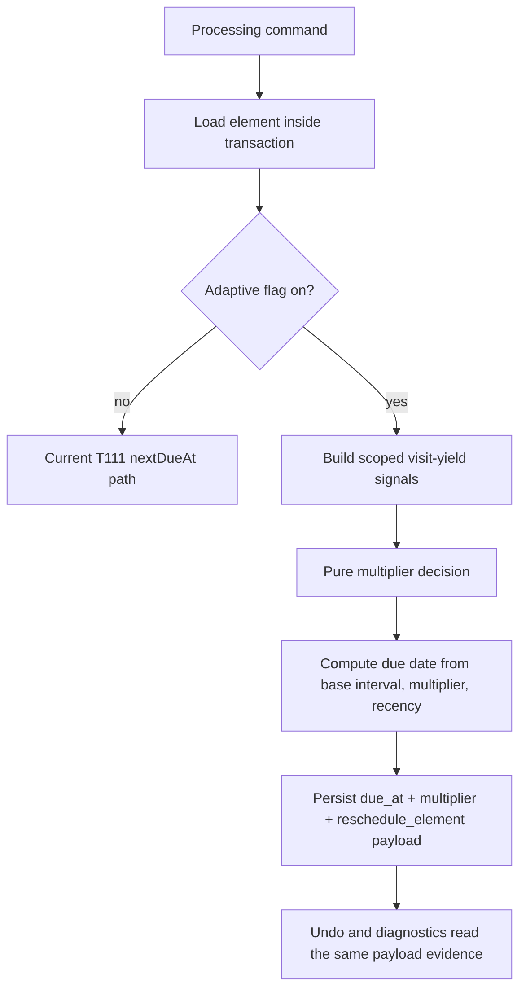

# feat: T112 yield-adaptive interval multiplier

## Summary

T112 replaces the attention scheduler's binary source-processing interval branches with a persisted, bounded interval multiplier for source and extract processing visits. The implementation keeps the math pure in `packages/scheduler`, persists multiplier state on `elements`, composes scoped yield inputs in `packages/local-db`, preserves byte-identical fallback behavior while the feature flag is off, and records enough payload evidence for undo, diagnostics, and T113 explainability.

---

## Problem Frame

The current attention scheduler can consume `lastSeenAt`, priority, stage, action, and repeated postpones, but source-processing value still collapses to two branches in `adjustForSourceProcessing`: halve high-value unresolved sources, or double mostly ignored no-output sources with a retirement suggestion. T104 already made non-card outcomes such as reference extracts, synthesized extracts, done-without-card fates, and synthesis notes count as productive value, so T112 should use that richer yield model instead of treating productive and barren visits with the same cadence.

This is attention scheduling only. Cards remain FSRS-owned through `review_states`; the new multiplier must never schedule cards or collapse review scheduling into the attention model.

---

## Requirements

**Adaptive Scheduler Behavior**

- R1. Source and extract heuristic reschedules compute a bounded `attentionIntervalMultiplier` in approximately the `0.5..4.0` range from v2 yield inputs, unresolved ratio, current multiplier, and priority.
- R2. One processed visit can move the multiplier only one step, with high-priority work growing away more slowly than low-priority work.
- R3. Productive visits, including synthesis-only and honorable extract fates from T104, shorten or hold intervals; barren visits lengthen intervals and preserve the existing source `retirementSuggestion` behavior.
- R4. Flag-off behavior is byte-identical to the current T111 scheduler behavior, including recency credit, postpone recession, topic default intervals, and the legacy binary source-processing branches.

**Persistence, Undo, and Diagnostics**

- R5. The multiplier is persisted as element scheduler state, defaults to `1.0` for existing rows, and is restored through the same undo path that restores schedule/status preimages.
- R6. Adaptive schedule writes append no new operation type; they enrich existing `reschedule_element` payloads with prior multiplier, new multiplier, flag state, yield input summary, base/final interval, and reason kind.
- R7. Scheduler consistency diagnostics detect out-of-range multiplier state and adaptive payload/history mismatches while ignoring manual choices, `queueSoon`, incomplete legacy payloads, and flag-off writes.

**Typed Boundaries and Handoff**

- R8. Source and extract yield inputs are built in local-db/main-side services from durable block-processing, lineage, fates, synthesis references, and card creation/count facts only; review logs, lapse rates, retrievability, and FSRS state are excluded until T114.
- R9. T112 emits a closed structured adaptive reason payload for T113 to render later, but no user-facing explainability copy ships in this task.
- R10. Topics keep current behavior and are regression-tested with adaptive intervals on and off unless implementation discovers a clear existing topic-yield signal.

---

## Key Technical Decisions

- KTD1. **Persist multiplier on `elements`:** The multiplier column lives on `elements` because all attention items share that table, but T112 reads and updates it only for source/extract heuristic processing visits. Existing rows start at `1.0`; a NOT NULL database CHECK and pure-code clamp protect the `0.5..4.0` bounds.
- KTD2. **Feature flag preserves current behavior:** Add a typed `adaptiveAttentionIntervals` setting that defaults off for T112. When off, the scheduler path must preserve current behavior exactly so T113 can be the user-facing enablement point.
- KTD3. **Visit boundary is command-shaped heuristic rescheduling:** T112 updates the multiplier only when a source or extract action already computes a heuristic return date. Opening a row, manual date choices, `queueSoon`, parking, fallow, and explicit schedule choices are not learning visits.
- KTD4. **Use scoped yield adapters, not full source-yield list reads:** Source-yield analytics already has a broad list/read model, but the write path must use scoped per-element adapters so a processing action never scans the whole library. Source and extract adapters can share output vocabulary while reading different durable facts.
- KTD5. **Payload evidence is the diagnostic contract:** Multiplier-vs-history diagnostics and T113 reasons need persisted evidence from each adaptive decision. The `reschedule_element` payload should carry compact versioned numeric inputs, visit-window baseline/end counters, multiplier preimage/new value, interval values, and reason kind rather than forcing later readers to reconstruct historical yield from mutable current rows.

---

## High-Level Technical Design

The pure scheduler owns only arithmetic and closed reason kinds. Local-db owns persistence, scoped yield collection, transaction boundaries, and operation-log payloads. Renderer and desktop IPC surfaces only receive typed schedule state and the structured adaptive reason, not raw SQL or filesystem paths.

---

## Scope Boundaries

- Adaptive intervals apply to source and extract heuristic processing visits for T112. Topics remain on current default-topic and priority behavior with regression coverage.
- T112 emits structured reason data but does not add queue or inspector explanation copy; T113 owns the user-visible line.
- Descendant card lapse-rate influence is deferred to T114.
- The implementation must not add a new operation-log type, a new element lifecycle status, or any raw database/filesystem bridge surface.

---

## Implementation Units

### U1. Pure adaptive multiplier model

- **Goal:** Add the scheduler-owned multiplier arithmetic and reason vocabulary without persistence or UI coupling.
- **Requirements:** R1, R2, R3, R4, R9
- **Dependencies:** none
- **Files:** `packages/scheduler/src/attention-scheduler.ts`; `packages/scheduler/src/attention-scheduler.test.ts`
- **Approach:** Introduce a DB-free visit-yield input shape, multiplier bounds, step constants, priority modulation, and adaptive reason kinds such as `yield_shortened` and `yield_lengthened`. `band_base` remains a T113 schedule-read reason and is not persisted or surfaced by T112. Keep the existing `nextDueAt` fallback path available when adaptive inputs are absent or disabled, and preserve `retirementSuggestion` for the existing barren-source case.
- **Technical design:** Directional transition table:
  - Productive visit (`cardsCreated`, child extract output, honorable extract fate, or synthesis output delta > 0): step multiplier down by `0.10` for A/B and `0.15` for C/D, clamped after the step.
  - Neutral visit (no new output, unresolved ratio still meaningful, no barren signal): hold multiplier.
  - Barren visit (no output delta and low unresolved ratio or mostly ignored/terminal source blocks): step multiplier up by `0.05` for A/B and `0.15` for C/D.
  - Unresolved high-value visit (A/B with unresolved ratio above the existing threshold): hold or step down at most `0.05`, preserving the current "bring it back sooner" intent without the old binary halve.
  - Malformed input: clamp current multiplier into bounds and emit no adaptive change.
  - Composition order: choose the current base/action interval, apply multiplier, then apply existing recency credit; round to whole days after multiplier application and before recency credit.
- **Execution note:** Start with pure table tests before editing the scheduler implementation.
- **Patterns to follow:** Existing `nextDueAt`, `postponeIntervalForPriority`, and recency-credit table tests in `packages/scheduler/src/attention-scheduler.test.ts`.
- **Test scenarios:**
  - Productive A-source visit moves toward a shorter multiplier no more than one step.
  - Barren C-source visit lengthens toward the upper bound and still returns a retirement suggestion when the old no-output threshold is met.
  - Synthesis-only and honorable extract fate inputs count as productive.
  - Multiplier clamps to lower and upper bounds even with malformed persisted input.
  - Adaptive disabled returns the same interval and due date as the pre-T112 path for source, extract, topic, postpone, done, and recency cases.
- **Verification:** Pure scheduler tests prove the multiplier table, fallback identity, bounds, reason kinds, and retirement preservation.

### U2. Persist multiplier state on elements

- **Goal:** Add durable element-level multiplier state with schema, domain, mapper, and migration coverage.
- **Requirements:** R5, R10
- **Dependencies:** U1
- **Files:** `packages/core/src/element.ts`; `packages/db/src/schema/elements.ts`; `packages/db/drizzle/*`; `packages/db/src/migration-*.test.ts`; `packages/local-db/src/mappers.ts`; `packages/local-db/src/element-repository.ts`; related schema alignment or roundtrip tests under `packages/db/src/`
- **Approach:** Add `attention_interval_multiplier REAL NOT NULL DEFAULT 1.0 CHECK (attention_interval_multiplier >= 0.5 AND attention_interval_multiplier <= 4.0)`. Thread the value through the `Element` type, Drizzle schema, row mapper, creation defaults, and schedule-update helpers without changing element lifecycle semantics. Topic/task rows may carry the default because of the shared table, but T112 behavior must prove they are not adaptive-learning participants.
- **Patterns to follow:** Recent additive element migrations for `fallow_*` and `extract_fate`; schema tests that assert CHECK constraints and upgraded-row behavior.
- **Test scenarios:**
  - Existing rows migrate with effective multiplier `1.0`.
  - Omitted values default to `1.0`; explicit `NULL`, lower-bound, and upper-bound violations fail at the schema boundary.
  - New source, extract, topic, and task rows map default multiplier state consistently.
  - Topic rows retain multiplier state but current scheduling behavior remains unchanged.
- **Verification:** Migration, schema alignment, mapper, and repository tests pass on a migrated in-memory SQLite database.

### U3. Compose adaptive scheduling in local-db

- **Goal:** Compute scoped source/extract visit yield, call the pure multiplier model, and persist due date plus multiplier in one transaction.
- **Requirements:** R1, R3, R4, R5, R6, R8, R10
- **Dependencies:** U1, U2
- **Files:** `packages/local-db/src/scheduler-service.ts`; `packages/local-db/src/scheduler-service.test.ts`; `packages/local-db/src/block-processing-service.ts`; `packages/local-db/src/source-yield-query.ts`; `packages/local-db/src/extract-service.ts`; `packages/local-db/src/extract-service.test.ts`; local-db factory/test helpers as needed
- **Approach:** Add transaction-scoped, target-only source and extract visit-yield adapters. Each adapter computes deltas for a concrete visit window: command preimage counters to post-action durable facts when the command produces output in the same transaction, otherwise the latest persisted adaptive baseline counters to the current counters. Persist the visit-window start/end, before/after compact counters, flag state, base interval, final interval, prior/new multiplier, and reason kind in the adaptive payload. Cumulative lifetime source-yield profile totals must never drive one multiplier step. Reload the element inside the mutation transaction before writing, then persist `due_at`, multiplier, and compact adaptive payload evidence through `reschedule_element`.
- **Execution note:** Characterize and route the concrete extract action matrix before replacing direct due-date writes. Adaptive learning visits: `advanceStage` / `setStage`, and any command hook that creates card or synthesis output for an existing extract. Excluded visits: `postpone`, explicit schedule choices, `queueSoon`, initial `ExtractionService.create*` scheduling, manual fate/reactivation due-now, and any command that does not represent completed processing output.
- **Patterns to follow:** `SchedulerService.toSchedulable`, `ElementRepository.rescheduleWithin`, `SourceYieldQuery.getSourceYield`, and block-processing summary queries.
- **Test scenarios:**
  - Two otherwise identical B-priority sources diverge after two visits when one produced extracts/cards/synthesis and the other remained barren.
  - A once-productive source with a later barren visit lengthens or holds instead of shortening from stale lifetime output.
  - Extract stage advancement or card/synthesis output updates the extract multiplier through the shared adaptive path.
  - Adaptive disabled leaves multiplier untouched or ignored and produces the current op payload shape with no adaptive compatibility fields.
  - A card id is rejected before any attention multiplier or schedule write.
  - Broad source-yield list queries are not used in per-visit scheduling.
- **Verification:** Local-db scheduler-service tests prove transactionality, scoped inputs, flag behavior, source/extract coverage, and FSRS isolation.

### U4. Settings flag and typed scheduler reason surface

- **Goal:** Add a typed feature flag and a structured adaptive reason field without rendering explanation copy.
- **Requirements:** R4, R8, R9, R10
- **Dependencies:** U1, U3
- **Files:** `packages/core/src/settings.ts`; `apps/desktop/src/shared/contract.ts`; `apps/desktop/src/main/db-service.ts`; `apps/desktop/src/preload/index.ts`; `apps/web/src/lib/appApi.ts`; `packages/local-db/src/queue-query.ts`; `packages/local-db/src/inspector-query.ts`; related contract/preload/appApi/query tests
- **Approach:** Add `adaptiveAttentionIntervals` to the existing settings flow with default false. Add a closed `adaptiveReason` shape to scheduler signals for queue and inspector reads, populated only for adaptive heuristic decisions with payload evidence. Keep renderer display unchanged except for type-safe propagation.
- **Patterns to follow:** Existing settings fields such as `defaultTopicIntervalDays`; current `schedulerSignals` wiring in `QueueQuery`, `InspectorQuery`, desktop contract, preload, and `appApi`.
- **Test scenarios:**
  - Settings default false flows through DB service, preload, and appApi types.
  - Queue and inspector scheduler signals include adaptive reason only after an adaptive write.
  - Flag-off, manual schedule, `queueSoon`, and internal band-base no-change rows emit no adaptive reason.
  - Renderer tests compile and existing scheduler chip rendering remains unchanged.
- **Verification:** Contract, db-service, preload, appApi, queue-query, and inspector-query tests pass.

### U5. Undo and drift diagnostics

- **Goal:** Make adaptive multiplier writes reversible and auditable through existing operation-log and maintenance diagnostics patterns.
- **Requirements:** R5, R6, R7
- **Dependencies:** U2, U3, U4
- **Files:** `packages/local-db/src/undo-service.ts`; `packages/local-db/src/scheduler-consistency-query.ts`; `packages/local-db/src/scheduler-consistency-query.test.ts`; `packages/local-db/src/scheduler-service.test.ts`; `tests/electron/queue.spec.ts` or a focused scheduler e2e if needed
- **Approach:** Extend `reschedule_element` undo handling to restore `prevAttentionIntervalMultiplier` when present, and preserve undo-of-undo symmetry. Extend scheduler consistency checks to report out-of-range persisted multiplier and adaptive payload/history mismatches only for complete adaptive heuristic payloads.
- **Patterns to follow:** Queue eligibility and T111 scheduler drift diagnostics; fallow and parked-state preimage restoration; chronic-postpone append-only marker handling.
- **Test scenarios:**
  - Undo after adaptive reschedule restores due date, status, and previous multiplier.
  - Undoing the undo remains coherent and does not lose multiplier state.
  - Diagnostics detect out-of-range persisted multiplier.
  - Diagnostics detect payload history mismatch when the latest adaptive payload says the previous multiplier differs from row history.
  - Diagnostics ignore explicit choices, `queueSoon`, incomplete legacy payloads, and flag-off writes.
- **Verification:** Undo and scheduler-consistency tests prove reversibility and diagnostic selectivity.

### U6. Documentation, performance, and roadmap/task updates

- **Goal:** Keep the public scheduler contract and roadmap task spec aligned with the implemented behavior.
- **Requirements:** R1, R4, R7, R9
- **Dependencies:** U1, U3, U5
- **Files:** `docs/scheduling-and-priority.md`; `docs/tasks/M23-adaptive-scheduler.md`; `docs/roadmap.md`; focused tests under `tests/electron/`; benchmark or scale smoke coverage if touched
- **Approach:** Update scheduler docs with the multiplier rule, flag-off default, and T113 handoff. Update T112 completion notes only after verification. Add focused Electron or app-level integration coverage for the user-facing path: adaptive flag off preserves current scheduling, adaptive flag on writes multiplier and due date, restart preserves both, and global undo restores due date, status, and multiplier.
- **Patterns to follow:** T111 completion notes in `docs/tasks/M23-adaptive-scheduler.md`; roadmap completion-note style used for T105-T111.
- **Test scenarios:**
  - Productive and barren fixture elements keep divergent due dates after restart.
  - Queue or process flow still works with adaptive flag off.
  - User-facing undo restores due date, status, and multiplier after an adaptive schedule write.
  - Scale smoke or targeted performance coverage confirms no whole-library scan was added to hot scheduling paths.
- **Verification:** Documentation matches code, roadmap/task docs are updated after implementation, and standard gates pass.

---

## System-Wide Impact

This change touches the attention scheduler contract, the universal element schema, operation-log undo semantics, settings, queue/inspector scheduler signals, and maintenance diagnostics. It must preserve the two-scheduler split: the multiplier can affect when sources and extracts return for processing, but card review remains governed by FSRS.

---

## Risks & Dependencies

- **Visit-yield ambiguity:** The implementation must avoid treating broad lifetime yield as a single visit. The plan constrains updates to command-shaped heuristic reschedules and requires compact payload evidence.
- **Extract path bypasses:** Extract services may compute due dates directly today. Characterization coverage should find and route those paths through the shared adaptive helper.
- **Flag-off drift:** The fallback must preserve current T111 behavior, not a simplified band-table-only variant.
- **Performance:** Any per-action full-library yield scan would regress large collections. Use scoped queries and verify scale-sensitive paths.
- **T113 dependency:** Adaptive intervals stay default-off until explainability renders the structured reason.

---

## Sources & Research

- `docs/tasks/M23-adaptive-scheduler.md` defines T112 and the shared M23 invariants.
- `packages/scheduler/src/attention-scheduler.ts` contains the current `adjustForSourceProcessing` branches and pure scheduling contract.
- `packages/local-db/src/scheduler-service.ts` is the persistence seam for heuristic attention reschedules.
- `packages/core/src/source-yield.ts` and `packages/local-db/src/source-yield-query.ts` carry the T104/T083 v2 yield vocabulary.
- `docs/solutions/logic-errors/attention-scheduler-last-seen-clock-semantics.md` anchors the pre-action clock, action clock, and diagnostic payload separation.
- `docs/solutions/architecture-patterns/extract-fates-value-model-v2-source-yield-stagnation.md` requires honorable extract fates and synthesis notes to count as productive value.
- `docs/solutions/logic-errors/queue-eligibility-inventory-scheduler-state.md` and `docs/solutions/architecture-patterns/topic-fallow-rest-operation-log-preimages.md` anchor backend-owned scheduler state and undo preimage discipline.
