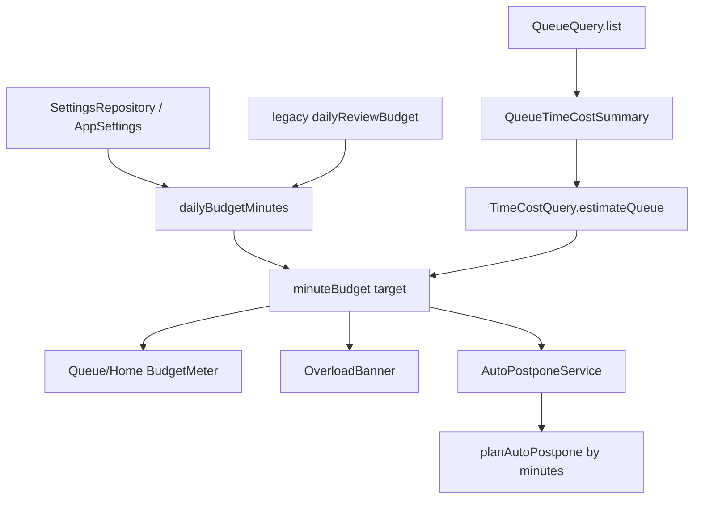

# feat: T116 minutes-denominated daily budget

## Summary

T116 changes overload budgeting from item counts to estimated minutes. The queue and home gauges
will compare T115's trusted time-cost projection against a minute budget, Settings will expose
minute presets, and manual auto-postpone will trim by estimated minutes while preserving its
existing priority and protection rules.

---

## Problem Frame

The current `dailyReviewBudget` setting is an item count. That makes a short cloze, a source pass,
and a heavy PDF-like attention row all cost one budget unit, so the queue can report a manageable
day while hiding hours of work. T115 already created the trusted minute-pricing read model; T116
must make overload detection and the user-facing budget meter consume it.

---

## Requirements

**Settings and compatibility**

- R1. Add a canonical `dailyBudgetMinutes` app setting with minute presets and validation, while
  keeping the legacy `dailyReviewBudget` count key readable for one-release rollback.
- R2. When only the legacy count key exists, derive minutes as `clamp(round(count), 5, 300)`;
  when both keys exist, the minute key wins. The default remains `60`, now meaning 60 minutes.
- R3. Settings writes to `dailyBudgetMinutes` should update the legacy count key with a conservative
  `clamp(round(minutes), 10, 300)` projection so a rollback or remaining count consumer does not
  see a stale budget.

**Trusted queue budget**

- R4. Queue reads must expose a minute-denominated budget gauge computed in trusted code from the
  full filtered due universe, not just the visible rows.
- R5. Item-count diagnostics such as due-today, overdue, protected, and per-type counts remain
  count-based and continue to use backend-owned queue eligibility.
- R6. Minute estimate confidence from T115 must survive into the budget surface so default-priced
  days can be labeled as approximate.

**Overload behavior**

- R7. Queue and home overload meters must compare estimated minutes to budget minutes.
- R8. Manual auto-postpone preview/apply must trim by estimated minutes, using the existing
  low-priority attention first, then low-priority mature-card victim order.
- R9. Auto-postpone should aim for a 10% reserve (`budgetMinutes * 0.9`) using raw minute math;
  display rounding must not drive planner decisions.
- R10. If safe victims cannot bring a day under the reserve because the remaining work is protected,
  the preview must report that honestly rather than over-postponing protected work.

**Verification**

- R11. Tests must cover legacy migration, both-key precedence, minute queue gauge semantics,
  mixed-cost auto-postpone, UI labels, typed IPC validation, and Electron queue/settings flows.
- R12. Update the T116 task spec, roadmap, and scheduling docs, including remaining count caps and
  final gate/commit references.

---

## Key Technical Decisions

- **Add a minute budget alongside the legacy count key:** `dailyBudgetMinutes` becomes canonical,
  but `dailyReviewBudget` stays in the settings shape for one-release rollback and existing
  count-only consumers. The compatibility write-through avoids a rollback opening with an old
  stale item budget after the user changed minutes. U5 must audit every remaining
  `dailyReviewBudget` reader and record whether it is migrated in T116, deliberately
  count-compatible until T118 or a named follow-up, or unrelated.
- **Expose explicit minute budget data instead of reusing count fields silently:** `QueueQuery`
  should preserve `budget: { used, target }` as count compatibility and add
  `minuteBudget: { usedMinutes, targetMinutes, confidence }` only when a queue read requests
  `includeTimeEstimate: true`. Queue and Home must request it; count-only badge consumers must not.
- **Use T115 as the only pricing source:** the local-db layer should reuse `TimeCostQuery` and
  `QueueTimeCostSummary` for aggregate minutes and confidence. React renders values; it does not
  estimate them.
- **Keep T116 scoped to queue budget and manual auto-postpone:** `reviewSessionNext`,
  catch-up/vacation, and workload simulation still use count caps. They should be audited and
  documented as adjacent consumers, but changing them here would expand T116 into session assembly
  and recovery-mode redesign.
- **Build auto-postpone from full minute-priced candidates:** `AutoPostponeService` must not plan
  from display-capped `QueueQuery.list().items`. It needs a full filtered due-candidate read or
  equivalent id-to-cost composition that attaches raw T115 `estimatedMinutes` and confidence to
  every candidate before calling the pure planner.
- **Planner uses raw minutes and display rounds late:** estimates may be fractional from learned
  medians. The pure planner should subtract raw `estimatedMinutes`; UI can show rounded whole
  minutes and `~` when confidence is default.

---

## High-Level Technical Design

The count-based due set remains the source for badges and drill-down counts. The minute-budget
path is an additional trusted projection over the same filtered due universe, with confidence
metadata carried from T115.

---

## Scope Boundaries

### In scope

- Core settings model, renderer-safe settings projection, Settings UI, desktop contract/preload
  surfaces, queue read model, BudgetMeter, Queue/Home/OverloadBanner copy, and manual
  auto-postpone planner/service behavior.
- Documentation updates for the T116 spec, roadmap, and scheduling docs.

### Deferred to follow-up work

- Re-denominating `reviewSessionNext` deck caps, recovery modes, and workload simulation. These
  still use count caps today and should be revisited with T118 session assembly or a dedicated
  compatibility cleanup. T116 still audits and documents each remaining reader so the mixed
  semantics are intentional and test-visible.
- Recording actual elapsed attention-work telemetry. T115 intentionally uses documented defaults
  for attention rows until such telemetry exists.

---

## System-Wide Impact

This change affects the shared settings contract, the queue IPC result shape, and the pure
auto-postpone planner. It does not change SQLite schema tables, card FSRS state, attention due
dates outside explicit auto-postpone apply, or renderer trust boundaries.

---

## Implementation Units

### U1. Canonical minute budget setting

- **Goal:** Add `dailyBudgetMinutes` with validation, defaults, legacy conversion, and
  write-through compatibility.
- **Requirements:** R1, R2, R3.
- **Dependencies:** none.
- **Files:** `packages/core/src/settings.ts`, `packages/core/src/settings.test.ts`,
  `packages/local-db/src/settings-repository.ts`, `packages/local-db/src/settings-repository.test.ts`,
  `apps/desktop/src/shared/contract.ts`, `apps/desktop/src/shared/contract.test.ts`,
  `apps/web/src/lib/appApi.ts`, `apps/web/src/lib/appApi.test.ts`.
- **Approach:** Introduce minute bounds and presets near the existing daily-budget constants.
  Derive minutes from the old count key only when the new key is absent using
  `clamp(round(count), 5, 300)`. Preserve `dailyReviewBudget` in `AppSettings` temporarily, but
  make `dailyBudgetMinutes` the field used by new budget consumers. Writes to
  `dailyBudgetMinutes` also write `dailyReviewBudget = clamp(round(minutes), 10, 300)` for
  rollback and remaining count readers.
- **Patterns to follow:** `retentionByBand` and `adaptiveAttentionIntervals` settings in
  `packages/core/src/settings.ts`; IPC settings validation in `apps/desktop/src/shared/contract.ts`.
- **Test scenarios:**
  - Legacy-only `review.dailyBudget = 60` resolves to the chosen derived minute budget.
  - Both keys present resolves to `dailyBudgetMinutes`.
  - Writing `dailyBudgetMinutes` clamps invalid values and writes a rollback-compatible
    `dailyReviewBudget`.
  - `dailyBudgetMinutes = 15` writes legacy count `15`, while invalid low/high values clamp to
    the minute bounds before write-through.
  - Renderer-safe settings include `dailyBudgetMinutes` and never expose unrelated secret fields.
- **Verification:** Settings compile across core, local-db, desktop contract, and renderer appApi
  tests; existing `dailyReviewBudget` tests are updated rather than deleted blindly.

### U2. Minute budget in queue reads

- **Goal:** Expose a trusted minute budget gauge from queue reads while preserving count-based
  diagnostics.
- **Requirements:** R4, R5, R6, R7.
- **Dependencies:** U1.
- **Files:** `packages/local-db/src/queue-query.ts`, `packages/local-db/src/queue-query.test.ts`,
  `packages/local-db/src/time-cost-query.ts`, `packages/local-db/src/time-cost-query.test.ts`,
  `apps/desktop/src/main/db-service.ts`, `apps/desktop/src/main/db-service.test.ts`,
  `apps/desktop/src/shared/contract.ts`, `apps/desktop/src/shared/contract.test.ts`,
  `apps/web/src/lib/appApi.ts`, `apps/web/src/lib/appApi.test.ts`.
- **Approach:** Keep item counts in `counts` and any compatibility count gauge. Add a minute
  budget result with used minutes, target minutes, and confidence. The IPC result shape should be
  `budget: { used, target }` for count compatibility plus optional
  `minuteBudget: { usedMinutes, targetMinutes, confidence }` when `includeTimeEstimate` is true.
  Build it from the same full-filtered `timeCostSummary` that T115 already computes.
- **Patterns to follow:** `DbService.listQueue` optional time-estimate path and
  `docs/solutions/architecture-patterns/queue-time-cost-read-model.md`.
- **Test scenarios:**
  - A filtered due set prices all matching rows, including rows beyond the visible limit.
  - Count badges remain unchanged when minute budget is added.
  - Default-priced attention rows produce approximate/default confidence.
  - A fixture can be minute-over-budget while item count is under the legacy count target.
  - Count-only navigation/badge reads omit `includeTimeEstimate` and do not receive
    `minuteBudget`.
- **Verification:** Queue read contract tests prove the new shape is typed and forwarded over IPC.
  If response schemas are added, parse queue and auto-postpone responses before returning them;
  otherwise keep the test wording at the existing request-validation boundary.

### U3. Auto-postpone trims by minutes

- **Goal:** Update pure auto-postpone planning and local-db preview/apply to cut estimated minutes,
  not item count.
- **Requirements:** R8, R9, R10.
- **Dependencies:** U2.
- **Files:** `packages/scheduler/src/auto-postpone.ts`,
  `packages/scheduler/src/auto-postpone.test.ts`,
  `packages/local-db/src/auto-postpone-service.ts`,
  `packages/local-db/src/auto-postpone-service.test.ts`,
  `apps/desktop/src/shared/contract.ts`, `apps/desktop/src/shared/contract.test.ts`,
  `apps/web/src/lib/appApi.ts`.
- **Approach:** Extend planner inputs with `estimatedMinutes`. Preserve existing victim tiers and
  scoring order, but stop once the remaining estimated minutes are within the reserve envelope.
  `AutoPostponeService` must build planner inputs from the same full filtered due universe used
  for `minuteBudget`, not the visible/scored display subset, and pass raw T115 estimates into
  `planAutoPostpone`. Preview should report used/target/overage in minutes plus postponed count.
  Apply should recompute live data, as it does today.
- **Patterns to follow:** Current `planAutoPostpone` tier partitioning and
  `AutoPostponeService.apply` batch-id behavior.
- **Test scenarios:**
  - Thirty cheap clozes and three heavy sources produce different victim sets under the same
    minute budget.
  - Protected heavy work can leave a day over budget without becoming a victim.
  - Fractional learned estimates use raw math and only round in presentation.
  - Preview and apply both recompute from live data and return actual postponed count/minutes.
  - A low-priority victim outside the visible display limit can still be selected when needed to
    reach the minute reserve.
- **Verification:** Scheduler and local-db auto-postpone tests cover the minute stop condition and
  preserve batch undo behavior.

### U4. Queue, home, overload, and settings UI

- **Goal:** Render minute budgets and presets without moving budget math into React.
- **Requirements:** R6, R7, R10, R11.
- **Dependencies:** U1, U2, U3.
- **Files:** `apps/web/src/components/queue/BudgetMeter.tsx`,
  `apps/web/src/components/queue/BudgetMeter.test.tsx`,
  `apps/web/src/pages/queue/QueueScreen.tsx`, `apps/web/src/pages/queue/QueueScreen.test.tsx`,
  `apps/web/src/pages/home/HomeScreen.tsx`, `apps/web/src/pages/home/HomeScreen.test.tsx`,
  `apps/web/src/pages/queue/OverloadBanner.tsx`,
  `apps/web/src/pages/queue/OverloadBanner.test.tsx`, `apps/web/src/pages/Settings.tsx`,
  `apps/web/src/pages/Settings.test.tsx`, `apps/web/src/help/help-bodies.ts`.
- **Approach:** Feed the new minute budget object into BudgetMeter and OverloadBanner. Keep
  count metrics labeled as counts. Settings should offer minute presets such as 15, 30, 60, and
  120, plus the existing numeric control pattern. Custom minute values remain allowed; presets are
  selected when the value equals a preset and the numeric field owns custom values.
- **Patterns to follow:** Current Queue/Home overload strip layout and the Settings section style
  described in `docs/solutions/design-patterns/folding-floating-diagnostics-into-settings-section.md`.
- **Test scenarios:**
  - BudgetMeter renders `~45 / 60 min` when any priced component is default-confidence, and omits
    `~` only when all priced components are learned-confidence.
  - Queue and Home still show due-today/overdue/protected counts as counts.
  - OverloadBanner triggers when minutes exceed budget even if item count is low.
  - Settings renders selected preset, custom numeric, invalid/out-of-bounds, pending, success,
    failure, and restart-persistence states.
  - Queue and Home cover loading, no due work, under-budget, near-reserve, over-budget,
    approximate-confidence, missing-`minuteBudget` fallback, and query-error states.
  - OverloadBanner covers idle overload, preview loading, preview success, no-safe-victims,
    apply loading, apply success with actual postponed minutes/count, stale preview-vs-apply
    recomputation, and preview/apply error recovery.
- **Verification:** Renderer tests cover labels and interaction; Electron tests cover settings and
  queue overload fixture behavior.

### U5. Daily budget consumer audit and documentation

- **Goal:** Audit remaining budget consumers, document temporary count-compatible readers, and
  update task docs.
- **Requirements:** R12.
- **Dependencies:** U1, U2, U3, U4.
- **Files:** `apps/desktop/src/main/db-service.ts`, `packages/local-db/src/recovery-mode-service.ts`,
  `packages/local-db/src/workload-service.ts`, `docs/tasks/M24-ambient-overload.md`,
  `docs/roadmap.md`, `docs/scheduling-and-priority.md`.
- **Approach:** Grep every `dailyReviewBudget` reader and classify it as migrated in T116,
  deliberately count-compatible until T118 or a named follow-up, or unrelated. Mark T116
  completion in the spec and roadmap after implementation. Update scheduling docs to describe
  minute-denominated daily budgets and call out remaining count caps where they still exist.
- **Patterns to follow:** Recent T111-T115 completion notes in `docs/tasks/M23-adaptive-scheduler.md`
  and `docs/tasks/M24-ambient-overload.md`.
- **Test scenarios:**
  - `reviewSessionNext` remains an intentional count-compatible cap until T118.
  - Recovery modes and workload simulation are either migrated to minutes if touched by
    implementation or explicitly documented as count-compatible with a named follow-up.
  - Documentation references the final commit and standard gate results.
- **Verification:** The audit leaves no unclassified `dailyReviewBudget` reader.

---

## Risks & Dependencies

- **Mixed budget semantics during transition:** some existing consumers still read
  `dailyReviewBudget` as a count. The implementation must avoid reusing that field for minutes
  without renaming the consumer.
- **Estimate uncertainty:** default-priced attention rows can make the meter approximate. The UI
  should label uncertainty rather than hiding it.
- **Auto-postpone precision:** if planner inputs omit full-universe per-item minutes, the service
  can only cut by count or by a display-capped subset. U3 owns a full due-candidate minute input.

---

## Acceptance Examples

- AE1. Given only legacy `review.dailyBudget = 60`, when settings load after upgrade, then the
  renderer receives a nonzero `dailyBudgetMinutes` derived from the legacy value.
- AE2. Given a queue with three default-priced sources totaling more minutes than the budget, when
  `/queue` loads, then BudgetMeter and OverloadBanner show minute overload even if the item count is
  less than the old count budget.
- AE3. Given low-priority attention work and protected high-priority fragile cards, when
  auto-postpone preview runs, then it postpones low-priority work until the minute reserve is met or
  no safe victims remain.

---

## Sources & Research

- `docs/tasks/M24-ambient-overload.md` defines T116 scope and the M24 overload direction.
- `packages/core/src/settings.ts` owns the persisted settings model and legacy
  `dailyReviewBudget` key.
- `packages/local-db/src/queue-query.ts` already computes `timeCostSummary` over the full filtered
  due set.
- `packages/local-db/src/time-cost-query.ts` is the T115 trusted minute-pricing model.
- `packages/scheduler/src/auto-postpone.ts` is the pure count-based planner to re-denominate.
- `docs/solutions/architecture-patterns/queue-time-cost-read-model.md` requires pricing to remain a
  trusted read model over the full due universe.
- `docs/solutions/logic-errors/queue-eligibility-inventory-scheduler-state.md` requires queue
  membership to remain backend-owned.
