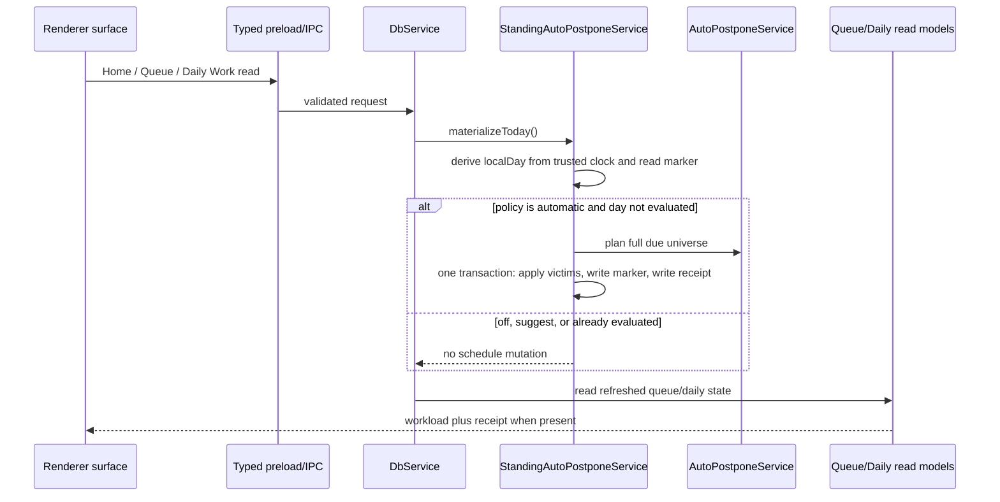
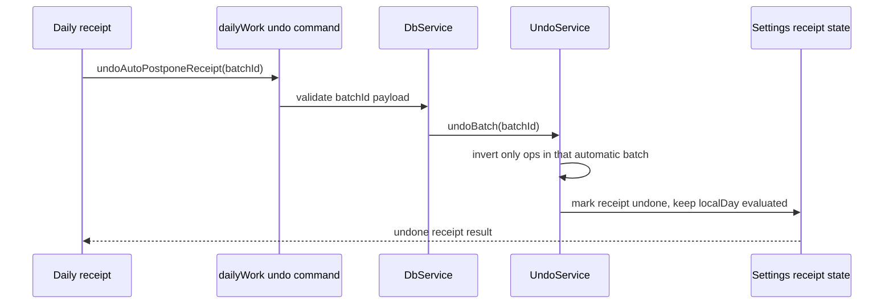

# feat: T117 standing auto-postpone policy

## Summary

T117 adds a typed standing overload policy that evaluates each local day once and can automatically apply the existing minute-priced auto-postpone plan before the user sees the day. The feature keeps the manual overload banner, makes automatic sacrifice visible in the daily receipt and priority-integrity ledger, and gives receipt undo a batch-specific path instead of relying on global `undoLast`.

---

## Problem Frame

T116 made the overload system honest in minutes, but overload relief is still a manual morning ceremony. The user who most needs the valve is least likely to run the preview-confirm flow every overloaded day, so the app needs an opt-in standing policy that trims safe due work before queue composition becomes overwhelming. The implementation must preserve the T077 protection rules, T105 receipt model, renderer trust boundary, and batch undo invariants.

---

## Requirements

**Policy and trigger**

- R1. The app exposes `overloadPolicy: "off" | "suggest" | "automatic"` through typed settings, defaulting existing and unset vaults to `suggest`.
- R2. The standing policy evaluates at most once per local day from trusted main/local-db code before Home, Queue, or Daily Work returns the day's workload.
- R2a. Standing materialization derives "today" from a trusted main/local-db clock, not from renderer-provided read parameters; tests may inject the clock, but past/future `asOf` reads must not create non-current-day markers or batches.
- R3. `automatic` applies the existing T077 auto-postpone plan against the full daily due universe, not the visible queue filter.
- R4. `suggest` and `off` never mutate schedules during day materialization, and the manual overload banner remains available when the queue is over budget.

**Receipts, undo, and attribution**

- R5. Automatic runs persist a local-day marker and, when anything moved, a receipt containing `batchId`, item count, estimated minutes, affected priority bands, remaining estimated minutes, and local day.
- R6. Receipt Undo targets the recorded automatic `batchId` specifically, so later user actions cannot cause the receipt button to undo the wrong command.
- R7. Automatic victim `reschedule_element` payloads carry structured origin metadata so priority-integrity can distinguish standing automatic deferrals from manual banner, catch-up, and vacation deferrals.
- R8. Zero-victim automatic evaluations mark the local day as evaluated without showing a false "slipped" receipt and without retrying on every read.

**Safety and compatibility**

- R9. Automatic application preserves T077 protections for high-priority fragile cards, leeches, and protected rows, and accepts protected overflow rather than sacrificing unsafe work.
- R10. Undoing an automatic receipt does not cause the standing policy to re-run on the same local day.
- R11. The renderer never computes victim selection, writes markers, or reads raw persistence; it uses the typed preload bridge only.
- R12. Vacation/catch-up precedence is not guessed from UI state; if durable recovery-mode evidence owns the current local day, T117 skips automatic mutation, and if no such durable evidence exists T117 documents that limitation and avoids adding a fake detector.

---

## Key Technical Decisions

- KTD1. **Use first materialization instead of a runner job.** A main-side guard called before Home, Queue, and Daily Work reads avoids at-least-once runner delivery, avoids scheduling while the app is closed, and still makes the day open already trimmed.
- KTD2. **Persist markers and receipts in settings state, not a new table.** T117 needs one small local-day receipt/marker shape, similar to daily-work graduation acknowledgement state, and does not need queryable historical analytics beyond operation-log evidence. The marker records evaluation state even for zero-victim days; the receipt is only shown for moved work.
- KTD3. **Automatic apply must be transaction-composable.** The existing `AutoPostponeService.apply()` shares a `batchId` but delegates per victim through helpers that each own transactions; standing automatic needs a local-db method that writes all victim ops plus marker/receipt state in one outer transaction.
- KTD4. **Receipt undo uses a targeted batch command.** A daily receipt remains visible after later user actions, so its Undo cannot call `undoLast`; the service should validate the batch belongs to a T117 automatic receipt and invert that batch directly. Batch validation, inverse reschedules, inverse operation-log rows, and receipt-state update happen in one transaction.
- KTD5. **Policy metadata rides on existing `reschedule_element` ops.** Priority-integrity stays a read model over durable command evidence; it should read a shared `postponeOrigin` payload shape from existing op payloads instead of maintaining a parallel analytics table. Standing automatic, manual auto-postpone, recovery/catch-up, vacation, and manual queue actions must be distinguishable; undone standing batches should be foldable as restored rather than counted as active sacrifice.
- KTD6. **`suggest` remains explicit.** It reuses the existing manual overload banner and does not prefetch, write a marker, receipt, or ledger entry until the user applies the banner.
- KTD7. **Home is covered through live workload reads.** The Home surface already calls trusted queue and daily-work reads, so materialization belongs in those read paths and Home-specific tests should prove opening Home does not bypass the guard.

---

## High-Level Technical Design

### Day materialization flow

### Receipt undo flow

---

## Acceptance Examples

- AE1. Given `overloadPolicy = "automatic"` and a mixed overloaded queue, when Home opens on `2026-06-12`, then exactly one automatic batch is applied, safe victims leave the due set, and Daily Work includes a receipt with count, minutes, bands, local day, and `batchId`.
- AE2. Given the same local day is read again after AE1, when Queue and Home refresh, then no second automatic batch is applied and the existing receipt is reused.
- AE3. Given an automatic receipt remains visible and the user performs another command, when they click receipt Undo, then only the automatic batch is undone and the later command remains intact.
- AE4. Given the due set is over budget but only protected fragile/high-priority work remains, when automatic evaluates the day, then zero items move, the day is marked evaluated, and the manual overload banner can still explain protected overflow.
- AE5. Given `overloadPolicy = "suggest"` or `"off"`, when Home or Queue opens over budget, then no schedule mutation or automatic marker is written and the existing manual banner path still works.
- AE6. Given automatic victims are logged, when priority integrity computes the window, then standing automatic deferrals are attributable separately from manual auto-postpone batches.
- AE7. Given Queue is read with a past or future `asOf`, when the trusted current local day has not changed, then no marker or batch is created for the arbitrary `asOf` day.
- AE8. Given automatic receipt undo succeeds, when priority integrity is recomputed, then the standing batch is either excluded from active sacrifice totals or explicitly labeled restored rather than counted as an active sacrifice.

---

## Implementation Units

### U1. Typed policy setting and renderer control

- **Goal:** Add the standing overload policy to the typed settings model, IPC validation, client wrapper, and Settings UI.
- **Requirements:** R1, R4, R11.
- **Dependencies:** None.
- **Files:** Modify `packages/core/src/settings.ts`, `packages/core/src/settings.test.ts`, `packages/testing/src/factories.ts`, `apps/desktop/src/shared/contract.ts`, `apps/desktop/src/shared/contract.test.ts`, `apps/desktop/src/main/db-service.test.ts`, `apps/desktop/src/preload/index.test.ts`, `apps/web/src/lib/appApi.ts`, `apps/web/src/lib/appApi.test.ts`, `apps/web/src/pages/Settings.tsx`, `apps/web/src/pages/Settings.test.tsx`.
- **Approach:** Introduce a closed `OVERLOAD_POLICIES` tuple and `OverloadPolicy` type in core, default to `suggest`, persist via the existing settings key/value model, and add a compact segmented control near the minute budget settings. Treat `off` as "no standing policy", not "hide manual auto-postpone". The control labels should make policy semantics explicit: Off = no standing policy and manual banner still available; Suggest = show manual overload suggestions and let the user confirm; Automatic = once per local day before Home/Queue/Daily Work, postpone only safe low-value work and show a receipt/undo/ledger attribution.
- **Activation path:** The manual overload banner/post-preview flow may offer a trust-preserving opt-in to Automatic after the user sees what would move, with copy covering once-per-day timing, protections, receipt undo, and ledger attribution.
- **Accessibility:** The segmented control must support keyboard selection, visible focus, accessible names/descriptions, and touch-friendly target sizing.
- **Patterns to follow:** `dailyBudgetMinutes` in `packages/core/src/settings.ts`, weekly/adaptive settings controls in `apps/web/src/pages/Settings.tsx`, and `docs/solutions/design-patterns/folding-floating-diagnostics-into-settings-section.md`.
- **Test scenarios:**
  - Default settings project `overloadPolicy: "suggest"` for an unset vault.
  - Invalid setting patches are rejected at the IPC schema.
  - Settings UI renders Off/Suggest/Automatic and persists a selected value through `appApi.settings.updateMany`.
- **Verification:** Settings round-trip through core, main, preload, appApi, and renderer tests without exposing new trusted capabilities.

### U2. Standing policy service, local-day marker, and atomic automatic apply

- **Goal:** Add a local-db service that evaluates a local day once, applies automatic safe victims in one transaction, and stores marker/receipt state.
- **Requirements:** R2, R3, R5, R8, R9, R10, R12, AE1, AE2, AE4.
- **Dependencies:** U1.
- **Files:** Create `packages/local-db/src/standing-auto-postpone-service.ts` and `packages/local-db/src/standing-auto-postpone-service.test.ts`; modify `packages/local-db/src/auto-postpone-service.ts`, `packages/local-db/src/index.ts`, `packages/local-db/src/operation-log-repository.ts` if payload helpers need typed metadata.
- **Approach:** Store state under a versioned settings key such as `dailyWork.standingAutoPostpone.v1` with per-local-day entries. Reuse `QueueQuery.autoPostponeCandidates`, `TimeCostQuery`, and `planAutoPostpone`, but add transaction-aware apply helpers so all victim reschedules and the marker/receipt are committed together. Automatic runs use the full daily due universe with no UI filters and derive the evaluated local day from the trusted service clock.
- **Transaction seams:** Add narrow `within` helpers where needed instead of calling public methods that own transactions: scheduler reschedule, queue card defer, operation-log append, and settings state update must all accept a shared transaction or be orchestrated by the standing service inside one DB transaction. A forced mid-batch failure test should prove no victim ops, marker, or receipt survive.
- **Recovery precedence:** Before automatic mutation, check only durable recovery/vacation/catch-up evidence already available in the local DB. If there is no durable active-day marker today, record in the task notes that T117 does not infer recovery state from UI or transient memory.
- **Execution note:** Start with failing local-db tests for idempotence and protected-only no-op behavior before wiring IPC.
- **Patterns to follow:** `AutoPostponeService.preview/apply`, `DailyWorkQuery` graduation state, `FallowService` shared `batchId` transaction shape, and `docs/solutions/architecture-patterns/minute-denominated-overload-budget.md`.
- **Test scenarios:**
  - Automatic policy on an overloaded mixed fixture applies one batch, writes one marker, writes one receipt, and returns under or closer to the minute budget without moving protected rows.
  - A second materialization for the same local day writes no new `reschedule_element` ops.
  - Protected-only overflow writes an evaluated marker, moves zero rows, and shows no slipped receipt.
  - `suggest` and `off` materialization write no operation-log rows.
  - Past/future `asOf` reads do not create markers or batches for the arbitrary requested day.
  - A simulated mid-batch failure rolls back all victim ops and marker/receipt state.
  - If no durable active vacation marker exists, service behavior is documented and tests assert no invented skip detector.
- **Verification:** Local-db tests prove one-run-per-day semantics and transaction-owned receipt/marker writes.

### U3. Batch-specific receipt undo

- **Goal:** Add a command that undoes the automatic receipt's `batchId` specifically and marks the receipt as undone without allowing same-day re-trim.
- **Requirements:** R6, R10, AE3.
- **Dependencies:** U2.
- **Files:** Modify `packages/local-db/src/undo-service.ts`, `packages/local-db/src/undo-service.test.ts`, `packages/local-db/src/standing-auto-postpone-service.ts`, `packages/local-db/src/standing-auto-postpone-service.test.ts`.
- **Approach:** Add a narrow `undoBatch(batchId)` or service-owned wrapper that validates the batch exists, belongs to the active T117 receipt, and contains standing automatic postpone payload metadata. Invert only that batch's operations, then update receipt state to `undone` while preserving the day's evaluated marker.
- **Atomicity:** Validate batch ownership, invert all operations, append inverse operation-log rows, and update receipt state in one transaction. A failure while restoring one victim should roll back all inverse writes and leave the receipt actionable.
- **Patterns to follow:** `UndoService.undoLast` batch grouping, lineage branch-delete batch restore rationale in `docs/solutions/architecture-patterns/lineage-aware-deletion-tombstone-purge-guard.md`, and `docs/solutions/logic-errors/queue-eligibility-inventory-scheduler-state.md`.
- **Test scenarios:**
  - Receipt undo restores all automatic victim due dates after an intervening logged action.
  - Receipt undo refuses a non-automatic or unknown batch id.
  - After receipt undo, materializing the same local day does not apply another automatic batch.
- **Verification:** Tests prove order-independent receipt undo and no same-day re-trim.

### U4. Main/preload/app API surfaces and materialization hook

- **Goal:** Wire trusted materialization and receipt undo through the desktop service boundary without creating raw persistence access.
- **Requirements:** R2, R6, R11.
- **Dependencies:** U2, U3.
- **Files:** Modify `apps/desktop/src/shared/channels.ts`, `apps/desktop/src/shared/contract.ts`, `apps/desktop/src/shared/contract.test.ts`, `apps/desktop/src/main/ipc.ts`, `apps/desktop/src/main/db-service.ts`, `apps/desktop/src/main/db-service.test.ts`, `apps/desktop/src/preload/index.ts`, `apps/desktop/src/preload/index.test.ts`, `apps/web/src/lib/appApi.ts`, `apps/web/src/lib/appApi.test.ts`.
- **Approach:** Call the standing service from `DbService` before queue and daily-work reads that represent a local day, then expose an explicit `dailyWork.undoAutoPostponeReceipt({ batchId })` command. Home is covered because it reads queue and daily-work data through the same trusted paths. Keep the read surfaces typed and document their materialization side effect in contract comments.
- **Patterns to follow:** Existing `queue.autoPostpone` IPC contract, `dailyWork.summary`, and `undo.last` bridge wiring.
- **Test scenarios:**
  - Queue, daily-work, and Home-opening read paths call materialization once for the trusted current day.
  - A read with a non-current `asOf` does not materialize that non-current day.
  - The receipt undo IPC validates payload shape and returns a typed result.
  - Renderer appApi wrapper exposes only the narrow daily-work undo command.
- **Verification:** Contract, IPC, preload, appApi, and db-service tests cover the full bridge.

### U5. Daily receipt UI and manual banner compatibility

- **Goal:** Surface automatic postponement as a calm daily receipt with batch undo, while preserving the manual overload banner for off/suggest/protected-overflow cases.
- **Requirements:** R4, R5, R6, R8, R11, AE1, AE3, AE4, AE5.
- **Dependencies:** U4.
- **Files:** Modify `packages/local-db/src/daily-work-query.ts`, `packages/local-db/src/daily-work-query.test.ts`, `apps/desktop/src/shared/contract.ts`, `apps/web/src/pages/home/HomeScreen.tsx`, `apps/web/src/pages/home/HomeScreen.test.tsx`, `apps/web/src/pages/queue/QueueScreen.tsx`, `apps/web/src/pages/queue/QueueScreen.test.tsx`, `apps/web/src/pages/queue/OverloadBanner.tsx`, `apps/web/src/pages/queue/OverloadBanner.test.tsx`, and relevant CSS in `apps/web/src/pages/home/home.css` or `apps/web/src/pages/queue/queue.css`.
- **Approach:** Extend `DailyWorkSummary` with an optional `autoPostponeReceipt`. Render it near existing daily receipts on Home and, if queue owns the primary receipt, show a compact line above the queue list. The receipt's Undo calls the batch-specific command and refreshes queue/daily state. The manual banner stays visible whenever current minutes exceed budget.
- **Receipt states:** Cover idle/actionable, undo pending, undone, error with retry, dismissed/stale, and already-restored states. Use an accessible status/`aria-live` update for undo success/failure and return focus predictably after the action.
- **Protected overflow copy:** If automatic evaluated but protected work still leaves the day over budget, the manual banner should explain that automatic already skipped unsafe/protected work and keep manual preview/apply available only when safe victims remain.
- **Patterns to follow:** `GraduationReceipts` in `apps/web/src/pages/home/HomeScreen.tsx`, `QueueSnackbar` undo affordances, and `docs/solutions/ui-bugs/daily-work-read-model-inbox-only-routing.md`.
- **Test scenarios:**
  - Home renders "N items slipped" with minutes and an Undo button for an automatic receipt.
  - Clicking Undo calls the receipt-specific API and refreshes Home/Queue.
  - Undo pending, success, and failure states are visible and announced.
  - `off`/`suggest` settings still show the manual overload banner on an overloaded queue.
  - Protected-only automatic evaluation does not render a slipped receipt.
- **Verification:** Renderer unit tests cover receipt rendering and manual banner compatibility.

### U6. Priority-integrity attribution and Electron E2E

- **Goal:** Make automatic sacrifice visible in the T105 ledger and prove the full desktop workflow survives restart.
- **Requirements:** R7, R9, R10, AE1, AE2, AE3, AE6.
- **Dependencies:** U2, U3, U4, U5.
- **Files:** Modify `packages/local-db/src/priority-integrity-query.ts`, `packages/local-db/src/priority-integrity-query.test.ts`, `apps/web/src/analytics/AnalyticsScreen.tsx`, `apps/web/src/analytics/AnalyticsScreen.test.tsx` if a visible attribution label is needed, `tests/electron/auto-postpone.spec.ts`.
- **Approach:** Extend priority-integrity sacrificed rows or summary metadata with automatic-vs-manual attribution derived from operation-log payloads. Define the shared origin payload in the local-db/core contract used by reschedule ops, update existing manual auto-postpone/recovery-compatible paths to populate or map to it, and make restored standing batches distinguishable after receipt undo. Add Electron coverage that sets policy to automatic, opens an overloaded day, verifies the receipt and queue trim, restarts or reloads, verifies no second trim, then undoes the receipt.
- **Patterns to follow:** `docs/solutions/architecture-patterns/priority-integrity-read-model.md`, existing `tests/electron/auto-postpone.spec.ts`, and `docs/solutions/architecture-patterns/chronic-postpone-reckoning-from-operation-log-reset-markers.md`.
- **Test scenarios:**
  - Priority-integrity rows identify standing automatic sacrifices.
  - Manual auto-postpone and standing automatic postpone are attributed differently.
  - Undone standing automatic batches are excluded from active sacrifice totals or labeled restored.
  - Electron overloaded fixture with automatic policy opens within budget when safe victims exist.
  - Restart/reopen on the same `asOf` does not double-trim.
  - Receipt Undo restores the batch and the same-day marker prevents re-trim.
- **Verification:** Priority-integrity tests plus focused Electron auto-postpone E2E pass.

---

## Scope Boundaries

- T117 does not change the pure T077 victim-selection policy except to call it from a standing policy path.
- T117 does not add wall-clock background jobs; first materialization is the chosen trigger.
- T117 does not invent a vacation/catch-up active-state model if durable evidence is not already present; that can be a follow-up to recovery modes.
- T117 does not add T118/T119 composition hooks; it should only avoid breaking existing queue and daily-work contracts those tasks may later consume.

---

## Risks & Dependencies

- **Read side effect clarity:** Home/Queue/Daily Work reads become materializing reads for `automatic`; contract comments and tests must make this explicit so future read-model work does not assume all reads are pure.
- **Atomicity gap in existing manual apply:** The plan must add transaction-composable apply helpers instead of layering marker writes around the existing per-victim apply loop.
- **Undo scope:** Receipt undo must validate automatic-batch ownership; a generic arbitrary-batch undo command would be too broad for the renderer.
- **Protected overflow:** The app may remain over budget after automatic evaluation if only protected work remains; the UI should explain this rather than hiding overload.

---

## Sources & Research

- Roadmap/spec: `docs/roadmap.md` and `docs/tasks/M24-ambient-overload.md`.
- Existing implementation: `packages/local-db/src/auto-postpone-service.ts`, `packages/scheduler/src/auto-postpone.ts`, `packages/local-db/src/daily-work-query.ts`, `packages/local-db/src/priority-integrity-query.ts`, `apps/web/src/pages/queue/OverloadBanner.tsx`, `apps/web/src/pages/home/HomeScreen.tsx`.
- Prior learnings: `docs/solutions/architecture-patterns/minute-denominated-overload-budget.md`, `docs/solutions/architecture-patterns/queue-time-cost-read-model.md`, `docs/solutions/architecture-patterns/priority-integrity-read-model.md`, `docs/solutions/architecture-patterns/chronic-postpone-reckoning-from-operation-log-reset-markers.md`, `docs/solutions/logic-errors/queue-eligibility-inventory-scheduler-state.md`, `docs/solutions/architecture-patterns/trusted-schedule-reasons-from-governing-reschedule-ops.md`, `docs/solutions/ui-bugs/daily-work-read-model-inbox-only-routing.md`.
