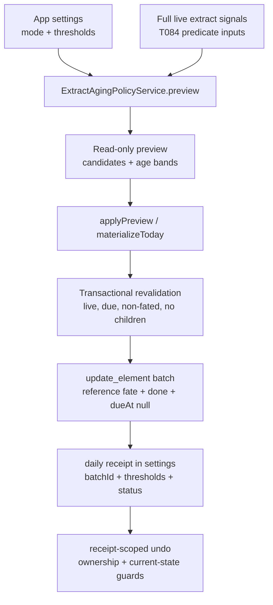

# feat: T121 Extract aging policy

## Summary

T121 adds an opt-in extract aging policy that turns repeatedly unproductive extracts into recoverable `reference` fates through trusted, batched, undoable sweeps. The work reuses T084 stagnation signals, T104 extract fates, and the T117 receipt pattern without adding a parallel scheduler or renderer-side policy logic.

---

## Problem Frame

Extract stagnation is currently visible but not consequential: the app can detect extracts that keep returning without progress, but the user must visit a maintenance surface and decide each one manually. T121 adds default pressure so old, unproductive extracts stop haunting the queue while staying recoverable and source-grounded.

The plan treats the M25 spec as authoritative for scope: automatic demotion is an honorable T104 `reference` fate, never deletion; policy modes are opt-in; every sweep carries one `batchId`, one receipt, and a targeted undo path.

---

## Requirements

- R1. Add typed extract-aging settings for policy mode, return threshold, and age threshold, with conservative defaults and clamped persisted values.
- R2. Compute aging candidates on the trusted side from live, due, non-fated extract rows that satisfy the existing stagnation heuristic plus the configured thresholds.
- R3. Keep preview read-only; applying a preview or automatic sweep must revalidate every candidate inside the mutation transaction and skip stale rows with explicit reasons.
- R4. Demote eligible rows to `extractFate: "reference"` with `status: "done"` and `dueAt: null`, using existing `update_element` operation-log semantics and one shared `batchId`.
- R5. Store a durable aging receipt with local day, batch id, threshold snapshot, affected/skipped counts, and `actionable | undone` status.
- R6. Undo an aging receipt through a receipt-scoped path that refuses the whole batch if ownership or current-state guards fail.
- R7. Surface aging pressure and receipts on Home, Queue, Weekly Review, and stagnant-extract maintenance without duplicating detection logic in React.
- R8. Render backend-owned age bands for extract rows in queue, process queue, library/search inventory, conversion, and stagnant maintenance contexts where extract rows already appear.
- R9. Preserve T104 invariants: `reference`, `synthesized`, and `done_without_card` extracts, live synthesis references, and extracts that already produced children/cards are never aging candidates.
- R10. Provide a convert-now escape hatch that routes to the existing T120 conversion surface instead of creating a second conversion workflow.

---

## Key Technical Decisions

- KTD1. **Candidate source:** Build the policy on the same full live-extract signal universe as `ExtractStagnationQuery`, but do not filter through a pre-thresholded "already stagnant" result. T121 must either parameterize the stagnation predicate or expose unfiltered signal rows, then apply the configured aging return and age thresholds directly.
- KTD2. **Default eligibility:** Only live, due, scheduled/active, non-fated, non-`atomic_statement` extracts are automatic candidates. This keeps automatic mode from demoting card-ready statements that should go through T120 conversion.
- KTD3. **Receipt state in settings:** Use an extract-aging state key rather than adding a table, but store receipts by `batchId` so multiple suggest-mode sweeps on the same local day remain independently undoable. Keep the once-per-day automatic evaluation marker separate from receipt storage. Receipts are control state, not domain history; durable domain history remains in `operation_log`.
- KTD4. **Mutation shape:** Use existing `ElementRepository.updateWithin` / `update_element` preimages with extra payload metadata such as `extractAgingOrigin`, `batchId`, and threshold snapshot. Do not add an operation-log type.
- KTD5. **Targeted undo:** Implement aging-specific receipt undo over `update_element` batch ops instead of using T117's postpone-specific guard. The guard should prove every affected row is still the system-written reference fate before restoring.
- KTD6. **Trusted current-day materialization:** Automatic mode runs once per trusted current local day before main-side Home/Daily/Queue/Weekly Review reads, matching standing auto-postpone. When both automatic policies are enabled, extract aging runs before standing auto-postpone so stale due extracts are either demoted or explicitly skipped before overload planning can push them into the future. Historical `asOf` reads and renderer clocks never trigger mutations.
- KTD7. **Backend age projection:** Add a shared extract-aging projection to trusted read models instead of computing age bands in React. UI surfaces render the band and route actions only.

---

## High-Level Technical Design

---

## Implementation Units

### U1. Settings and shared aging vocabulary

- **Goal:** Add typed settings and shared result types for extract aging policy mode, thresholds, receipts, and age bands.
- **Requirements:** R1, R5, R8.
- **Dependencies:** None.
- **Files:**
  - Modify `packages/core/src/settings.ts`.
  - Modify `packages/core/src/settings.test.ts`.
  - Modify `apps/web/src/lib/appApi.ts`.
  - Modify `apps/web/src/pages/Settings.tsx`.
  - Modify `apps/web/src/pages/Settings.test.tsx`.
- **Approach:** Add `extractAgingPolicy: "off" | "suggest" | "automatic"`, `extractAgingReturnThreshold`, and `extractAgingAgeDays` to the core settings model and renderer projection. Default to `off` so the aging policy remains explicitly opt-in; users can then enable either preview-only suggestions or automatic sweeps. Add a compact Settings section near overload/distillation controls. Choosing `automatic` must show an inline confirmation disclosure before saving, state the active thresholds, show the current candidate count when available, and explain that the first sweep runs on the next trusted current-day materialization. The settings update needs pending, error, and committed states.
- **Patterns to follow:** `overloadPolicy`, `chronicPostponeThreshold`, `parkedResurfaceAfterDays`, and `distillationQuotaPercent` settings.
- **Test scenarios:**
  - Coerces invalid policy values to the default.
  - Clamps return threshold and age days to documented min/max.
  - Renderer fallback settings include the new fields.
  - Settings UI writes mode and threshold patches through `settings.updateMany`.
- **Verification:** Core settings tests and Settings renderer tests prove defaults, clamping, projection, and UI writes.

### U2. Candidate query, preview, and age projection

- **Goal:** Introduce a trusted read model for extract aging candidates and reusable age bands.
- **Requirements:** R2, R3, R8, R9, R10.
- **Dependencies:** U1.
- **Files:**
  - Create `packages/local-db/src/extract-aging-policy-service.ts`.
  - Create `packages/local-db/src/extract-aging-policy-service.test.ts`.
  - Modify `packages/local-db/src/extract-stagnation-query.ts`.
  - Modify `packages/local-db/src/index.ts`.
  - Modify `packages/local-db/src/queue-query.ts`.
  - Modify `packages/local-db/src/library-query.ts`.
  - Modify `packages/local-db/src/conversion-session-query.ts`.
- **Approach:** Reuse or refactor `ExtractStagnationQuery` so the aging service can read unfiltered stagnation signal rows, then apply due/status/stage/fate filters and the configured thresholds itself. Add age-band fields such as `fresh | aging | stale | graveyard` plus `daysSinceProgress` and `postponeCount` to extract summaries returned by queue/library/conversion/stagnation reads. Preview/materialize should use a service-level sweep limit and return `remainingCandidateCount` when more eligible rows exist, so automatic mode is bounded but honest. Preview is read-only and includes action hints: convert via `/convert` only for rows that the existing T120 conversion surface can actually accept; raw/clean policy candidates should keep rewrite/open/demote actions instead of a misleading conversion shortcut. Convert-now actions should carry the candidate id or selected ids into `/convert`, focus the conversion session on those rows when the conversion API supports it, preserve a return path to the aging preview, and refresh aging preview state after conversion without demoting converted candidates.
- **Patterns to follow:** `TimeCostQuery` projection into queue rows, `ConversionSessionQuery` eligibility filtering, and `ExtractStagnationQuery` grouped reads.
- **Test scenarios:**
  - Returns no candidates when policy is `off` but still computes age bands for inventory.
  - Excludes `reference`, `synthesized`, `done_without_card`, live synthesis-referenced, child-producing, deleted, non-due, and `atomic_statement` extracts.
  - Includes due stagnant extracts that cross both return and age thresholds.
  - Produces stable age bands from backend timestamps without React date math.
- **Verification:** Local-db tests cover candidate eligibility, threshold boundaries, exclusion reasons, and age-band projection.

### U3. Batch apply, automatic materialization, and targeted undo

- **Goal:** Apply aging demotions in one transaction, persist receipts, and undo only the exact receipt batch.
- **Requirements:** R3, R4, R5, R6, R9.
- **Dependencies:** U2.
- **Files:**
  - Modify `packages/local-db/src/extract-aging-policy-service.ts`.
  - Modify `packages/local-db/src/extract-aging-policy-service.test.ts`.
  - Modify `packages/local-db/src/undo-service.ts` if a small reusable batch guard is needed.
  - Modify `packages/local-db/src/priority-integrity-query.ts` if aging origin attribution is surfaced there.
- **Approach:** Add `preview`, `applyPreview`, `materializeToday`, `receiptsForToday`, and `undoReceipt`. Applying should mint one `batchId`, re-read and revalidate every selected id inside the transaction, update eligible extracts to `reference`, and persist a receipt under an `extractAgingPolicy` settings state key keyed by batch id. Undo should verify the batch belongs to aging and every affected row still matches the system-written reference state; refuse the whole batch on conflict. Trusted current-day orchestration should run extract aging before standing auto-postpone, and tests should cover both automatic policies enabled so aging-eligible extracts are not merely postponed out of eligibility.
- **Patterns to follow:** `StandingAutoPostponeService`, `UndoService.undoBatch`, `ParkedResurfacingService`, `ChronicPostponeService`, and `ElementRepository.updateWithin`.
- **Test scenarios:**
  - Automatic mode materializes once per local day and does not double-demote on repeat reads.
  - Suggest/off modes do not mutate during daily summary reads.
  - With standing auto-postpone also automatic, aging evaluates due stagnant extracts before overload auto-postpone runs.
  - Multiple manual suggest-mode sweeps on the same local day produce separately undoable receipts keyed by batch id.
  - Preview/materialize respect the sweep limit and report the remaining eligible count.
  - Stale preview rows are skipped when they gained children, a fate, a synthesis reference, or a future due date before apply.
  - Batch apply writes one shared `batchId` and aging origin metadata.
  - Receipt undo restores prior status, due date, parked state, and fate.
  - Receipt undo refuses the whole batch when any affected row changed after the sweep.
- **Verification:** Service tests prove transactional apply, idempotence, stale skips, receipt state, restart-readable settings state, and conflict-safe undo.

### U4. IPC, preload, and renderer API surface

- **Goal:** Expose a narrow typed extract-aging API through the desktop bridge.
- **Requirements:** R3, R5, R6, R7.
- **Dependencies:** U2, U3.
- **Files:**
  - Modify `apps/desktop/src/shared/channels.ts`.
  - Modify `apps/desktop/src/shared/contract.ts`.
  - Modify `apps/desktop/src/shared/contract.test.ts`.
  - Modify `apps/desktop/src/main/db-service.ts`.
  - Modify `apps/desktop/src/main/ipc.ts`.
  - Modify `apps/desktop/src/main/ipc.test.ts`.
  - Modify `apps/desktop/src/preload/index.ts`.
  - Modify `apps/desktop/src/preload/index.test.ts`.
  - Modify `apps/web/src/lib/appApi.ts`.
  - Modify `apps/web/src/lib/appApi.test.ts`.
- **Approach:** Add commands for preview, apply, and undo receipt. `dailyWork.summary`, queue reads, Home reads, and Weekly Review reads may call `materializeToday` main-side when using the trusted current-day clock. Keep request schemas bounded by ids, limits, and optional `asOf`; apply must not accept arbitrary patch data.
- **Patterns to follow:** `dailyWork.undoAutoPostponeReceipt`, `queue.autoPostpone`, `conversion.sessionPreview`, and `extracts.setFate`.
- **Test scenarios:**
  - Contract rejects malformed policy requests, unbounded limits, and invalid batch ids.
  - IPC validates before calling `DbService`.
  - Preload forwards the exact command payloads.
  - Renderer `appApi` degrades safely outside desktop mode.
- **Verification:** Shared contract, IPC, preload, and appApi tests cover the new bridge surface.

### U5. Daily, weekly, maintenance, and inventory UI

- **Goal:** Render extract aging pressure, preview/apply controls, receipts, and undo affordances in existing surfaces.
- **Requirements:** R7, R8, R10.
- **Dependencies:** U4.
- **Files:**
  - Modify `packages/local-db/src/daily-work-query.ts`.
  - Modify `packages/local-db/src/weekly-review-query.ts`.
  - Modify `apps/web/src/components/AutoPostponeReceiptLine.tsx` or create a sibling receipt line component.
  - Modify `apps/web/src/pages/home/HomeScreen.tsx`.
  - Modify `apps/web/src/pages/home/HomeScreen.test.tsx`.
  - Modify `apps/web/src/pages/queue/QueueScreen.tsx`.
  - Modify `apps/web/src/pages/queue/QueueScreen.test.tsx`.
  - Modify `apps/web/src/pages/queue/ProcessQueue.tsx`.
  - Modify `apps/web/src/library/BrowseScreen.tsx`.
  - Modify `apps/web/src/maintenance/StagnantExtracts.tsx`.
  - Modify `apps/web/src/pages/convert/ConversionSession.tsx`.
  - Modify `apps/web/src/pages/convert/ConversionSession.test.tsx`.
  - Modify `apps/web/src/weekly/WeeklyReviewScreen.tsx`.
  - Modify relevant CSS modules under `apps/web/src/**`.
- **Approach:** Add a calm receipt line parallel to auto-postpone, a candidate preview entry point, and age-band chips on extract rows. Keep controls dense and task-focused: demote selected candidates, undo receipt, and route to `/convert` for conversion rather than adding another conversion form. Define the preview/apply state contract explicitly: off-mode and no-candidate empty states, preview loading and error states, candidate list selection, apply-pending disabled controls, success receipt refresh, partial success with affected/skipped counts and per-row skip reasons, and failure with retry while preserving selection. New controls must support keyboard activation, focus return after preview/apply/undo, aria-live outcome text, and clear disabled labels while mutations are pending.
- **Patterns to follow:** `AutoPostponeReceiptLine`, stagnant extract maintenance actions, Home/Queue daily-work panels, conversion session links, and existing token-based chip styles.
- **Test scenarios:**
  - Home and Queue render actionable and undone aging receipts.
  - Undo targets the receipt batch id and keeps the receipt actionable when undo is refused.
  - Stagnant maintenance shows age bands and can apply a demotion preview.
  - Preview/apply UI renders loading, empty, error, pending, partial-success, retry, and stale-skip states.
  - Keyboard users can activate preview, apply, undo, and convert controls; focus returns after async actions and outcomes are announced through `aria-live`.
  - Library/Queue/Process/Conversion extract rows show backend-provided age bands when present.
  - Convert-now action routes to `/convert` without mutating the candidate.
- **Verification:** Renderer tests prove receipt behavior, age-band rendering, and route actions without duplicating backend eligibility logic.

### U6. Electron acceptance coverage and documentation updates

- **Goal:** Prove the full T121 flow through the desktop app and update roadmap/task docs after implementation.
- **Requirements:** R1-R10.
- **Dependencies:** U1-U5.
- **Files:**
  - Create `tests/electron/extract-aging-policy.spec.ts`.
  - Modify `docs/roadmap.md`.
  - Modify `docs/tasks/M25-flow-control.md`.
- **Approach:** Seed a fixture graveyard with live due stagnant extracts, excluded fated/synthesized/carded extracts, and a stale-preview conflict. Drive Settings -> automatic/suggest policy, Home or Queue receipt, maintenance preview, receipt undo, restart persistence, and `/convert` routing.
- **Patterns to follow:** `tests/electron/extract-stagnation.spec.ts`, `tests/electron/auto-postpone.spec.ts`, `tests/electron/conversion-session.spec.ts`, and roadmap completion note format.
- **Test scenarios:**
  - Off mode does not demote stale extracts.
  - Suggest mode previews but does not mutate until apply.
  - Automatic mode demotes eligible extracts once per local day and shows a receipt.
  - Restart preserves reference fates and receipt state.
  - Weekly Review opened before Home/Queue materializes or returns the current aging receipt.
  - Undo restores the whole batch.
  - Undo conflict refusal leaves the receipt actionable.
  - Terminal fates, synthesized references, child-producing extracts, and atomic statements are never demoted.
  - Settings automatic mode requires explicit confirmation before the first automatic sweep can run.
- **Verification:** Electron E2E plus full project gates confirm the feature and docs are complete.

---

## Scope Boundaries

- Do not change the T084 `isStagnant` heuristic except for small shared age-band helpers if needed.
- Do not create a new global element status, scheduler type, operation-log type, or analytics history table.
- Do not auto-convert extracts to cards; T120 remains the conversion surface.
- Do not demote `atomic_statement` extracts automatically in this task.
- Do not add AI to aging decisions.

### Deferred to Follow-Up Work

- Richer analytics separating system-created references from user-created references beyond receipt/origin attribution.
- Shape-aware birth staging remains T122.
- A broader due-appearance telemetry model can later replace postpone count as the "returns without progress" signal.

---

## Acceptance Examples

- AE1. Given policy mode `automatic`, a due raw extract with at least the configured postpone count, enough days since progress, no children, no fate, and no live synthesis references is changed to `status: "done"`, `dueAt: null`, and `extractFate: "reference"` in one aging batch.
- AE2. Given the same automatic read runs twice on the same local day, the second read returns the existing receipt and does not demote more rows.
- AE3. Given a preview candidate gains a card before apply, apply skips that row and records the skip instead of overwriting the user's progress.
- AE4. Given an aging receipt is undone before any affected row changes, every row returns to its previous status, due date, parked state, and fate.
- AE5. Given an affected row was manually reactivated after the sweep, receipt undo refuses the batch and reports a conflict rather than partially restoring.
- AE6. Given a `reference`, `done_without_card`, `synthesized`, live-synthesis-referenced, child-producing, or `atomic_statement` extract, no aging policy mode demotes it.

---

## Risks & Dependencies

- **Undo guard complexity:** T117's guard is postpone-specific; T121 must not reuse it blindly for `update_element` fate changes.
- **Analytics interpretation:** System-created references count as T104 value. The operation-log payload and receipts should preserve origin so future analytics can distinguish them.
- **Surface sprawl:** "Wherever extracts list" can grow wide. U5 should use shared backend projection fields and minimal chips rather than custom logic per view.
- **Automatic trust:** Running once per local day is predictable but can miss extracts that become eligible later that same day. This mirrors standing auto-postpone and should be documented as the current boundary.

---

## Sources & Research

- `docs/tasks/M25-flow-control.md` defines T121 scope and completion criteria.
- `packages/local-db/src/extract-stagnation-query.ts` is the trusted T084 signal source.
- `packages/scheduler/src/stagnation.ts` owns the pure stagnation heuristic.
- `packages/local-db/src/extract-service.ts` owns T104 fate transitions and reactivation.
- `packages/local-db/src/standing-auto-postpone-service.ts` demonstrates current-day materialization, receipts, and targeted undo.
- `packages/local-db/src/undo-service.ts` owns batch undo mechanics.
- `packages/local-db/src/conversion-session-query.ts` and `apps/desktop/src/main/db-service.ts` show T120 snapshot and revalidation patterns.
- `docs/solutions/architecture-patterns/extract-fates-value-model-v2-source-yield-stagnation.md` defines extract fate invariants.
- `docs/solutions/architecture-patterns/standing-auto-postpone-trusted-current-day-materialization.md` and `docs/solutions/architecture-patterns/topic-fallow-rest-operation-log-preimages.md` guide receipt and preimage discipline.
