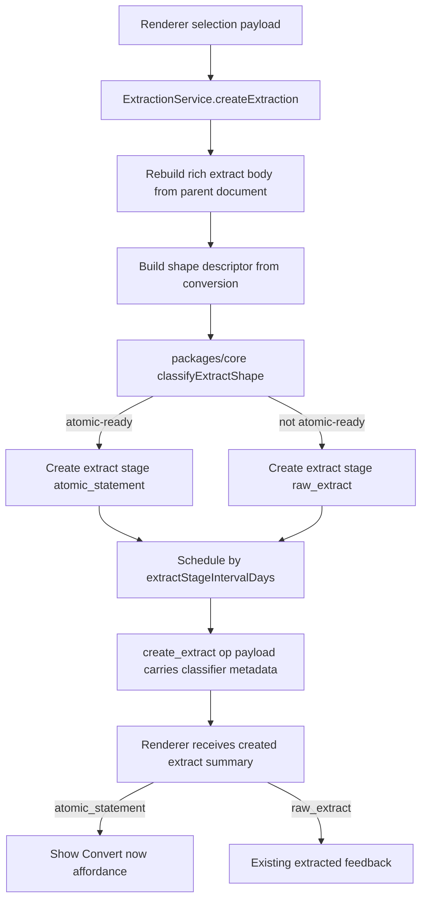

# feat: T122 shape-aware extract staging

## Summary

T122 makes text extraction choose the correct first distillation rung at birth: conservative one-line facts can start as `atomic_statement`, while anything not confidently atomic stays `raw_extract`. The decision remains deterministic and main-side, and users keep a fast correction path through the existing op-logged stage transition command.

---

## Problem Frame

Today every text extract is born `raw_extract`, even when the selection is already a single self-contained card-ready statement. That forces simple captures through extra scheduled touches before card creation, increasing extract backlog pressure that M25 is trying to reduce. False positives are still worse than false negatives, so the plan favors a conservative classifier and manual correction over aggressive automation.

---

## Requirements

- R1. Text extraction classifies the reconstructed extract body as either `atomic_ready` or `not_atomic_ready` using deterministic pure domain logic.
- R2. Atomic-ready text extracts are born as `atomic_statement`, are attention-scheduled with existing atomic-stage due semantics, and remain non-FSRS until a user creates a card.
- R3. Prose, ambiguous selections, multi-block paragraphs, lists, dangling-pronoun fragments, and malformed or sparse inputs stay on the existing `raw_extract` path.
- R4. Birth-stage decisions are audit-visible in existing operation-log facts without adding a new operation type.
- R5. Users can correct false positives and false negatives through the existing `extracts.updateStage` command, with rescheduling and operation-log writes preserved.
- R6. Atomic-born extracts surface a same-session convert-now affordance while preserving manual conversion for non-atomic extracts.
- R7. Existing source lineage, rich extraction body reconstruction, source-location anchors, block IDs, tags, priority inheritance, and renderer boundary rules remain intact.

---

## Key Technical Decisions

- **Classifier lives in `packages/core`:** The shape heuristic is pure domain logic with no React, SQLite, Electron, AI, embeddings, or async dependencies, so every extraction caller gets the same result.
- **Classify reconstructed shape, not renderer text:** `ExtractionService.createExtraction()` should classify a structured shape descriptor derived from the reconstructed body, with `conversion.plainText` as one input. Renderer `selectedText` is not authoritative because rich selections preserve paragraphs, lists, code blocks, images, and math nodes only after main-side reconstruction.
- **Only two birth outcomes:** T122 chooses `atomic_statement` or `raw_extract`; it does not birth `clean_extract`. Ambiguous material stays raw and can be promoted manually.
- **Schedule by the chosen stage:** Initial scheduling should use `extractStageIntervalDays(birthStage, priority)` instead of the raw-only helper so atomic-born extracts get the existing +1 day attention fallback.
- **Audit via existing `create_extract` payload:** Add classifier result metadata to the existing `create_extract` operation payload rather than introducing a new op type or separate write.
- **Convert now is an affordance, not a gate:** Non-atomic extracts can still open the card builder manually; atomic-born extracts get a stronger prompt to continue immediately.
- **Media fragments stay conservative:** PDF region and media clip `media_fragment` creation paths continue to default to `raw_extract`; T122 focuses on text extracts selected from source or extract bodies.

---

## High-Level Technical Design

---

## Scope Boundaries

- No AI or model calls participate in the birth-stage decision.
- No hard block is added to prevent card creation from `raw_extract` or `clean_extract`.
- No new operation-log type, database table, or renderer-provided stage field is introduced.
- No broad redesign of `/convert`; same-session conversion can route through the existing extract/card-builder flow.
- No behavior change is planned for image-region or media-clip `media_fragment` creation.

---

## Assumptions

- The convert-now route can be represented as a small navigation intent or query flag that opens the existing `CardBuilder` in `ExtractView`.
- Existing stage steppers count as mouse correction, but T122's "one keystroke" bar should add keyboard shortcuts where the extract workspace is active.
- Conservative punctuationless one-liners may classify as atomic only when they have enough word count and no fragment or pronoun-dangling signals.
- Initial classifier thresholds should be explicit and test-backed: prefer atomic only for 4-40 words, <=280 normalized characters, one sentence or one self-contained formula, one paragraph/block, no list/code/media structural flags, and no dangling-pronoun or title-fragment signal.

---

## Implementation Units

### U1. Add the pure extract-shape classifier

- **Goal:** Add a deterministic classifier that returns `atomic_statement` only for conservative, self-contained one-line facts and otherwise returns `raw_extract`.
- **Requirements:** R1, R3.
- **Dependencies:** None.
- **Files:** Create `packages/core/src/extract-shape.ts`; create `packages/core/src/extract-shape.test.ts`; modify `packages/core/src/index.ts`.
- **Approach:** Accept a closed input shape with normalized plain text plus paragraph count, block count, block types, list/code/math/media flags, and fallback status. Return a closed result with version, stage, `atomic_ready` / `not_atomic_ready` label, reason codes, input stats, and a normalized-input hash suitable for operation-log payloads. Treat multiple paragraphs, list markers, long selections, very short title-like fragments, code blocks, malformed formulas, formulas lacking context, and pronoun-dangling starts as raw; allow simple self-contained formulas as atomic.
- **Patterns to follow:** `packages/core/src/card-quality.ts`; `packages/core/src/contradiction.ts`; `packages/core/src/settings.ts`.
- **Test scenarios:** Definitions, single factual sentences, and simple self-contained formulas classify atomic; multi-sentence selections classify raw; multi-paragraph or multi-block text classifies raw; bullet/list/code/media selections classify raw even when flattened text is one line; dangling-pronoun starts classify raw; abbreviations and decimals do not accidentally split a single sentence; malformed formulas and contextless snippets stay raw.
- **Verification:** Core exports expose the classifier, and table tests document both positive and conservative-negative cases.

### U2. Apply birth-stage classification in text extraction

- **Goal:** Use the classifier in the trusted text extraction path so newly created text extracts are born at the selected stage and scheduled by that stage.
- **Requirements:** R2, R3, R4, R7.
- **Dependencies:** U1.
- **Files:** Modify `packages/local-db/src/extraction-service.ts`; modify `packages/local-db/src/source-repository.ts`; modify `packages/local-db/src/extraction-service.test.ts`.
- **Approach:** Build the classifier input after rich reconstruction from `conversion.plainText`, `conversion.blocks`, reconstructed document shape, and whether rich reconstruction fell back. Pass the chosen stage into `createExtractWithin`, schedule via `extractStageIntervalDays(stage, priority)`, and add classifier metadata to the existing `create_extract` op payload. If `richSelectionToProseMirrorDoc` returns `null` for a ranged rich selection, keep the extract raw and log a reason such as `rich_reconstruction_failed`. Keep region and clip creation raw.
- **Patterns to follow:** `packages/local-db/src/extraction-service.ts`; `packages/local-db/src/extract-service.ts`; `docs/solutions/logic-errors/rich-extractions-preserve-paragraphs-and-images.md`.
- **Test scenarios:** One atomic sentence creates an `atomic_statement` extract with a +1 day attention due date and no `review_states` row; prose extraction remains `raw_extract` with priority-based raw interval; sub-extraction uses the same classification; rich list/code/multi-block selections stay raw based on structural metadata; rich reconstruction fallback stays raw; `create_extract` payload includes version, normalized-input hash, word/char/block counts, structural flags, chosen stage, label, and reason codes without storing full duplicate body text; media region and clip creation still create raw-stage `media_fragment` rows.
- **Verification:** Existing extraction atomicity, lineage, tags, document marks, and block-processing assertions remain green while new birth-stage cases pass.

### U3. Surface convert-now after atomic text extraction

- **Goal:** Give atomic-born extracts a same-session path into the existing card builder without creating cards automatically.
- **Requirements:** R6, R7.
- **Dependencies:** U2.
- **Files:** Modify `apps/web/src/pages/source/SourceReader.tsx`; modify `apps/web/src/pages/queue/ProcessQueue.tsx`; modify `apps/web/src/reader/ExtractView.tsx`; modify relevant tests near `apps/web/src/pages/source/`, `apps/web/src/pages/queue/`, and `apps/web/src/reader/ExtractView.test.tsx`.
- **Approach:** Inventory every renderer `createExtraction` call site and either add the atomic convert-now affordance or document it as an exempt non-text/media path. For text selection callers, use the `createExtraction` response to detect `atomic_statement`, show a non-blocking prompt with `Convert to card` and dismiss actions, and navigate to the new extract with a one-time `cardBuilder=qa` intent. Dismissal returns to normal extracted feedback, successful action opens the existing Q&A builder, and failed extract loads land in the existing recoverable error state. `ExtractView` consumes and clears/replaces the intent immediately after first use so back, reload, or direct entry do not reopen the builder.
- **Patterns to follow:** `apps/web/src/reader/ExtractView.tsx` builder state; `apps/web/src/components/Snackbar.tsx`; `apps/web/src/pages/convert/ConversionSession.tsx`.
- **Test scenarios:** Atomic extraction in `SourceReader` and `ProcessQueue` shows the convert-now prompt and opens the builder for the created extract; raw extraction only shows the existing extracted feedback; direct `/extract/$id` entry does not open the builder without intent; reload/back after intent consumption keeps the builder closed; prompt dismiss leaves the extract in the normal atomic view; card creation still goes through `cards.create`.
- **Verification:** The renderer never infers or persists the stage itself and never bypasses the typed bridge.

### U4. Add keyboard correction shortcuts in extract workspaces

- **Goal:** Make false-positive and false-negative stage correction reachable with one keystroke while preserving existing `extracts.updateStage` semantics.
- **Requirements:** R5.
- **Dependencies:** U2.
- **Files:** Modify `apps/web/src/reader/ExtractView.tsx`; modify `apps/web/src/reader/ExtractView.test.tsx`.
- **Approach:** Bind focused `ExtractView` shortcuts to explicit stage targets, avoiding text inputs, contentEditable edits, modifier chords, and IME composition. Use `A` to promote to `atomic_statement` and `R` to demote to `raw_extract`, with a visible hint near the stage control. Reuse `setStage` / `updateExtractStage` so the main process continues to log `update_element` and `reschedule_element`.
- **Patterns to follow:** Source and extract selection keyboard handlers in `apps/web/src/pages/source/SourceReader.tsx` and `apps/web/src/reader/ExtractView.tsx`.
- **Test scenarios:** `A` promotes raw/clean to atomic; `R` demotes atomic to raw; shortcuts do not fire while editing text fields, contentEditable body, builder controls, or composing; stage updates announce the resulting stage and refresh header chips and inspector.
- **Verification:** Existing click stepper behavior still works.

### U5. Cover the same-session card path end to end

- **Goal:** Prove T122's user-facing outcome: a one-line capture can become a card in one session without ladder ceremony.
- **Requirements:** R2, R6, R7.
- **Dependencies:** U1, U2, U3.
- **Files:** Modify `tests/electron/extraction.spec.ts` or create `tests/electron/shape-aware-extraction.spec.ts`; inspect related card-builder tests for reusable helpers.
- **Approach:** Drive the real Electron app: extract an atomic sentence, use convert-now, create a Q&A card, verify card lineage under the new extract, then restart and verify extract stage, card, and source location persist. Keep an additional prose extraction assertion so the old raw path remains covered.
- **Patterns to follow:** `tests/electron/extraction.spec.ts`; `tests/electron/cards.spec.ts`; `tests/electron/conversion-session.spec.ts`.
- **Test scenarios:** Atomic one-liner birth stage persists as `atomic_statement`; convert-now opens the builder; Q&A card appears under the extract with source lineage and review state; prose capture remains `raw_extract`; restart preserves all durable state.
- **Verification:** The focused Electron spec passes against a fresh seeded data dir.

---

## System-Wide Impact

Persistence changes are limited to the birth stage and first due date for text extracts; UI changes add a convert-now intent for atomic-born extracts and keyboard correction shortcuts on the existing extract workspace. Downstream queue, conversion-session, extract-aging, source-yield, and stagnation behavior should then consume the existing `stage` and `due_at` facts without special cases. The most important invariant is that classification cannot weaken lineage or move any persistence decision into the renderer.

---

## Risks & Dependencies

- **False atomic classification:** A conservative heuristic and one-keystroke demotion mitigate convert pressure on unprocessed prose.
- **Rich-body mismatch:** Classifying `conversion.plainText` avoids diverging from the persisted body, but tests must prove multi-block rich selections stay raw.
- **UI intent stickiness:** Builder-open navigation intent must be consumed once so reloads or direct links do not keep reopening the builder unexpectedly.
- **Audit drift:** Operation-log metadata should record version, normalized-input hash, stats, structural flags, chosen stage, label, and reason codes without storing full duplicate body text.
- **Accessibility drift:** Convert-now and shortcut interactions must use keyboard-reachable controls, clear accessible names, existing live-region/status feedback, builder focus transfer to the first meaningful control, and stage-change announcements.
- **Deferred queue shortcut parity:** ProcessQueue gets convert-now coverage because it creates text extracts, but keyboard stage-correction parity there is deferred unless a later task broadens correction shortcuts beyond `ExtractView`.

---

## Sources & Research

- `docs/tasks/M25-flow-control.md` defines T122's scope and conservative no-AI classifier requirement.
- `packages/local-db/src/extraction-service.ts` is the text extraction transaction boundary and currently hardcodes raw-stage creation.
- `packages/scheduler/src/attention-scheduler.ts` already owns `extractStageIntervalDays`, including atomic +1 day semantics.
- `apps/web/src/reader/ExtractView.tsx` already owns card-builder state and explicit stage correction through `extracts.updateStage`.
- `docs/solutions/logic-errors/rich-extractions-preserve-paragraphs-and-images.md` requires shape decisions to respect main-side rich document reconstruction.
- `docs/solutions/architecture-patterns/frozen-conversion-session-revalidation.md` and `docs/solutions/architecture-patterns/extract-card-ipc-invariant-test-hardening.md` reinforce fresh main-side validation, typed IPC, and lineage-preserving extract-to-card paths.
