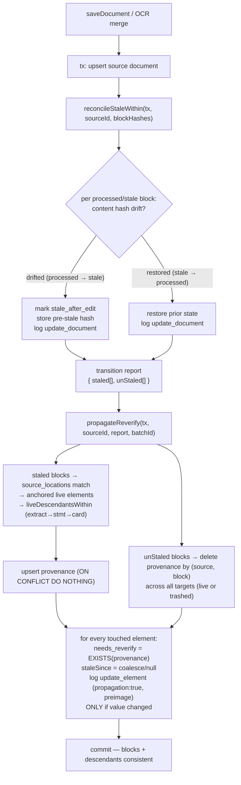

# feat: T123 — Stale propagation through the lineage DAG

## Summary

Lineage in Interleave points *backward* (card → statement → extract → source block) but never pushes change *forward*. When a source edit marks blocks `stale_after_edit`, the extracts/statements/cards derived from those blocks keep circulating with untouched schedules — a user who corrects an error then reviews the superseded fact for months while FSRS faithfully strengthens it.

T123 makes the dirty bit flow downstream. When block reconciliation marks source blocks `stale_after_edit`, the **same transaction** walks the live lineage DAG from each newly-stale block to its live derived artifacts and sets a queryable `needs_reverify` *content-staleness* flag on them. The flag is additive metadata — schedules, lineage anchors, and bodies are untouched (resolution is T124). Counts surface in source progress, the Done-intent breakdown, and inventory rows. Restoring a block's content (un-staling) clears exactly the derived flags that block caused.

This is **content** staleness, kept strictly distinct from T090's **calendar** staleness (`cards.valid_until`/`review_by`).

---

## Problem Frame

- **What is wrong today.** `BlockProcessingRepository.reconcileStaleWithin` writes `stale_after_edit` on a source block whose content hash drifted, but nothing propagates that to the derived extracts/statements/cards. The only card-level staleness is T090's *calendar* expiry. A corrected source silently leaves wrong knowledge in circulation.
- **What "done" looks like.** Editing a source flags exactly the affected **live** downstream artifacts, atomically (a crash never leaves blocks flagged but descendants clean), visibly in source progress and the Done-intent breakdown, reversibly when content is restored, idempotently on re-reconciliation.
- **Scope boundary.** T123 only *flags*. It never re-anchors, re-derives bodies, reschedules, or mutates lineage — that is T124 (re-verify workflow). It does not touch `cards.valid_until`/`review_by` or the topic-knowledge `needsReverify` (open-verification-task count) — those are T090/T092 surfaces.

---

## Requirements

Traced from `docs/tasks/M26-lineage-integrity.md` (T123 section) and the roadmap line.

- **R1 — Schema.** `needs_reverify` flag, `staleSince` timestamp, and source-block provenance on derived elements, via a Drizzle migration with CHECK/enum hygiene per the house pattern.
- **R2 — Same-transaction propagation.** Reconciliation walks live lineage from each newly-stale block (anchored extracts → their statements/cards) and flags them in the *same* transaction that writes `stale_after_edit`.
- **R3 — Idempotence.** Re-running reconciliation on an unchanged document (or with the same stale set) does not re-flag, duplicate provenance, or emit redundant op-log entries.
- **R4 — Reversibility (un-stale).** Restoring a block's content (hash returns to its pre-stale processed value) removes the provenance that block created and clears the derived `needs_reverify` flags it — and *only* it — caused.
- **R5 — Live-only.** Dead / soft-deleted lineage (extracts, statements, cards with `deletedAt`) is never flagged and never retains a flag.
- **R6 — Source-progress count.** A derived-output reverify count appears in the source processing summary.
- **R7 — Done-intent breakdown.** The breakdown shows a "… · N outputs need re-verify" segment.
- **R8 — Inventory rows.** A `needsReverify` signal appears on inventory/queue rows (`schedulerSignals`-adjacent, T113-style display).
- **R9 — Op-log + preimage.** Each derived-element flag change is op-logged in the same transaction with an undo preimage, sharing a per-reconciliation `batchId`.
- **R10 — Distinctness from T090.** The new content-staleness signal does not overload or collide with calendar-staleness fields or the topic-knowledge `needsReverify` count.
- **R11 — Restart-safe persistence.** Flags, `staleSince`, and provenance survive app restart.

---

## Key Technical Decisions

### KTD1 — The flag lives on the universal `elements` table

`needs_reverify` and `stale_since` are added to `elements` (`packages/db/src/schema/elements.ts`), not `cards`. The derived artifacts that can be flagged span three element shapes — top-level extracts, atomic-statement extracts (`stage: "atomic_statement"`), and cards — all of which are `elements` rows. This matches existing additive-flag precedents on `elements` (`extractFate`, `parkedAt`, `fallowUntil`/`fallowReason`/`fallowBatchId`, `attentionIntervalMultiplier`). The CHECK is type-coupled (`needs_reverify` may be true only when `type IN ('extract','card','media_fragment')`), mirroring `0032_extract_fates.sql`.

*Note:* a "statement" is not a distinct element type — it is an `extract` at `stage: "atomic_statement"`. The DAG is `extract → sub-extract(s) → card`, all via `parentId`. (see origin: `docs/tasks/M26-lineage-integrity.md`)

### KTD2 — Provenance is a dedicated side table; the flag is a self-healing projection

A new `element_reverify_provenance` table records *which source block caused each derived flag*: `(elementId, sourceElementId, stableBlockId, batchId, createdAt)` with a unique index on `(elementId, sourceElementId, stableBlockId)`. Rationale:

- **Many-to-many.** One derived element can be staled by several blocks (an extract spanning two edited blocks); one block stales many elements. A single column cannot represent this.
- **Precise clearing (R4).** `elements.needs_reverify` is true **iff** the element has ≥1 provenance row. Un-staling block B deletes B's provenance rows, then recomputes the flag — it clears only if no other block still stales the element.
- **Idempotence (R3).** The unique index + `ON CONFLICT DO NOTHING` makes re-propagation a no-op.
- **Migration safety.** A `CREATE TABLE` + additive `ADD COLUMN` avoids rebuilding `elements` — directly honoring the migration-0030 lineage-wipe incident (`docs/solutions/database-issues/sqlite-table-rebuild-with-foreign-keys-on-fires-on-delete-actions.md`). FK on `elementId`/`sourceElementId` uses `onDelete: "cascade"` so a **hard purge** of an element or source cleans its provenance.

**Soft-delete is NOT a cascade (R5 — corrected after doc review).** Soft delete sets `deletedAt`; the row persists, so FK cascade never fires. R5 ("dead/soft-deleted lineage never retains a flag") is therefore satisfied at the **read layer and the clear path**, not by cascade:

- **Reads are live-scoped.** The source-progress count (U5) counts only `distinct live elementId`; inventory/inspector signals (U7) are read only for live rows (trashed elements aren't in the queue). A soft-deleted element is never *counted* or *shown* as flagged.
- **Un-stale clears by block-key across all targets.** The un-stale branch deletes provenance by `(sourceElementId, stableBlockId)` for **every** target row — live or soft-deleted — so a block returning to its pre-stale content clears even a since-trashed element's provenance. This removes the "resurrects permanently flagged with no causing block" failure the adversarial review constructed.
- **Restore-while-still-stale is correct, not a bug.** If a flagged element is trashed and restored while its source block is *still* stale, it correctly returns flagged (it genuinely derives from still-drifted source). R5 governs the *dead* state only.

**The flag is a self-healing projection (corrected after doc review).** Rather than flipping `needs_reverify` only when a provenance row is "newly inserted" (which drifts if the column is ever cleared out of band), `propagateReverify` **recomputes** `needs_reverify = EXISTS(provenance for this element)` and `stale_since` for every element it touches. This makes the column literally a projection of provenance presence, idempotent and drift-proof. It is never written outside `propagateReverify` and the soft-delete path.

**Why keep the denormalized column at all (vs. deriving `EXISTS(provenance)` in every read):** U7's per-row inventory/inspector signal reads the flag once per visible row; a stored boolean is a single column read versus a correlated `EXISTS` subquery per row. The spec also mandates a `needs_reverify` field on derived elements. The count (U5) uses a live-join `GROUP BY` either way. Column kept; correctness guaranteed by the self-healing recompute above.

### KTD3 — Reconciliation reports transitions; propagation is a separate step composed in the same transaction

`reconcileStaleWithin` / `reconcileSourceDocumentWithin` change return type from `void` to a transition report — the set of blocks that **entered** `stale_after_edit` and the set that **left** it this run. A new propagation step consumes that report inside the same `tx`, after reconciliation, before commit. This composes at both reconciliation call sites — `DbService.saveDocument` and `OcrService` (OCR text merge) — so no caller is missed (R2).

### KTD4 — Un-stale recognition uses a dedicated `pre_stale_hash` column and a new reconcile loop arm (decided, not deferred)

Doc review (feasibility F1, adversarial F1, scope F1 — all ≥90 confidence) established that the current code makes restoration *impossible* without two concrete changes, and that the storage choice is **not** safe to defer:

1. **A dedicated `pre_stale_hash` column on `source_block_processing`** (added in U1). When a block transitions `processed → stale_after_edit`, the stale write currently overwrites `blockContentHash` with the *drifted* hash (`blockContentHash: nextHash ?? row.blockContentHash`) and replaces `metadata` wholesale — so the pre-stale hash is destroyed today. We must capture the pre-stale (last-processed) hash into a **new** column **once, on the `processed → stale` transition**, and never overwrite it while the row stays stale. Do **not** repurpose `blockContentHash` (the idempotence short-circuit and `hydrated_missing_hash` paths read it as *current*; making it polymorphic-by-state has high blast radius).

2. **A new un-stale loop arm.** The reconcile loop today `continue`s past any row already in `stale_after_edit` (it only processes `extracted`/`ignored`/`processed_without_output`/`needs_later`). The un-stale branch is therefore genuinely new code: iterate `stale_after_edit` rows; if the block's current content hash equals its stored `pre_stale_hash`, transition the row back to its `previousState` (recorded in metadata), clear `pre_stale_hash`, and emit the block id into `unStaled`.

**Restoration scope = restore the block's own processing state + clear derived flags.** Restoring the block row's processing state (stale → previousState) is the symmetric inverse of staling and is *required* for both idempotence (otherwise the block re-emits `unStaled` every pass or never leaves stale) and honest source-progress counts. This is distinct from T124 "resolution," which operates on the derived **elements** (confirm/rebase/detach), not on block processing state. (Scope review raised this at confidence 75; decision: in-scope, because a block whose content is byte-identical to its processed version genuinely *is* processed again, and leaving it stale-with-clean-descendants is the inverse of the inconsistency the milestone forbids.)

**Multi-generation restoration is out of T123 scope.** The hash is content-addressed (history-independent), so `A→B→A` and `A→B→C→A` both clear correctly (current hash == `pre_stale_hash` == A). But if the block's *processed* content advanced across generations (processed at A1, re-processed at A2, then drifted to X — `pre_stale_hash` = A2), restoring to the *older* A1 will not match and the flag will not auto-clear; that element requires T124 re-verify resolution. Documented + tested as intentional, not a bug.

**Invariant:** a block leaving `stale_after_edit` MUST appear in the transition report's `unStaled` set so propagation can clear its provenance.

### KTD5 — Reuse `update_element` as a non-invertible marker op; do not grow the op-type set

`OPERATION_TYPES` is closed (adding one is itself a migration and breaks undo/audit stability per `packages/core/CLAUDE.md`). Derived-element flag flips log `update_element` with payload `{ needsReverify, staleSince, prev: {needsReverify, staleSince}, batchId, propagation: true }`. Block-state changes continue to log `update_document` as today. The per-reconciliation `batchId` is minted once per propagation run via `newRowId()` (`packages/local-db/src/ids.ts`, `crypto.randomUUID()` — transaction-safe, no DB round-trip), threaded through every op.

**Global undo (⌘Z) must NOT invert these ops (corrected after doc review — adversarial F3).** `update_document` (the block-state + body edit) is deliberately non-invertible in the MVP (`undo-service.ts`). If the propagation `update_element` ops *were* globally invertible, a ⌘Z after a source edit would clear the derived flags while leaving the blocks stale and the body edited — re-creating the forbidden "blocks stale, descendants clean" inconsistency, inverted. Therefore the propagation ops carry a `propagation: true` marker and `UndoService` **skips** them (a new guard alongside the existing marker-op skips). The preimage (`prev`) is retained for **audit and for T124's resolution-undo**, not for global undo. The single clear path under T123 is **restoration-driven re-reconciliation** (edit the source block back to its pre-stale content → reconcile → un-stale → flags cleared). This resolves the tension the review flagged: preimages exist (R9 satisfied — op-logged, auditable, T124-undoable) *and* global-undo coherence is preserved.

### KTD6 — Counts ride existing payloads; no new IPC channel

The source-progress count widens the existing `SourceBlockProcessingSummary` / `BlockProcessingSummaryResult` payload (already plumbed through `blockProcessing.summary`). The Done-intent segment is derived renderer-side from that widened summary. The inventory `needsReverify` boolean widens the existing `QueueItemSummary.schedulerSignals` / inspector `SchedulerSignals` payloads on their existing channels. No new top-level IPC group is introduced (R6, R7, R8). Read tolerance (stable empty payload for a disappeared source) stays at the `DbService`/IPC adapter; the flag-setting mutation stays strict — splitting read-tolerance from write-strictness per `docs/solutions/runtime-errors/block-processing-stale-source-ids-zero-summary.md`.

### KTD7 — Traverse the immutable anchor, never the extract body's block ids

The block→derived walk starts from the staled source `stableBlockId`, finds `source_locations` rows whose `blockIds` JSON references it (matching `BlockProcessingRepository.listLiveOutputs`' parse-and-match), follows those anchored elements, then recurses transitively via `liveDescendantsWithin` (which walks `parentId`, skips `deletedAt`, is cycle-safe and chunked). Extract bodies carry **freshly minted** block ids disjoint from the source's — matching staleness via the extract body's own ids would be wrong (`docs/solutions/logic-errors/rich-extractions-preserve-paragraphs-and-images.md`). Anchors may be image-only / offsetless — match on `blockIds` membership, not text offsets.

---

## High-Level Technical Design

### Propagation data flow (rides the existing save/OCR transaction)



### Flag lifecycle (per derived element)

```mermaid
stateDiagram-v2
    [*] --> Clean: created from source block
    Clean --> NeedsReverify: ancestor block content drifts\n(provenance row added)
    NeedsReverify --> NeedsReverify: another ancestor block drifts\n(additional provenance row)
    NeedsReverify --> Clean: all causing blocks restored\n(provenance rows removed, flag recomputed)
    NeedsReverify --> Trashed: soft-deleted\n(row persists; live reads exclude it — R5)
    Trashed --> NeedsReverify: restored while source still stale
    Trashed --> Clean: restored after source un-staled\n(clear-by-block already removed provenance)
    note right of NeedsReverify
        needs_reverify = EXISTS(provenance) — self-healing projection
        soft-delete is NOT an FK cascade (rows persist)
        T124 resolution (confirm/rebase/detach) is OUT OF SCOPE here
    end note
```



---

## Output Structure

New files (everything else is a modification of an existing file):

```
packages/db/drizzle/
  0037_<reverify_flag_name>.sql            # additive migration
  meta/0037_snapshot.json                  # drizzle snapshot (generated)
packages/local-db/src/
  reverify-propagation-repository.ts       # block→descendant walk, provenance, flag flips, op-log
  reverify-propagation-repository.test.ts
packages/db/src/
  migration-0037-reverify-flag.test.ts     # column-value survival on seeded lineage
tests/electron/
  reverify-propagation.spec.ts             # edit source → card flagged → restart → restore → cleared
```

---

## Implementation Units

### U1. Schema and migration `0037` — `needs_reverify`, `stale_since`, provenance table

**Goal:** Add the durable storage for content-staleness flags and their provenance, with a migration that cannot wipe lineage.

**Requirements:** R1, R11.

**Dependencies:** none.

**Files:**
- `packages/db/src/schema/elements.ts` — add `needsReverify` (`integer mode:"boolean"`, notNull default false) and `staleSince` (`integer` timestamp, nullable) with a type-coupled CHECK (`check()` builder referencing `type IN ('extract','card','media_fragment')`), modeled on `extractFate` in `0032` and the `attentionIntervalMultiplier` CHECK builder in `0036`.
- `packages/db/src/schema/documents.ts` — add `preStaleHash` (`text`, nullable) to `sourceBlockProcessing` (the last-processed content hash, captured once on `processed → stale`; see KTD4). Also add the new `elementReverifyProvenance` table here (next to `sourceBlockProcessingOutputs`): `id`, `elementId` (FK → elements, cascade), `sourceElementId` (FK → elements, cascade), `stableBlockId` (text), `batchId` (text), `createdAt`; unique index on `(elementId, sourceElementId, stableBlockId)`; secondary indexes on `elementId` and `(sourceElementId, stableBlockId)` for the clear-by-block query.
- `packages/db/src/schema/index.ts` — barrel re-export (documents.ts already exported; no new module).
- `packages/db/drizzle/0037_*.sql` + `packages/db/drizzle/meta/_journal.json` + `meta/0037_snapshot.json` — generated via `pnpm db:generate`; verify journal `when` is strictly greater than HEAD (`0036`).
- `packages/db/src/migration-0037-reverify-flag.test.ts` — new.

**Approach:** Pure additive — `ALTER TABLE elements ADD COLUMN` (×2), `ALTER TABLE source_block_processing ADD COLUMN pre_stale_hash`, `CREATE TABLE element_reverify_provenance` + indexes. **No rebuild of `elements`, no widening of an existing CHECK on `elements`.** Doc review (adversarial attack #1) confirmed against both `0032_extract_fates.sql` and `0036_attention_interval_multiplier.sql` that drizzle-kit emits an additive `ALTER ... ADD COLUMN ... CHECK(...)` for this exact pattern — it does **not** trigger the SQLite 12-step rebuild that fired `ON DELETE SET NULL` and nulled lineage in the 0030 incident (that fired only because 0030 *widened an existing* CHECK). Do **not** hand-write `PRAGMA foreign_keys=OFF` in the migration file (no-op inside Drizzle's per-migration transaction) — the runner already disables FKs outside the transaction and runs `foreign_key_check` after.

**Patterns to follow:** `0032_extract_fates.sql` and `0036_attention_interval_multiplier.sql` (type-coupled column add via `check()` builder); `sourceBlockProcessingOutputs` in `documents.ts` (provenance side-table shape, unique-triple index).

**Naming note:** the SQL column is `needs_reverify` / `stale_since` / `pre_stale_hash`; Drizzle generates the camelCase TS accessors `needsReverify` / `staleSince` / `preStaleHash`. Use camelCase in TS code, snake_case only in raw SQL and migration fixtures.

**Test scenarios:**
- Fresh DB migrated to HEAD has `elements.needs_reverify` (default 0/false), `elements.stale_since` (null), and `element_reverify_provenance` with the unique index.
- *Lineage-survival (the 0030 guard):* seed a linked source→extract→card graph through the prior migration, migrate to `0037`, assert every preserved `elements` column value survives — `parentId`, `sourceId`, body, plus the new columns defaulting correctly. Covers the column-value-survival lesson, not just row counts.
- CHECK rejects `needs_reverify = true` on a `source`/`topic` element; accepts it on `extract`/`card`/`media_fragment`.
- `schema.alignment.test.ts` / `schema.roundtrip.test.ts` pass with the new columns/table.
- `journal-ordering.test.ts` passes (strictly-increasing `when`).

**Verification:** `pnpm db:generate` produces a clean additive diff; the migration and journal-ordering tests pass; `foreign_key_check` clean after migrate.

---

### U2. Core domain types — summary field, provenance/transition shapes

**Goal:** Give `packages/core` (persistence-agnostic) the vocabulary the propagation and read surfaces need, so DB and renderer share one definition.

**Requirements:** R6, R10.

**Dependencies:** none (parallel with U1).

**Files:**
- `packages/core/src/source.ts` — add `needsReverifyOutputs: number` to `SourceBlockProcessingSummary`.
- `packages/core/src/` (existing block-processing or lineage module) — export the transition-report type (`{ staled: BlockId[]; unStaled: BlockId[] }`) and a `ReverifyProvenance`/flag shape if a shared type helps the repository and contract agree.
- Relevant core unit test file for the summary shape.

**Approach:** Additive type fields only. The flag itself is a boolean — no new `ELEMENT_STATUSES` value and no lifecycle-status change (`needs_reverify` is additive metadata, like `isLeech`/`isRetired`, per `packages/core/CLAUDE.md`). Keep the content-staleness vocabulary distinct from T090's `fact-lifetime.ts` expiry types (R10).

**Patterns to follow:** how `extractFate`/aging fields were threaded through core types in T121/T122.

**Test scenarios:** type-level — a summary literal with `needsReverifyOutputs` typechecks; existing summary consumers still compile. `Test expectation: light` — mostly type surface; behavioral coverage lands in U3/U4.

**Verification:** `pnpm typecheck` clean across the workspace; downstream packages compile against the widened types.

---

### U3. Reconciliation reports stale/un-stale transitions (+ un-stale recognition)

**Goal:** Make the block-reconciliation path return *which blocks entered and left* `stale_after_edit` this run, and recognize restoration so a previously-stale block can transition back — the signal the propagation consumes.

**Requirements:** R2, R4 (block-level transition reporting + un-stale recognition). Block-state op-logging via `update_document` already exists and is unchanged; derived-element op-logging (R9) and derived-element idempotence (R3) land in U4.

**Dependencies:** U1 (the `pre_stale_hash` column), U2 (transition type).

**Files:**
- `packages/local-db/src/block-processing-repository.ts` — `reconcileStaleWithin` returns the transition report `{ staled: string[]; unStaled: string[] }`. On the `processed → stale` transition, capture the last-processed hash into the new `pre_stale_hash` column **once** (do not overwrite while the row stays stale; do not repurpose `blockContentHash`). Add the **new un-stale loop arm** over `stale_after_edit` rows (today's loop `continue`s past them): if the block's current hash equals `pre_stale_hash`, transition the row back to `previousState`, clear `pre_stale_hash`, log `update_document`, and emit into `unStaled`.
- `packages/local-db/src/block-processing-service.ts` — `reconcileSourceDocumentWithin` returns the report (propagate the new return type up).
- `packages/local-db/src/block-processing-service.test.ts` / `block-processing-repository.test.ts` — extend.

**Approach:** Keep the existing idempotence short-circuit (`row.blockContentHash === nextHash` → skip) for processed rows. The new un-stale arm must be equally idempotent — a block already restored (back in `previousState`, `pre_stale_hash` null) does not re-emit. The report is the only new output; it carries stable block ids, not element ids. `block_missing` blocks (deleted from the doc) are staled (`reason: "block_missing"`) and can never un-stale (their hash never returns) — correct; their descendants stay flagged until T124.

**Patterns to follow:** the existing `upsertStateWithin` + same-tx `OperationLogRepository.append` pattern; `metadata.previousState` already recorded on stale.

**Test scenarios:**
- Editing one block's text → that block id appears in `staled`, unchanged blocks do not.
- Re-running reconciliation on the same drifted doc → `staled` is empty (idempotent; block already stale).
- Restoring a block to its pre-stale content → that block id appears in `unStaled` and its `source_block_processing` row returns to its prior processed state.
- A block that disappears (deleted from the doc) → staled with `reason: "block_missing"`, not un-staled.
- `hydrated_missing_hash` path unaffected (no spurious staling).

**Verification:** `pnpm test` for the block-processing suites; transition report matches the documented truth table.

---

### U4. Lineage propagation — walk, provenance, flag flips, op-log (the core unit)

**Goal:** Consume the transition report inside the reconciliation transaction: flag live descendants of newly-stale blocks, clear flags for restored blocks, all op-logged and idempotent.

**Requirements:** R2, R3, R4, R5, R9.

**Dependencies:** U1, U2, U3.

**Files:**
- `packages/local-db/src/reverify-propagation-repository.ts` — **new.** `propagateReverify(tx, sourceElementId, report, batchId)`:
  - For each `staled` block: find live anchored elements via `source_locations` (`sourceElementId` + `blockIds` membership, `deletedAt IS NULL`) — reuse `listLiveOutputs`' defensive `JSON.parse(blockIds)` (try/catch → `[]`); for each anchored element, compute the affected set as the **union of the anchored element itself and `liveDescendantsWithin(tx, anchoredId)`** (the helper **excludes** the root — prepend it explicitly; the prepended root is the already-filtered live anchored element); upsert provenance `(elementId, sourceElementId, stableBlockId, batchId)` `ON CONFLICT DO NOTHING`.
  - For each `unStaled` block: delete provenance rows for `(sourceElementId, stableBlockId)` across **all** target elements (live or soft-deleted — KTD2 soft-delete handling).
  - **Then, for every element touched this run** (staled-side anchored/descendant set ∪ unStaled-side affected elements): recompute `needs_reverify = EXISTS(provenance for element)`; set `stale_since = coalesce(existing, now)` when becoming true, `null` when becoming false; stamp `updatedAt`; append a `update_element` op with preimage `{ needsReverify, staleSince, prev, batchId, propagation: true }` **only when the recomputed value differs from the current** (no-op when unchanged → idempotence R3). This recompute-from-provenance rule (not "flip only if newly inserted") makes the column a self-healing projection (KTD2).
- `packages/local-db/src/block-processing-service.ts` — call `propagateReverify` after `reconcileStaleWithin` within `reconcileSourceDocumentWithin`, threading a single `batchId` per run via `newRowId()`; only invoke when the report is non-empty (cheap-exit when nothing transitioned, reinforcing R3).
- `packages/local-db/src/undo-service.ts` — add a skip guard so `update_element` ops carrying `payload.propagation === true` are **not** inverted by global undo (KTD5).
- `packages/local-db/src/index.ts` — register the new repository in `Repositories` and construct it.
- `packages/local-db/src/reverify-propagation-repository.test.ts` — new.

**Approach:** Reuse `liveDescendantsWithin` (do **not** hand-roll a walk that forgets the `deletedAt` guard or cycle defense). The walk is **`parentId`-only** — `liveDescendantsWithin` has no `sourceId` branch; `sourceId` is the denormalized lineage *root* pointer, not a traversal edge (corrected after scope review). The DAG `extract (anchored) → statement (sub-extract, `parentId=extract`) → card (`parentId=extract`/`statement`)` is a `parentId` tree rooted at the anchored extract, so `parentId` DFS reaches all of it (feasibility review confirmed against `card-service`/`extraction-service` parenting). A soft-deleted *middle* node prunes its subtree from flagging — consistent with the canonical live-walk semantics the rest of the app uses. The flag column and provenance rows are written in lockstep within the same `tx` so the denormalized `needs_reverify` can never disagree with provenance presence.

**Patterns to follow:** `CardEditService.setLifetime` (mutate + preimage + `update_element` append); `BlockProcessingRepository.listLiveOutputs` (block→anchored-output via `source_locations`); `descendant-query.ts` `liveDescendantsWithin`; the same-transaction back-edge discipline in `docs/solutions/architecture-patterns/review-triggered-descendant-health-source-rescheduling.md` (the just-written reconciliation must be visible to the walk; a later failure rolls back both); lineage-aware-deletion doc for preimage symmetry + shared `batchId`.

**Test scenarios:** (note: "statement" S is an `extract` at `stage: "atomic_statement"` — there is no `statement` element type; all three of E/S/C are `type: 'extract'` or `'card'`.)
- *Happy path:* fixture source with block B anchoring extract E, E has child statement S, S has child card C (all live). Edit B → exactly E, S, C gain `needs_reverify = true`, `stale_since` set, one provenance row each, `update_element` op each, all sharing one `batchId`.
- *Live-only (R5):* soft-delete S before the edit → S and its descendant C are not flagged (S filtered, C unreachable via live walk); E is flagged. A soft-deleted E is never flagged.
- *Soft-delete then un-stale (R5, adversarial F2):* flag E (live) → soft-delete E → un-stale B → E's provenance row is deleted (clear-by-block removes dead targets too); E's column recomputes false; E is not counted/shown while dead.
- *Restore-while-stale (R5):* flag E → soft-delete E → (B still stale) → restore E → E is correctly still flagged (derives from still-stale source).
- *Idempotence (R3):* run reconciliation twice on the same drift → second run inserts no provenance, recomputes the same flag value, appends no op.
- *Self-heal (KTD2/adversarial F5):* with provenance present, force-clear `needs_reverify` out of band, then re-run propagation touching that element → flag recomputes back to true (column is a projection, not authoritative).
- *Multi-block (KTD2):* extract E anchored to blocks B1 and B2; edit both → one provenance row per block (2 rows) for E; un-stale B1 only → E stays flagged (B2 provenance remains); un-stale B2 → E clears.
- *Un-stale clears (R4):* edit B (flags E/S/C), then restore B → provenance for B removed, E/S/C clear `needs_reverify`, `stale_since` null, `update_element` ops with preimage and `propagation: true`.
- *Multi-generation (KTD4):* block processed at A1, re-processed at A2, drift to X (flags), restore to A1 (≠ `pre_stale_hash` A2) → does NOT auto-clear (intentional — T124 territory); restore to A2 → clears.
- *Undo coherence (adversarial F3):* edit source (flags E/S/C), then global ⌘Z → the `propagation: true` flag ops are skipped by `UndoService` (flags unchanged); block-state and flags stay in sync.
- *Malformed anchor (adversarial F6):* a stale block whose only `source_locations.blockIds` is unparseable → walk skips it (defensive parse → `[]`), no throw; document as the chosen behavior.
- *Disjoint sources:* editing source X's block does not flag descendants anchored only to source Y.
- *OCR caller:* an OCR merge that drifts a block flags descendants identically (integration with `OcrService` path).
- *Transaction atomicity:* inject a failure after flagging but before commit → no block stays stale with descendants clean (whole tx rolls back).
- *Invariant (coherence F6):* after any propagation, for every live element `needs_reverify === (provenance rows for element ≥ 1)`.

**Verification:** `pnpm test` for the propagation + block-processing suites; a flagged graph survives a simulated restart (reload repos, flags persist); idempotence, un-stale, soft-delete, undo-skip, and invariant assertions hold.

---

### U5. Read surface — source-progress reverify count

**Goal:** Expose the count of derived outputs needing re-verify in the source processing summary, end-to-end through IPC.

**Requirements:** R6, R10, plus read-tolerance per KTD6.

**Dependencies:** U1, U2, U4.

**Files:**
- `packages/local-db/src/block-processing-service.ts` — `getSourceProcessingSummary` computes `needsReverifyOutputs` via a new query: `COUNT(DISTINCT element_id)` over `element_reverify_provenance` joined to live `elements` (`deletedAt IS NULL`) `WHERE source_element_id = ?` (uses the `(sourceElementId, stableBlockId)` index). This is a genuinely new query, not a field already in `listBlockViews`.
- `apps/desktop/src/shared/contract.ts` — add `needsReverifyOutputs` to `SourceBlockProcessingSummaryPayload`; Zod schema if the payload is validated.
- `apps/desktop/src/main/db-service.ts` — `getBlockProcessingSummary` passes the field through; **also add `needsReverifyOutputs: 0` to the `emptyBlockProcessingSummary` literal** (the disappeared-source read-tolerance path) so the shape stays stable.
- `apps/desktop/src/shared/contract.test.ts`, `apps/desktop/src/main/db-service.test.ts` — extend.

**Approach:** Backend-owned count (renderer never recomputes). Distinct from block `stateCounts` — this is a live-scoped *output* count, not a block-state bucket (R10), and excludes soft-deleted targets (R5). Keep the field required in the contract so all producers/mocks opt in. *R6 spans two units: U2 defines the `needsReverifyOutputs` type on the summary shape; U5 implements the aggregation that populates it.*

**Patterns to follow:** existing `SourceBlockProcessingSummary` aggregation (`staleAfterEditBlocks`, `unresolvedBlocks`); `queue-eligibility-inventory-scheduler-state.md` (queryable signal as an explicit read-model field).

**Test scenarios:**
- Source with 3 flagged descendants → `needsReverifyOutputs === 3`.
- Distinctness: flagged descendants do not change the block `stateCounts` map.
- Disappeared/deleted source id → summary returns full shape with `needsReverifyOutputs: 0`, no throw (read tolerance).
- Restart-safe: count is correct after repos reload.

**Verification:** `pnpm test`; contract test confirms payload shape; `pnpm typecheck`.

---

### U6. Read surface — Done-intent breakdown segment

**Goal:** Surface "… · N outputs need re-verify" in the Done-intent breakdown.

**Requirements:** R7.

**Dependencies:** U5.

**Files:**
- `apps/web/src/pages/queue/doneIntentBreakdown.ts` — add a derived segment fed by `summary.needsReverifyOutputs` (a distinct addition from the block-state `describeUnresolved`, which is `stateCounts`-based). Add a `pluralizeOutputs` helper analogous to the existing `pluralizeBlocks`: `"1 output needs re-verify"` / `"N outputs need re-verify"` (count of 1 is common — a single card from a single edited block).
- `apps/web/src/components/queue/DoneIntentMenu.tsx` — render the new segment when count > 0; consume the widened summary.
- `apps/web/src/pages/queue/doneIntentBreakdown.test.ts`, `apps/web/src/components/queue/DoneIntentMenu.test.tsx` — extend.

**Approach:** Pure derivation in the testable helper; the component only renders. Backend owns the number (KTD6). No new mutation path — purely display. **Visual treatment:** the segment uses the **same neutral treatment** as existing breakdown segments (no icon, no warning color) — appropriate for a non-terminal advisory signal and consistent with the `stale_after_edit` block-state segment already shown in the same menu. (Design review flagged this as an unresolved fork; decision: neutral, to avoid alarm-fatigue on an advisory flag.)

**Patterns to follow:** `describeUnresolved` segment helpers, `NON_TERMINAL_LABELS`/`DISPLAY_ORDER`, `pluralizeBlocks`; `signal-hash-advisory-nudges.md` (backend-owned signal surfaced in DoneIntentMenu without a parallel surface).

**Test scenarios:**
- `needsReverifyOutputs: 4` → helper emits a "4 outputs need re-verify" segment with the right copy/order.
- `needsReverifyOutputs: 1` → "1 output needs re-verify" (singular).
- `needsReverifyOutputs: 0` → no segment (no empty noise).
- `DoneIntentMenu` renders the segment only when count > 0; neutral styling; light/dark token compliance.

**Verification:** `pnpm test` for the renderer helpers/components; visual check of the menu in `pnpm dev`.

---

### U7. Read surface — inventory / scheduler-signal `needsReverify`

**Goal:** A `needsReverify` boolean appears `schedulerSignals`-adjacent on inventory/queue rows (and inspector), for T113-style display.

**Requirements:** R8, R10.

**Dependencies:** U1, U4.

**Files:**
- `packages/local-db/src/queue-query.ts` — add `needsReverify` to `QueueSchedulerSignals` / `QueueItemSummary` (read `elements.needs_reverify`).
- `packages/local-db/src/inspector-query.ts` — add `needsReverify` to the per-element `SchedulerSignals` resolution.
- `apps/desktop/src/shared/contract.ts` — mirror on `QueueSchedulerSignals` and inspector `SchedulerSignals` payloads, with this exact inline disambiguating comment near each:
  ```
  // T123 content-staleness: this element's body may no longer match its edited source (resolve via T124).
  // NOT T090 calendar-staleness — KnowledgeStaleness.needsReverify is the topic-knowledge open-task COUNT.
  ```
- `apps/web/src/pages/queue/queueRow.tsx` — add a new exported `ReverifyChip` component, analogous to `ExtractAgeChip`.
- `apps/web/src/pages/queue/queue.css` — add a `.reverify-chip` class.
- Corresponding query + contract + component tests.

**Approach:** Widen existing payloads on existing channels (no new IPC group). Read straight off the denormalized `elements.needs_reverify` column (cheap, single-column read — see KTD2). **Chip shape (design review):** a fully **inert read-only `<span>`** — no `onClick`, no `role="button"`, no navigation (resolution is T124). It carries an informational tooltip/`title` such as *"Source content changed — re-verify this item (available in a future update)."* **Tokens/icon:** use `--warn-soft` background / `--warn` text + the `warning` icon (`TriangleAlert`, size 12), matching the advisory severity of `extract-age-chip--stale` — not `--danger` (would overstate a non-terminal advisory). **Zero-state:** render the chip/field only when `needsReverify: true` (queue rows and inspector both hide it when false, matching the inspector's boolean-signal convention).

**Patterns to follow:** `ExtractAgeChip` (inert `<span>` chip with `--warn` tokens + icon, T121); how `retirementSuggestion`/`extractAging` were added to `QueueSchedulerSignals` (T113/T121).

**Test scenarios:**
- A flagged element's queue/inspector row reports `needsReverify: true`; an unflagged element reports `false`.
- The signal does not collide with or overwrite the topic-knowledge `KnowledgeStaleness.needsReverify` count (different payload/surface).
- `ReverifyChip` renders for flagged rows, is hidden for unflagged rows, and is **inert** (no `role="button"`, no `onClick`); `--warn-soft`/`--warn` token compliance; light/dark.
- Inspector panel shows the field only when `needsReverify: true`; nothing rendered when false.

**Verification:** `pnpm test`; `pnpm typecheck`; visual check in `pnpm dev`.

---

### U8. End-to-end and integration coverage

**Goal:** Prove the whole loop in the real Electron app, restart-safe.

**Requirements:** R2, R4, R5, R7, R9, R11.

**Dependencies:** U1–U7.

**Files:**
- `tests/electron/reverify-propagation.spec.ts` — new, modeled on `tests/electron/extraction.spec.ts`.

**Approach:** Drive the app: import/seed a source, create an extract (and a card from it), edit the source block text, assert the derived card surfaces the `needs_reverify` flag and the source progress / Done-intent breakdown show the count; restart the app and assert the flag persists; restore the block text and assert the flag clears.

**Test scenarios:**
- *Covers R2/R7:* edit source text → derived card shows the flag; Done-intent breakdown shows "N outputs need re-verify".
- *Covers R11:* restart app → flag and count persist.
- *Covers R4:* restore the block text → flag and count clear after re-reconciliation.
- *Covers R5:* a soft-deleted descendant is absent from the flagged set / count.

**Verification:** `pnpm e2e tests/electron/reverify-propagation.spec.ts` green; the broader `extraction.spec.ts` still passes.

---

## Risks & Mitigations

- **Migration wipes lineage (critical, precedented).** Mitigated by KTD2's additive-only migration (no `elements` rebuild, no CHECK widening on existing columns) and U1's column-value-survival test on a seeded lineage graph. Do not hand-write FK pragmas in the migration.
- **Out-of-order journal silently skips on installed DBs.** Mitigated by verifying `0037`'s journal `when` is strictly greater than HEAD and letting `journal-ordering.test.ts` guard it; never raise a later entry — only the fresh-DB path would apply it.
- **Denormalized flag drifts from provenance (adversarial F5).** Mitigated by the self-healing recompute (KTD2): `propagateReverify` sets `needs_reverify = EXISTS(provenance)` for every touched element rather than gating on "newly inserted"; the flag is never written outside `propagateReverify` and the soft-delete path.
- **R5 false on soft-delete (adversarial F2).** FK cascade fires only on hard purge, not soft delete. Mitigated by clear-by-block over all targets (un-stale removes provenance for dead targets too), live-scoped counts/signals, and tests for the trash→restore paths. Documented in KTD2.
- **⌘Z half-clears flags, desyncing from non-invertible block state (adversarial F3).** Mitigated by marking propagation `update_element` ops `propagation: true` and skipping them in `UndoService` (KTD5); the clear path is re-reconciliation, tested in U4.
- **Un-stale can't recognize multi-generation processed content (adversarial F4).** Out of T123 scope by decision (KTD4); such elements resolve via T124. Documented + tested as intentional.
- **Large reimports flag many artifacts at once.** This is correct behavior (the per-session cap is T124's concern). T123 only makes the counts honest; the descendant walk's `IN`-chunking handles large fan-out (already in `liveDescendantsWithin`).
- **Name collision with T090's `needsReverify`.** Mitigated by KTD6/R10 — different payload shapes/surfaces, documented inline with the exact comment in U7; T123 never touches `cards.valid_until`/`review_by` or `topic-knowledge-state-query.ts`.
- **Missed reconciliation caller.** Both `DbService.saveDocument` and `OcrService` are covered by composing propagation inside `reconcileSourceDocumentWithin` (KTD3); U4 tests the OCR path explicitly.
- **Silent empty walk on degraded `blockIds` (adversarial F6).** A stale block whose `source_locations.blockIds` is unparseable produces no flagged descendants (defensive parse → `[]`). Accepted as the read-path-consistent behavior; documented + tested. The vault may carry degraded anchors from the 0030/0034 incident.

---

## Scope Boundaries

**In scope:** schema for the flag + provenance; same-transaction forward propagation with idempotence and un-stale clearing; live-only walk; counts in source progress, Done-intent breakdown, and inventory rows; op-log with preimage; e2e.

**Out of scope (T124 — Re-verify workflow):** confirm / rebase / detach resolution; per-source batching UI; session caps; anchor re-resolution and extract-body re-derivation; the maintenance-hub re-verify surface.

**Out of scope (T125):** card-edit write barrier / re-stabilization.

### Deferred to follow-up work
- A DoneIntentMenu dismissible "re-verify?" nudge keyed to a content signal hash (per `signal-hash-advisory-nudges.md`) — only if product wants a prompt; T123 ships the count, not a nudge.
- Surfacing the flag on the source-reader block rail (T131 territory).

---

## Verification Strategy (Definition of Done)

1. `pnpm lint`
2. `pnpm typecheck`
3. `pnpm test`
4. `pnpm e2e tests/electron/reverify-propagation.spec.ts` (+ `extraction.spec.ts` regression)
5. Persistence proof: flags/provenance survive restart; propagation is transactional (block + descendant flags commit/rollback together); FKs enforced (`foreign_key_check` clean post-migrate); lineage anchors never mutated; `operation_log` entries written for every flag change.
6. Roadmap (`docs/roadmap.md` T123 line) and task doc (`docs/tasks/M26-lineage-integrity.md` T123 status) updated with the landing commit.

---

## Sources & Research

- Origin spec: `docs/tasks/M26-lineage-integrity.md` (T123).
- `docs/solutions/architecture-patterns/durable-source-block-processing-state.md` — `stale_after_edit` semantics; reconcile-by-hash; non-terminal advisory state; gate counts in the domain service.
- `docs/solutions/logic-errors/rich-extractions-preserve-paragraphs-and-images.md` — immutable anchors vs reminted extract-body ids; walk via the anchor.
- `docs/solutions/database-issues/sqlite-table-rebuild-with-foreign-keys-on-fires-on-delete-actions.md` — the 0030 lineage-wipe; additive-only migration; column-value survival test.
- `docs/solutions/database-issues/drizzle-migrator-high-water-mark-skips-out-of-order-migrations.md` — journal `when` strictly increasing.
- `docs/solutions/architecture-patterns/lineage-aware-deletion-tombstone-purge-guard.md` — live-only walk; preimage symmetry; shared `batchId`; no new op type.
- `docs/solutions/logic-errors/queue-eligibility-inventory-scheduler-state.md` — queryable signal as explicit read-model field; keep distinct from scheduler/calendar state.
- `docs/solutions/runtime-errors/block-processing-stale-source-ids-zero-summary.md` — read tolerance vs write strictness.
- `docs/solutions/design-patterns/signal-hash-advisory-nudges.md` — backend-owned signal in DoneIntentMenu.
- `docs/solutions/architecture-patterns/review-triggered-descendant-health-source-rescheduling.md` — same-transaction back-edge discipline (closest structural analogue; note direction is inverse — T123 is downward).
