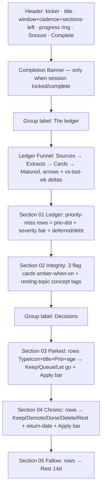

# feat: Redesign the Weekly Review page to the Claude Design handoff

## Summary

Rebuild the Weekly Review surface (`apps/web/src/weekly/WeeklyReviewScreen.tsx` + `weekly-review.css`) to match a Claude Design handoff mock, which was authored directly against Interleave's own token vocabulary. The redesign is **presentational**: it preserves every existing behavior, mutation call, `data-testid`, and button label, and keeps all domain logic behind the existing `window.appApi` bridge. It replaces the current bespoke, hardcoded-hex styling with a token-only stylesheet that themes correctly in light and dark, and reuses the shared inspector primitives (`TypeIcon`, `ConceptTag`, `Prio`) plus the global `Icon`.

The mock is faithful to the real data contract with three exceptions: week-over-week funnel deltas, and `author`/`concept` tags on decision rows. Deltas are **earned** (a bounded prior-window count added to the ledger query) rather than faked; `author`/`concept` degrade gracefully (rows render correctly without them) and their backend enrichment is deferred.

---

## Problem Frame

The shipped Weekly Review page is functionally complete (ledger, integrity flags, three forced-decision sections, Skip/Done, Complete/Snooze) but visually unfinished:

- Its CSS uses **hardcoded hex fallbacks** inside token references (`var(--text, #eef2f7)`, `var(--bg, #0c1118)`, `var(--panel, #121a24)`, `var(--muted, #9aa6b2)`). Those literal fallbacks bypass the OKLCH light+dark theming the design system mandates and will not flip with the theme. Several referenced tokens (`--bg`, `--panel`, `--muted`) are not even the repo's canonical token names.
- The layout is a flat stack of generic metric cards and rows. It does not express the "ledger funnel," the priority-miss severity bars, the integrity flag cards, the numbered/iconified section frames, the progress ring, or the completion banner that the design calls for.

The design handoff resolves all of this and — crucially — was mocked using the repo's exact token names (`--surface`, `--ok`, `--el-source`, `--prio-a`, etc.), so the visual upgrade is largely a token-correct CSS port plus a markup rebuild, not a redesign from first principles.

**North-star fit:** The Weekly Review is the system-owned weekly ritual where the user reconciles what slipped (priority misses, postpone debt) and resolves parked/chronic/fallow items through reversible domain commands. The redesign must keep it a *structured ritual that resolves things*, not a static dashboard — and must not let any renderer read trigger session creation or reimplement decision mutations (see origin learning: `docs/solutions/architecture-patterns/system-owned-recurring-tasks.md`).

---

## Scope Boundaries

### In scope

- Full visual rebuild of the weekly review content column (`.wk` surface) to match the mock: header with kicker/title/window+cadence+sections-left, progress ring chip, Snooze/Complete; "The ledger" and "Decisions" group labels; ledger funnel (Sources → Extracts → Cards → Matured) with arrows and week-over-week deltas; five numbered section frames (icon chip, title, state pill, sub-label, Skip/Done, left accent bar for done/skipped); priority-miss rows (priority dot + severity bar + deferred/debt); integrity flag cards (amber when active) with resting-topic titles as concept tags; Parked/Chronic/Fallow decision rows (TypeIcon + Prio + meta + per-row segmented control + apply bar + fallow return-date); completion banner; calm-week empty states.
- A token-only `weekly-review.css` (no hardcoded hex), themed in light and dark, porting the supporting kit classes from `design/kit/styles/app.css` and the `.wk-*` layer from the mock's `weekly/weekly.css`.
- A bounded backend extension: prior-window counts in the ledger query so the funnel deltas are real.
- Preserve all behaviors and the test contract; update/extend component tests; add a CSS-contract test.

### Deferred to Follow-Up Work

- **`author` / `concept` enrichment on parked & chronic rows.** Neither `MaintenanceRef` nor the parked/chronic row summaries carry author or concept membership; surfacing them requires enriching the maintenance reads in `packages/local-db` (concept-membership join + source-author lookup). Disproportionate to a design pass; rows render cleanly without them. Track separately.
- **Wiring the shell inspector right-rail** to show the `weekly_review` task / selected-row detail. The mock shows the task inspector, but the shell already mounts a selection-driven `<Inspector/>` that the weekly screen never feeds; wiring it is a separate feature.
- **localStorage progress, undo-snackbar, and "Reopen" lifecycle flourishes** from the mock. The real session uses server-persisted progress and reversible commands; we keep those and do not introduce a client-only lifecycle or a reopen API that the backend does not support.

### Out of scope (non-goals)

- Changing weekly-session lifecycle semantics, scheduling, or any decision-command behavior.
- Adding the weekly screen to the sidebar nav (it remains reachable via ⌘K, unchanged).
- Touching `design/kit/` (immutable) or any other screen's CSS.

---

## Requirements

- **R1.** The weekly review surface matches the design mock's structure and visual treatment (funnel, misses bars, integrity flag cards, numbered section frames, progress ring, completion banner, empty states).
- **R2.** All styling derives from `design/tokens.css` tokens — zero hardcoded color hex — and renders correctly in both `data-theme="dark"` and light.
- **R3.** Every existing behavior is preserved: load/error states, per-section Skip/Done (server-persisted progress), Parked Keep/Queue/Let go + Apply, Chronic Keep/Demote/Done/Delete/(Rest for topics) + return-date + Apply, Fallow rest, Complete, Snooze.
- **R4.** All mutations continue to route through `window.appApi` (`getWeeklyReviewSummary`, `updateWeeklyReviewProgress`, `maintenance.parkedResurfacingApply`, `maintenance.chronicPostponesApply`, `completeWeeklyReview`, `dismissWeeklyReview`). No new mutation paths; no domain logic in the component.
- **R5.** The existing test contract is preserved: root `data-testid="weekly-review"`, error testids `weekly-error` / `weekly-action-error`, and the decision button labels the test keys on (`Queue`, `Demote`, `Apply parked decisions`, `Apply chronic decisions`).
- **R6.** Funnel week-over-week deltas reflect **real** prior-window counts, or are omitted — never fabricated. The renderer degrades gracefully when prior-window values are absent.
- **R7.** The progress ring reflects the real server-persisted section progress (`summary.progress.sections`), not client-only state.

---

## Key Technical Decisions

- **KTD1 — Port, don't translate, the `.wk-*` layer.** The mock's `weekly/weekly.css` references only existing repo tokens. Lift it into `apps/web/src/weekly/weekly-review.css` adapted to repo conventions (the established per-screen porting pattern — see the `queue.css` header "Ported verbatim from the design kit's app.css"). This is the cheapest path to fidelity and guarantees theme-correctness.
- **KTD2 — Reuse inspector primitives for element vocabulary; port the small remainder.** Import `apps/web/src/components/inspector/inspector.css` and use `TypeIcon`, `ConceptTag`, `Prio` from `apps/web/src/components/inspector/primitives.tsx` (used by 20+ screens). These supply `.tico`, `.concept-tag`, `.badge`, `.prio`. Port only the genuinely missing classes — `.btn` family, `.prio-dot--{a,b,c,d}`, `.banner`/`--info`, `.dot-sep`, `.mono`, `.truncate` — from the immutable `design/kit/styles/app.css` into `weekly-review.css`. **Do not** rely on a global `app.css` (it doesn't exist) and **do not** use `Btn`/`Segmented` from `apps/web/src/help/primitives.tsx` for styling (their CSS is scoped under `.hc/.coach/.welcome/.tour-rail` and won't apply on `/weekly`). The page-local segmented control (`.wk-seg`, fully specified in the mock) stays page-local.
- **KTD3 — `Prio` is numeric.** The inspector `Prio` takes a numeric `priority`. Decision rows expose `element.priority` (number, on `MaintenanceRef`) alongside `element.priorityLabel` (string). Pass the numeric `element.priority` to `Prio`. For the priority-**miss** rows, the design uses `.prio-dot--{band}` keyed by the band letter — port `.prio-dot` and key it off `miss.band.toLowerCase()`.
- **KTD4 — Earned deltas.** Extend `WeeklyReviewQuery.ledger` to also count the *previous* window (symmetric to the existing current-window counts) and surface `sourcesPrev` / `extractsPrev` / `cardsPrev` / `maturedCardsPrev` through the local-db type → desktop contract → `appApi` `WeeklyReviewLedger`. The renderer reads these as optional and renders the "vs last wk" delta only when present, so U3 is runtime-independent of U2.
- **KTD5 — Faithful-to-real lifecycle.** Keep `complete()` / `dismiss()` calling the existing reversible commands and reloading. Render the completion banner from whatever completed/locked signal the real summary already exposes (verify at implementation time); do **not** invent a reopen endpoint or a localStorage lifecycle. If no explicit "locked" signal exists, the banner is driven by the post-complete reload state and the existing behavior is otherwise unchanged.
- **KTD6 — Graceful omission for unbacked decorative fields.** `author` and `concept` on parked/chronic rows are not in the contract; the row layout omits them when absent (no placeholder, no fabrication). Resting-topic **titles** (already in `integrity.resting[]`) are a free upgrade and *are* surfaced as concept-tag pills.

---

## High-Level Technical Design

Page composition (single scrolling content column inside the existing app shell `.shell-page`; the shell sidebar/topbar are unchanged and provided for free):

Each `Section` frame carries: number (`01`–`05`), icon chip, title + state pill (Pending/Done/Skipped), sub-label, Skip/Done actions, and a left accent bar (green when done, neutral when skipped, hidden when pending). Skip/Done write through `updateWeeklyReviewProgress`; the header progress ring is `done+skipped / 5` from server progress.

### Data-source mapping (decisive — what the mock invents vs. what the contract supplies)

| Mock field (data.js) | Real source | Action |
| --- | --- | --- |
| `ledger.sources/extracts/cards/matured` | `summary.ledger.sources/extracts/cards/maturedCards` | Use directly (`matured` → `maturedCards`). |
| `ledger.sourcesPrev/extractsPrev/cardsPrev/maturedPrev` | **Not present** | **U2** adds prior-window counts; render delta only when present. |
| `ledger.misses[].band/deferred/debtDays` | `ledger.priorityMisses[].band/deferred/postponeDebtDays` | Use directly (`debtDays` → `postponeDebtDays`). |
| `integrity.aDeferred` | `integrity.thresholdFlags.aBandDeferredRecently` | Use directly. |
| `integrity.debtHigh` | `integrity.thresholdFlags.postponeDebtHigh` | Use directly. |
| `integrity.resting[]` (names) | `integrity.resting[]` → each has `title`, `band`, `fallowUntil` | Surface `title` as concept-tag pills (upgrade over count-only). |
| parked `title/prio/ageDays/type` | `decisions.parked.rows[].element.title/priority(+Label)/.. ageDays/.. type` | Use directly; `Prio` gets numeric `element.priority`. |
| parked `author/concept` | **Not present** | Omit gracefully (deferred). |
| chronic `title/prio/postponed/type` | `decisions.chronic.rows[].element.title/priority/postponeCount/type` | Use directly. |
| chronic `concept` | **Not present** | Omit gracefully (deferred). |
| fallow `title/band/deferred` | `decisions.fallowSuggestions[].title/band/deferred` (+ `topicId`) | Use directly. |
| `window.start/end` | `summary.window.start/end` | Use directly. |
| `window.cadence` ("Weekly") | derive from `summary.cadenceDays` (7 → "Weekly") | Format client-side. |

---

## Implementation Units

### U1. Rewrite `weekly-review.css` as a token-only, themed stylesheet

**Goal:** Replace the hardcoded-hex stylesheet with a token-only one that renders the full `.wk-*` design layer and themes correctly in light + dark.

**Requirements:** R1, R2.

**Dependencies:** none.

**Files:**
- `apps/web/src/weekly/weekly-review.css` (rewrite)
- Read-only references: `design/kit/styles/app.css` (canonical `.btn`/`.badge`/`.prio-dot`/`.concept-tag`/`.banner`/`.dot-sep`/`.mono`/`.truncate` definitions), the mock's `weekly/weekly.css` (the `.wk-*` layer), `apps/web/src/pages/queue/queue.css` (porting-pattern precedent), `design/tokens.css` (token names).

**Approach:**
- Port the `.wk-*` layer (`.wk`, `.wk-head`, `.wk-kicker`, `.wk-title`, `.wk-window`, `.wk-prog*`, `.wk-group*`, `.wk-funnel`, `.wk-stage*`, `.wk-arrow`, `.wk-sec*`, `.wk-state*`, `.wk-misses`/`.wk-miss*`, `.wk-flags`/`.wk-flag*`, `.wk-decisions`/`.wk-decision*`, `.wk-seg`, `.wk-date`, `.wk-applybar*`, `.wk-empty*`, `.wk-complete`, `.wk-msg`, plus the `@media (max-width: 860px)` rules) using repo tokens verbatim.
- Port only the supporting kit classes the markup needs and that are not provided by `inspector.css`: the `.btn` family (`--primary/--ghost/--soft/--danger/--sm/--lg/--icon/--block`, `[disabled]`, `:focus-visible` → `var(--focus-ring)`), `.prio-dot` + `--a/b/c/d`, `.banner` + `--info`, `.dot-sep`, `.mono`, `.truncate`. Keep the page root class compatible with the shell (the screen paints inside `.shell-page`; the `.wk` max-width column centers within it).
- **No hardcoded color hex.** Every color/spacing/radius is a `var(--…)` token. Remove all `var(--x, #hex)` fallbacks and the non-canonical `--bg`/`--panel`/`--muted` references.

**Patterns to follow:** `apps/web/src/pages/queue/queue.css` (header comment documents the verbatim-port-from-kit convention and token-only rule).

**Test scenarios:** Covered by U5 (CSS-contract test). `Test expectation: none here — styling unit; behavior is asserted in U4 and contract in U5.`

**Verification:** The page renders with the new layout in dark and (toggling `data-theme`) light without color regressions; no literal hex remains in the file.

---

### U2. Add real prior-window counts to the ledger (earned funnel deltas)

**Goal:** Supply genuine week-over-week deltas by counting the previous window symmetrically to the current one.

**Requirements:** R6.

**Dependencies:** none (independent backend change).

**Files:**
- `packages/local-db/src/weekly-review-query.ts` (extend `ledger()` to compute prior-window counts)
- `packages/local-db/src/weekly-review-service.ts` (pass-through if it maps the shape)
- `packages/local-db/src/weekly-review-query.test.ts` (extend)
- `apps/desktop/src/shared/contract.ts` (extend the weekly summary / ledger type if it restates the shape)
- `apps/web/src/lib/appApi.ts` (`WeeklyReviewLedger`: add optional `sourcesPrev`, `extractsPrev`, `cardsPrev`, `maturedCardsPrev`)

**Approach:**
- Compute the immediately-preceding window of equal length (`window.start - window.days`) and count sources/extracts/cards/matured over it using the same predicates as the current-window counts. Surface them as the four `*Prev` fields. Keep them optional in the renderer-facing type so the renderer is runtime-independent of this unit.
- Follow the existing `operation_log`/read-model conventions — this is a pure read extension; it must not write or trigger session creation.

**Patterns to follow:** the existing current-window count logic in `WeeklyReviewQuery.ledger`; existing assertions in `weekly-review-query.test.ts`.

**Test scenarios:**
- Happy path: a window with known sources/extracts/cards/matured in both the current and prior windows returns the correct current values AND the correct `*Prev` values.
- Edge: an empty prior window returns `*Prev = 0` (not undefined/NaN).
- Edge: items exactly on the window boundary are attributed to exactly one window (no double counting between current and prior).
- Edge: a partial/short first window (no full prior window of data) returns `0` prior counts rather than erroring.

**Verification:** `pnpm test` for `packages/local-db` passes with the new prior-window assertions; `pnpm typecheck` clean across the contract → appApi type flow.

---

### U3. Rebuild `WeeklyReviewScreen.tsx` to the design markup

**Goal:** Render the full design structure while preserving every behavior, mutation call, testid, and decision button label.

**Requirements:** R1, R3, R4, R5, R6, R7.

**Dependencies:** U1 (styles), U2 (optional delta fields; renders gracefully without).

**Files:**
- `apps/web/src/weekly/WeeklyReviewScreen.tsx` (rebuild markup)
- Add imports: `import "../components/inspector/inspector.css";` and `TypeIcon`, `ConceptTag`, `Prio` from `../components/inspector/primitives`; keep `Icon` from `../components/Icon`.

**Approach:**
- **Header:** `.wk-head` with kicker "Weekly session", `<h1 class="wk-title">Ledger and integrity`, `.wk-window` showing `start – end` (mono) · cadence (from `cadenceDays`) · `${remaining} section(s) left`/`all reviewed`; `.wk-actions` with the `.wk-prog` ring chip (conic-gradient driven by real `done/total` from `summary.progress.sections`), a `.btn` Snooze (`Icon clock`), and a `.btn.btn--primary` Complete (`Icon check`).
- **Completion banner:** render `.wk-complete` with the ported `.banner.banner--info` when the session is locked/complete (per KTD5 — confirm the real signal at implementation time).
- **Ledger group + funnel:** `.wk-group` label "The ledger"; `LedgerFunnel` with four `.wk-stage--{source,extract,card,matured}` cells (icon + label + value + `Delta`) separated by `.wk-arrow` chevrons. `Delta` renders "±N vs last wk" only when the matching `*Prev` field is present.
- **Section frames:** a `Section` component (number, `.wk-sec__ico` Icon chip, title + `WkState` pill, sub-label, Skip/Done `.btn`s, `.wk-sec--done/--skipped` modifier classes). Skip toggles skipped↔pending; Done toggles done↔pending; both call `updateWeeklyReviewProgress` (preserve current gating on `summary.session`).
- **Ledger section body:** `.wk-misses` rows (`.prio-dot--{band}` + "Band {band}" + `.wk-miss__bar` width = `deferred/max` + "{deferred} deferred · {debt}d debt"), or the `emptyOk` empty state.
- **Integrity section body:** three `.wk-flag` cards (A-band deferred Yes/No, Postpone debt High/Normal, Resting topics count) with `.wk-flag--on` (amber) when the flag is active; the resting card lists `integrity.resting[].title` as `ConceptTag` pills.
- **Parked/Chronic/Fallow:** `.wk-decision` rows with `TypeIcon`, title (`.truncate`), `.wk-decision__meta` (`Prio` numeric + mono age/postpone-count; concept tag only if present), the page-local `.wk-seg` segmented control, and the `.wk-applybar` with a `.btn.btn--soft` Apply button. Preserve Chronic's `Rest` (topics only) + return-date input + validation, and the exact decision payloads. Fallow rows keep the "Rest 14d" action.
- Preserve `LoadState` (loading/error with `weekly-error`), `busySection` disabling, `actionError` (`weekly-action-error`), and the inline message.
- Preserve the **exact** button text the test keys on: `Queue`, `Demote`, `Apply parked decisions`, `Apply chronic decisions`; keep root `data-testid="weekly-review"`.

**Patterns to follow:** the mock's `weekly/screen.jsx` (structure, class names, props) translated to the repo's real data contract and TS types; `QueueScreen.tsx` for primitive imports and `inspector.css` usage.

**Test scenarios:** Covered by U4.

**Verification:** `pnpm typecheck` clean; the page renders all five sections, the funnel, integrity flags, progress ring, and empty states against live data; all decision flows still dispatch the same `appApi` calls.

---

### U4. Update and extend `WeeklyReviewScreen.test.tsx`

**Goal:** Keep the existing behavioral contract green and add coverage for the new states.

**Requirements:** R3, R5, R6, R7.

**Dependencies:** U3.

**Files:**
- `apps/web/src/weekly/WeeklyReviewScreen.test.tsx` (extend)

**Approach:** Keep the `vi.mock("../lib/appApi", { importActual })` shape and the existing `SUMMARY` fixture, extended with `*Prev` ledger values, a non-empty `integrity.resting` (with titles), and active threshold flags. Migrate any assertion whose visible text changed; preserve the testid + decision-label assertions verbatim.

**Test scenarios:**
- Preserve: clicking `Queue` then `Apply parked decisions` calls `parkedResurfacingApply` with `{ decisions: [{ id: "parked-1", kind: "queueNow" }] }` and marks the parked section done. (existing)
- Preserve: clicking `Demote` then `Apply chronic decisions` calls `chronicPostponesApply` with `{ decisions: [{ id: "chronic-1", kind: "demote" }] }` and marks chronic done. (existing)
- Funnel deltas: with `*Prev` present, the four stages render a "vs last wk" delta; with `*Prev` omitted, no delta text renders (graceful degradation).
- Progress ring: header shows `done/total` derived from `summary.progress.sections` (e.g., one section `done` → `1/5`).
- Integrity: an active `aBandDeferredRecently` / `postponeDebtHigh` renders the amber (`wk-flag--on`) card; resting topics render their `title`s as concept tags.
- Empty states: an all-empty summary (no misses, no parked/chronic/fallow) renders the calm-week `emptyOk` messages, and `weekly-review` still mounts.
- Error: a rejected `getWeeklyReviewSummary` renders `weekly-error`; a rejected decision apply renders `weekly-action-error`.

**Verification:** `pnpm test` for `apps/web` passes including the new cases.

---

### U5. Add a `weekly-review-css.test.ts` contract test

**Goal:** Pin the token-only + key-class contract for the rewritten stylesheet, matching the repo's CSS-contract-test precedent.

**Requirements:** R2.

**Dependencies:** U1.

**Files:**
- `apps/web/src/weekly/weekly-review-css.test.ts` (new)

**Approach:** Read `weekly-review.css` as text and assert the contract, mirroring `apps/web/src/pages/queue/queue-css.test.ts` / `apps/web/src/styles-css.test.ts`.

**Test scenarios:**
- No hardcoded color hex: the file contains no `#rrggbb`/`#rgb` literals (colors come from tokens). (This is the regression guard against the old `var(--x, #hex)` pattern.)
- Key structural classes are present: `.wk-funnel`, `.wk-sec`, `.wk-flag`, `.wk-decision`, `.wk-seg`, `.wk-prog`, `.banner`, `.btn`, `.prio-dot`.
- Theme-correctness proxy: color declarations reference `var(--…)` tokens (e.g., assert occurrences of `var(--` and absence of raw `rgb(`/`hsl(` literals for color).

**Verification:** `pnpm test` for `apps/web` includes the new contract test and it passes.

---

## Risks & Dependencies

- **Test-contract breakage (medium).** The redesign renames/moves markup. Mitigation: preserve `data-testid="weekly-review"`, `weekly-error`, `weekly-action-error`, and the four decision button labels verbatim; migrate only assertions whose visible text genuinely changed, in the same commit (origin learning: `folding-floating-diagnostics-into-settings-section.md`).
- **Cross-package type plumbing for deltas (low-medium).** The `*Prev` fields must flow local-db → `apps/desktop/src/shared/contract.ts` → `appApi`. Mitigation: keep the fields optional and the renderer runtime-independent (U3 works without U2), so a plumbing snag never blocks the design landing.
- **Completion/locked signal uncertainty (low).** The exact "session complete/locked" representation in the real summary must be confirmed at implementation time (KTD5). Mitigation: drive the banner from the existing post-complete reload state; do not invent an API.
- **Primitive coupling (low).** `Prio` is numeric and `inspector.css` must be imported for `.tico`/`.concept-tag`. Mitigation: explicit in U3; pass `element.priority` (number).
- **Definition of Done:** `pnpm lint`, `pnpm typecheck`, `pnpm test`, and a renderer smoke check that `/weekly` mounts. No persistence/migration risk (read-only ledger extension; no schema change).

---

## Sources & Research

- Design handoff bundle (origin): `Weekly Review.html`, `weekly/weekly.css`, `weekly/screen.jsx`, `weekly/data.js`, `assets/tokens.css`, `assets/components.jsx`, and `chats/chat1.md` (intent: "design the weekly review page, aligned with the rest of the design, reuse existing components, use best judgment"). Extracted from the handoff archive.
- Repo research (ce-repo-research-analyst): current screen/test contract, shell mounting, the absence of a global `app.css` / empty `packages/ui`, the real shared primitives in `apps/web/src/components/inspector/primitives.tsx` + `inspector.css`, the help-scoped `Btn`/`Segmented` caveat, the icon-name map (all 24 names map cleanly), and the decisive data-contract gap analysis.
- Institutional learnings (ce-learnings-researcher): `docs/solutions/architecture-patterns/system-owned-recurring-tasks.md` (keep the redesign presentational; decisions stay command-shaped), `design-patterns/folding-floating-diagnostics-into-settings-section.md` (preserve testids; reskin-under-test-contract), `design-patterns/three-zone-scroll-owned-review-card-surface.md` (kit→React port recipe; CSS-contract + geometry verification), `ui-bugs/renderer-button-cursor-baseline.md` (global cursor baseline; use `role="button"`+`aria-disabled` for non-native controls), `ui-bugs/source-reader-shared-text-measure.md` (token convention; document divergences in `docs/design-system.md`), `ui-bugs/balance-banner-queue-inbox-action-gating.md` (banner gating), `ui-bugs/hide-queue-route-shell-topbar.md` (route-scoped shell chrome). Present-state flag: the current `weekly-review.css` hardcoded-hex fallbacks bypass theming — drop them in this pass.
- Kit class confirmation: `design/kit/styles/app.css` defines `.btn`/`.badge`/`.prio-dot`/`.concept-tag`/`.banner`/`.dot-sep`/`.mono`/`.truncate` (token-based); `inspector.css` defines `.tico`/`.concept-tag`/`.badge`/`.prio`; 12 existing `*-css.test.ts` files establish the CSS-contract-test precedent.
