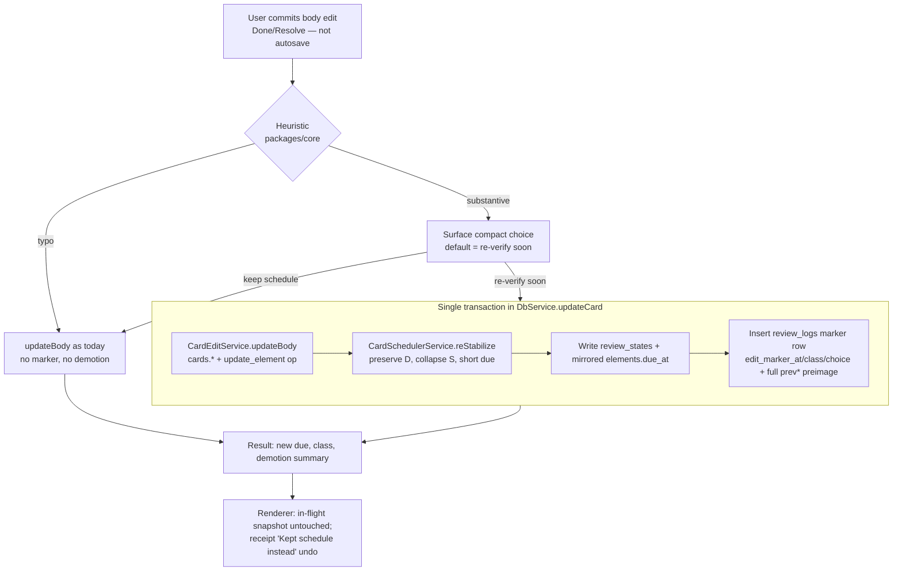

# feat: T125 — Card-edit write barrier

## Summary

When a user substantively rewrites a card body — most often through T085 leech remediation —
the card keeps the FSRS **stability** its *old* formulation earned. The rewritten card then
surfaces nine months later and fails as "user error". The M7 rule "an edit never touches
`review_states`" was written to protect *in-flight* session state, but it overshoots: it lets a
materially rewritten card inherit undeserved stability.

T125 adds a **write barrier** on card body edits:

1. A pure, table-tested **substantive-edit heuristic** in `packages/core` classifies each edit as
   `typo` or `substantive` by diffing the *answer-bearing* side.
2. Substantive edits surface a compact **keep-schedule vs re-stabilize** choice (defaulted by the
   heuristic, one keystroke to flip). Re-stabilize **demotes the persisted FSRS state** to a short
   confirmation interval — through the scheduler service, never raw field pokes — so the next
   encounter verifies the *new* formulation.
3. The demotion records an **edit marker** on `review_logs` (timestamp + class + choice) so the
   T080 FSRS optimizer **excludes pre-edit grades** for that card.
4. The demotion is **op-logged with a full FSRS preimage** and reversible under a current-state
   guard; **in-flight review state stays uncorrupted** (the demotion hits only the *persisted*
   state, never the in-session snapshot the user is grading).

This is the closing task of M26 (Lineage integrity). T124 explicitly pre-wired the seam: a
material card-body rewrite during a re-verify rebase can route through this re-stabilization gate.

---

## Problem Frame

**Today.** `CardEditService.updateBody` (`packages/local-db/src/card-edit-service.ts`) is the single
body-edit choke point. It updates `cards.{prompt,answer,cloze}`, stamps `elements.updatedAt`, and
appends an `update_element` op — and **deliberately never touches `review_states`,
`review_logs`, or lineage**. Three renderer callers reach it through the one `cards.update` IPC
surface: the T038 in-review repair bar (`apps/web/src/review/ReviewRepairBar.tsx`), the T085 leech
rewrite surface (`apps/web/src/maintenance/LeechRemediation.tsx`), and any other card-body editor —
all via `appApi.updateCard`.

**The gap.** FSRS stability is a memory-strength estimate for a *specific* prompt→answer mapping.
Rewrite the answer and the old stability no longer describes the new mapping, yet the card keeps
circulating on the old long interval (the only existing card staleness is T090's *calendar*
expiry, which is unrelated). FSRS faithfully strengthens a fact the user can no longer recall as
written. Worse, the pre-edit *grades* still feed T080 optimization, training the model on
answer-changed (contaminated) history.

**The refined invariant.** The M7 rule's real intent was: *an edit must never corrupt **in-flight**
review state.* It was over-applied to mean *an edit must never change scheduling at all.* T125
restores the intent: an edit never corrupts in-flight state; a **substantive** edit re-stabilizes
the **persisted** state through the scheduler service.

**External models.** Anki's analog of `forget()` is a full reset (discards difficulty too); its
"Set Due Date" is known to confuse FSRS. Neither matches "short interval, keep difficulty, no fake
grade" — which is exactly the mechanic T125 builds (see KTD-2).

---

## Requirements

Traced to the T125 spec in `docs/tasks/M26-lineage-integrity.md` (see origin).

- **R1** — A pure substantive-edit heuristic in `packages/core`: normalized diff on the
  answer-bearing side (answer text / cloze answers) above a threshold → `substantive`; prompt-only
  and small edits → `typo`. Table-tested. Gated strictly to active-recall cards.
- **R2** — On save: `typo`-class edits behave exactly as today; `substantive`-class edits surface a
  compact keep-schedule / re-verify-soon choice (default per heuristic, one keystroke to flip),
  applying the demotion **transactionally with the body edit**.
- **R3** — Demotion semantics: a documented short-interval re-stabilization, FSRS state adjusted
  **via the scheduler service** (not raw field pokes); full preimage logged.
- **R4** — Review-log linkage: an edit marker (timestamp + class + choice) lands on `review_logs`;
  the T080 optimizer input query excludes pre-edit grades for that card.
- **R5** — Every body-edit caller routes through the barrier — grep every body-edit path. (Grep
  confirms exactly two `appApi.updateCard` callers today: `apps/web/src/review/ReviewRepairBar.tsx`
  and `apps/web/src/maintenance/LeechRemediation.tsx`. There is no separate extract-workspace /
  inspector card-body editor — all card-body edits funnel through the one `cards.update` IPC
  surface — so wiring those two + the shared command path satisfies R5. Re-run the grep at
  implementation time to confirm no new caller appeared.)
- **R6** — In-flight review state stays uncorrupted: the demotion applies to the persisted state,
  never the in-session snapshot; a pending grade after a mid-review edit still validates and lands.
- **R7** — Undo restores the **exact** prior FSRS scheduling state (full tuple), under a
  current-state guard; one owning undo path (no dual-path desync).
- **R8** — Doc honesty: amend `docs/tasks/M7-fsrs-review.md` (and any doc repeating the rule) to the
  refined invariant. Update `docs/roadmap.md` and the task doc on completion.
- **R9** — The fabricated marker row must never be miscounted as a real review. **Every**
  `review_logs` reader (not just the T080 optimizer) excludes marker rows via `edit_marker_at IS
  NOT NULL` so streaks, retention, maturity, priority-servicing, source-yield, and time-cost
  numbers do not silently inflate when a card is re-stabilized.
- **Success criteria** — A substantive rewrite offers (and defaults sensibly to) re-stabilization; a
  typo edit changes nothing; review history carries the edit linkage and the optimizer excludes
  contaminated grades; undo restores the exact prior scheduling state. Standard gates pass;
  persistence survives restart.

---

## Key Technical Decisions

### KTD-1 — The substantive-edit heuristic is pure, in `packages/core`, and diffs the answer-bearing side

Mirror the existing card-quality / cloze pure modules (`packages/core/src/card-quality.ts`,
`packages/core/src/cloze.ts`) and their table tests. The classifier takes the card kind plus the
`before` and `after` body and returns `{ class: "typo" | "substantive", ... audit }`.

- **Q&A card** — answer-bearing side is the `answer`. Prompt-only changes are `typo` (per spec:
  "prompt-only and small edits → typo"). The answer changing beyond the threshold is `substantive`.
- **Cloze card** — answer-bearing side is the set of cloze deletion *answers* (the hidden spans),
  derived via the existing `cloze` parser. Editing surrounding context only → `typo`; adding,
  removing, or changing a deletion's answer text beyond threshold → `substantive`.
- **Normalization + threshold** — normalize (trim, collapse internal whitespace, case-fold) then
  apply a conservative normalized edit-distance ratio. Tiny fixes (a few characters / punctuation)
  stay `typo`; meaning-changing rewrites are `substantive`. The exact constant is documented inline
  with rationale and locked by table tests. **Conservative bias:** when genuinely ambiguous, prefer
  `typo` (a missed demotion is recoverable on the next real lapse; a spurious demotion annoys the
  user). The heuristic is **always user-overridable** (KTD-4).

Rationale: keeps domain logic out of React (`apps/web/CLAUDE.md`), keeps it deterministic and
table-tested, and isolates the one fuzzy judgment behind a pure boundary.

### KTD-2 — Demotion mechanic: preserve difficulty, collapse stability to a confirmation interval, log as a non-grade — **not** `forget()`

ts-fsrs `5.4.1` (implements FSRS-6) is pinned in `packages/scheduler`. Research against the
installed source settles the mechanic the spec asks us to "decide against ts-fsrs semantics and
document":

- **Reject `forget()`** — it sets `state=New`, `stability=0`, **`difficulty=0`**, `due=now`. It
  discards difficulty, which violates "the card is reformulated, not brand-new". `forget()` is the
  right primitive only for "different fact entirely", which is out of scope for an in-place edit.
- **Reject a fabricated grade** (`Again`/`Good`) — it would corrupt FSRS optimization as a false
  recall observation.
- **Chosen mechanic:** a new **pure** method on `CardSchedulerService`
  (`packages/scheduler/src/card-scheduler.ts`), e.g. `reStabilize(state, now)`, that produces a
  `ReviewOutcome`-shaped transition:
  - **Difficulty preserved**, `reps`/`lapses` preserved (lifetime stats honest).
  - **`lastReviewedAt` is NOT advanced** — the demotion is not a review event. Advancing it would
    make a subsequently-landing in-flight grade compute its `elapsedDays` from the demotion time
    instead of the genuine last review, corrupting the very grade R6 protects (see KTD-5).
  - **Stability collapsed** to a small value such that the resolved retention yields a short
    confirmation interval, and **`dueAt` set to a short confirmation interval** (a documented
    constant, e.g. ~1 day, honoring the card's resolved `maximumInterval`). Use the engine's
    `next_interval` / state primitives behind the adapter; **never import ts-fsrs outside the
    scheduler package**.
  - Semantically this is a `Relearning`-style "verify soon" transition. **Note on
    `Rating.Manual`:** ts-fsrs's own `forget()` records a `Rating.Manual` log, and FSRS *optimizers*
    drop `Manual` rows — but our persisted `review_logs.rating` CHECK domain is
    `REVIEW_RATINGS = ["again","hard","good","easy"]` (`packages/core/src/enums.ts`) with **no
    `Manual` value**, and KTD-3 forbids widening it. So the marker row stores a **placeholder
    CHECK-valid rating** whose value is semantically meaningless, and **every** consumer excludes it
    by `edit_marker_at IS NOT NULL` (R9), never by rating. Do not rely on a `Manual` rating reaching
    the column — it cannot.

The demotion **honors the card's resolved retention/params** by building the scheduler the same way
the live grade path does — `DbService.schedulerForCard(cardElementId)` resolves `desiredRetention`
(T079) and `params` (T080). The confirmation interval must be a *floor-style* demotion: if a card's
current due is already sooner than the confirmation interval, never push it *out* (demotion only
ever shortens).

**Card-state carve-outs (defined behavior, table-tested in U3/U4):**
- **New / never-reviewed** (`reps = 0`, `fsrsState = "new"`, no earned stability) — nothing to
  demote; treat as a typo-equivalent **no-op** (no demotion, no marker row, no op-log entry).
- **Suspended / retired** — still active-recall cards that keep a `review_states` row. Demote the
  **persisted** state as normal (it takes effect on un-suspend/un-retire); the demotion never
  un-suspends or un-retires the card. Document this so the floor demotion isn't mistaken for a
  resurrection.
- **Already due sooner than the confirmation interval** — `dueAt` is left where it is (floor-only),
  but stability is still collapsed so the *next* schedule after a pass doesn't rebound to the old
  long interval. The marker row is still written (the optimizer cut and the undo preimage both
  need it).

### KTD-3 — Edit marker is additive nullable columns on `review_logs`; the demotion writes one marker row

Per the review-analytics learning (`docs/solutions/architecture-patterns/review-analytics-data-capture-in-review-logs.md`),
the marker is **additive nullable columns on `review_logs`**, not a new table and not a new op type.
The re-stabilization writes **one `review_logs` row** that doubles as (a) the demotion record
(carrying the full `prev*` FSRS preimage for undo) and (b) the optimizer cut-point.

- New nullable columns (migration `0039`, hand-edited additive `ALTER TABLE ... ADD COLUMN` only):
  `edit_marker_at TEXT`, `edit_class TEXT` (CHECK in `typo`/`substantive` when non-null),
  `edit_choice TEXT` (CHECK in `keep`/`re_stabilize` when non-null). NULL = a normal grade row.
- **Marker rows are written only when re-stabilize is applied.** A `keep`-schedule choice on a
  substantive edit (and every `typo` edit) changes no scheduling and writes no marker — the old
  grades remain valid for the unchanged schedule.
- **Rating value for the marker row:** `REVIEW_RATINGS = ["again","hard","good","easy"]` has no
  non-grade value, and `prev_state`/`next_state` are CHECK-constrained to `FSRS_STATES`. **Do not
  widen any CHECK** — that forces a table rebuild and reopens the migration-0030 lineage-wipe
  hazard. The marker row therefore carries a **placeholder CHECK-valid `rating`** (e.g. `good`) and
  CHECK-valid `prev_state`/`next_state`; the value is semantically meaningless because **every**
  `review_logs` reader excludes marker rows by `edit_marker_at IS NOT NULL` (R9), never by rating.
  The marker row is indistinguishable from a real grade to any reader that does *not* apply that
  filter — which is exactly why R9 audits the full reader set, not just the optimizer.

Rationale: additive columns on `review_logs` are a proven safe pattern (migration `0028` added
`prompt_ms`/`prev_due_at`/`next_reps` the same way); the closed 15-op `operation_log` union and the
`review_logs.rating` CHECK both stay untouched.

### KTD-4 — One owning undo path: receipt-scoped restore of the full FSRS preimage, guarded; global ⌘Z defers

The re-stabilization is a **compound** mutation (body text + FSRS demotion + marker row). T123/T124
established the rule (`docs/solutions/architecture-patterns/detach-tombstone-receipt-only-undo-and-per-triple-fingerprint-for-flag-resolution.md`):
a compound mutation must have **exactly one** undo owner, or the FSRS state and the marker drift.

- The **demotion** is the undoable unit. Undo restores the **full prior `review_states` tuple**
  (due, stability, difficulty, elapsedDays, scheduledDays, reps, lapses, fsrsState, learningSteps,
  lastReviewedAt) **and both stores** (`review_states.due_at` *and* the mirrored `elements.due_at`),
  matching the queue-eligibility two-store inverse
  (`docs/solutions/logic-errors/queue-eligibility-inventory-scheduler-state.md`), **and clears the
  marker** (so the optimizer re-includes the now-valid old grades). Body **text stays as edited**
  (consistent with T038's intentionally non-invertible body edits — undo reverses the *scheduling
  demotion*, i.e. "actually, keep the schedule").
- **Four-part current-state guard** (mirrors T124): op exists + carries the re-stabilize marker +
  card still exists + card's current FSRS state still matches what the demotion wrote. **Skip the
  restore if the card was reviewed after the edit** — newer FSRS intent wins.
- **Each demotion restores to *its own* `prev*` — the FSRS state read inside *that* demotion's
  transaction** (`docs/solutions/architecture-patterns/topic-fallow-rest-operation-log-preimages.md`).
  That reaches the genuine pre-first-edit state **only when no real grade intervened**. In the
  sequence edit₁→demote→**real grade G₁**→edit₂→demote→undo edit₂, the correct restore target is the
  **post-G₁** state (G₁'s legitimate FSRS effect must survive), *not* pre-edit₁; capturing each
  marker's own pre-state inside its transaction gives exactly this, and the four-part guard (no
  review after *this* edit) is what makes the restore safe. U4 tests both the no-grade-between case
  (restores pre-first-edit) and the grade-between case (restores post-G₁).
- **Global ⌘Z defers** on the demotion (mark non-invertible, like the T123 `propagation` marker) so
  two undo mechanisms never both reverse it.

Surface: a compact one-tap "Kept schedule instead" reversal on the same surface that made the
choice (snackbar/receipt in the repair bar and leech surface), consistent with the M22–M26 receipt
pattern.

### KTD-5 — In-flight protection: demote persisted state only; never trip the stale-preimage guard

`ReviewRepository.recordReview` has a stale-preimage guard that throws if `outcome.prev* !==
before.*`. **Resolved (verified against the code during review):** `DbService.gradeCard` reads the
card's state fresh main-side via `findReviewState`, and `recordReview` re-reads `before` inside its
own transaction before checking the guard. So a demotion-then-grade sequence is **safe** — the next
grade computes its `prev*` from the demoted state it just read, and the guard does not fire
spuriously. The risk is only reintroduced if a future caller carries a renderer-snapshot outcome
into `recordReview`; the R6 regression test is the guard against that regression.

Two invariants U4 must hold for in-flight correctness:
1. **`reStabilize` must NOT advance `lastReviewedAt`** (KTD-2) — otherwise a subsequently-landing
   in-flight grade computes `elapsedDays` from the demotion time, not the true last review.
2. The demotion mutates only the **persisted** `review_states`; the renderer's in-session snapshot
   is never replaced by it (KTD-7). The R6 e2e/service test asserts a grade landing after a
   mid-review substantive edit lands correctly, does not throw, and uses the true last-review
   elapsed days.

### KTD-6 — Marker-row exclusion spans the optimizer AND every other `review_logs` reader

The marker must be carried on the **core `ReviewLog` type and its mapper**, not just the Drizzle row
type — `OptimizationService.buildHistory` consumes `this.review.listReviewLogs(cardId)`, which
returns the core `ReviewLog[]` via `rowToReviewLog`, and neither carries `edit_marker_at` today. So
U2 must extend `packages/core/src/review.ts` (`ReviewLog`) and the `rowToReviewLog` mapper
(`packages/local-db/src/mappers.ts`) with the nullable marker fields, or the exclusion has nothing to
read.

Two exclusion shapes, both required (R4 + R9):
- **Optimizer cut (T080):** in `buildHistory`, per card compute `cutAt = max(reviewedAt) where
  editMarkerAt != null`; drop all marker rows (non-grades); drop all grade rows with
  `reviewedAt < cutAt`; **then** compute `elapsedDays` from consecutive deltas so the first post-edit
  review correctly resets its elapsed days. The pure evaluator
  (`packages/scheduler/src/fsrs-optimizer.ts`) needs no change. The off-main runner payload flows
  through the same `buildHistory`, so one fix covers both paths.
- **Every other reader (R9):** add `edit_marker_at IS NULL` to the count/aggregate predicate of each
  `review_logs` reader so the marker row is never counted as a real review. Grep-confirmed reader
  set to audit: `analytics-query.ts` (reviews-total / not-again / streak / first-last boundaries),
  `weekly-review-query.ts` (`countMaturedCards`), `topic-knowledge-state-query.ts`,
  `priority-integrity-query.ts` (`fsrsServiced`), `source-yield-query.ts` (ms/count/lastReviewedAt),
  `time-cost-query.ts` (median response-time buckets), and `descendant-query.ts`. Note
  `descendant-health-query.ts` is **safe by construction** — its `nextLapses > prevLapses` predicate
  already excludes the lapse-preserving marker row; cite it as the one reader that needs no change.

### KTD-7 — The choice is a commit-time decision; autosave never demotes

Both callers autosave the body every ~600ms of idle (`EDIT_AUTOSAVE_MS` /
`CARD_EDIT_AUTOSAVE_MS`) and flush on unmount. A demotion must never ride a silent autosave, or a
card gets re-stabilized with no user-visible choice. The resolving rule:

- **Autosaves never demote.** Autosave keeps today's behavior exactly — body text only, no
  `editChoice`, no marker, no schedule change. The substantive/typo classification may be computed
  on autosave results to drive UI affordance, but it changes no scheduling.
- **The contract is choice-explicit.** `cards.update` with **`editChoice` omitted ⇒ keep schedule**
  (today's behavior, no demotion). The demotion happens **only** when the renderer sends an explicit
  `editChoice: "re_stabilize"`. There is **no server-side "default-to-demote"** — the heuristic class
  is returned for UI pre-selection only. This removes every "silent default demotion" path the
  design review flagged.
- **The choice surfaces on the explicit commit** (Done / Resolve / close), not on each autosave. On
  commit, if the final classification is `substantive`, the renderer shows the compact choice
  pre-selected per heuristic and sends `editChoice` accordingly. A `typo` commit shows no choice and
  sends no `editChoice`.
- **Flip key:** `K` toggles between "re-verify soon" and "keep schedule" while the choice is
  focused; `Enter` confirms the selection. Scope the key to the choice widget (active only while it
  has focus), so it never collides with the repair bar's existing `E`/`S` shortcuts.
- **Receipt per surface:** in `ReviewRepairBar`, the receipt is an **inline element within the
  `rv-edit` panel** (the bar is already inside the card flow; it has no viewport snackbar of its
  own). In `LeechRemediation`, add a **screen-scoped `Snackbar`** at the surface root, mirroring the
  T124 `ReverifyScreen` snack pattern (`SNACKBAR_TIMEOUT_LONG_MS`, since it carries an undo). Both
  show "Re-verifying soon · Keep schedule instead".
- **Leech partial-success:** `LeechRemediation` resolves by calling `updateCard` then
  `markLeechCard`. If `updateCard` demotes but `markLeechCard` then fails, the card is demoted yet
  still shows as a leech. U7 must order these so a `markLeechCard` failure does not strand a demoted
  card (resolve the leech first, or surface a retry that does not re-demote).

---

## High-Level Technical Design

### Edit-flow decision and data path



### Undo and optimizer consumption

```mermaid
sequenceDiagram
    participant U as User
    participant R as Renderer
    participant M as Main / DbService
    participant DB as SQLite
    participant O as T080 Optimizer
    U->>R: Re-verify soon chosen (on commit)
    R->>M: cards.update {editChoice: re_stabilize}
    M->>DB: tx: body edit + demotion + marker row (full preimage)
    Note over U,R: in-flight card snapshot NOT replaced
    U->>R: "Kept schedule instead" (undo)
    R->>M: reverify-style receipt undo
    M->>DB: guard (4-part) → restore full FSRS tuple + clear marker
    O->>DB: buildHistory(cardIds)
    DB-->>O: logs; drop marker rows + pre-cut grades
    Note over O: trains only on post-edit grades
```

---

## Implementation Units

### U1. Substantive-edit heuristic (pure, `packages/core`)

- **Goal:** A deterministic classifier that labels a card body edit `typo` or `substantive` by
  diffing the answer-bearing side. (R1)
- **Requirements:** R1.
- **Dependencies:** none.
- **Files:**
  - `packages/core/src/card-edit-classifier.ts` (new)
  - `packages/core/src/card-edit-classifier.test.ts` (new)
  - `packages/core/src/index.ts` (export)
- **Approach:** Pure function `classifyCardEdit(kind, before, after) → { class, answerChanged, ... }`.
  Q&A: diff normalized `answer`; prompt-only → `typo`. Cloze: diff the set of deletion answers via
  the existing `cloze` parser; context-only → `typo`. Normalize (trim, collapse whitespace, case-
  fold) and apply a conservative normalized edit-distance ratio threshold (documented constant).
  Conservative bias toward `typo` on ambiguity. No persistence/React/Drizzle imports
  (`packages/core/CLAUDE.md`).
- **Patterns to follow:** `packages/core/src/card-quality.ts`, `packages/core/src/cloze.ts` and
  their `*.test.ts` table-test style.
- **Test scenarios:**
  - Q&A: identical body → `typo`; whitespace/case/punctuation-only change → `typo`; prompt reworded,
    answer identical → `typo`; answer materially reworded → `substantive`; answer replaced entirely
    → `substantive`; single-character answer typo fix → `typo` (below threshold).
  - Cloze: surrounding context edited, deletions unchanged → `typo`; a deletion's answer text
    changed → `substantive`; a deletion added/removed → `substantive`; cloze hint changed but answer
    same → `typo`.
  - Boundary: empty `before` or `after` answer handled without throwing; threshold edge values
    table-tested both sides.
- **Verification:** `pnpm test` green for the new suite; classifier is pure (no imports outside
  core); every branch table-covered.

### U2. Additive `review_logs` edit-marker columns + migration + core type plumbing

- **Goal:** Durable, queryable edit-marker columns on `review_logs`, carried all the way to the
  core `ReviewLog` type so every reader can filter on them. (R4, R6, R9)
- **Requirements:** R4, R6, R9.
- **Dependencies:** none (independent of U1).
- **Files:**
  - `packages/db/src/schema/cards.ts` (add nullable columns + CHECKs to `reviewLogs`)
  - `packages/db/drizzle/00NN_*.sql` (hand-edited, **additive `ALTER TABLE ... ADD COLUMN` only**;
    **NN is provisional** — see migration-slot note)
  - `packages/db/drizzle/meta/_journal.json` + snapshot (journal `when` strictly after the current
    HEAD)
  - `packages/db/src/migration-00NN-card-edit-marker.test.ts` (new)
  - `packages/db/src/schema/cards.ts` row types (`ReviewLogRow`/`NewReviewLogRow`) updated
  - **`packages/core/src/review.ts`** — add nullable `editMarkerAt`/`editClass`/`editChoice` to the
    core `ReviewLog` interface (so `buildHistory`'s `listReviewLogs` consumers can read them)
  - **`packages/local-db/src/mappers.ts`** — `rowToReviewLog` maps the new columns through
- **Approach:** Add `edit_marker_at TEXT`, `edit_class TEXT` (CHECK in `typo`/`substantive` when
  non-null), `edit_choice TEXT` (CHECK in `keep`/`re_stabilize` when non-null), all nullable. **Do
  not** let `drizzle-kit` rebuild `review_logs` / `elements` / `review_states` (migration-0030
  lineage-wipe). **Do not** widen the existing `rating` CHECK (KTD-3). Carry the columns to the core
  `ReviewLog` type + `rowToReviewLog` — without this the U5 marker exclusion has nothing to read
  (the Drizzle row type alone is not what `buildHistory`/readers consume). Keep the end-state schema
  matching the generated snapshot so future `db:generate` stays clean; keep the journal `when`
  monotonic (high-water-mark skip bug).
- **Migration-slot note:** the repo has many parallel worktrees, several sitting at the current HEAD
  migration, each poised to claim the next index. The number is **provisional**: at implementation
  time, recompute the next free index **against `main`** (not this branch), and treat the
  `_journal.json` entry + snapshot as regenerate-not-hand-merge artifacts. Renumber on rebase if
  another worktree merged the same slot first.
- **Patterns to follow:** migrations `0028` (additive review-log columns), `0037`/`0038` (hand-edited
  additive headers); `packages/db/src/migration-0037-reverify-flag.test.ts`.
- **Test scenarios:**
  - Migrate a vault seeded (through the prior migration) with a linked source→extract→card graph and
    review logs/states; assert the three new columns exist and default NULL on existing rows.
  - **Value survival:** `parent_id`/`source_id` lineage AND `review_states` FSRS columns survive the
    migration (not just row counts).
  - Row-count invariance for `review_logs`, `elements`, `review_states`.
  - `PRAGMA foreign_key_check` and `integrity_check` clean post-migrate.
  - CHECK rejects an out-of-domain `edit_class` / `edit_choice`.
  - `rowToReviewLog` round-trips the marker fields (NULL stays NULL; a set value reads back).
- **Verification:** migration test green; `pnpm db:generate` produces no spurious diff against the
  committed snapshot; fresh-DB and already-migrated-vault paths both apply the new migration.

### U3. Scheduler demotion mechanic (`reStabilize`, pure, `packages/scheduler`)

- **Goal:** A pure FSRS transition that preserves difficulty, collapses stability, and yields a short
  confirmation interval. (R3)
- **Requirements:** R3.
- **Dependencies:** none (independent; consumed by U4).
- **Files:**
  - `packages/scheduler/src/card-scheduler.ts` (add `reStabilize`)
  - `packages/scheduler/src/card-scheduler.test.ts` (extend)
- **Approach:** `reStabilize(state, now): ReviewOutcome` keeping `difficulty`, `reps`, `lapses`, and
  **not advancing `lastReviewedAt`** (KTD-2/KTD-5 — the demotion is not a review); setting `dueAt` to
  a short confirmation interval (documented constant, honoring resolved `maximumInterval`) and
  collapsing `stability` to match that interval at the resolved retention. **Floor-only:** never push
  `dueAt` later than its current value. **New/never-reviewed input** (`reps = 0`, `fsrsState =
  "new"`) returns a no-demotion signal so U4 skips it (nothing to demote). Uses ts-fsrs primitives
  (`next_interval` / state helpers) **inside the adapter**; ts-fsrs vocabulary never leaks past the
  package. Emits the full prev/next tuple so callers can persist a coherent preimage. Document the
  decision (reject `forget()` because it zeroes difficulty; the placeholder-rating / `edit_marker_at`
  exclusion model per KTD-3) in a code comment.
- **Patterns to follow:** existing `gradeCard` / `previewIntervals` outcome shape and round-trip
  adapters (`toFsrsCard`/`fromFsrsCard`).
- **Test scenarios:**
  - A high-stability mature card → after `reStabilize`, due within the confirmation window;
    difficulty unchanged; reps/lapses unchanged; stability reduced; **`lastReviewedAt` unchanged**.
  - A card already due sooner than the confirmation interval → `dueAt` not pushed out (floor-only),
    stability still collapsed.
  - A new/never-reviewed card (`reps = 0`) → returns the no-demotion signal.
  - Deterministic output for fixed input (fuzz off); resolved-retention/maximumInterval respected.
  - Round-trip: the produced state survives `toFsrsCard`/`fromFsrsCard` without drift.
- **Verification:** scheduler unit suite green; no ts-fsrs import outside the package.

### U4. Re-stabilization service path + guarded undo (`packages/local-db`, `apps/desktop`)

- **Goal:** Apply body edit + demotion + marker row in one transaction with a full FSRS preimage;
  provide guarded, single-owner undo; protect in-flight state. (R2, R3, R6, R7)
- **Requirements:** R2, R3, R6, R7.
- **Dependencies:** U1, U2, U3.
- **Files:**
  - `packages/local-db/src/card-edit-service.ts` (extend `updateBody` to accept the resolved edit
    class + choice and, when re-stabilizing, drive the demotion in the same transaction)
  - `packages/local-db/src/review-repository.ts` (helper to write the marker `review_logs` row with
    the full `prev*` preimage; keep the stale-preimage guard coherent)
  - `packages/local-db/src/undo-service.ts` (receipt-scoped restore of the full FSRS tuple + marker
    clear, four-part guard; mark the demotion non-invertible for global ⌘Z)
  - `apps/desktop/src/main/db-service.ts` (`updateCard` orchestrates `schedulerForCard` →
    `reStabilize` → service; expose the receipt-undo handler)
  - sibling `*.test.ts` for `card-edit-service`, `review-repository`, `undo-service`
- **Approach:** `DbService.updateCard` accepts the explicit `editChoice` (KTD-7: omitted ⇒ keep
  schedule, no demotion). For `re_stabilize` on a substantive edit it builds the scheduler via
  `schedulerForCard` (resolved retention/params), calls `reStabilize`, and in **one transaction**:
  updates the body (`updateBody`), writes `review_states` + mirrored `elements.due_at` (skipping
  `lastReviewedAt`), inserts the marker row with the full `prev*` preimage (the state read inside
  *this* transaction — KTD-4), and op-logs the demotion (single owner, full preimage, marked
  non-invertible for global undo). New/never-reviewed cards short-circuit (no demotion, no marker)
  via `reStabilize`'s no-demotion signal; suspended/retired cards demote persisted state without
  un-suspending/un-retiring (KTD-2 carve-outs). Undo is a guarded receipt restore (KTD-4). In-flight
  safety is **already structurally satisfied** (KTD-5): `gradeCard`/`recordReview` re-read `before`
  fresh, so a demotion-then-grade never trips the guard — the test locks that in.
- **Patterns to follow:** `RetentionService.setCardRetention` preimage shape; the `cardDefer` /
  `reschedule_element` two-store inverse in `UndoService`; T124 receipt-undo four-part guard;
  `OperationLogRepository.append`.
- **Test scenarios:**
  - Re-stabilize a high-stability card: persisted `review_states` demoted (short due, reduced
    stability, difficulty preserved, **`lastReviewedAt` unchanged**); marker row written with
    class/choice + a CHECK-valid placeholder rating + full preimage; `elements.due_at` mirrored;
    op-logged.
  - `keep`-schedule on a substantive edit / `editChoice` omitted: body changes, **no** scheduling
    change, **no** marker.
  - `typo` edit: behaves exactly as today.
  - **New/never-reviewed card** substantive edit + `re_stabilize`: no demotion, no marker (nothing to
    demote).
  - **Suspended/retired card:** persisted state demoted; card stays suspended/retired.
  - **Undo restores the exact prior FSRS tuple** (all fields) in both stores and clears the marker;
    body text stays edited.
  - **Guard:** undo is skipped/refused when the card was reviewed after the edit (newer intent wins).
  - **Double edit, no grade between → undo** restores the genuine pre-first-edit state.
  - **edit → real grade → edit → undo:** restores the **post-grade** state, not pre-first-edit
    (the intervening grade's FSRS effect survives — KTD-4).
  - **In-flight (R6):** a grade recorded after a mid-review substantive edit lands correctly, does
    not trip the stale-preimage guard, and computes `elapsedDays` from the **true** last review (not
    the demotion time); the in-session snapshot is unaffected.
  - **Persistence:** demotion + marker survive a reopen of the DB.
- **Verification:** local-db + desktop service suites green; `operation_log` row written in the same
  transaction; the marker row's `rating`/`prev_state`/`next_state` are CHECK-valid (the `rating`
  CHECK is unchanged); FK/constraints enforced.

### U5. Marker-row exclusion across the optimizer AND every `review_logs` reader

- **Goal:** The T080 optimizer trains only on post-edit grades; no analytics/stats/maturity/yield
  reader miscounts the fabricated marker row as a real review. (R4, R9)
- **Requirements:** R4, R9.
- **Dependencies:** U2, U4.
- **Files:**
  - `packages/local-db/src/optimization-service.ts` (`buildHistory` cut + marker drop)
  - **Every `review_logs` reader (R9):** `packages/local-db/src/analytics-query.ts`,
    `weekly-review-query.ts`, `topic-knowledge-state-query.ts`, `priority-integrity-query.ts`,
    `source-yield-query.ts`, `time-cost-query.ts`, `descendant-query.ts` — add `editMarkerAt == null`
    (or SQL `edit_marker_at IS NULL`) to the count/aggregate predicate.
  - sibling `*.test.ts` for each touched reader
- **Approach:** Two exclusion shapes (KTD-6). **Optimizer:** in `buildHistory`, per card
  `cutAt = max(reviewedAt) where editMarkerAt != null`; drop marker rows; drop grade rows with
  `reviewedAt < cutAt`; **then** compute `elapsedDays` deltas (first post-edit review resets
  correctly). **Other readers:** filter marker rows out of every count/sum so re-stabilizing a card
  changes no user-visible analytics number. `descendant-health-query.ts` needs no change (its
  `nextLapses > prevLapses` predicate already excludes the lapse-preserving marker — note it as
  safe-by-construction in a comment + a regression assertion).
- **Patterns to follow:** existing `buildHistory` delta derivation; the existing WHERE predicates in
  each reader.
- **Test scenarios:**
  - Optimizer: pre-edit grades + substantive-edit marker + post-edit grades → input is post-edit
    grades only; marker excluded; first post-edit `elapsedDays` from the demoted state.
  - Optimizer: no marker → history unchanged (regression); multiple markers → cut at the latest.
  - **R9 invariant:** seed a card, snapshot every analytics/stats/retention/streak/maturity/yield/
    time-cost number, re-stabilize it, and assert **no number changed** (the marker row is invisible
    to every reader). Cover each touched query at least once.
- **Verification:** optimizer-input + every touched reader's tests green; the R9 "re-stabilize
  changes no analytics number" assertion passes.

### U6. IPC contract + bridge wiring (`apps/desktop`, `apps/web/src/lib`)

- **Goal:** Carry the explicit edit choice into the command and the resolved class + demotion outcome
  back out. (R2, R5)
- **Requirements:** R2, R5.
- **Dependencies:** U4.
- **Files:**
  - `apps/desktop/src/shared/contract.ts` (extend `CardsUpdateRequestSchema` with optional
    `editChoice`; extend `CardEditSummary`/result with resolved class + demotion outcome; add the
    receipt-undo contract)
  - `apps/desktop/src/preload/index.ts` (bridge)
  - `apps/web/src/lib/appApi.ts` (`updateCard` typing + receipt-undo call)
  - contract/preload/appApi sibling tests
- **Approach:** Optional `editChoice: "keep" | "re_stabilize"` (KTD-7). **Choice-explicit: omitted ⇒
  keep schedule (today's behavior, no demotion); demotion happens only when `re_stabilize` is sent
  explicitly. There is no server-side default-to-demote.** The result returns the **resolved
  heuristic class** (so the renderer can pre-select the choice at commit) and, for a demotion, the
  new due / summary so the renderer shows the receipt without re-deriving (read-model discipline).
  Zod-validated main-side.
- **Patterns to follow:** existing `cards.update` contract + the T124 `reverify.*` receipt-undo
  surface.
- **Test scenarios:**
  - Contract round-trips `editChoice` and the demotion outcome; rejects an invalid `editChoice`.
  - `updateCard` **without** `editChoice` → no demotion (keeps schedule), still returns the resolved
    class for UI.
  - `updateCard` with `re_stabilize` on a typo-class or new card → no demotion (server re-checks).
  - Receipt-undo call typed and wired.
- **Verification:** contract/preload/appApi tests green; typecheck clean across the bridge.

### U7. Renderer: keep / re-verify choice + receipt (`apps/web`)

- **Goal:** A compact, keyboard-first keep-schedule / re-verify-soon choice shown at commit on
  substantive edits, defaulted by the heuristic, with a one-tap "Keep schedule instead" receipt.
  (R2, R5, R6)
- **Requirements:** R2, R5, R6.
- **Dependencies:** U6.
- **Files:**
  - `apps/web/src/review/ReviewRepairBar.tsx`
  - `apps/web/src/maintenance/LeechRemediation.tsx`
  - a shared choice/receipt affordance + sibling renderer tests
  - design tokens/icons per `design/AGENTS.md`
- **Approach (KTD-7):** **Autosave never demotes** — it sends body-only updates (no `editChoice`)
  exactly as today. **At the explicit commit** (Done / Resolve / close), if the resolved class is
  `substantive`, surface a compact choice pre-selected to "re-verify soon"; **`K` flips** to "keep
  schedule" while the choice has focus, **`Enter` confirms**; send `editChoice` accordingly. Typo
  commits show no choice. **Receipt per surface:** `ReviewRepairBar` → inline element in the
  `rv-edit` panel; `LeechRemediation` → screen-scoped `Snackbar` at the surface root
  (`SNACKBAR_TIMEOUT_LONG_MS`), both offering one-tap "Keep schedule instead". **In-flight:** never
  replace the in-session card snapshot the user is grading (KTD-5). **Leech ordering:** resolve the
  leech such that a `markLeechCard` failure does not strand a demoted card (KTD-7). Demotion-path
  errors surface through the existing `rv-edit__error` / leech error display (no new error surface).
- **Patterns to follow:** existing `ReviewRepairBar` autosave/close flow + its `rv-edit__error`
  display; T124 `ReverifyScreen` snack/receipt-undo affordance; review-UI rules in
  `apps/web/CLAUDE.md`.
- **Test scenarios:**
  - Substantive commit renders the choice pre-selected to re-verify; `K` flips to keep; `Enter`
    confirms; autosaves before commit never demote.
  - Typo commit renders no choice.
  - Receipt reversal calls the undo path; the in-flight card is not visually corrupted mid-session.
  - `updateCard` error after a re-stabilize commit surfaces through the existing error display; no
    partial state shown.
  - Light + dark render per the kit; keyboard-first operation; `K`/`Enter` scoped to the choice (no
    collision with `E`/`S`).
- **Verification:** renderer tests green; design matches the kit in both themes.

### U8. Docs: amend M7 invariant + roadmap/task update

- **Goal:** Make the history honest about the refined invariant and close the roadmap task. (R8)
- **Requirements:** R8.
- **Dependencies:** U1–U7 landed and verified.
- **Files:**
  - `docs/tasks/M7-fsrs-review.md` (refine the "never touch review_states" rule)
  - any doc repeating the rule (grep `review_states` / "never touch")
  - `docs/roadmap.md` (mark T125 `[x]`, record commit + verification)
  - `docs/tasks/M26-lineage-integrity.md` (T125 status → complete)
- **Approach:** State the refined invariant verbatim: "an edit never corrupts *in-flight* review
  state; substantive edits re-stabilize the *persisted* state through the scheduler service." Keep
  the rationale (why M7 over-applied). Record downstream notes.
- **Test scenarios:** `Test expectation: none — documentation only.`
- **Verification:** docs updated; roadmap + task doc reflect completion with the commit reference and
  the verification command list.

### U9. End-to-end coverage (Electron Playwright)

- **Goal:** Prove the headline behavior end to end, restart-safe. (R2, R3, R4, R6, R7)
- **Requirements:** R2, R3, R4, R6, R7.
- **Dependencies:** U1–U7.
- **Files:**
  - `tests/electron/card-edit-write-barrier.spec.ts` (new) — or extend
    `tests/electron/leech-remediation.spec.ts`
  - factories in `packages/testing/src/factories.ts` (high-stability card whose body is rewritten)
- **Approach:** Seed a high-stability (long-due) card; rewrite it substantively via the T085 leech
  surface; choose re-verify; assert the card now surfaces within the confirmation window (not months
  out); restart the app and assert the demotion + marker persist; exercise the receipt reversal and
  assert the exact prior schedule returns.
- **Test scenarios:**
  - `Covers R2/R3.` Substantive leech rewrite + re-verify → due within the confirmation window.
  - `Covers R6.` In-flight: a grade after a mid-review edit lands without corruption.
  - `Covers R7.` Receipt reversal restores the exact prior due/stability; restart-safe.
  - Typo edit → schedule unchanged (control).
- **Verification:** `pnpm e2e` for the spec green; restart assertions pass.

---

## Scope Boundaries

**In scope:** the heuristic, the demotion mechanic + service path, the marker + optimizer exclusion,
the IPC + renderer choice, guarded undo, in-flight protection, the M7 doc amendment, and e2e.

**Explicitly out of scope (non-goals):**
- Re-classifying *card split* (`CardRemediationService.split`) — it already mints fresh cards with
  fresh `review_states`; it is not a body-edit-in-place and must not route through the barrier.
- Changing FSRS optimization math (`fsrs-optimizer.ts`) — only its *input set* narrows.
- Attention-scheduled elements (extracts, atomic statements) — the heuristic is gated strictly to
  active-recall cards; the attention scheduler is untouched.
- T090 calendar staleness — distinct from this content/edit-driven re-stabilization.

### Deferred to Follow-Up Work
- Wiring T124 rebase to *route through* this re-stabilization gate when a rebase materially rewrites
  a card body — T124 is complete (`[x]` in the roadmap) with the seam noted in code; actually
  invoking the barrier from the rebase path is a tracked follow-up, not a T125 deliverable, doable
  once T125's service entry point is stable. (The M26 T124 deliverables checklist still shows `[ ]`
  for "route through T125's write barrier"; U8 may tidy that checkbox since the dependency now
  exists, but the routing itself stays deferred.)
- A maintenance diagnostic auditing re-stabilized cards for internal `review_states` consistency
  (analogous to the queue-eligibility scheduler-drift audit) — nice-to-have, not required by
  "Done when".

---

## Risks & Dependencies

- **Marker row miscounted as a real review (high).** The placeholder-rating marker row is
  indistinguishable from a real grade to any reader that doesn't filter it, silently inflating
  streaks/retention/maturity/yield/time-cost. Mitigation: R9 + U5 audit **every** `review_logs`
  reader and add the "re-stabilize changes no analytics number" regression assertion.
- **Migration safety (high).** Any non-additive change to `review_logs`/`elements`/`review_states`
  risks the migration-0030 lineage wipe. Mitigation: additive `ALTER ADD COLUMN` only; never widen
  the `rating` CHECK; migration test asserts value-survival + row-count invariance.
- **Migration-slot collision (med).** Many parallel worktrees may each claim the next migration
  index. Mitigation: recompute the next free index against `main` at implementation time; treat the
  number as provisional and the journal/snapshot as regenerate-not-merge (U2).
- **Stale-preimage guard (resolved, verify in test).** Demoting `review_states` out of band could
  trip `recordReview`'s guard — but `gradeCard`/`recordReview` re-read `before` fresh, so the path is
  structurally safe (KTD-5). Mitigation: lock it in with the R6 in-flight test; ensure `reStabilize`
  never advances `lastReviewedAt`.
- **Dual undo desync (med).** Mitigation: KTD-4 single owner + four-part guard + global-⌘Z deferral;
  undo target is each demotion's own pre-state (correct under a grade-between-edits sequence).
- **Heuristic false positives (med).** A spurious `substantive` demotes a fine card. Mitigation:
  conservative bias toward `typo`, always user-overridable, table-tested thresholds.
- **Dependencies:** T038 (CardEditService) and T080 (optimizer) complete; ts-fsrs `5.4.1` pinned;
  T079 retention + T080 params resolved via `schedulerForCard`.

---

## Test Strategy

- **Unit (pure):** U1 heuristic table tests; U3 scheduler demotion tests (incl. new/floor/no-advance
  cases).
- **Migration:** U2 value-survival + row-count invariance + FK/integrity + CHECK rejection + mapper
  round-trip.
- **Service:** U4 demotion/undo/guard/double-edit/grade-between-edits/carve-outs/in-flight; U5
  optimizer cut **and the R9 "re-stabilize changes no analytics number" assertion** across every
  touched reader; U6 choice-explicit contract.
- **Renderer:** U7 commit-time choice + `K`/`Enter` + per-surface receipt + error path + theme.
- **E2E:** U9 leech rewrite → re-verify → soon → restart-safe → reversal.
- **Definition of Done:** `pnpm lint`, `pnpm typecheck`, `pnpm test`, and the U9 `pnpm e2e` spec all
  green; persistence survives restart; multi-table mutation transactional + op-logged; FKs enforced;
  source lineage preserved.

---

## Sources & Research

- Origin spec: `docs/tasks/M26-lineage-integrity.md` (T125).
- ts-fsrs `5.4.1` (FSRS-6) installed-source review: `forget()` resets difficulty (rejected);
  `reschedule`/`rollback` semantics; recommended `Manual` non-grade re-stabilization; Anki/FSRS
  optimizer drops `Manual` rows. Sources: open-spaced-repetition/ts-fsrs;
  ankitects/anki#3634 ("Set Due Date can confuse FSRS"); fsrs4anki-helper.
- Learnings (`docs/solutions/`): queue-eligibility two-store inverse; migration-0030 lineage wipe;
  T123 downward-dirty-bit additive-migration + non-invertible marker; T124 detach-tombstone
  receipt-only undo + four-part guard; review-analytics review-log additive marker columns; topic-
  fallow original-preimage discipline; T113 trusted schedule reasons; drizzle migrator high-water-
  mark skip.
